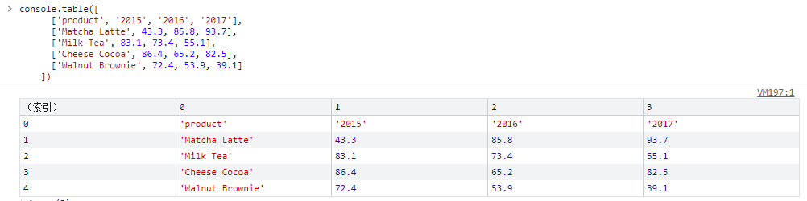
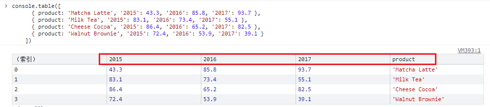
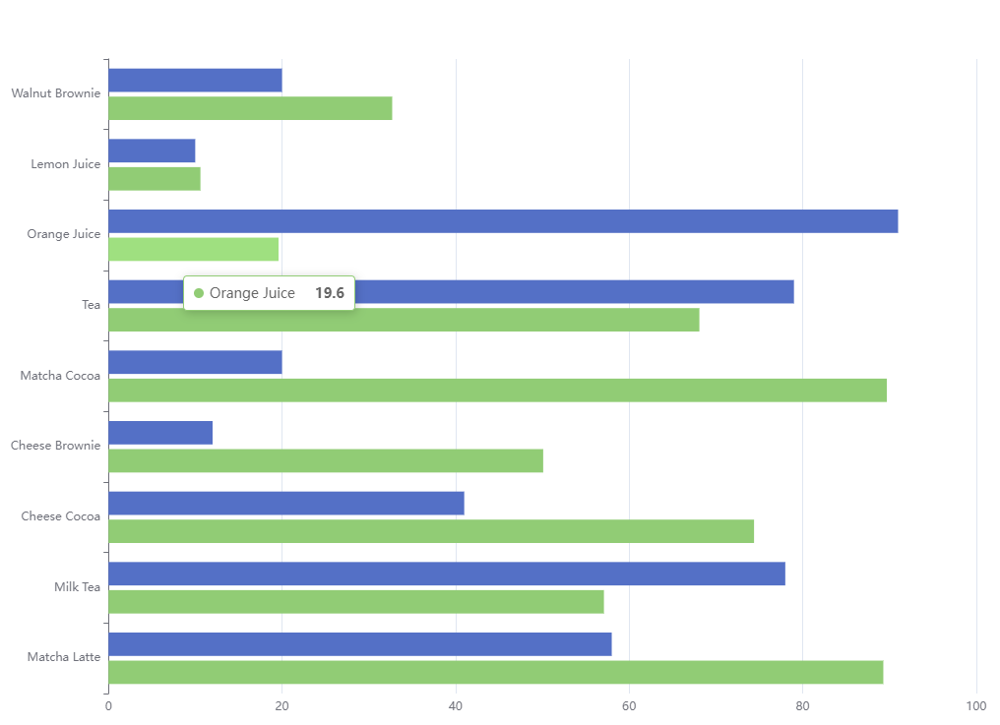

[TOC]

# 数据集

`数据集`（`dataset`）是**专门用来管理数据的组件**。

虽然每个系列都可以在 `series.data` 中设置数据，但是从 ECharts4 支持 `数据集` 开始，**更推荐使用 `数据集` 来管理数据**。

因为这样，数据可以被多个组件复用，也方便进行 “数据和其他配置” 分离的配置风格。

毕竟，**在运行时，数据是最常改变的，而其他配置大多并不会改变**。


## 在系列中设置数据

如果数据设置在 `系列`（`series`）中，例如：

```js
option = {
  xAxis: {
    type: 'category',
    data: ['Matcha Latte', 'Milk Tea', 'Cheese Cocoa', 'Walnut Brownie']
  },
  yAxis: {},
  series: [
    {
      type: 'bar',
      name: '2015',
      data: [89.3, 92.1, 94.4, 85.4]
    },
    {
      type: 'bar',
      name: '2016',
      data: [95.8, 89.4, 91.2, 76.9]
    },
    {
      type: 'bar',
      name: '2017',
      data: [97.7, 83.1, 92.5, 78.1]
    }
  ]
}
```

这种方式的优点是，适于对一些特殊的数据结构（如“树”、“图”、超大数据）进行一定的数据类型定制。 

但是**缺点是，常需要用户先处理数据**，**把数据分割**设置到各个系列（和类目轴）中。

此外，**不利于多个系列共享一份数据**，也不利于基于原始数据进行图表类型、系列的映射安排。


## 在数据集中设置数据

而数据设置在 `数据集`（`dataset`）中，会有这些好处：

- 能够贴近数据可视化常见思维方式：（I）提供数据，（II）指定数据到视觉的映射，从而形成图表。
- **数据和其他配置可以被分离开来**。**数据常变，其他配置常不变**。分开易于分别管理。
- **数据可以被多个系列或者组件复用**，对于大数据量的场景，不必为每个系列创建一份数据。
- **支持更多的数据的常用格式**，例如二维数组、对象数组等，一定程度上避免使用者为了数据格式而进行转换。


下面是一个最简单的 `dataset` 的例子：

```js
option = {
  legend: {},
  tooltip: {},
  dataset: {
    // 提供一份数据。
    source: [
      ['product', '2015', '2016', '2017'],
      ['Matcha Latte', 43.3, 85.8, 93.7],
      ['Milk Tea', 83.1, 73.4, 55.1],
      ['Cheese Cocoa', 86.4, 65.2, 82.5],
      ['Walnut Brownie', 72.4, 53.9, 39.1]
    ]
  },
  // 声明一个 X 轴，类目轴（category）。默认情况下，类目轴对应到 dataset 第一列。
  xAxis: { type: 'category' },
  // 声明一个 Y 轴，数值轴。
  yAxis: {},
  // 声明多个 bar 系列，默认情况下，每个系列会自动对应到 dataset 的每一列。
  series: [{ type: 'bar' }, { type: 'bar' }, { type: 'bar' }]
};
```

声明一个 **X 轴**，类目轴（category）。默认情况下，**类目轴对应到 dataset 第一列**。

声明一个 **Y 轴**，数值轴。

声明多个 **bar 系列**，默认情况下，每个系列会自动对应到 **dataset 的每一列**。

dataset.source 更像是一张二维表



也可以使用**常见的“对象数组”的格式**：

```js
option = {
  legend: {},
  tooltip: {},
  dataset: {
    // 用 dimensions 指定了维度的顺序。直角坐标系中，如果 X 轴 type 为 category，
    // 默认把第一个维度映射到 X 轴上，后面维度映射到 Y 轴上。
    // 如果不指定 dimensions，也可以通过指定 series.encode
    // 完成映射，参见后文。
    dimensions: ['product', '2015', '2016', '2017'],
    source: [
      { product: 'Matcha Latte', '2015': 43.3, '2016': 85.8, '2017': 93.7 },
      { product: 'Milk Tea', '2015': 83.1, '2016': 73.4, '2017': 55.1 },
      { product: 'Cheese Cocoa', '2015': 86.4, '2016': 65.2, '2017': 82.5 },
      { product: 'Walnut Brownie', '2015': 72.4, '2016': 53.9, '2017': 39.1 }
    ]
  },
  xAxis: { type: 'category' },
  yAxis: {},
  series: [{ type: 'bar' }, { type: 'bar' }, { type: 'bar' }]
};
```

用 dimensions 指定了**维度的顺序**。

**直角坐标系中，如果 X 轴 type 为 category，默认把第一个维度映射到 X 轴上，后面维度映射到 Y 轴上**。

如果不指定 dimensions，也可以通过指定 series.encode

---- 相对上面二维表的方式, 这里需要要 `维度`  指定数组中元素的 key




## 数据到图形的映射

如上所述，数据可视化的一个常见思路是：（I）提供数据，（II）指定数据到视觉的映射。

简而言之，可以进行这些映射的设定：

- **指定 `数据集` 的列（column）还是行（row）映射为 `系列`（`series`）**。

  ​	这件事可以使用 [series.seriesLayoutBy](https://echarts.apache.org/option.html##series.seriesLayoutBy) 属性来配置。默认是按照列（column）来映射。

- **指定维度映射的规则**：如何从 dataset 的维度（**一个“维度”的意思是一行/列**）映射到坐标轴（如 X、Y 轴）、提示框（tooltip）、标签（label）、图形元素大小颜色等（visualMap）。

  ​	这件事可以使用 [series.encode](https://echarts.apache.org/option.html##series.encode) 属性，以及 [visualMap](https://echarts.apache.org/option.html##visualMap) 组件来配置（如果有需要映射颜色大小等视觉维度的话）。
  
  ​	上面的例子中，没有给出这种映射配置，那么 ECharts 就按最常见的理解进行默认映射：X 坐标轴声明为类目轴，默认情况下会自动对应到 `dataset.source` 中的第一列；三个柱图系列，一一对应到 `dataset.source` 中后面每一列。


下面详细解释这些映射的设定。


## 把数据集（ dataset ）的行或列映射为系列（series）

有了数据表之后，使用者可以灵活地配置：**数据如何对应到轴和图形系列**。

用户可以使用 `seriesLayoutBy` 配置项，改变图表对于行列的理解。`seriesLayoutBy` 可取值：

- 'column': 	系列被安放到 `dataset` 的列上面。( 默认值。)
- 'row': 	       系列被安放到 `dataset` 的行上面。

详见[例子](https://echarts.apache.org/handbook/zh/concepts/dataset#%E6%8A%8A%E6%95%B0%E6%8D%AE%E9%9B%86%EF%BC%88-dataset-%EF%BC%89%E7%9A%84%E8%A1%8C%E6%88%96%E5%88%97%E6%98%A0%E5%B0%84%E4%B8%BA%E7%B3%BB%E5%88%97%EF%BC%88series%EF%BC%89)


## 维度（ dimension ）

常用图表所描述的数据大部分是**“二维表”结构**，上述的例子中，我们都使用二维数组来容纳二维表。

现在，当我们把系列（ series ）对应到“列”的时候，那么**每一列就称为一个“维度（ dimension ）”**，而**每一行称为数据项（ item ）**。反之，如果我们把系列（ series ）对应到表行，那么每一行就是“维度（ dimension ）”，每一列就是数据项（ item ）。

维度可以有单独的名字，便于在图表中显示。

- 维度名（ dimension name ）可以在定义在 **dataset 的第一行（或者第一列）**。例如上面的例子中，`'score'`、`'amount'`、`'product'` 就是维度名。

- **从第二行开始，才是正式的数据。**`dataset.source` 中第一行（列）到底包含不包含维度名，ECharts 默认会**自动探测**。

当然也可以设置 :

- `dataset.sourceHeader: true` 显示声明第一行（列）就是维度，或者

- `dataset.sourceHeader: false` 表明第一行（列）开始就直接是数据。

**维度的定义**，也可以使用**单独的 `dataset.dimensions` 或者 `series.dimensions` 来定义**，这样可以同时指定维度名，和维度的类型（ dimension type ）：


**大多数情况下，我们并不需要去设置维度类型，因为 ECharts 会自动尝试判断。但是如果不足够准确时，可以手动设置维度类型。**


维度类型（ dimension type ）可以取这些值：

- `'number'`: 默认，表示普通数据。
- `'ordinal'`: 对于类目、文本这些 string 类型的数据，如果需要能在数轴上使用，须是 'ordinal' 类型。ECharts 默认会试图自动判断这个类型。但是自动判断也可能不准确，所以使用者也可以手动强制指定。
- `'time'`: 表示时间数据。设置成 `'time'` 则能支持自动解析数据成时间戳（timestamp），比如该维度的数据是 '2017-05-10'，会自动被解析。如果这个维度被用在时间数轴（[axis.type](https://echarts.apache.org/option.html##xAxis.type) 为 `'time'`）上，那么会被自动设置为 `'time'` 类型。时间类型的支持参见 [data](https://echarts.apache.org/option.html##series.data)。
- `'float'`: 如果设置成 `'float'`，在存储时候会使用 `TypedArray`，对性能优化有好处。
- `'int'`: 如果设置成 `'int'`，在存储时候会使用 `TypedArray`，对性能优化有好处。


## 数据到图形的映射（ series.encode ）

了解了维度的概念后，我们就可以使用 [series.encode](https://echarts.apache.org/option.html##series.encode) 来做映射。

```js
option = {
  dataset: {
    source: [
      ['score', 'amount', 'product'],
      [89.3, 58, 'Matcha Latte'],
      [57.1, 78, 'Milk Tea'],
      [74.4, 41, 'Cheese Cocoa'],
      [50.1, 12, 'Cheese Brownie'],
      [89.7, 20, 'Matcha Cocoa'],
      [68.1, 79, 'Tea'],
      [19.6, 91, 'Orange Juice'],
      [10.6, 10, 'Lemon Juice'],
      [32.7, 20, 'Walnut Brownie']
    ]
  },
  tooltip: {},
  legend:{},
  xAxis: {},
  yAxis: { type: 'category' },
  series: [
    {
      type: 'bar',
      encode: {
        // 将 "amount" 列映射到 X 轴。
        x: 'amount',
        // 将 "product" 列映射到 Y 轴。
        y: 'product'
      }
    },
    {
      type: 'bar',
      encode: {
        // 将 "amount" 列映射到 X 轴。
        x: 'score',
        // 将 "product" 列映射到 Y 轴。
        y: 'product'
      }
    }
  ]
};
```



`series.encode` 声明的基本结构如下。其中冒号左边是坐标系、标签等特定名称，如 `'x'`, `'y'`, `'tooltip'` 等，冒号右边是数据中的维度名（string 格式）或者维度的序号（number 格式，从 0 开始计数），可以指定一个或多个维度（使用数组）。通常情况下，下面各种信息不需要所有的都写，按需写即可。

下面是 `series.encode` 支持的属性：

```js
// 在任何坐标系和系列中，都支持：
encode: {
  // 使用 “名为 product 的维度” 和 “名为 score 的维度” 的值在 tooltip 中显示
  tooltip: ['product', 'score']
  // 使用 “维度 1” 和 “维度 3” 的维度名连起来作为系列名。（有时候名字比较长，这可以避免在 series.name 重复输入这些名字）
  seriesName: [1, 3],
  // 表示使用 “维度2” 中的值作为 id。这在使用 setOption 动态更新数据时有用处，可以使新老数据用 id 对应起来，从而能够产生合适的数据更新动画。
  itemId: 2,
  // 指定数据项的名称使用 “维度3” 在饼图等图表中有用，可以使这个名字显示在图例（legend）中。
  itemName: 3
}

// 直角坐标系（grid/cartesian）特有的属性：
encode: {
  // 把 “维度1”、“维度5”、“名为 score 的维度” 映射到 X 轴：
  x: [1, 5, 'score'],
  // 把“维度0”映射到 Y 轴。
  y: 0
}

// 单轴（singleAxis）特有的属性：
encode: {
  single: 3
}

// 极坐标系（polar）特有的属性：
encode: {
  radius: 3,
  angle: 2
}

// 地理坐标系（geo）特有的属性：
encode: {
  lng: 3,
  lat: 2
}

// 对于一些没有坐标系的图表，例如饼图、漏斗图等，可以是：
encode: {
  value: 3
}
```


这是个更丰富的 `series.encode` 的 [示例](https://echarts.apache.org/examples/zh/editor.html?c=dataset-encode1&edit=1&reset=1) 。


## 默认的 series.encode

TODO...

## 视觉通道（颜色、尺寸等）的映射

TODO...

## 数据的各种格式

多数常见图表中，数据适于用二维表的形式描述。广为使用的数据表格软件（如 MS Excel、Numbers）或者关系数据数据库都是二维表。

他们的数据可以**导出成 JSON 格式，输入到 `dataset.source` 中**，在不少情况下可以免去一些数据处理的步骤。


## 其他

目前并非所有图表都支持 dataset。支持 dataset 的图表有： `line`、`bar`、`pie`、`scatter`、`effectScatter`、`parallel`、`candlestick`、`map`、`funnel`、`custom`。 后续会有更多的图表进行支持。

最后，给出这个 [示例](https://echarts.apache.org/examples/zh/editor.html?c=dataset-link&edit=1&reset=1)，多个图表共享一个 `dataset`，并带有联动交互。