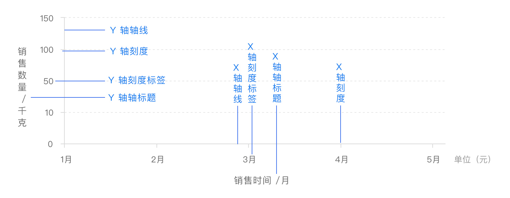

[TOC]

# 坐标轴

直角坐标系中的 x/y 轴。

## x 轴、y 轴

x 轴和 y 轴都由**<u>轴线、刻度、刻度标签、轴标题</u>四个部分**组成。

部分图表中还会有**网格线**来帮助查看和计算数据



普通的二维数据坐标系都有 x 轴和 y 轴，通常情况下，x 轴显示在图表的底部，y 轴显示在左侧，一般配置如下：

```js
option = {
  xAxis: {
    // ...
  },
  yAxis: {
    // ...
  }
};
```

x 轴常用来标示**数据的维度**，维度一般用来指**数据的类别**，是**观察数据的角度**，例如“销售时间” “销售地点” “产品名称”等。

y 轴常常用来标示**数据的数值**，数值是用来具体考察**某一类数据的数量值**，也是我们需要分析的**指标**，例如“销售数量”和“销售金额”等。

```js
option = {
  xAxis: {
    type: 'time',
    name: '销售时间'
    // ...
  },
  yAxis: {
    type: 'value',
    name: '销售数量'
    // ...
  },
  // 当 x 轴（水平坐标轴）跨度很大，可以采用区域缩放方式灵活显示数据内容。
  dataZoom: [
    // ...
  ]
  // ...
};
```


在二维数据中，轴也可以有多个。

ECharts 中一般情况下单个 grid 组件最多只能放两个 x/y 轴，多于两个 x/y 轴需要通过配置 [offset](https://echarts.apache.org/option.html#xAxis.offset) 属性防止同个位置多个轴的重叠。

两个 x 轴显示在上下，两个 y 轴显示在左右两侧。


## 轴线

ECharts 提供了轴线 [axisLine](https://echarts.apache.org/option.html#xAxis.axisLine) 相关的配置，我们可以根据实际情况调整，例如轴线两端的箭头，轴线的样式等

## 刻度

ECharts 提供了轴线 [axisTick](https://echarts.apache.org/option.html#xAxis.axisTick) 相关的配置，我们可以根据实际情况调整，例如刻度线的长度，样式等。

## 刻度标签

ECharts 提供了轴线 [axisLabel](https://echarts.apache.org/option.html#xAxis.axisLabel) 相关的配置，我们可以根据实际情况调整，例如文字对齐方式，自定义刻度标签内容等