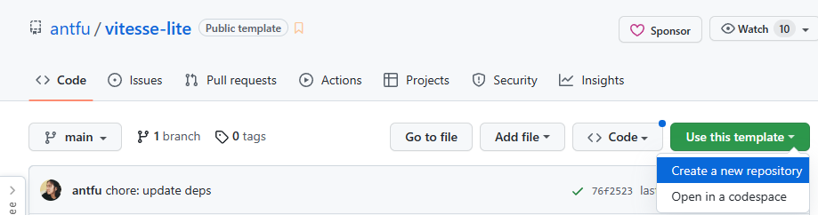

# [从模板创建仓库](https://docs.github.com/en/repositories/creating-and-managing-repositories/creating-a-repository-from-a-template)

1. On GitHub.com, navigate to the main page of the repository.
2. Above the file list, click **Use this template**.
3. Select **Create a new repository**.

4. Use the **Owner** drop-down menu, and select the account you want to own the repository.

>  public template:
>
> [antfu/vitesse-lite: ⛺️ Lightweight version of Vitesse (github.com)](https://github.com/antfu/vitesse-lite)

