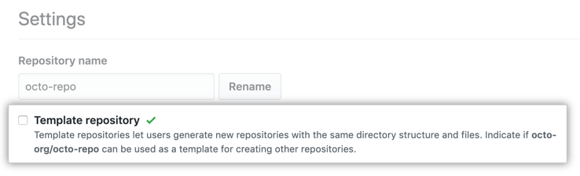

将存储库设置为模板后，任何对该存储库有访问权限的人都可以生成一个新存储库，该存储库具有与你的默认分支相同的目录结构和文件。 还可以选择在存储库中包含所有其他分支。 从模板创建的分支具有不相关的历史记录，因此无法创建拉取请求或在分支之间合并。 有关详细信息，请参阅“[通过模板创建存储库](https://docs.github.com/zh/articles/creating-a-repository-from-a-template)”。

1. 在存储库名称下，单击 “设置”
2. 选择“模板存储库”。

