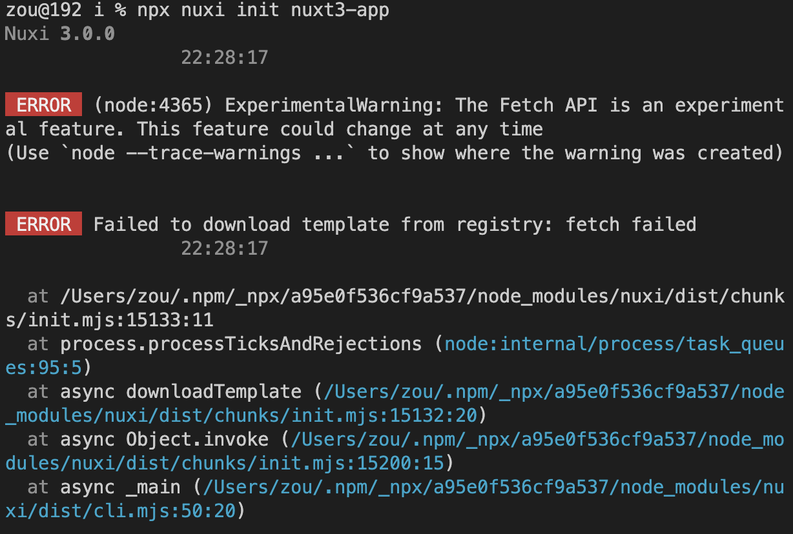
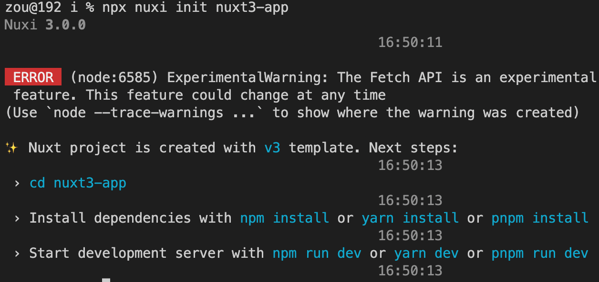

# can not install base on the docs cli

same issue in [#](https://stackoverflow.com/questions/74283819/error-while-creating-nuxt3-project-failed-to-download-template-from-registry)

I found the reason in here.

It's indeed a **network** issue. It couldn't access `raw.githubusercontent.com` from the command line because it couldn't find the corresponding IP address.

After adding the correct ip address of raw.githubusercontent.com to the Windows hosts file, the issue was fixed

https://juejin.cn/post/7154586714416087076

先`ping raw.githubusercontent.com`是否连通

如果不通，访问`https://ipaddress.com/website/raw.githubusercontent.com`

然后添加host，

> mac下host配置路径：`/etc/hosts`
>
> windows下host路径: `C:\Windows\System32\drivers\etc`

新增一行， `185.199.108.133 raw.githubusercontent.com`

> 需要注意是否有冲突的 ip, 从上往下加载

添加完host后，再ping一下 `ping raw.githubusercontent.com` 是否连通

ping通后，再重新执行`npx nuxi init nuxt-app`

> Works
>
> 

### fixed the network issue

edit the hosts file

**How To Find and Edit Your Mac Hosts File (In 4 Steps)**

1. Find the Terminal application on your Mac.
2. Select the “Terminal” application.
3. Enter the “sudo nano /etc/hosts” command.
4. Nano Text Editor.
5. Add the domain ip address.
6. control + x  edit and save

> Check ping again ping `raw.githubusercontent.com`  is working

### Error in dev server

pnpm i & pnpm dev

>  **WARN**  Failed to resolve dependency: vue, present in 'optimizeDeps.include'                                            16:58:53
>
>
>  **ERROR**  The following dependencies are imported but could not be resolved:                                             16:58:53
>
>   vue (imported by /Users/zou/Desktop/i/nuxt3-app/node_modules/.pnpm/nuxt@3.0.0/node_modules/nuxt/dist/app/entry.mjs)
>
> Are they installed?

Fix: https://github.com/nuxt/framework/issues/7534

> Are you using pnpm?
> If so you probably just need to run ***pnpm install --shamefully-hoist***

Don't know why but it works

### Auto-import 导入composables/states.ts

> 