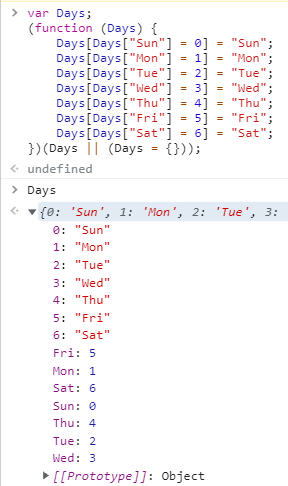

[TOC]

### 布尔值

### 数字

和JavaScript一样，TypeScript里的所有数字都是浮点数

### 字符串

### 数组

有两种方式可以定义数组。 

第一种，可以在元素类型后面接上 `[]`，表示由此类型元素组成的一个数组

```ts
let list: number[] = [1, 2, 3];
```

第二种方式是使用**数组泛型**，`Array<元素类型>`：

```ts
let list: Array<number> = [1, 2, 3]; // 数组泛型 <>
```

### 元组 Tuple

元组类型允许表示一个**已知元素数量和类型的数组**，各元素的类型不必相同。

```ts
// Declare a tuple type
let x: [string, number];
// Initialize it
x = ['hello', 10]; // OK
// Initialize it incorrectly
x = [10, 'hello']; // Error
```

当访问一个**已知索引**的元素，会得到正确的类型：

```ts
console.log(x[0].substr(1)); // OK
console.log(x[1].substr(1)); // Error, 'number' does not have 'substr'
```

当访问一个**越界的元素，会使用联合类型替代**：

```ts
x[3] = 'world'; // OK, 字符串可以赋值给(string | number)类型
console.log(x[5].toString()); // OK, 'string' 和 'number' 都有 toString
x[6] = true; // Error, 布尔不是(string | number)类型
```

### 枚举

`enum`类型是对JavaScript标准数据类型的一个补充。 

像C#等其它语言一样，使用枚举类型可以**为一组数值赋予友好的名字**。 使数值具有意义

默认情况下，从`0`开始为元素编号。 你也可以手动的指定成员的数值。 

```ts
enum Color {Red, Green, Blue}
let c: Color = Color.Green;

enum Color2 {Red = 1, Green, Blue}
let c: Color2 = Color2.Green;
```

tsc编译前后内容

```ts
enum Days {Sun, Mon, Tue, Wed, Thu, Fri, Sat};
enum Days {fucking = 'must be valued'};
```

```js
var Days;
(function (Days) {
    Days[Days["Sun"] = 0] = "Sun";
    Days[Days["Mon"] = 1] = "Mon";
    Days[Days["Tue"] = 2] = "Tue";
    Days[Days["Wed"] = 3] = "Wed";
    Days[Days["Thu"] = 4] = "Thu";
    Days[Days["Fri"] = 5] = "Fri";
    Days[Days["Sat"] = 6] = "Sat";
})(Days || (Days = {}));

(function (Days) {
    Days["fucking"] = "must be valued";
})(Days || (Days = {}));
```



### any

为那些在**编程阶段**还不清楚类型的变量指定一个类型。

 这些值可能来自于动态的内容，比如来自用户输入或第三方代码库。

这种情况下，我们**不希望类型检查器对这些值进行检查**而是**直接让它们通过编译阶段的检查**。 

那么我们可以使用 `any`类型来标记这些变量：

### Void

某种程度上来说，`void`类型像是与`any`类型相反，它表示没有任何类型。 当一个函数没有返回值时，你通常会见到其返回值类型是 `void`：

声明一个`void`类型的变量没有什么大用，因为你只能为它赋予`undefined`和`null`：

### Null 和 Undefined

TypeScript里，`undefined`和`null`两者各自有自己的类型分别叫做`undefined`和`null`。 和 `void`相似，它们的本身的类型用处不是很大：

默认情况下`null`和`undefined`是所有类型的**子类型**。

### Never

`never`类型表示的是那些永不存在的值的类型。

### Object

`object`表示非原始类型，也就是除`number`，`string`，`boolean`，`symbol`，`null`或`undefined`之外的类型。

### 类型断言

通过*类型断言*这种方式可以告诉编译器，“相信我，我知道自己在干什么”。 

类型断言好比其它语言里的类型转换，但是不进行特殊的数据检查和解构。 

它没有运行时的影响，只是在编译阶段起作用。 

TypeScript会假设你，程序员，已经进行了必须的检查。

类型断言有两种形式。 其一是“尖括号”语法：

```ts
let someValue: any = "this is a string";
let strLength: number = (<string>someValue).length;
```

另一个为`as`语法：

```ts
let someValue: any = "this is a string";
let strLength: number = (someValue as string).length;
```

**两种形式是等价的**。 至于使用哪个大多数情况下是凭个人喜好；然而，当你在TypeScript里使用JSX时，只有 `as`语法断言是被允许的。
