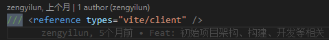
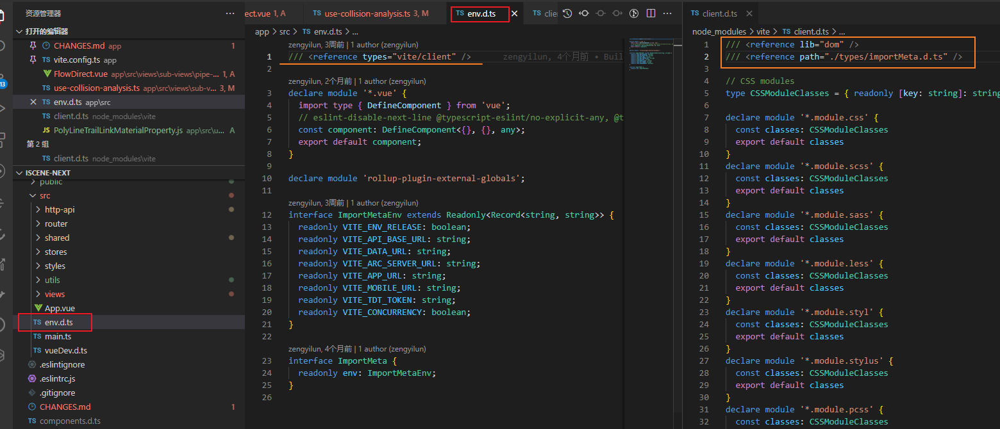
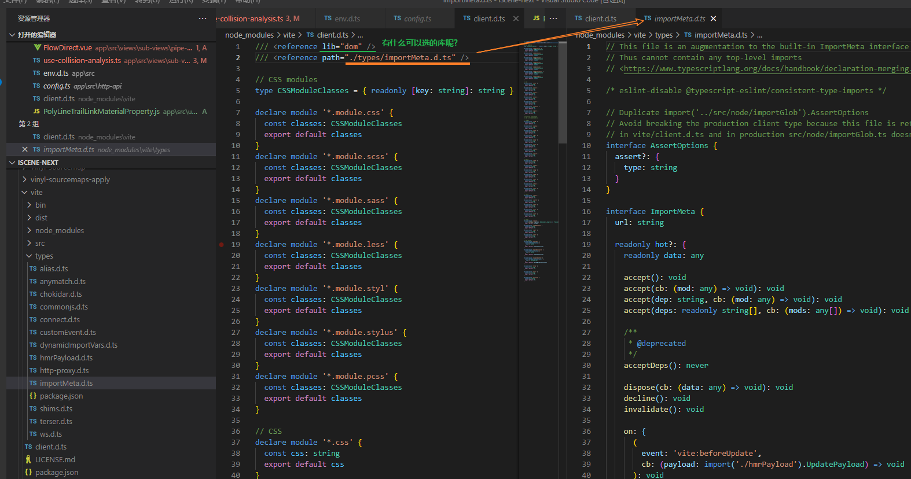

[TOC]

# 三斜线指令 Triple-Slash Directives

三斜线指令是包含单个XML标签的单行注释。 注释的内容会做为编译器指令使用。

三斜线指令*仅*可放在包含它的文件的最顶端。 如果它们出现在一个语句或声明之后，那么它们会被当做普通的单行注释，并且不具有特殊的涵义。

 一个三斜线指令的前面只能出现单行或多行注释，这包括其它的三斜线指令。

## `/// <reference path="..." />` 

`/// <reference path="..." />`指令是三斜线指令中最常见的一种。 

它用于**声明文件间的 *依赖***。

三斜线引用告诉编译器**在编译过程中要引入的额外的文件**。

当使用`--out`或`--outFile`时，它也可以做为调整输出内容顺序的一种方法。 

文件在输出文件内容中的位置与经过预处理后的输入顺序一致。

### 预处理输入文件

编译器会对输入文件进行预处理来解析所有三斜线引用指令。 在这个过程中，额外的文件会加到编译过程中。

这个过程会以一些*根文件*开始； 它们是在命令行中指定的文件或是在 `tsconfig.json`中的`"files"`列表里的文件。 这些根文件按指定的顺序进行预处理。 在一个文件被加入列表前，它包含的所有三斜线引用都要被处理，还有它们包含的目标。 三斜线引用以它们在文件里出现的顺序，使用深度优先的方式解析。

一个三斜线引用路径是相对于包含它的文件的，如果不是根文件。

### 错误

引用不存在的文件会报错。 一个文件用三斜线指令引用自己会报错。

### 使用 `--noResolve`

如果指定了`--noResolve`编译选项，三斜线引用会被忽略；它们不会增加新文件，也不会改变给定文件的顺序。

## `/// <reference types="..." />`

与 `/// <reference path="..." />`指令相似，这个指令是用来**声明 *依赖***的； 

一个 `/// <reference types="..." />`指令则**声明了对某个*包*的依赖**。

对这些包的名字的解析与在 `import`语句里对模块名的解析类似。

**可以简单地把三斜线类型引用指令当做 `import`声明的包。**

例如，把 `/// <reference types="node" />`引入到声明文件，表明这个文件使用了 `@types/node/index.d.ts`里面声明的名字； 并且，这个包需要在编译阶段与声明文件一起被包含进来。

仅当在你需要写一个`d.ts`文件时才使用这个指令。

对于那些在编译阶段生成的声明文件，编译器会自动地添加`/// <reference types="..." /> `； *当且仅当*结果文件中使用了引用的包里的声明时才会在生成的声明文件里添加`/// <reference types="..." />`语句。

若要在`.ts`文件里声明一个对`@types`包的依赖，使用`--types`命令行选项或在`tsconfig.json`里指定。 查看 [在`tsconfig.json`里使用`@types`，`typeRoots`和`types`](https://www.tslang.cn/docs/handbook/tsconfig-json.html#types-typeroots-and-types)了解详情。



## `/// <reference lib="..." />`

This directive allows a file to explicitly include an existing built-in lib file.

Built-in lib files are referenced in the same fashion as the lib compiler option in tsconfig.json (e.g. use lib="es2015" and not lib="lib.es2015.d.ts", etc.).

For declaration file authors who rely on built-in types, e.g. DOM APIs or built-in JS run-time constructors like Symbol or Iterable, triple-slash-reference lib directives are recommended. Previously these .d.ts files had to add forward/duplicate declarations of such types.

For example, adding `/// <reference lib="es2017.string" />` to one of the files in a compilation is equivalent to compiling with --lib es2017.string.

该指令允许文件显式包含现有的内置*lib*文件。

内置*lib*文件的引用方式与*tsconfig.json*[`lib`](https://www.typescriptlang.org/tsconfig#lib)中的编译器选项相同（例如 use和 not等）。`lib="es2015"` `lib="lib.es2015.d.ts"`

对于依赖内置类型的声明文件作者，例如 DOM API 或内置 JS 运行时构造函数，例如`Symbol`or `Iterable`，推荐使用三斜杠引用 **lib 指令**。以前这些 .d.ts 文件必须添加此类类型的前向/重复声明。

例如，`///<reference lib="es2017.string" /> `在编译中添加到其中一个文件相当于使用`--lib es2017.string`.

```ts
/// <reference lib="es2017.string" />
"foo".padStart(4);
```


## `/// <reference no-default-lib="true"/>`

这个指令把一个文件标记成*默认库*。 你会在 `lib.d.ts`文件和它不同的变体的顶端看到这个注释。

这个指令告诉编译器在编译过程中*不要*包含这个默认库（比如，`lib.d.ts`）。 这与在命令行上使用 `--noLib`相似。

还要注意，当传递了`--skipDefaultLibCheck`时，编译器只会忽略检查带有`/// <reference no-default-lib="true"/> `的文件。

## `/// <amd-module />`

默认情况下生成的AMD模块都是匿名的。 但是，当一些工具需要处理生成的模块时会产生问题，比如 `r.js`。

`amd-module`指令允许给编译器传入一个可选的模块名：

##### amdModule.ts

```ts
///<amd-module name='NamedModule'/>
export class C {
}
```

这会将`NamedModule`传入到AMD `define`函数里：

##### amdModule.js

```js
define("NamedModule", ["require", "exports"], function (require, exports) {
    var C = (function () {
        function C() {
        }
        return C;
    })();
    exports.C = C;
});
```


# [你知道TS中的三斜线指令吗](https://juejin.cn/post/7035868404632256542)

## 什么是三斜线指令

正如上面的`/// <reference> `，它的格式就是三条斜线后面跟一个**标签**

可以把它理解为单行注释，只不过它比较特殊，它会被**当成编译器指令解析**使用

你也可以把它理解能`import`，它可以告诉编译器**在编译过程中要引入的额外的文件**

## 出现位置

三斜线指令出现位置是有讲究的

它必须放在文件的最顶部，例外情况是，三斜线指令的前面也可以出现其他注释，包括单行注释、多行注释和三斜线指令

否则，三斜线指令会被当做普通的单行注释，而不具任何特殊的含义了

## 常见的三斜线指令

- `/// <reference path="..." /> `

用于声明**文件之间的依赖**

- `/// <reference types="..." /> `

用于声明**对某个包的依赖**

- `/// <reference no-default-lib="true"/> `

用于**将一个文件标记成默认库**

- `/// <amd-module /> `

用于给编译器**传入一个可选的模块名**

- `///  <amd-dependency path="x"/> `

告诉编译器有一个非TS模块依赖需要被注入；不过该指令已经使用`import "x"`语句代替了

## 注意点

需要另外补充几点：

1. 编译器会对输入文件进行预处理来解析所有三斜线引用指令
2. 一个文件用三斜线指令引用不存在的文件时，会报错
3. 如果指定了`--noResolve`编译选项，三斜线引用会被忽略，既不会引入新文件也不会改变给定文件的顺序


### 使用案例:




