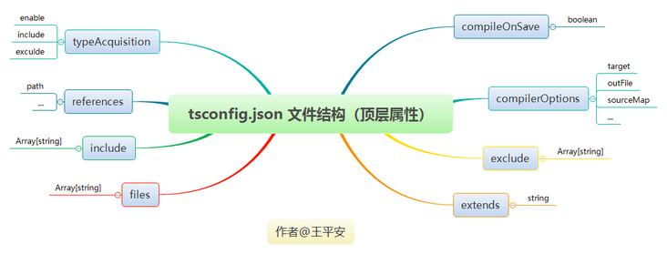
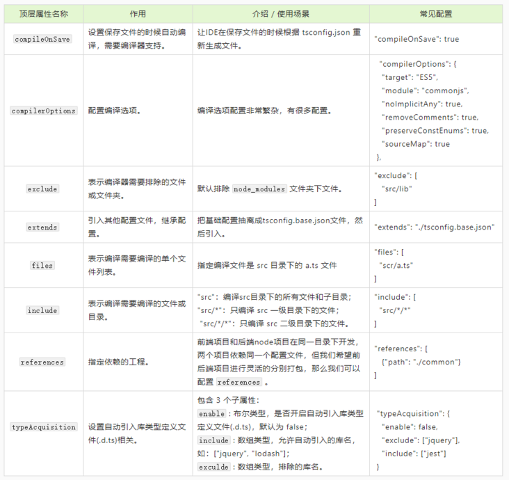
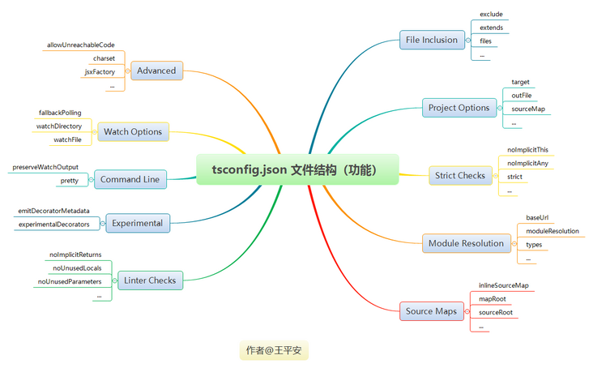

[TOC]

## tsconfig.json 文件结构介绍


### 1. 按顶层属性分类

在 tsconfig.json 文件中按照**顶层属性**，分为以下几类：




### 2. 按功能分类




## tsconfig.json 配置介绍


### 1. compileOnSave

`compileOnSave` 属性作用是**设置保存文件的时候自动编译，但需要编译器支持**。

```json
{
    // ...
  "compileOnSave": false,
}
```


### 2. compilerOptions

`compilerOptions` 属性作用是**配置编译选项**。
若 `compilerOptions` 属性被忽略，则编译器会使用默认值，可以查看[《官方完整的编译选项列表》](https://link.segmentfault.com/?enc=6ysi2h3vk4NnXiewDlP6tw%3D%3D.R0Wx9ubbDGY8M%2BWRzjXIh35TAcWCCzGO4cqX3CHIf%2F8K10C5w20%2FOz4FL5DWpAb5cSrxaFFkUdhPhRruyLbwl%2FRf0%2BbCLPpwKmL9yR78jqg%3D)。
编译选项配置非常繁杂，有很多配置，这里只列出常用的配置。

```json
{
  // ...
  "compilerOptions": {
    "incremental": true, // TS编译器在第一次编译之后会生成一个存储编译信息的文件，第二次编译会在第一次的基础上进行增量编译，可以提高编译的速度
    "tsBuildInfoFile": "./buildFile", // 增量编译文件的存储位置
    "diagnostics": true, // 打印诊断信息 
    "target": "ES5", // 目标语言的版本
    "module": "CommonJS", // 生成代码的模板标准
    "outFile": "./app.js", // 将多个相互依赖的文件生成一个文件，可以用在AMD模块中，即开启时应设置"module": "AMD",
    "lib": ["DOM", "ES2015", "ScriptHost", "ES2019.Array"], // TS需要引用的库，即声明文件，es5 默认引用dom、es5、scripthost,如需要使用es的高级版本特性，通常都需要配置，如es8的数组新特性需要引入"ES2019.Array",
    "allowJS": true, // 允许编译器编译JS，JSX文件
    "checkJs": true, // 允许在JS文件中报错，通常与allowJS一起使用
    "outDir": "./dist", // 指定输出目录
    "rootDir": "./", // 指定输出文件目录(用于输出)，用于控制输出目录结构
    "declaration": true, // 生成声明文件，开启后会自动生成声明文件
    "declarationDir": "./file", // 指定生成声明文件存放目录
    "emitDeclarationOnly": true, // 只生成声明文件，而不会生成js文件
    "sourceMap": true, // 生成目标文件的sourceMap文件
    "inlineSourceMap": true, // 生成目标文件的inline SourceMap，inline SourceMap会包含在生成的js文件中
    "declarationMap": true, // 为声明文件生成sourceMap
    "typeRoots": [], // 声明文件目录，默认时node_modules/@types
    "types": [], // 加载的声明文件包
    "removeComments":true, // 删除注释 
    "noEmit": true, // 不输出文件,即编译后不会生成任何js文件
    "noEmitOnError": true, // 发送错误时不输出任何文件
    "noEmitHelpers": true, // 不生成helper函数，减小体积，需要额外安装，常配合importHelpers一起使用
    "importHelpers": true, // 通过tslib引入helper函数，文件必须是模块
    "downlevelIteration": true, // 降级遍历器实现，如果目标源是es3/5，那么遍历器会有降级的实现
    "strict": true, // 开启所有严格的类型检查
    "alwaysStrict": true, // 在代码中注入'use strict'
    "noImplicitAny": true, // 不允许隐式的any类型
    "strictNullChecks": true, // 不允许把null、undefined赋值给其他类型的变量
    "strictFunctionTypes": true, // 不允许函数参数双向协变
    "strictPropertyInitialization": true, // 类的实例属性必须初始化
    "strictBindCallApply": true, // 严格的bind/call/apply检查
    "noImplicitThis": true, // 不允许this有隐式的any类型
    "noUnusedLocals": true, // 检查只声明、未使用的局部变量(只提示不报错)
    "noUnusedParameters": true, // 检查未使用的函数参数(只提示不报错)
    "noFallthroughCasesInSwitch": true, // 防止switch语句贯穿(即如果没有break语句后面不会执行)
    "noImplicitReturns": true, //每个分支都会有返回值
    "esModuleInterop": true, // 允许export=导出，由import from 导入
    "allowUmdGlobalAccess": true, // 允许在模块中全局变量的方式访问umd模块
    "moduleResolution": "node", // 模块解析策略，ts默认用node的解析策略，即相对的方式导入
    "baseUrl": "./", // 解析非相对模块的基地址，默认是当前目录
    "paths": { // 路径映射，相对于baseUrl
      // 如使用jq时不想使用默认版本，而需要手动指定版本，可进行如下配置
      "jquery": ["node_modules/jquery/dist/jquery.min.js"]
    },
    "rootDirs": ["src","out"], // 将多个目录放在一个虚拟目录下，用于运行时，即编译后引入文件的位置可能发生变化，这也设置可以虚拟src和out在同一个目录下，不用再去改变路径也不会报错
    "listEmittedFiles": true, // 打印输出文件
    "listFiles": true// 打印编译的文件(包括引用的声明文件)
  }
}
```


### 3. exclude

`exclude` 属性作用是**指定编译器需要排除的文件或文件夹。**
默认排除 `node_modules` 文件夹下文件。

```json
{
    // ...
  "exclude": [
    "src/lib" // 排除src目录下的lib文件夹下的文件不会编译
  ]
}
```

和 `include` 属性一样，支持 glob 通配符：

- `*` 匹配0或多个字符（不包括目录分隔符）
- `?` 匹配一个任意字符（不包括目录分隔符）
- `**/` 递归匹配任意子目录


### 4. extends

`extends` 属性作用是**引入其他配置文件，继承配置**。
默认包含当前目录和子目录下所有 TypeScript 文件。

```json
{
    // ...
  // 把基础配置抽离成tsconfig.base.json文件，然后引入
    "extends": "./tsconfig.base.json"
}
```


### 5. files

`files` 属性作用是**指定需要编译的单个文件列表**。
默认包含当前目录和子目录下所有 TypeScript 文件。

```json
{
    // ...
  "files": [
    // 指定编译文件是src目录下的leo.ts文件
    "scr/leo.ts"
  ]
}
```


### 6. include

`include` 属性作用是**指定编译需要编译的文件或目录**。

```json
{
    // ...
  "include": [
    // "scr" // 会编译src目录下的所有文件，包括子目录
    // "scr/*" // 只会编译scr一级目录下的文件
    "scr/*/*" // 只会编译scr二级目录下的文件
  ]
}
```


### 7. references

`references` 属性作用是**指定工程引用依赖。**
在项目开发中，有时候我们为了方便将前端项目和后端`node`项目放在同一个目录下开发，两个项目依赖同一个配置文件和通用文件，但我们希望前后端项目进行灵活的分别打包，那么我们可以进行如下配置：

```json
{
    // ...
  "references": [ // 指定依赖的工程
     {"path": "./common"}
  ]
}
```


### 8. typeAcquisition

`typeAcquisition` 属性作用是**设置自动引入库类型定义文件(.d.ts)相关。**
包含 3 个子属性：

- `enable` : 布尔类型，是否开启自动引入库类型定义文件(.d.ts)，默认为 false；
- `include` : 数组类型，允许自动引入的库名，如：["jquery", "lodash"]；
- `exculde` : 数组类型，排除的库名。

```json
{
    // ...
  "typeAcquisition": {
    "enable": false,
    "exclude": ["jquery"],
    "include": ["jest"]
  }
}
```


## 六、常见配置示例

本部分内容中，我们找了几个实际开发中比较常见的配置，当然，还有很多配置需要自己摸索哟~~


### 1. 移除代码中注释

tsconfig.json：

```json
{
  "compilerOptions": {
    "removeComments": true,
  }
}
```

编译前：

```typescript
// 返回当前版本号
function getVersion(version:string = "1.0.0"): string{
    return version;
}
console.log(getVersion("1.0.1"))
```

编译结果：

```javascript
function getVersion(version) {
    if (version === void 0) { version = "1.0.0"; }
    return version;
}
console.log(getVersion("1.0.1"));
```


### 2. 开启null、undefined检测

tsconfig.json：

```json
{
    "compilerOptions": {
        "strictNullChecks": true
    },
}
```

修改 `index.ts` 文件内容：

```typescript
const leo;
leo = new Pingan('leo','hello');
```


这时候编辑器也会提示错误信息，执行 `tsc` 后，控制台报错：

```bash
src/index.ts:9:11 - error TS2304: Cannot find name 'Pingan'.

9 leo = new Pingan('leo','hello');

Found 1 error.
```


### 3. 配置复用

通过 `extends` 属性实现配置复用，即一个配置文件可以继承另一个文件的配置属性。
比如，建立一个基础的配置文件 `configs/base.json` ：

```json
{
  "compilerOptions": {
    "noImplicitAny": true,
    "strictNullChecks": true
  }
}
```

在`tsconfig.json` 就可以引用这个文件的配置了：

```json
{
  "extends": "./configs/base",
  "files": [
    "main.ts",
    "supplemental.ts"
  ]
}
```


### 4. 生成枚举的映射代码

在默认情况下，使用 `const` 修饰符后，枚举不会生成映射代码。
如下，我们可以看出：使用 `const` 修饰符后，编译器不会生成任何 `RequestMethod` 枚举的任何映射代码，在其他地方使用时，内联每个成员的值，节省很大开销。

```typescript
const enum RequestMethod {
  Get,
  Post,
  Put,
  Delete
}

let methods = [
  RequestMethod.Get,
  RequestMethod.Post
]
```

编译结果：

```javascript
"use strict";
let methods = [
    0 /* Get */,
    1 /* Post */
];
```

当然，我们希望生成映射代码时，也可以设置 `tsconfig.json` 中的配置，设置 `preserveConstEnums` 编译器选项为 `true` ：

```json
{
  "compilerOptions": {
    "target": "es5",
    "preserveConstEnums": true
  }
}
```


最后编译结果变成：

```javascript
"use strict";
var RequestMethod;
(function (RequestMethod) {
    RequestMethod[RequestMethod["Get"] = 0] = "Get";
    RequestMethod[RequestMethod["Post"] = 1] = "Post";
    RequestMethod[RequestMethod["Put"] = 2] = "Put";
    RequestMethod[RequestMethod["Delete"] = 3] = "Delete";
})(RequestMethod || (RequestMethod = {}));
let methods = [
    0 /* Get */,
    1 /* Post */
];
```


### 5. 关闭 this 类型注解提示

通过下面代码编译后会报错：

```typescript
const button = document.querySelector("button");
button?.addEventListener("click", handleClick);
function handleClick(this) {
 console.log("Clicked!");
 this.removeEventListener("click", handleClick);
}
```


报错内容：

```bash
src/index.ts:10:22 - error TS7006: Parameter 'this' implicitly has an 'any' type.
10 function handleClick(this) {
Found 1 error.
```


这是因为 `this` 隐式具有 `any` 类型，如果没有指定类型注解，编译器会提示“"this" 隐式具有类型 "any"，因为它没有类型注释。”。


解决方法有2种：

1. 指定 this 类型，如本代码中为 `HTMLElement` 类型：

`HTMLElement` 接口表示所有的 HTML 元素。一些HTML元素直接实现了 `HTMLElement` 接口，其它的间接实现`HTMLElement`接口。
关于[ HTMLElement ](https://link.segmentfault.com/?enc=n2WjlrVkt71tGqWR6E4zzA%3D%3D.%2BEJqXd%2FvxR%2B8OMFYQ0YcLpuTDYa%2FXumbvZ%2BcA6sCamcEjt0jbBJAN1sLmodWLlKVZkkB39fcini%2BVaU0R9%2FbHQ%3D%3D)可查看详细。

1. 使用 `--noImplicitThis` 配置项： 


在 TS2.0 还增加一个新的编译选项： `--noImplicitThis`，表示当 `this` 表达式值为 `any` 类型时生成一个错误信息。我们设置为 `true` 后就能正常编译。

```json
{
  "compilerOptions": {
    "noImplicitThis": true
  }
}
```


## 七、Webpack/React 中使用示例


### 1. 配置编译 ES6 代码，JSX 文件

创建测试项目 webpack-demo，结构如下：

```bash
webpack-demo/
  |- package.json
  |- tsconfig.json
  |- webpack.config.js
  |- /dist
    |- bundle.js
    |- index.html
  |- /src
    |- index.js
    |- index.ts
  |- /node_modules
```

安装 TypeScript 和 ts-loader：

```bash
$ npm install --save-dev typescript ts-loader
```

配置 tsconfig.json，支持 JSX，并将 TypeScript 编译为 ES5：

```diff
{
  "compilerOptions": {
    "outDir": "./dist/",
    "noImplicitAny": true,
+   "module": "es6",
+   "target": "es5",
+   "jsx": "react",
    "allowJs": true
  }
}
```

还需要配置 webpack.config.js，使其能够处理 TypeScript 代码，这里主要在 `rules` 中添加 `ts-loader` ：

```javascript
const path = require('path');

module.exports = {
  entry: './src/index.ts',
  module: {
    rules: [
      {
        test: /\.tsx?$/,
        use: 'ts-loader',
        exclude: /node_modules/
      }
    ]
  },
  resolve: {
    extensions: [ '.tsx', '.ts', '.js' ]
  },
  output: {
    filename: 'bundle.js',
    path: path.resolve(__dirname, 'dist')
  }
};
```


### 2. 配置 source map

想要启用 source map，我们必须配置 TypeScript，以将内联的 source map 输出到编译后的 JavaScript 文件中。
只需要在 tsconfig.json 中配置 sourceMap 属性：

```diff
  {
    "compilerOptions": {
      "outDir": "./dist/",
+     "sourceMap": true,
      "noImplicitAny": true,
      "module": "commonjs",
      "target": "es5",
      "jsx": "react",
      "allowJs": true
    }
  }
```

然后配置 webpack.config.js 文件，让 webpack 提取 source map，并内联到最终的 bundle 中：

```diff
  const path = require('path');

  module.exports = {
    entry: './src/index.ts',
+   devtool: 'inline-source-map',
    module: {
      rules: [
        {
          test: /\.tsx?$/,
          use: 'ts-loader',
          exclude: /node_modules/
        }
      ]
    },
    resolve: {
      extensions: [ '.tsx', '.ts', '.js' ]
    },
    output: {
      filename: 'bundle.js',
      path: path.resolve(__dirname, 'dist')
    }
  };
```


## 八、总结

本文较全面介绍了 tsconfig.json 文件的知识，从“什么是 tsconfig.js 文件”开始，一步步带领大家全面认识 tsconfig.json 文件。
文中通过一个简单 learnTsconfig 项目，让大家知道项目中如何使用 tsconfig.json 文件。在后续文章中，我们将这么多的配置项进行分类学习。最后通过几个常见配置示例，解决我们开发中遇到的几个常见问题。


当然，本文篇幅有限，无法针对每个属性进行深入介绍，这就需要大家在实际开发中，多去尝试和使用啦~