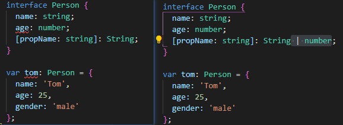

[TOC]

## 对象的类型--接口

在 TypeScript 中，我们使用接口（Interfaces）来定义对象的类型。

TypeScript 中的接口是一个非常灵活的概念，除了可用于[对类的一部分行为进行抽象](https://ts.xcatliu.com/advanced/class-and-interfaces.html#类实现接口)以外，也常用于对「对象的形状（Shape）」进行描述。

```typescript
interface Person {
    name: string;
    age: number;
}

let tom: Person = {
    name: 'Tom',
    age: 25
};
```

**上面的接口定义不允许定义的变量比接口多或者少一些属性**; 

**赋值的时候，变量的形状必须和接口的形状保持一致**。

### 只读属性

对象中的一些字段**只能在创建的时候被赋值**(如果是创建的是时候没有赋值也会报错)，那么可以用 `readonly` 定义只读属性：

```typescript
interface Person {
    readonly id: number;
    name: string;
}

let tom: Person = {
    id: 89757,
    name: 'Tom',
};

tom.id = 9527; // 不允许赋值只读属性
```

**注意，只读的约束存在于第一次给对象赋值的时候，**

**而不是第一次给只读属性赋值的时候**：

```ts
interface Person {
    readonly id: number;
    name: string;
    age?: number;
    [propName: string]: any;
}

let tom: Person = {
    name: 'Tom',
    gender: 'male'
};

tom.id = 89757;

// index.ts(8,5): error TS2322: Type '{ name: string; gender: string; }' is not assignable to type 'Person'.
//   Property 'id' is missing in type '{ name: string; gender: string; }'.
// index.ts(13,5): error TS2540: Cannot assign to 'id' because it is a constant or a read-only property.
```

上例中，报错信息有两处，第一处是在对 `tom` 进行赋值的时候，没有给 `id` 赋值。

第二处是在给 `tom.id` 赋值的时候，由于它是只读属性，所以报错了。

### 可选属性

不要完全匹配一个形状, 可选属性的含义是该属性可以不存在。

```typescript
interface Person {
    name: string;
    age?: number; // 可选, 定义的变量可以不包含这个属性
}
```

但是此时仍不能添加未定义的属性

### 任意属性

希望一个接口允许有任意的属性，可以使用如下方式：

```typescript
interface Person {
    name: string;
    age?: number;
    [propName: string]: any;
}

let tom: Person = {
    name: 'Tom',
    gender: 'male'
};
```

使用 `[propName: string]` 定义了任意属性取 `string` 类型的值。

需要注意的是，**一旦定义了任意属性，那么确定属性和可选属性的类型都必须是<u>它(任意属性)的类型的子集</u>**：

```ts
interface Person {
    name: string;
    age?: number;
    [propName: string]: string;
}

let tom: Person = {
    name: 'Tom',
    age: 25,
    gender: 'male'
};

// index.ts(3,5): error TS2411: Property 'age' of type 'number' is not assignable to string index type 'string'.
// index.ts(7,5): error TS2322: Type '{ [x: string]: string | number; name: string; age: number; gender: string; }' is not assignable to type 'Person'.
//   Index signatures are incompatible.
//     Type 'string | number' is not assignable to type 'string'.
//       Type 'number' is not assignable to type 'string'.
```

任意属性的值允许是 `string`，但是可选属性 `age` 的值却是 `number`，`number` 不是 `string` 的子属性，所以报错了。

在报错信息中可以看出，此时 `{ name: 'Tom', age: 25, gender: 'male' }` 的类型被推断成了 `{ [x: string]: string | number; name: string; age: number; gender: string; }`，这是联合类型和接口的结合。



一个接口中只能定义一个任意属性。如果接口中有多个类型的属性，则可以在任意属性中使用联合类型