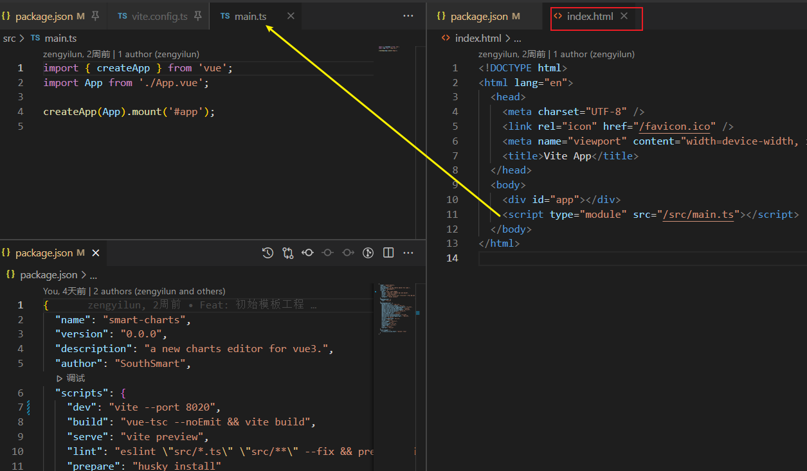
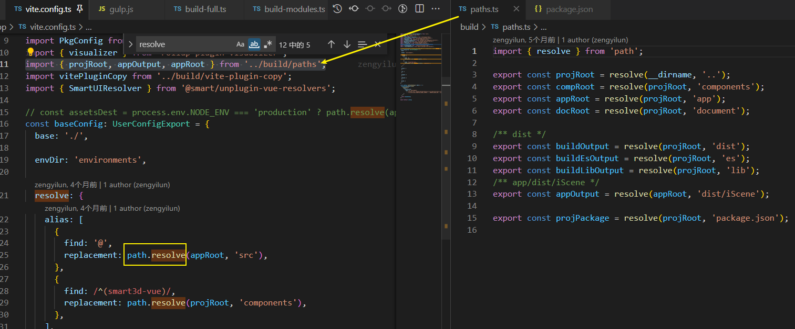
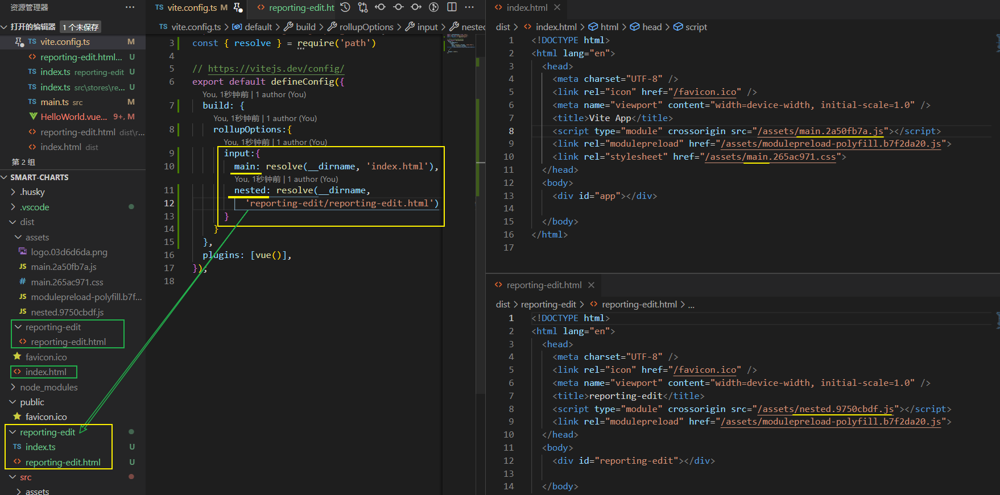

[toc]

# 构建生产版本[#](https://cn.vitejs.dev/guide/build.html#building-for-production)

当需要将应用部署到生产环境时，只需**运行 `vite build` 命令**。

默认情况下，它**使用 `/index.html` 作为其构建入口点**，并**生成能够静态部署的应用程序包**。 ( 可以配置多页面应用构建, 并非是库 )

请查阅 [部署静态站点](https://cn.vitejs.dev/guide/static-deploy.html) 获取常见服务的部署指引。



> 如果需要自定义多种构建情况该怎么处理?
>
> smartCharts: 多页面应用 + 构建lib
>
> 参考: 配置--构建选项, 配置多个不同的配置对象, 以不同的路径作为切入点


## 浏览器兼容性[#](https://cn.vitejs.dev/guide/build.html#browser-compatibility)

用于生产环境的构建包会假设目标浏览器支持现代 JavaScript 语法。

默认情况下，Vite 的目标浏览器是指能够 [支持原生 ESM script 标签](https://caniuse.com/es6-module) 和 [支持原生 ESM 动态导入](https://caniuse.com/es6-module-dynamic-import) 的。


你也可以通过 [`build.target` 配置项](https://cn.vitejs.dev/config/#build-target) 指定构建目标，最低支持 `es2015`。

请注意，默认情况下 Vite 只处理语法转译，且 **默认不包含任何 polyfill**。

你可以前往 [Polyfill.io](https://polyfill.io/v3/) 查看，这是一个基于用户浏览器 User-Agent 字符串自动生成 polyfill 包的服务。

传统浏览器可以通过插件 [@vitejs/plugin-legacy](https://github.com/vitejs/vite/tree/main/packages/plugin-legacy) 来支持，它将自动生成传统版本的 chunk 及与其相对应 ES 语言特性方面的 polyfill。兼容版的 chunk 只会在不支持原生 ESM 的浏览器中进行按需加载。


## 公共基础路径[#](https://cn.vitejs.dev/guide/build.html#public-base-path)

- 相关内容：[静态资源处理](https://cn.vitejs.dev/guide/assets.html)

如果你需要在嵌套的公共路径下部署项目，只需指定 [`base` 配置项](https://cn.vitejs.dev/config/#base)，然后所有资源的路径都将据此配置重写。

这个选项也可以通过命令行参数指定，例如 `vite build --base=/my/public/path/`。

由 JS 引入的资源 URL，CSS 中的 `url()` 引用以及 `.html` 文件中引用的资源在构建过程中都会自动调整，以适配此选项。

当然，情况也有例外，当访问过程中需要**使用动态连接的 url 时，可以使用全局注入的 `import.meta.env.BASE_URL` 变量，它的值为公共基础路径。**

> 注意，这个变量在构建时会**被静态替换**，因此，它必须按 `import.meta.env.BASE_URL` 的原样出现（例如 `import.meta.env['BASE_URL']` 是无效的）


## 自定义构建[#](https://cn.vitejs.dev/guide/build.html#customizing-the-build)

构建过程可以通过多种 [构建配置选项](https://cn.vitejs.dev/config/#build-options) 来自定义构建。

具体来说，你可以通过 `build.rollupOptions` 直接调整底层的 [Rollup 选项](https://rollupjs.org/guide/en/#big-list-of-options)：

```
// vite.config.js
module.exports = defineConfig({
  build: {
    rollupOptions: {
      // https://rollupjs.org/guide/en/#big-list-of-options
    }
  }
})
```

例如，你可以使用仅在构建期间应用的插件来指定多个 Rollup 输出。


## 产物分块策略[#](https://cn.vitejs.dev/guide/build.html#chunking-strategy)

你可以配置在使用 `build.rollupOptions.output.manualChunks` 时各个 **chunk** 是如何分割的（查看 [Rollup 相应文档](https://rollupjs.org/guide/en/#outputmanualchunks)）。

到 Vite 2.8 时，默认的策略是将 chunk 分割为 `index` 和 `vendor`。(默认index为source, vendor为node_modules中使用的依赖文件)

​	这对一些 SPA 来说是好的策略，但是要对每一种用例目标都提供一种通用解决方案是非常困难的。

从 Vite 2.9 起，`manualChunks` **默认情况下不再被更改**。你可以通过在配置文件中添加 **`splitVendorChunkPlugin`** 来继续**使用 “分割 Vendor Chunk” 策略**：

```js
// vite.config.js
import { splitVendorChunkPlugin } from 'vite'
module.exports = defineConfig({
  plugins: [splitVendorChunkPlugin()]
})
```

同时这个策略也被作为 `splitVendorChunk({ cache: SplitVendorChunkCache })` 工厂函数，在需要使用自定义逻辑时可以进行组合。

必须确保 `cache.reset()` 在 `buildStart` 阶段调用，以保证构建时监听模式能够正常工作。


## 文件变化时重新构建[#](https://cn.vitejs.dev/guide/build.html#rebuild-on-files-changs)

你可以使用 `vite build --watch` 来启用 rollup 的监听器。

或者，你可以直接通过 `build.watch` 调整底层的 [`WatcherOptions`](https://rollupjs.org/guide/en/#watch-options) 选项：

```
// vite.config.js
module.exports = defineConfig({
  build: {
    watch: {
      // https://rollupjs.org/guide/en/#watch-options
    }
  }
})
```

(示例代码中的地址:  https://rollupjs.org/guide/en/#watch-options)

当启用 `--watch` 标志时，对 `vite.config.js` 的改动，以及任何要打包的文件，都将触发**重新构建**。


## 多页面应用模式[#](https://cn.vitejs.dev/guide/build.html#multi-page-app)

假设你有下面这样的项目文件结构

```
├── package.json
├── vite.config.js
├── index.html
├── main.js
└── nested
    ├── index.html
    └── nested.js
```

在开发过程中，简单地导航或链接到 `/nested/` - 将会按预期工作，与正常的静态文件服务器表现一致。

**在构建过程中，你只需指定多个 `.html` 文件作为入口点即可**：

```js
// vite.config.js
const { resolve } = require('path')
const { defineConfig } = require('vite')

module.exports = defineConfig({
  build: {
    rollupOptions: {
    // 使用input属性指定入口点 
      input: {
        main: resolve(__dirname, 'index.html'),
        nested: resolve(__dirname, 'nested/index.html')
      }
    }
  }
})
```

如果你指定了另一个根目录，请记住，在解析输入路径时，**`__dirname` 的值将仍然是 vite.config.js 文件所在的目录**。

因此，你需要把对应入口文件的 `root` 的路径添加到 `resolve` 的参数中。


(可以参考 iScene-next 如何使用 resolve 获取路径)



在外部指定好了对应的路径:

`projectRoot为根文件夹`, 依次指定其他的目录后再提供给`vite.config.ts`中进行使用


#### 实操 smart-charts 配置

执行 build 命令后生成的结果



.. 如何开发时配置路由, 能够同时访问两个页面


## 库模式[#](https://cn.vitejs.dev/guide/build.html#library-mode)

当你开发面向浏览器的库时，你可能会将大部分时间花在该库的测试/演示页面上。

在 Vite 中你可以使用 `index.html` 获得如丝般顺滑的开发体验。

当这个库要进行**发布构建时，请使用 [`build.lib` 配置项](https://cn.vitejs.dev/config/#build-lib)**，以确保将那些你**不想打包进库的依赖进行外部化处理**，例如 `vue` 或 `react`：

```js
// vite.config.js
const path = require('path')
const { defineConfig } = require('vite')

module.exports = defineConfig({
  build: {
    lib: {
      entry: path.resolve(__dirname, 'lib/main.js'),
      name: 'MyLib',
      fileName: (format) => `my-lib.${format}.js`
    },
    rollupOptions: {
      // 确保外部化处理那些你不想打包进库的依赖
      external: ['vue'],
      output: {
        // 在 UMD 构建模式下为这些外部化的依赖提供一个全局变量
        globals: {
          vue: 'Vue'
        }
      }
    }
  }
})
```


**vite打包lib库:https://juejin.cn/post/7073646687968821256**

**vite的项目，使用rollup打包的方法**:https://juejin.cn/post/7036207262414667790
