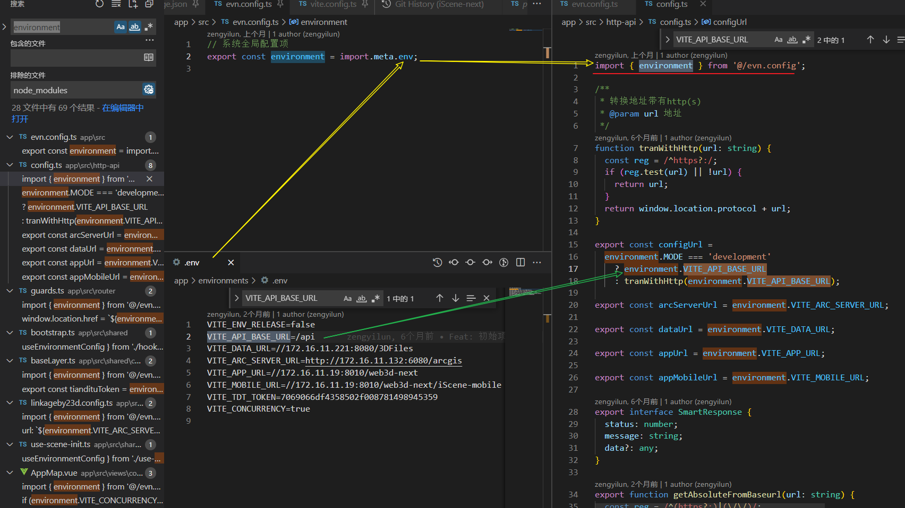
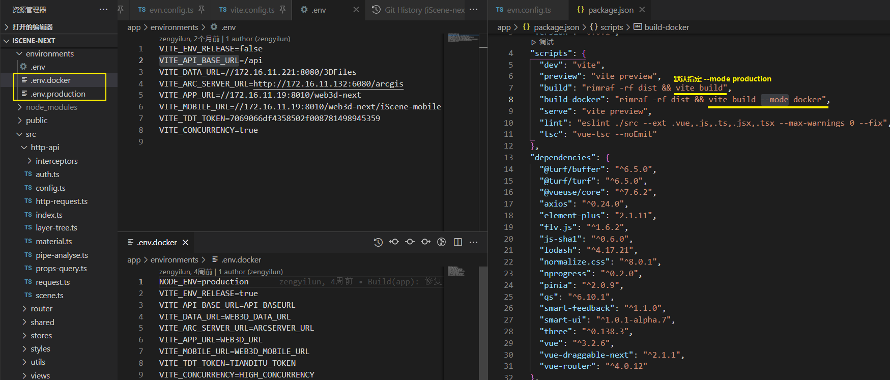
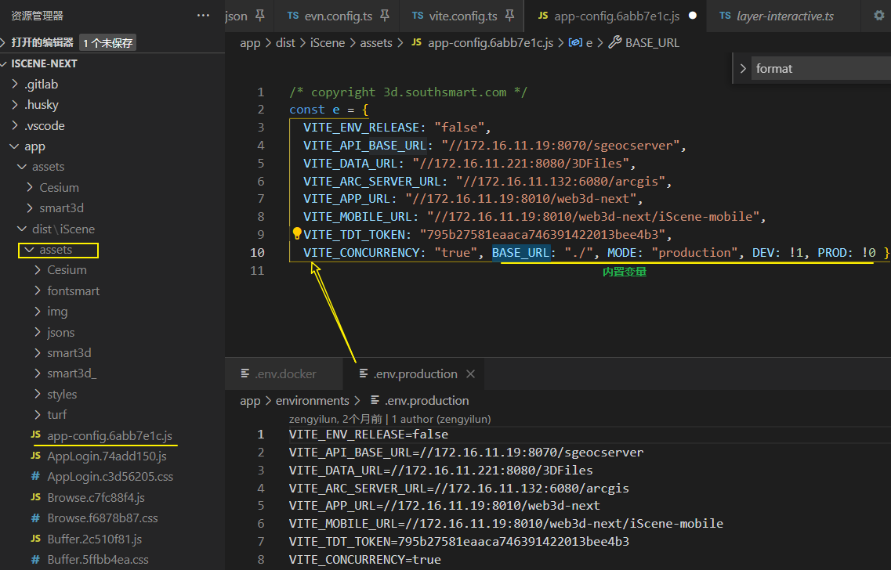
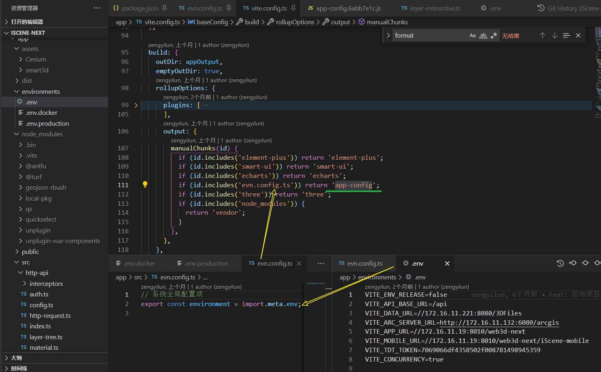
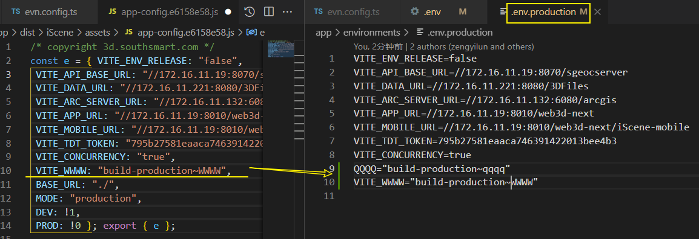
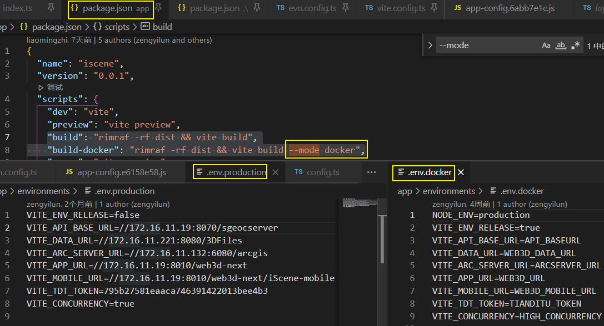

[toc]

# 环境变量和模式[#](https://cn.vitejs.dev/guide/env-and-mode.html#env-variables-and-modes)

## 环境变量[#](https://cn.vitejs.dev/guide/env-and-mode.html#env-variables)

Vite 在一个特殊的 **`import.meta.env`** 对象上暴露环境变量。

iScene-next `env`配置示例:



这里有一些在所有情况下都可以使用的**内置变量**：

- **`import.meta.env.MODE`**: {string} 应用运行的[模式](https://cn.vitejs.dev/guide/env-and-mode.html#modes)。

- **`import.meta.env.BASE_URL`**: {string} 部署应用时的基本 URL。他由[`base` 配置项](https://cn.vitejs.dev/config/#base)决定。

- **`import.meta.env.PROD`**: {boolean} 应用是否运行在生产环境。

- **`import.meta.env.DEV`**: {boolean} 应用是否运行在开发环境

   (永远与 `import.meta.env.PROD`相反)。


### 生产环境替换[#](https://cn.vitejs.dev/guide/env-and-mode.html#production-replacement)

在生产环境中，这些环境变量会在构建时被**静态替换**，因此，在**引用它们时**请使用完**全静态的字符串**。

**动态的 key 将无法生效**。例如，动态 key 取值 `import.meta.env[key]` 是无效的。

它还将替换出现在 JavaScript 和 Vue 模板中的字符串。这本应是非常少见的，但也可能是不小心为之的。在这种情况下你可能会看到类似 `Missing Semicolon` 或 `Unexpected token` 等错误，例如当 `"process.env.NODE_ENV"` 被替换为 `""development": "`。有一些方法可以避免这个问题：

- 对于 JavaScript 字符串，你可以使用 unicode 零宽度空格 **`\u200b`** (一个看不见的分隔符)来分割这个字符串，例如： `'import.meta\u200b.env.MODE'`。
- 对于 Vue 模板或其他编译到 JavaScript 字符串的 HTML，你可以使用 [`` 标签](https://developer.mozilla.org/en-US/docs/Web/HTML/Element/wbr)，例如：`import.meta.env.MODE`。


## `.env` 文件[#](https://cn.vitejs.dev/guide/env-and-mode.html#env-files)

Vite 使用 [dotenv](https://github.com/motdotla/dotenv) 从你的 **[环境目录](https://cn.vitejs.dev/config/#envdir)** 中的下列**文件**加载**额外的环境变量**：

```
.env                # 所有情况下都会加载
.env.local          # 所有情况下都会加载，但会被 git 忽略
.env.[mode]         # 只在指定模式下加载
.env.[mode].local   # 只在指定模式下加载，但会被 git 忽略
```

**环境加载优先级**

- 一份用于指定**模式的文件**（例如 `.env.production`）会比通用形式的**优先级更高**（例如 `.env`）。

- 另外，Vite 执行时已经存在的环境变量有最高的优先级，不会被 `.env` 类文件覆盖。例如当运行 `VITE_SOME_KEY=123 vite build` 的时候。

  > 如何理解? 命令行的优先级高?

- `.env` 类文件会在 Vite 启动一开始时被加载，而改动会在重启服务器后生效。


iScene-next 示例



从示例上来说这些配置会在打包后, 集中在一个配置文件中?


---- 搜到了



app-config 的名字也是 vite 中配置的:




**加载的环境变量也会通过 `import.meta.env` 以字符串形式暴露给客户端源码。**

为了防止意外地将一些环境变量泄漏到客户端，只有以 `VITE_` 为前缀的变量才会暴露给经过 vite 处理的代码。例如下面这个文件中：

```shell
DB_PASSWORD=foobar
VITE_SOME_KEY=123
```

只有 `VITE_SOME_KEY` 会被暴露为 `import.meta.env.VITE_SOME_KEY` 提供给**客户端**源码，而 `DB_PASSWORD` 则不会。

> 也就是说其他的模块可以访问不到这个没有前缀的变量?
>
> iScene-next中环境变量都是带前缀使用的

如果你想自定义 env 变量的前缀，请参阅 [envPrefix](https://cn.vitejs.dev/config/index.html#envprefix)。

> 安全注意事项:
>
> `.env.*.local` 文件应是本地的，可以包含敏感变量。
>
> 你应该将 `.local` 添加到你的 `.gitignore` 中，以避免它们被 git 检入。
>
> 由于任何暴露给 Vite 源码的变量最终都将出现**在客户端包**中，**`VITE_*` 变量应该不包含任何敏感信息**。

~~ 可以试试添加额外的环境变量 ~~


打包app..



那不暴露给客户端, 是不是不带前缀的变量仅在node环境(服务端)下能用呢? 暂时不能够想到场景..

vite 配置文件是在 nodejs 中执行的，所以只需要通过 nodejs 读取环境变量文件，然后解析文件就行了。当然这只是简单的实现 ~ https://zhuanlan.zhihu.com/p/378228376


#### 拓展阅读

- dotenv

  Dotenv is a zero-dependency module that loads environment variables from a `.env` file into [`process.env`](https://nodejs.org/docs/latest/api/process.html#process_process_env). 

  Storing configuration in the environment separate from code is based on [The Twelve-Factor App](http://12factor.net/config) methodology.

- 环境目录:

  #### envDir[#](https://cn.vitejs.dev/config/#envdir)

  - **类型：** `string`

  - **默认：** `root`

    用于加载 `.env` 文件的目录。

    可以是一个绝对路径，也可以是相对于项目根的路径。

    关于环境文件的更多信息，请参见 [这里](https://cn.vitejs.dev/guide/env-and-mode.html#env-files)。


### TypeScript 的智能提示[#](https://cn.vitejs.dev/guide/env-and-mode.html#intellisense)

默认情况下，Vite 在 [`vite/client.d.ts`](https://github.com/vitejs/vite/blob/main/packages/vite/client.d.ts) 中为 `import.meta.env` 提供了类型定义。随着在 `.env[mode]` 文件中自定义了越来越多的环境变量，你可能想要在代码中获取这些以 `VITE_` 为前缀的用户自定义环境变量的 TypeScript 智能提示。

要想做到这一点，你可以在 `src` 目录下创建一个 `env.d.ts` 文件，接着按下面这样增加 `ImportMetaEnv` 的定义：

```ts
/// <reference types="vite/client" />

interface ImportMetaEnv {
  readonly VITE_APP_TITLE: string
  // 更多环境变量...
}

interface ImportMeta {
  readonly env: ImportMetaEnv
}
```

iScene-next 示例:

```ts
/// <reference types="vite/client" />

declare module '*.vue' {
  import type { DefineComponent } from 'vue';
  // eslint-disable-next-line @typescript-eslint/no-explicit-any, @typescript-eslint/ban-types
  const component: DefineComponent<{}, {}, any>;
  export default component;
}

declare module 'rollup-plugin-external-globals';

interface ImportMetaEnv extends Readonly<Record<string, string>> {
  readonly VITE_ENV_RELEASE: boolean;
  readonly VITE_API_BASE_URL: string;
  readonly VITE_DATA_URL: string;
  readonly VITE_ARC_SERVER_URL: string;
  readonly VITE_APP_URL: string;
  readonly VITE_MOBILE_URL: string;
  readonly VITE_TDT_TOKEN: string;
  readonly VITE_CONCURRENCY: boolean;
}

interface ImportMeta {
  readonly env: ImportMetaEnv;
}

```

**不同之处:**   

- `interface ImportMetaEnv` vs `interface ImportMetaEnv extends Readonly<Record<string, string>>`

  `Record<string, string>`  相关的vite文档内容: [共享配置-define](https://cn.vitejs.dev/config/#define)

- 


## 模式[#](https://cn.vitejs.dev/guide/env-and-mode.html#modes)

默认情况下:

- 开发服务器 (`dev` 命令) 运行在 `development` (开发) 模式，
-  `build` 命令则运行在 `production` (生产) 模式。

这意味着当执行 `vite build` 时，它会**自动加载 `.env.production` 中可能存在的环境变量**：

```js
# .env.production
VITE_APP_TITLE=My App
```

在你的应用中，你可以使用 `import.meta.env.VITE_APP_TITLE` 渲染标题。

然而，重要的是要理解 **模式** 是一个更广泛的概念，而不仅仅是开发和生产。

一个典型的例子是，你可能希望有一个 “staging” (预发布|预上线) 模式，它应该具有类似于生产的行为，但环境变量与生产环境略有不同。

你可以**通过传递 `--mode` 选项标志来覆盖命令使用的默认模式**。

例如，如果你想为我们假设的 staging 模式构建应用：

```shell
vite build --mode staging
```

为了使应用实现预期行为，我们还需要一个 `.env.staging` 文件：

```js
# .env.staging
NODE_ENV=production
VITE_APP_TITLE=My App (staging)
```

现在，你的 staging 应用应该具有类似于生产的行为，但显示的标题与生产环境不同。

iScene-next 示例:


