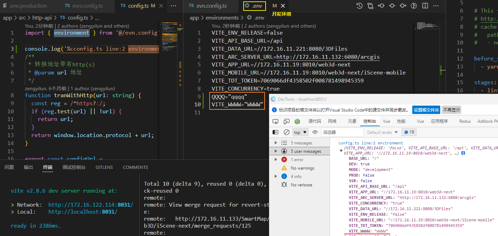

[toc]

# 配置 Vite[#](https://cn.vitejs.dev/config/#configuring-vite)

## 配置文件

当以命令行方式运行 `vite` 时，Vite 会自动解析 [项目根目录](https://cn.vitejs.dev/guide/#index-html-and-project-root) 下名为 `vite.config.js` 的文件。

最基础的配置文件是这样的：

```js
// vite.config.js
export default {
  // 配置选项
}
```

注意：即使项目没有在 `package.json` 中开启 `type: "module"`，Vite 也支持在配置文件中使用 ESM 语法。

这种情况下，**配置文件会在被加载前自动进行预处理**。


可以**显式地通过 `--config` 命令行选项指定一个配置文件**（相对于 `cwd` 路径进行解析）

```shell
vite --config my-config.js
```

> 注意:
>
> Vite 会在 **CommonJS** 和 **TypeScript** **配置文件中**替换 `__filename`，`__dirname` 以及 `import.meta.url`。
>
> 如果使用这些名称作为变量名可能会导致代码报错：
>
> ```
> const __filename = "value"
> // will be transformed to
> const "path/vite.config.js" = "value"
> ```

基于以上注意事项, iScene-next 将 `vite.config.js` 中使用的 `路径`变量用一个模块单独处理


### 配置智能提示[#](https://cn.vitejs.dev/config/#config-intellisense)

因为 Vite 本身附带 Typescript 类型，所以你可以**通过 IDE 和 jsdoc 的配合来实现智能提示**：

```js
/**
 * @type {import('vite').UserConfig}
 */
const config = {
  // ...
}

export default config
```

另外你可以使用 `defineConfig` 工具函数，这样不用 jsdoc 注解也可以获取类型提示：

```tsx
import { defineConfig } from 'vite'

export default defineConfig({
  // ...
})
```

Vite 也直接支持 TS 配置文件。你可以在 `vite.config.ts` 中使用 `defineConfig` 工具函数。

iScene-next: `app/vite.config.js`:


### 情景配置[#](https://cn.vitejs.dev/config/#conditional-config)

如果配置文件需要基于（`dev`/`serve` 或 `build`）**命令**或者不同的 [模式](https://cn.vitejs.dev/guide/env-and-mode.html) 来决定选项，则可以选择导出这样**一个函数**：

```ts
export default defineConfig(({ command, mode }) => {
  if (command === 'serve') {
    return {
      // dev 独有配置
    }
  } else {
    // command === 'build'
    return {
      // build 独有配置
    }
  }
})
```

> iScene-next示例同上

需要注意的是，在 Vite 的 API 中，

- 在开发环境下 `command` 的值为 `serve`（在 CLI 中， `vite dev` 和 `vite serve` 是 `vite` 的别名），
- 而在生产环境下为 `build`（`vite build`）。

###  异步配置[#](https://cn.vitejs.dev/config/#async-config)

如果配置需要调用一个异步函数，也可以转而导出一个异步函数：

```ts
export default defineConfig(async ({ command, mode }) => {
  const data = await asyncFunction()
  return {
    // vite 配置
  }
})
```


### 环境变量

**环境变量通常可以从 `process.env` 获得。**

注意 Vite 默认是不加载 `.env` 文件的，因为这些文件需要在执行完 Vite 配置后才能确定加载哪一个，

举个例子，`root` 和 `envDir` 选项会影响加载行为。

不过当你的确需要时，你可以使用 Vite 导出的 `loadEnv` 函数来加载指定的 `.env` 文件

> ​	疑问: 为什么默认是不加载的, 我之前认为是默认加载.env文件中的变量后才能在客户端使用;

> ​	实际: iScene-next中我在.env文件中的修改, 在重启开发服务器后能直接更新对应的变量..?

`app/vite.config.ts` 中指定了 `envDir` 配置:

```ts
const baseConfig: UserConfigExport = {
  base: './',
  envDir: 'environments',
	//...
}
```

从 [`.env` 文件](https://cn.vitejs.dev/guide/env-and-mode.html#env-files) 环境变量配置中理解 `.env`所有情况下(指定任一mode时)会被加载.

```js
.env                # 所有情况下都会加载
.env.local          # 所有情况下都会加载，但会被 git 忽略
.env.[mode]         # 只在指定模式下加载
.env.[mode].local   # 只在指定模式下加载，但会被 git 忽略
```

