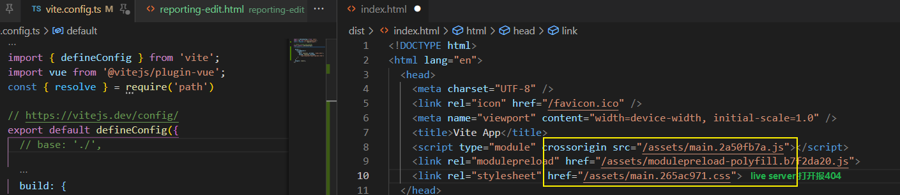
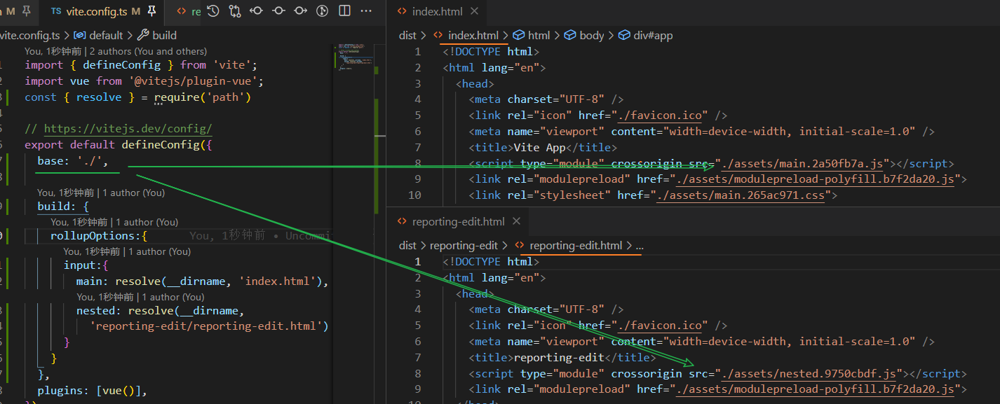

[toc]

## 共享配置[#](https://cn.vitejs.dev/config/#shared-options)

### 可以重点关注下有iScene-next使用经历的配置项:

1. base
2. envDir
3. resolve.alias
4. server
   1. host/port
   2. fs
   3. proxy
5. css
   1. preprocessorOptions
6. plugins
7. esbuild
   1. banner

### root

- **类型：** `string`
- **默认：** `process.cwd()`

**项目根目录（`index.html` 文件所在的位置）**。可以是一个绝对路径，或者一个相对于该配置文件本身的相对路径。

更多细节请见 [项目根目录](https://cn.vitejs.dev/guide/#index-html-and-project-root)。

###  base[#](https://cn.vitejs.dev/config/#base)

- **类型：** `string`
- **默认：** `/`

**开发或生产环境服务的公共基础路径**。

合法的值包括以下几种：

- 绝对 URL 路径名，例如 `/foo/`
- 完整的 URL，例如 `https://foo.com/`
- 空字符串或 `./`（用于开发环境）

更多信息详见 [公共基础路径](https://cn.vitejs.dev/guide/build.html#public-base-path)。


#### 默认配置 & run build



**base: './'**, 最直接的影响是改变了打包文件的引用路径.



### mode[#](https://cn.vitejs.dev/config/#mode)

- **类型：** `string`

- **默认：** `'development'`（serve），`'production'`（build）

  在配置中指明将会把 **serve 和 build** 时的模式 **都** 覆盖掉。也可以通过命令行 `--mode` 选项来重写。

  查看 [环境变量与模式](https://cn.vitejs.dev/guide/env-and-mode.html) 章节获取更多细节。

### define[#](https://cn.vitejs.dev/config/#define)

- **类型：** `Record<string, string>`

  **定义全局常量替换方式**。

  其中每项在开发环境下会被定义在全局，而在**构建时被静态替换**。

  - 为了与 [esbuild 的行为](https://esbuild.github.io/api/#define)保持一致，表达式必须为一个 JSON 对象（null、boolean、number、string、数组或对象），亦或是一个单独的标识符。
  - 替换只会在匹配到周围是单词边界（`\b`）时执行。

  > WARNING
>
  > 因为它是不经过任何语法分析，直接替换文本实现的，所以我们建议只对 CONSTANTS 使用 `define`。
>
  > 例如，`process.env.FOO` 和 `__APP_VERSION__` 就非常适合。但 `process` 或 `global` 不应使用此选项。变量相关应使用 shim 或 polyfill 代替。

  

  > NOTE
>
  > 对于使用 TypeScript 的开发者来说，请确保在 `env.d.ts` 或 `vite-env.d.ts` 文件中添加类型声明，以获得类型检查以及代码提示。
>
  > Example:
  >
  > ```ts
  > // vite-env.d.ts
  > declare const __APP_VERSION__: string
  > ```


### plugins[#](https://cn.vitejs.dev/config/#plugins)

- **类型：** `(Plugin | Plugin[])[]`

  需要用到的**插件数组**。

  Falsy 虚值的插件将被忽略，**插件数组将被扁平化**（flatten）。查看 [插件 API](https://cn.vitejs.dev/guide/api-plugin.html) 获取 Vite 插件的更多细节。


### publicDir[#](https://cn.vitejs.dev/config/#publicdir)

- **类型：** `string | false`

- **默认：** `"public"`

  作为**静态资源服务的文件夹**。

  该目录中的文件在开发期间在 `/` 处提供，并在构建期间复制到 `outDir` 的根目录，并且始终按原样提供或复制而无需进行转换。

  该值可以是文件系统的绝对路径，也可以是相对于项目的根目录的相对路径。

  将 `publicDir` 设定为 `false` 可以关闭此项功能。

  欲了解更多，请参阅 [`public` 目录](https://cn.vitejs.dev/guide/assets.html#the-public-directory)。


### cacheDir[#](https://cn.vitejs.dev/config/#cachedir)

- **类型：** `string`

- **默认：** `"node_modules/.vite"`

  **存储缓存文件的目录。**

  此目录下会存储预打包的依赖项或 vite 生成的某些缓存文件，**使用缓存可以提高性能**。

  如需重新生成缓存文件，你可以**使用 `--force` 命令行选项**或手动删除目录。

  此选项的值可以是文件的绝对路径，也可以是以项目根目录为基准的相对路径。

  当没有检测到 package.json 时，则默认为 `.vite`。

  

### resolve.alias[#](https://cn.vitejs.dev/config/#resolve-alias)

- **类型：**
```ts
Record | Array<{ 
	find: string | RegExp, 
	replacement: string, 
	customResolver?: ResolverFunction | ResolverObject 
}>
```

  将会被传递到 `@rollup/plugin-alias` 作为 [entries 的选项](https://github.com/rollup/plugins/tree/master/packages/alias#entries)。也可以是一个对象，或一个 `{ find, replacement, customResolver }` 的数组。

  当使用文件系统路径的别名时，请始终使用绝对路径。相对路径的别名值会原封不动地被使用，因此无法被正常解析。

  更高级的自定义解析方法可以通过 [插件](https://cn.vitejs.dev/guide/api-plugin.html) 实现。

```js
// iScene-next/app/vite.config.ts
{  // ...
    resolve: {
        alias: [
            {
                find: '@',
                replacement: path.resolve(appRoot, 'src'),
            },
            {
                find: /^(smart3d-vue)/,
                replacement: path.resolve(projRoot, 'components'),
            },
        ],
    },
	// ...
}
```


### resolve.dedupe

**类型：** `string[]`

如果你在你的应用程序中**有相同依赖的副本**（比如 monorepos），请使用此选项强制 Vite 始终将列出的依赖项解析为同一副本（从项目根目录）。


### resolve.conditions[#](https://cn.vitejs.dev/config/#resolve-conditions)

- **类型：** `string[]`

  解决程序包中 [情景导出](https://nodejs.org/api/packages.html#packages_conditional_exports) 时的其他允许条件。


### resolve.mainFields[#](https://cn.vitejs.dev/config/#resolve-mainfields)

- **类型：** `string[]`

- **默认：** `['module', 'jsnext:main', 'jsnext']`

  `package.json` 中，在解析包的入口点时尝试的字段列表。

  注意：这比从 `exports` 字段解析的情景导出优先级低：如果一个入口点从 `exports` 成功解析，`resolve.mainFields` 将被忽略


### resolve.extensions[#](https://cn.vitejs.dev/config/#resolve-extensions)

- **类型：** `string[]`

- **默认：** `['.mjs', '.js', '.ts', '.jsx', '.tsx', '.json']`

  导入时想要省略的扩展名列表。

  注意，**不** 建议忽略自定义导入类型的扩展名（例如：`.vue`），因为它会影响 IDE 和类型支持。

### resolve.preserveSymlinks[#](https://cn.vitejs.dev/config/#resolve-preservesymlinks)

- **类型：** `boolean`

- **默认：** `false`

  启用此选项会使 Vite 通过**原始文件路径**（即不跟随符号链接的路径）而不是真正的文件路径（即跟随符号链接后的路径）确定文件身份。

- **相关：** [esbuild#preserve-symlinks](https://esbuild.github.io/api/#preserve-symlinks)，[webpack#resolve.symlinks](https://webpack.js.org/configuration/resolve/#resolvesymlinks)


### css.modules[#](https://cn.vitejs.dev/config/#css-modules)

- **类型：**

  ```
  interface CSSModulesOptions {
    scopeBehaviour?: 'global' | 'local'
    globalModulePaths?: RegExp[]
    generateScopedName?:
      | string
      | ((name: string, filename: string, css: string) => string)
    hashPrefix?: string
    /**
     * default: null
     */
    localsConvention?:
      | 'camelCase'
      | 'camelCaseOnly'
      | 'dashes'
      | 'dashesOnly'
      | null
  }
  ```

  配置 **CSS modules 的行为**。选项将被传递给 [postcss-modules](https://github.com/css-modules/postcss-modules)。


### css.postcss[#](https://cn.vitejs.dev/config/#css-postcss)

- **类型：** `string | (postcss.ProcessOptions & { plugins?: postcss.Plugin[] })`

  内联的 PostCSS 配置（格式同 `postcss.config.js`），或者一个（默认基于项目根目录的）自定义的 PostCSS 配置路径。

  对内联的 POSTCSS 配置，它期望接收与 `postcss.config.js` 一致的格式。但对于 `plugins` 属性有些特别，只接收使用 [数组格式](https://github.com/postcss/postcss-load-config/blob/main/README.md#array)。

  搜索是使用 [postcss-load-config](https://github.com/postcss/postcss-load-config) 完成的，只有被支持的文件名才会被加载。

  注意：如果提供了该内联配置，Vite 将不会搜索其他 PostCSS 配置源。


### css.preprocessorOptions[#](https://cn.vitejs.dev/config/#css-preprocessoroptions)

- **类型：** `Record`

  **指定传递给 CSS 预处理器的选项**。

  文件扩展名用作选项的键，例如：

  ```ts
  export default defineConfig({
    css: {
      preprocessorOptions: {
        scss: {
          additionalData: `$injectedColor: orange;`
        },
        styl: {
          additionalData: `$injectedColor ?= orange`
        }
      }
    }
  })
  ```

  ```ts
  // iScene-next/app/vite.config.ts
  {
      //...
      css: {
          preprocessorOptions: {
              scss: { // 可以理解为传递给scss的option
                  additionalData: `@use "@/styles/element-variables" as *;`,
              },
  		},
  	},
  }
  
  ```

  

### css.devSourcemap[#](https://cn.vitejs.dev/config/#css-devsourcemap)

- **实验性**

- **类型：** `boolean`

- **默认：** `false`

  在开发过程中是否启用 sourcemap。

### json.namedExports[#](https://cn.vitejs.dev/config/#json-namedexports)

- **类型：** `boolean`

- **默认：** `true`

  是否支持从 `.json` 文件中进行按名导入。

### json.stringify[#](https://cn.vitejs.dev/config/#json-stringify)

- **类型：** `boolean`

- **默认：** `false`

  若设置为 `true`，导入的 JSON 会被转换为 `export default JSON.parse("...")`，这样会比转译成对象字面量性能更好，尤其是当 JSON 文件较大的时候。

  开启此项，则会禁用按名导入。


###  esbuild[#](https://cn.vitejs.dev/config/#esbuild)

- **类型：** `ESBuildOptions | false`

`ESBuildOptions` 继承自 [esbuild 转换选项](https://esbuild.github.io/api/#transform-api)。

最常见的用例是**自定义 JSX**：

```ts
export default defineConfig({
  esbuild: {
    jsxFactory: 'h',
    jsxFragment: 'Fragment'
  }
})
```

**默认情况下，esbuild 会被应用在 `ts`、`jsx`、`tsx` 文件。**

你可以通过 `esbuild.include` 和 `esbuild.exclude` 对要处理的文件类型进行配置，这两个配置的值可以是一个正则表达式、一个 [picomatch](https://github.com/micromatch/picomatch#globbing-features) 模式，或是一个值为这两种类型的数组。

此外，你还可以通过 `esbuild.jsxInject` 来自动为每一个被 esbuild 转换的文件注入 JSX helper。

```
export default defineConfig({
  esbuild: {
    jsxInject: `import React from 'react'`
  }
})
```

设置为 `false` 来禁用 esbuild 转换。

```ts
// iScene-next/app/vite.config.ts
esbuild: {
    banner: '/* copyright 3d.southsmart.com */',
  },
```


###  assetsInclude[#](https://cn.vitejs.dev/config/#assetsinclude)

- **类型：** `string | RegExp | (string | RegExp)[]`

- **相关内容：** [静态资源处理](https://cn.vitejs.dev/guide/assets.html)

  指定额外的 [picomatch 模式](https://github.com/micromatch/picomatch#globbing-features) 作为静态资源处理，因此：

  - 当从 HTML 引用它们或直接通过 `fetch` 或 XHR 请求它们时，它们将被插件转换管道排除在外。
  - 从 JavaScript 导入它们将返回解析后的 URL 字符串（如果你设置了 `enforce: 'pre'` 插件来处理不同的资产类型，这可能会被覆盖）。

  内建支持的资源类型列表可以在 [这里](https://github.com/vitejs/vite/blob/main/packages/vite/src/node/constants.ts) 找到。

  **示例：**

  ```
  export default defineConfig({
    assetsInclude: ['**/*.gltf']
  })
  ```

### logLevel[#](https://cn.vitejs.dev/config/#loglevel)

- **类型：** `'info' | 'warn' | 'error' | 'silent'`

  调整控制台输出的级别，默认为 `'info'`。

### clearScreen[#](https://cn.vitejs.dev/config/#clearscreen)

- **类型：** `boolean`

- **默认：** `true`

  设为 `false` 可以避免 Vite 清屏而错过在终端中打印某些关键信息。命令行模式下可以通过 `--clearScreen false` 设置。

### envDir[#](https://cn.vitejs.dev/config/#envdir)

- **类型：** `string`

- **默认：** `root`

  用于加载 `.env` 文件的**目录**(**不是文件地址**)。可以是一个绝对路径，也可以是相对于项目根的路径。

  关于环境文件的更多信息，请参见 [这里](https://cn.vitejs.dev/guide/env-and-mode.html#env-files)。


## 开发服务器选项[#](https://cn.vitejs.dev/config/#server-options)

### server.host[#](https://cn.vitejs.dev/config/#server-host)

- **类型：** `string | boolean`

- **默认：** `'127.0.0.1'`

  指定服务器应该监听哪个 IP 地址。 

  **如果将此设置为 `0.0.0.0` 或者 `true` 将监听所有地址，包括局域网和公网地址。**

  也可以通过 CLI 使用 `--host 0.0.0.0` 或 `--host` 来设置。

### server.port[#](https://cn.vitejs.dev/config/#server-port)

- **类型：** `number`

- **默认值：** `3000`

  指定开发服务器端口。

  注意：如果端口已经被使用，Vite 会自动尝试下一个可用的端口，所以这可能不是开发服务器最终监听的实际端口。

### server.strictPort[#](https://cn.vitejs.dev/config/#server-strictport)

- **类型：** `boolean`

  设为 `true` 时若端口已被占用则会直接退出，而不是尝试下一个可用端口。


### server.https[#](https://cn.vitejs.dev/config/#server-https)

- **类型：** `boolean | https.ServerOptions`

  启用 **TLS + HTTP/2。**

  注意：当 [`server.proxy` 选项](https://cn.vitejs.dev/config/#server-proxy) 也被使用时，将会仅使用 TLS。

  这个值也可以是一个传递给 `https.createServer()` 的 [选项对象](https://nodejs.org/api/https.html#https_https_createserver_options_requestlistener)。


### server.open[#](https://cn.vitejs.dev/config/#server-open)

- **类型：** `boolean | string`

  在开发服务器启动时自动在浏览器中打开应用程序。

  当此值为字符串时，会被用作 URL 的路径名。

  若你想指定喜欢的浏览器打开服务器，你可以设置环境变量 `process.env.BROWSER`（例如：`firefox`）。

  查看 [这个 `open` 包](https://github.com/sindresorhus/open#app) 获取更多细节。

  **示例：**

  ```
  export default defineConfig({
    server: {
      open: '/docs/index.html'
    }
  })
  ```


### server.proxy[#](https://cn.vitejs.dev/config/#server-proxy)

- **类型：** `Record<string, string | ProxyOptions>`

  **为开发服务器配置自定义代理规则**。

  期望接收一个 `{ key: options }` 对象。

  **如果 key 值以 `^` 开头，将会被解释为 `RegExp`。**

  **`configure` 可用于访问 proxy 实例。**

  使用 [`http-proxy`](https://github.com/http-party/node-http-proxy)。完整选项详见 [此处](https://github.com/http-party/node-http-proxy#options).

  **示例：**

  ```ts
  export default defineConfig({
    server: {
      proxy: {
        // 字符串简写写法
        '/foo': 'http://localhost:4567',
        // 选项写法 ~ iScene-next中如此使用来跨域
        '/api': {
          target: 'http://jsonplaceholder.typicode.com',
          changeOrigin: true,
          rewrite: (path) => path.replace(/^\/api/, '')
        },
        // 正则表达式写法
        '^/fallback/.*': {
          target: 'http://jsonplaceholder.typicode.com',
          changeOrigin: true,
          rewrite: (path) => path.replace(/^\/fallback/, '')
        },
        // 使用 proxy 实例
        '/api': {
          target: 'http://jsonplaceholder.typicode.com',
          changeOrigin: true,
          configure: (proxy, options) => {
            // proxy 是 'http-proxy' 的实例
          }
        },
        // Proxying websockets or socket.io
        '/socket.io': {
          target: 'ws://localhost:3000',
          ws: true
        }
      }
    }
  })
  ```
  
  

### server.cors

- **类型：** `boolean | CorsOptions`

  为开发服务器配置 CORS。默认启用并允许任何源，传递一个 [选项对象](https://github.com/expressjs/cors) 来调整行为或设为 `false` 表示禁用。

### server.headers

- **类型：** `OutgoingHttpHeaders`

  指定服务器响应的 header。

### server.force[#](https://cn.vitejs.dev/config/#server-force)

- **类型：** `boolean`

- **相关内容：** [依赖预构建](https://cn.vitejs.dev/guide/dep-pre-bundling.html)

  设置为 `true` 强制使依赖预构建。


### server.hmr[#](https://cn.vitejs.dev/config/#server-hmr)

- **类型：** 

```ts
boolean | 
{ protocol?: string, 
 host?: string, port?: number, 
 path?: string, 
 timeout?: number, 
 overlay?: boolean, 
 clientPort?: number, 
 server?: Server }
```

  禁用或配置 **HMR 连接**（用于 HMR websocket 必须使用不同的 http 服务器地址的情况）。

  设置 `server.hmr.overlay` 为 `false` 可以禁用开发服务器错误的屏蔽。

  `clientPort` 是一个高级选项，只在客户端的情况下覆盖端口，这允许你为 websocket 提供不同的端口，而并非在客户端代码中查找。如果需要在 dev-server 情况下使用 SSL 代理，这非常有用。

  当使用 `server.middlewareMode` 或 `server.https` 时，你需将 `server.hmr.server` 指定为你 HTTP(S) 的服务器，这将通过你的服务器来处理 HMR 的安全连接请求。这在使用自签证书或想通过网络在某端口暴露 Vite 的情况下，非常有用。

### server.watch[#](https://cn.vitejs.dev/config/#server-watch)

- **类型：** `object`

  传递给 [chokidar](https://github.com/paulmillr/chokidar#api) 的文件系统监听器选项。

  当需要再 Windows Subsystem for Linux (WSL) 2 上运行 Vite 时，如果项目文件夹位于 Windows 文件系统中，你需要将此选项设置为 `{ usePolling: true }`。这是由于 Windows 文件系统的 [WSL2 限制](https://github.com/microsoft/WSL/issues/4739) 造成的。

  Vite 服务器默认会忽略对 `.git/` 和 `node_modules/` 目录的监听。如果你需要对 `node_modules/` 内的包进行监听，你可以为 `server.watch.ignored` 赋值一个取反的 glob 模式，例如：

  ```ts
  export default defineConfig({
    server: {
      watch: {
        ignored: ['!**/node_modules/your-package-name/**']
      }
    },
    // 被监听的包必须被排除在优化之外，
    // 以便它能出现在依赖关系图中并触发热更新。
    optimizeDeps: {
      exclude: ['your-package-name']
    }
  })
  ```


### server.middlewareMode[#](https://cn.vitejs.dev/config/#server-middlewaremode)

- **类型：** `'ssr' | 'html'`

  以中间件模式创建 Vite 服务器。（不含 HTTP 服务器）

  - `'ssr'` 将禁用 Vite 自身的 HTML 服务逻辑，因此你应该手动为 `index.html` 提供服务。
  - `'html'` 将启用 Vite 自身的 HTML 服务逻辑。

- **相关：** [SSR - 设置开发服务器](https://cn.vitejs.dev/guide/ssr.html#setting-up-the-dev-server)

- **示例：**

```
const express = require('express')
const { createServer: createViteServer } = require('vite')

async function createServer() {
  const app = express()

  // 以中间件模式创建 Vite 服务器
  const vite = await createViteServer({
    server: { middlewareMode: 'ssr' }
  })
  // 将 vite 的 connect 实例作中间件使用
  app.use(vite.middlewares)

  app.use('*', async (req, res) => {
    // 如果 `middlewareMode` 是 `'ssr'`，应在此为 `index.html` 提供服务.
    // 如果 `middlewareMode` 是 `'html'`，则此处无需手动服务 `index.html`
    // 因为 Vite 自会接管
  })
}

createServer()
```

### server.base[#](https://cn.vitejs.dev/config/#server-base)

- **类型：** `string | undefined`

  在 HTTP 请求中预留此文件夹，用于代理 Vite 作为子文件夹时使用。应该以 `/` 字符开始和结束。

iScene-next/app/vite-config.js: `base: './',`


iScene-next/app/vite-config.js: `fs:{strict:true, allow: [projRoot]}`

### server.fs.strict[#](https://cn.vitejs.dev/config/#server-fs-strict)

- **类型：** `boolean`

- **默认：** `true` (自 Vite 2.7 起默认启用)

  **限制为工作区 root 路径以外的文件的访问**。

### server.fs.allow[#](https://cn.vitejs.dev/config/#server-fs-allow)

- **类型：** `string[]`

  **限制哪些文件可以通过 `/@fs/` 路径提供服务。**

  **当 `server.fs.strict` 设置为 true 时，访问这个<u>目录列表外</u>的文件将会返回 403 结果。**

  
  
  Vite 将会搜索此根目录下**潜在工作空间并作默认使用**。
  

一个有效的工作空间应符合以下几个条件，否则会默认以 [项目 root 目录](https://cn.vitejs.dev/guide/#index-html-and-project-root) 作备选方案。

- 在 `package.json` 中包含 `workspaces` 字段
  - 包含以下几种文件之一
    - `lerna.json`
    - `pnpm-workspace.yaml`

> iScene-next 中的工作空间表示如下:
>
> ```json
> // 根目录下的package.json
> {
>     "workspaces": [
>         "app",
>         "document"
>   ],
> }
> ```

接受一个路径作为自定义工作区的 root 目录。

可以是绝对路径或是相对于 [项目 root 目录](https://cn.vitejs.dev/guide/#index-html-and-project-root) 的相对路径。示例如下：

```ts
export default defineConfig({
  server: {
    fs: {
      // 可以为项目根目录的上一级提供服务
      allow: ['..']
    }
  }
})
```

当 `server.fs.allow` 被设置时，工作区根目录的自动检索将被禁用。

当需要扩展默认的行为时，你可以使用暴露出来的工具函数 `searchForWorkspaceRoot`：

```
import { defineConfig, searchForWorkspaceRoot } from 'vite'

export default defineConfig({
  server: {
    fs: {
      allow: [
        // 搜索工作区的根目录
        searchForWorkspaceRoot(process.cwd()),
        // 自定义规则
        '/path/to/custom/allow'
      ]
    }
  }
})
```

### server.fs.deny[#](https://cn.vitejs.dev/config/#server-fs-deny)

- **实验性**

- **类型：** `string[]`

  用于限制 Vite 开发服务器提供敏感文件的黑名单。

  默认为 `['.env', '.env.*', '*.{pem,crt}']`。

### server.origin[#](https://cn.vitejs.dev/config/#server-origin)

- **类型：** `string`

用于定义开发调试阶段生成资产的 origin。

```
export default defineConfig({
  server: {
    origin: 'http://127.0.0.1:8080'
  }
})
```
