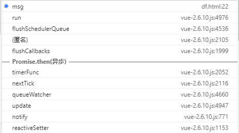

[toc]

# 如何理解Vue?

以js的理念去理解Vue这个全局变量, Vue只是一个函数, 更深一层去理解它是一个构造函数, 使用new关键字来返回一个实例, 跟我们写的简单的轮子没有什么不同

```js
class A {
	constructor(option) {
		this.doSomething(option)
	}
}
const $a = new A({})
```

Vue的源码的复杂部分是在于 基于`option`所做的动作

下面我就说说从new Vue()如何关联到浏览器中对应的DOM变化这个过程. 注: 源码基于`Vue.js v2.6.11`

```js
// #5073
function Vue (options) {
    this._init(options);	// _init 是提前挂载在原型上的方法
}
```

 

```js
// #4960
function initMixin (Vue) {
    Vue.prototype._init = function (options) {
      var vm = this;
      vm._uid = uid$3++;

      // a flag to avoid this being observed
      vm._isVue = true;
      // merge options
      if (options && options._isComponent) {
        // optimize internal component instantiation
        // since dynamic options merging is pretty slow, and none of the
        // internal component options needs special treatment.
        initInternalComponent(vm, options);
      } else {
        vm.$options = mergeOptions(
          resolveConstructorOptions(vm.constructor),
          options || {},
          vm
        );
      }
        
      initProxy(vm);
      // expose real self
      vm._self = vm;
      initLifecycle(vm);
      initEvents(vm);
      initRender(vm);
      callHook(vm, 'beforeCreate');
      initInjections(vm); // resolve injections before data/props
      initState(vm);
      initProvide(vm); // resolve provide after data/props
      callHook(vm, 'created');

      if (vm.$options.el) {
        vm.$mount(vm.$options.el);
      }
    };
  }
```


## 各函数功能

#3909 initLifecycle: 关联父子Vue实例, 形成一个组件树

#3763 initEvents: 创建一个事件hash表

#3485 initRender: 添加跟render函数相关的变量

### initState

```js
function initState (vm) {
    vm._watchers = [];
    var opts = vm.$options;
    if (opts.props) { initProps(vm, opts.props); }
    if (opts.methods) { initMethods(vm, opts.methods); }
    if (opts.data) {
      initData(vm);
    } else {
      observe(vm._data = {}, true /* asRootData */);
    }
    if (opts.computed) { initComputed(vm, opts.computed); }
    if (opts.watch && opts.watch !== nativeWatch) {
      initWatch(vm, opts.watch);
    }
  }
```

#### initProps

props 属性的作用: prop 都使得其父子 prop 之间形成了一个**单向下行绑定**：父级 prop 的更新会向下流动到子组件中; 换言之: 我一个组件定义了prop, 数据来源是于其父级绑定, 形成一个响应式数据

```js
// #4651
function initProps (vm, propsOptions) {
    var propsData = vm.$options.propsData || {};
    var props = vm._props = {};
    // cache prop keys so that future props updates can iterate using Array
    // instead of dynamic object key enumeration.
    var keys = vm.$options._propKeys = [];
    var isRoot = !vm.$parent;
    // root instance props should be converted
    if (!isRoot) {
      toggleObserving(false);
    }
    var loop = function ( key ) {
      keys.push(key);
      var value = validateProp(key, propsOptions, propsData, vm);
      /* istanbul ignore else */
      {
        defineReactive$$1(props, key, value, function () {
          if (!isRoot && !isUpdatingChildComponent) {
            warn(
              "Avoid mutating a prop directly since the value will be " +
              "overwritten whenever the parent component re-renders. " +
              "Instead, use a data or computed property based on the prop's " +
              "value. Prop being mutated: \"" + key + "\"",
              vm
            );
          }
        });
      }
      // static props are already proxied on the component's prototype
      // during Vue.extend(). We only need to proxy props defined at
      // instantiation here.
      if (!(key in vm)) {
        proxy(vm, "_props", key); // 代理到实例vm上
      }
    };

    for (var key in propsOptions) loop( key );
    toggleObserving(true);
  }
```

##### **defineReactive 定义响应式数据**

仔细品品这个函数, 这个就是响应式核心原理

```js
/** #1011
* Define a reactive property on an Object.
*/
function defineReactive (obj, key, val, 
         customSetter, /* set 时需要执行的自定义函数 */
         shallow /* shallow: 浅的意思, 如果传true, 则不对对象内部的属性定义响应式 */) {
    var dep = new Dep();

    var property = Object.getOwnPropertyDescriptor(obj, key);
    if (property && property.configurable === false) {
        return
    }

    // cater for pre-defined getter/setters, 避免覆盖原有的getter/setters
    var getter = property && property.get;
    var setter = property && property.set;
    if ((!getter || setter) && arguments.length === 2) {
        val = obj[key];
    }

    var childOb = !shallow && observe(val);
    Object.defineProperty(obj, key, {
        enumerable: true,
        configurable: true,
        get: function reactiveGetter () {
            var value = getter ? getter.call(obj) : val;
            if (Dep.target) {
                dep.depend(); // dep.depend() 为关联二者的桥梁
                if (childOb) {
                    childOb.dep.depend();
                    if (Array.isArray(value)) {
                        dependArray(value);
                    }
                }
            }
            return value
        },
        set: function reactiveSetter (newVal) {
            var value = getter ? getter.call(obj) : val;
            /* eslint-disable no-self-compare */
            if (newVal === value || (newVal !== newVal && value !== value)) {
                return
            }
            /* eslint-enable no-self-compare */
            if (customSetter) {
                customSetter();
            }
            // #7981: for accessor properties without setter
            if (getter && !setter) { return }
            if (setter) {
                setter.call(obj, newVal);
            } else {
                val = newVal;
            }
            childOb = !shallow && observe(newVal);
            dep.notify();
        }
    });
}
```

此时我们看这个函数内部遇到了一个Dep函数, 这个函数是什么? 下面的代码表示这个对象是一个简单的构造函数而已

```js
/** #712
 * A dep is an observable that can have multiple
 * directives subscribing to it.
 */
var Dep = function Dep () {
    this.id = uid++;
    this.subs = [];
};
// 为了弄清楚 subs 里面是什么, 需要去src/core/observer/dep.js翻一下预定义的类型
export default class Dep {
  static target: ?Watcher;
  id: number;
  subs: Array<Watcher>;

  constructor () {
    this.id = uid++
    this.subs = []
  }
}
```

Dep的 subs 中的元素类型是Watcher, 那么Watcher是什么呢? 继续翻看一下

```js
/**
 * A watcher parses an expression, collects dependencies,
 * and fires callback when the expression value changes.
 * watcher解析表达式, 收集依赖, 然后在表达式的值变化的时候执行回调函数 
 * This is used for both the $watch() api and directives.
 */
var Watcher = function Watcher (
  vm,
  expOrFn,
  cb,
  options,
  isRenderWatcher
) {}
```

##### Dep 如何跟 Watcher 关联?

```js
// #714
Dep.prototype.depend = function depend () {
  if (Dep.target) {
    Dep.target.addDep(this);
  }
};
```

```js
/** #4498
 * Add a dependency to this directive.
 */
Watcher.prototype.addDep = function addDep (dep) {
  var id = dep.id;
  if (!this.newDepIds.has(id)) {
    this.newDepIds.add(id);
    this.newDeps.push(dep);	// dep 被关联到 watcher中
    if (!this.depIds.has(id)) {
      dep.addSub(this);		// watcher 被加入到 dep.subs 中
    }
  }
    // 值得一提的是 两个 if 判断是为了保证不重复添加
};
```

##### 如何理解Dep跟Watcher

从DefineReactive的处理中我们可以看到每一个key都关联了一个Dep

为了更清晰的查看DefineReactive中Dep实例跟key, val的关联关系, 我进行了如下的简单改造

```js
var Dep = function Dep (k, v) {
    this.id = uid++;
    this.subs = [];
    this.key = k;
    this.originValue = v;
    /* 这里的Dep没有挂载到vm实例上 */
};

// DefineReactive中 val 被赋值后添加以下代码
var dep = new Dep(key, val);
```

以下是改造后的例子

Dep.target 是一个全部的变量, 表明当前工作的Watcher, 可以这么理解, 执行js的时候一次只能访问到一个变量, 这个变量如果有关联的Watcher就只能是这个watcher处于激活状态; 还需要要有一个维护watcher访问顺序的栈;

```js
// #734
// The current target watcher being evaluated.
// This is globally unique because only one watcher
// can be evaluated at a time.
Dep.target = null;
var targetStack = [];
```

小结: get中通过闭包的dep调用dep.depend()使dep和watcher都关联对方, 所谓"依赖收集"

```js
watch: {
    msg() {
        console.log(`msg : ${msg}`)
    }
}
```


watcher: 

watcher.deps

通过get访问msg的时候就创建了二者并关联

接下来是看看set触发时如何触发回调

```js
dep.notify(); 
// #760
Dep.prototype.notify = function notify () {
  // stabilize the subscriber list first
  var subs = this.subs.slice(); // 赋值一份拷贝
  if (process.env.NODE_ENV !== 'production' && !config.async) {
    // subs aren't sorted in scheduler if not running async
    // we need to sort them now to make sure they fire in correct order
    subs.sort(function (a, b) { return a.id - b.id; });
  }
  for (var i = 0, l = subs.length; i < l; i++) {
    subs[i].update();
  }
};

/** #4927
 * Subscriber interface.
 * Will be called when a dependency changes.
 */
Watcher.prototype.update = function update() {
    /* istanbul ignore else */
    if (this.lazy) {
        this.dirty = true
    } else if (this.sync) {
        this.run()
    } else {
        queueWatcher(this) // 简单理解就是执行watcher关联的cb
    }
}
```



控制台修改msg后, 执行到回调函数时的调用栈, 注意 **异步更新 Promise.then(异步)**

至此已经把 DefineReactive 中 get/set 的主要工作方式简单梳理清楚了; 后面追加一些细节

##### childOb 是什么? 有什么用?


#### initMethods

#### initData

#### initComputed

#### initWatch
