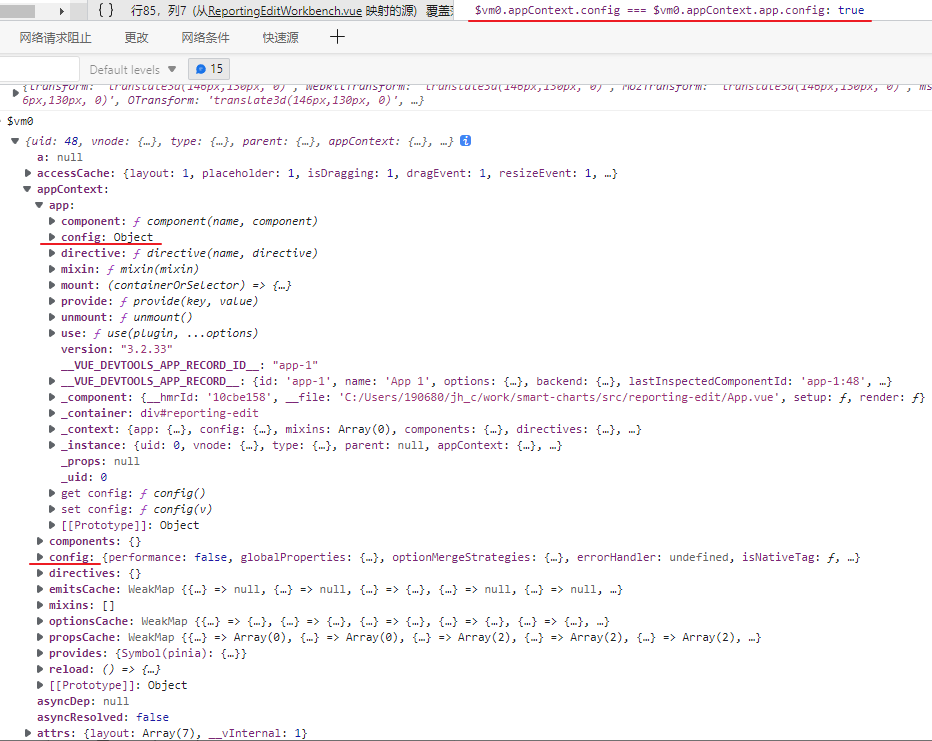

# [#](https://v3.cn.vuejs.org/api/application-config.html#应用配置)应用配置

每个 Vue 应用都会暴露一个**包含其配置项的 `config` 对象**：

```js
const app = createApp({})

console.log(app.config)
```

**在挂载应用之前，你可以修改下列 property。**

问题1: 如何通过组件来访问这个config?



问题2: 如何在setup中访问这个appContext?


## [#](https://v3.cn.vuejs.org/api/application-config.html#errorhandler)errorHandler

指定一个处理函数，来处理组件渲染函数和侦听器执行期间抛出的未捕获错误。

这个处理函数被调用时，可获取错误信息和相应的应用实例。


## [#](https://v3.cn.vuejs.org/api/application-config.html#warnhandler)warnHandler

为 Vue 的运行时警告指定一个自定义处理函数。注意这只会在开发环境下生效，在生产环境下它会被忽略。


## [#](https://v3.cn.vuejs.org/api/application-config.html#globalproperties)globalProperties

添加一个可以在应用的任何组件实例中访问的**全局 property**。

组件的 property 在命名冲突时具有优先权。

- **类型**：`[key: string]: any`
- **默认**：`undefined`
- **用法**：

```js
app.config.globalProperties.foo = 'bar'

app.component('child-component', {
  mounted() {
    console.log(this.foo) // 'bar'
  }
})
```

这可以代替 Vue 2.x 的 `Vue.prototype` 扩展：

```js
// 之前 (Vue 2.x)
Vue.prototype.$http = () => {}

// 之后 (Vue 3.x)
const app = createApp({})
app.config.globalProperties.$http = () => {}
```


## [#](https://v3.cn.vuejs.org/api/application-config.html#optionmergestrategies)optionMergeStrategies

为自定义选项定义合并策略。


## [#](https://v3.cn.vuejs.org/api/application-config.html#performance)performance

设置为 `true` 以在浏览器开发工具的 performance/timeline 面板中启用对组件初始化、编译、渲染和更新的性能追踪。只适用于开发模式和支持 [performance.mark](https://developer.mozilla.org/en-US/docs/Web/API/Performance/mark) API 的浏览器


## [#](https://v3.cn.vuejs.org/api/application-config.html#compileroptions)compilerOptions 3.1+

配置运行时编译器的选项。

设置在这个对象上的值将会被传入浏览器内的模板编译器，并影响配置过的应用内的每个组件。

注意，你也可以使用 [`compilerOptions` 选项](https://v3.cn.vuejs.org/api/options-misc.html#compileroptions)在每个组件的基础上覆写这些选项。

### [#](https://v3.cn.vuejs.org/api/application-config.html#compileroptions-iscustomelement)compilerOptions.isCustomElement

指定一个方法来识别 Vue 以外 (例如通过 Web Components API) 定义的自定义元素。

如果一个组件匹配了这个条件，它就不需要在本地或全局注册，Vue 也不会抛出 `Unknown custom element` 的警告。

### [#](https://v3.cn.vuejs.org/api/application-config.html#compileroptions-whitespace)compilerOptions.whitespace

- **类型**：`'condense' | 'preserve'`
- **默认值**：`'condense'`
- **用法**：

```js
app.config.compilerOptions.whitespace = 'preserve'
```

默认情况下，Vue 会移除/压缩模板**元素之间的空格**以产生更高效的编译结果：

1. 元素内的多个开头/结尾空格会被压缩成一个空格
2. 元素之间的包括折行在内的多个空格会被移除
3. 文本结点之间可被压缩的空格都会被压缩成为一个空格

将值设置为 `'preserve'` 可以禁用 (2) 和 (3)。


### [#](https://v3.cn.vuejs.org/api/application-config.html#compileroptions-delimiters)compilerOptions.delimiters

- **类型**：`Array`
- **默认值**：`['{{', '}}']`
- **用法**：

```js
// 将分隔符设置为 ES6 模板字符串风格
app.config.compilerOptions.delimiters = ['${', '}']    
```

用于配置**模板内文本插值的分隔符**。

这个选项一般会用于避免和同样使用双大括号语法的**服务端框架**发生冲突。


### [#](https://v3.cn.vuejs.org/api/application-config.html#compileroptions-comments)compilerOptions.comments

默认情况下，Vue 会在生产环境下移除模板内的 HTML 注释。

将这个选项设置为 `true` 可以强制 Vue 在生产环境下保留注释。

而在开发环境下注释是始终被保留的。