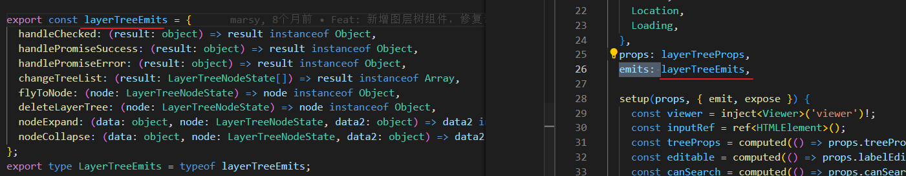
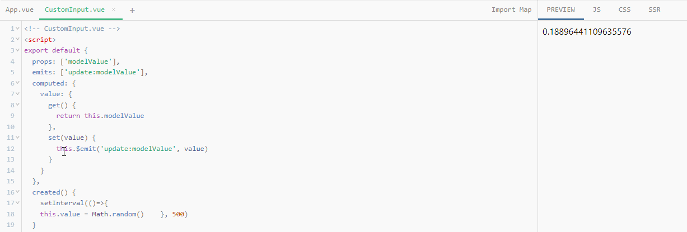

# 组件事件

## 触发与监听事件

组件与 prop 一样，事件的名字也提供了自动的格式转换。

注意这里我们触发了一个以 camelCase 形式命名的事件，但在父组件中可以使用 kebab-case 形式来监听。

与 [prop 大小写格式](https://cn.vuejs.org/guide/components/props.html#prop-name-casing)一样，在模板中我们也**推荐使用 kebab-case** 形式来编写监听器。


和原生 DOM 事件不一样，组件触发的事件**没有冒泡机制**。你只能监听直接子组件触发的事件。

平级组件或是跨越多层嵌套的组件间通信，应使用一个外部的事件总线，或是使用一个[全局状态管理方案](https://cn.vuejs.org/guide/scaling-up/state-management.html)。


## 事件参数


## 声明触发的事件[#](https://cn.vuejs.org/guide/components/events.html#declaring-emitted-events)

组件要触发的事件可以显式地通过 [`emits`](https://cn.vuejs.org/api/options-state.html#emits) **选项**来声明：

setup 中通过defineEmits声明,  然后显示触发

```ts
const emit = defineEmits['eventName', 'another-event'];
emit('eventName', someValue)
```

这个 `emits` 选项还支持对象语法，它允许我们对触发事件的参数进行验证

事件声明是可选的，我们还是**推荐完整地声明所有要触发的事件**，以此在代码中作为文档记录组件的用法。

同时，事件声明能让 Vue 更好地**将事件和[透传 attribute](https://cn.vuejs.org/guide/components/attrs.html#v-on-listener-inheritance) 作出区分**，从而避免一些由第三方代码触发的自定义 DOM 事件所导致的边界情况。

> 如果一个原生事件的名字 (例如 `click`) 被定义在 `emits` 选项中，
>
> 则监听器**只会监听组件触发**的 `click` 事件而不会再响应原生的 `click` 事件。


TypeScript 用户请参考：[如何为组件所抛出的事件标注类型](https://cn.vuejs.org/guide/typescript/options-api.html#typing-component-emits)。

## 为组件的 emits 标注类型[#](https://cn.vuejs.org/guide/typescript/options-api.html#typing-component-emits)

我们可以给 `emits` 选项提供一个对象来声明组件所触发的事件，以及这些事件所期望的参数类型。

试图触发未声明的事件会抛出一个类型错误：

```ts
import { defineComponent } from 'vue'

export default defineComponent({
  emits: {
    addBook(payload: { bookName: string }) {
      // 执行运行时校验
      return payload.bookName.length > 0
    }
  },
  methods: {
    onSubmit() {
      this.$emit('addBook', {
        bookName: 123 // 类型错误
      })

      this.$emit('non-declared-event') // 类型错误
    }
  }
})
```




## 事件校验

和对 props 添加类型校验的方式类似，所有触发的事件也可以使用对象形式来描述。

要为事件添加校验，那么事件可以被赋值为一个函数，接受的参数就是抛出事件时传入 `this.$emit` 的内容，**返回一个布尔值来表明事件是否合法**。

```ts
export default {
  emits: {
    // 没有校验
    click: null,

    // 校验 submit 事件
    submit: ({ email, password }) => {
      if (email && password) {
        return true
      } else {
        console.warn('Invalid submit event payload!')
        return false
      }
    }
  },
  methods: {
    submitForm(email, password) {
      this.$emit('submit', { email, password })
    }
  }
}
```


## v-model[#](https://cn.vuejs.org/api/built-in-directives.html#v-model)

在**表单输入元素**或**组件**上创建双向绑定。

- **期望的绑定值类型**：根据表单输入元素或组件输出的**值**而变化
- **仅限：**
  - `<input>`
  - `<select>`
  - `<textarea>`
  - components
- **修饰符：**
  - [`.lazy`](https://cn.vuejs.org/guide/essentials/forms.html#lazy) ——监听 `change` 事件而不是 `input`
  - [`.number`](https://cn.vuejs.org/guide/essentials/forms.html#number) ——将输入的合法符串转为数字
  - [`.trim`](https://cn.vuejs.org/guide/essentials/forms.html#trim) ——移除输入内容两端空格


## 配合 `v-model` 使用

自定义事件可以用于开发支持 `v-model` 的自定义**表单组件**。

 `v-model` 在原生元素上的用法：

```html
<input v-model="searchText" />
<!-- 等价于 -->
<input
  :value="searchText"
  @input="searchText = $event.target.value"
/>  
```


而当使用在一个组件上时，`v-model` 会被展开为如下的形式

```html
<CustomInput
  :modelValue="searchText"
  @update:modelValue="newValue => searchText = newValue"
/>
```

要让这个例子实际工作起来，`<CustomInput>` 组件内部需要做两件事：

1. 将内部**原生 `input` 元素的 `value`** attribute 绑定到 **`modelValue`** prop
2. **输入**新的值**时**在 `input` 元素上**触发 `update:modelValue` 事件**

```vue
<!-- CustomInput.vue -->
<script>
export default {
  props: ['modelValue'], 	 	// 定义 prop
  emits: ['update:modelValue']	// 定义 事件
}
</script>

<template>
	绑定value&触发事件
  <input
    :value="modelValue"		
    @input="$emit('update:modelValue', $event.target.value)"
  />
</template>
```


另一种在组件内实现 `v-model` 的方式是**使用一个可写的，同时具有 getter 和 setter 的计算属性**。

`get` 方法需返回 `modelValue` prop，而 `set` 方法需**触发相应的事件**：

```vue
<!-- CustomInput.vue -->
<script>
export default {
  props: ['modelValue'],
  emits: ['update:modelValue'],
  computed: { // 记算属性
    value: {
      get() {
        return this.modelValue
      },
      set(value) {
        this.$emit('update:modelValue', value)
      }
    }
  }
}
</script>

<template>
  <input v-model="value" />
</template>
```

所以本质上 `v-model` 语法糖只是做了

- 绑定

- 触发

与原生的表单元素也没有关联




### `v-model` 的参数[#](https://cn.vuejs.org/guide/components/events.html#v-model-arguments)

**默认情况**下，`v-model` 在组件上都是**使用 `modelValue` 作为 prop**，并以 `update:modelValue` 作为对应的事件。

通过给 `v-model` **指令** 指定一个**参数**来**更改**这些**名字**：

```html
<MyComponent v-model:title="bookTitle" />
```

在这个例子中，子组件应声明一个 `title` prop，并通过触发 `update:title` 事件更新父组件值：

```vue
<!-- MyComponent.vue -->
<script>
export default {
  props: ['title'],
  emits: ['update:title']
}
</script>

<template>
  <input
    type="text"
    :value="title"
    @input="$emit('update:title', $event.target.value)"
  />
</template>
```


### 多个 `v-model` 绑定[#](https://cn.vuejs.org/guide/components/events.html#multiple-v-model-bindings)

利用刚才在 [`v-model` 参数](https://cn.vuejs.org/guide/components/events.html#v-model-arguments)小节中学到的技巧，可以在一个组件上创建多个 `v-model` 双向绑定，每一个 `v-model` 都会同步不同的 prop：

```html
<UserName
  v-model:first-name="first"
  v-model:last-name="last"
/>
```

```vue
<script>
export default {
  props: {
    firstName: String,
    lastName: String
  },
  emits: ['update:firstName', 'update:lastName']
}
</script>

<template>
  <input
    type="text"
    :value="firstName"
    @input="$emit('update:firstName', $event.target.value)"
  />
  <input
    type="text"
    :value="lastName"
    @input="$emit('update:lastName', $event.target.value)"
  />
</template>
```


### `v-model` 修饰符[#](https://cn.vuejs.org/guide/components/events.html#handling-v-model-modifiers)

在学习输入绑定时，我们知道了 `v-model` 有一些[内置的修饰符](https://cn.vuejs.org/guide/essentials/forms.html#modifiers)

自定义组件的 `v-model` 支持自定义的修饰符。

我们来创建一个自定义的修饰符 `capitalize`，它会自动将 `v-model` 绑定输入的字符串值第一个字母转为大写：

```html
<MyComponent v-model.capitalize="myText" />
```

**组件的 `v-model` 上所添加的修饰符，可以通过 `modelModifiers` prop 在组件内访问到**。

在下面的组件中，我们声明了 `modelModifiers` 这个 prop，它的默认值是一个空对象

```vue
<script>
export default {
  props: {
    modelValue: String,
    modelModifiers: {
      default: () => ({})
    }
  },
  emits: ['update:modelValue'],
  created() {
      console.log(this.modelModifiers) // { capitalize: true }
      // 组件的 modelModifiers prop 包含了 capitalize 且其值为 true，
      // 因为它在模板中的 v-model 绑定上被使用了。
  }
}
</script>

<template>
  <input
    type="text"
    :value="modelValue"
    @input="$emit('update:modelValue', $event.target.value)"
  />
</template>

```

有了 `modelModifiers` 这个 prop，我们就可以在**原生事件侦听函数中**检查它的值，然后决定触发的自定义事件中要向父组件传递什么值。

在下面的代码里，我们就是在每次 `` 元素触发 `input` 事件时将值的首字母大写

```diff
<script>
export default {
  props: {
    modelValue: String,
    modelModifiers: {
      default: () => ({})
    }
  },
  emits: ['update:modelValue'],
  methods: {
+   emitValue(e) {
+     let value = e.target.value
+     if (this.modelModifiers.capitalize) {
+       value = value.charAt(0).toUpperCase() + value.slice(1)
+     }
+     this.$emit('update:modelValue', value)
    }
  }
}
</script>

<template>
  <input type="text" :value="modelValue" @input="emitValue" />
</template>

```

对于**又有参数又有修饰符**的 `v-model` 绑定，生成的 prop 名将是 `arg + "Modifiers"`。

举例来说：

```html
<MyComponent v-model:title.capitalize="myText">
```

相应的声明应该是：

```ts
export default {
  props: ['title', 'titleModifiers'],
  emits: ['update:title'],
  created() {
    console.log(this.titleModifiers) // { capitalize: true }
  }
}
```
