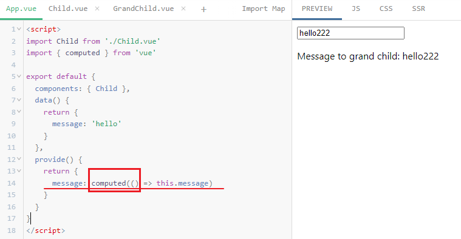

[TOC]

# [选项式](https://cn.vuejs.org/api/options-composition.html)

## provide[#](https://cn.vuejs.org/api/options-composition.html#provide)

用于提供可以被后代组件注入的值。

- **详细信息**

  `provide` 和 [`inject`](https://cn.vuejs.org/api/options-composition.html#inject) 通常成对一起使用，使一个祖先组件作为其后代组件的依赖注入方，无论这个组件的层级有多深都可以注入成功，只要他们处于同一条组件链上。

  这个 `provide` 选项应当是一个对象或是返回一个对象的函数。这个对象包含了可注入其后代组件的属性。你可以在这个对象中使用 Symbol 类型的值作为 key。

**示例**

基本使用方式：

```
const s = Symbol()

export default {
  provide: {
    foo: 'foo',
    [s]: 'bar'
  }
}
```

使用函数可以提供其组件中的状态：

```
export default {
  data() {
    return {
      msg: 'foo'
    }
  }
  provide() {
    return {
      msg: this.msg
    }
  }
}
```

请注意，针对上面这个例子，所供给的 `msg` 将**不会**是**响应式**的。


## inject[#](https://cn.vuejs.org/api/options-composition.html#inject)

用于声明要通过从上层提供方匹配并注入进当前组件的属性。

- **类型**

  ```
  interface ComponentOptions {
    inject?: ArrayInjectOptions | ObjectInjectOptions
  }
  
  type ArrayInjectOptions = string[]
  
  type ObjectInjectOptions = {
    [key: string | symbol]:
      | string
      | symbol
      | { from?: string | symbol; default?: any }
  }
  ```

- **详细信息**

  该 `inject` 选项应该是以下两种之一：

  - 一个字符串数组
  - 一个对象，其 key 名就是在当前组件中的本地绑定名称，而它的值应该是以下两种之一：
    - 匹配可用注入的 key (string 或者 Symbol)
    - 一个对象
      - 它的 `from` 属性是一个 key (string 或者 Symbol)，用于匹配可用的注入
      - 它的 `default` 属性用作候补值。和 props 的默认值类似，如果它是一个对象，那么应该使用一个工厂函数来创建，以避免多个组件共享同一个对象。

  如果没有供给相匹配的属性、也没有提供默认值，那么注入的属性将为 `undefined`。

  请注意，注入绑定并非响应式的。这是有意为之的一个设计。如果要注入的值是一个响应式对象，那么这个对象上的属性将会保留响应性。请看[配合响应性](https://cn.vuejs.org/guide/components/provide-inject.html#working-with-reactivity)一节获取更多细节。

- **示例**

  基本使用方式：

  ```
  export default {
    inject: ['foo'],
    created() {
      console.log(this.foo)
    }
  }
  ```

  使用注入的值作为 props 的默认值：

  ```
  const Child = {
    inject: ['foo'],
    props: {
      bar: {
        default() {
          return this.foo
        }
      }
    }
  }
  ```

  使用注入的值作为 data：

  ```
  const Child = {
    inject: ['foo'],
    data() {
      return {
        bar: this.foo
      }
    }
  }
  ```

  注入项可以选择是否带有默认值：

  ```
  const Child = {
    inject: {
      foo: { default: 'foo' }
    }
  }
  ```

  如果需要从不同名字的属性中注入，请使用 `from` 指明来源属性。

  ```
  const Child = {
    inject: {
      foo: {
        from: 'bar',
        default: 'foo'
      }
    }
  }
  ```

  和 props 默认值类似，对于非原始数据类型的值，你需要使用工厂函数：

  ```
  const Child = {
    inject: {
      foo: {
        from: 'bar',
        default: () => [1, 2, 3]
      }
    }
  }
  ```


# 组合式 API：依赖注入 [#](https://cn.vuejs.org/api/composition-api-dependency-injection.html)

## provide()[#](https://cn.vuejs.org/api/composition-api-dependency-injection.html#provide)

提供一个值，可以被后代组件注入。

- **类型**

  ```
  function provide<T>(key: InjectionKey<T> | string, value: T): void
  ```

- **详细信息**

  `provide()` 接受两个参数：第一个参数是要注入的 key，可以是一个字符串或者一个 symbol，第二个参数是要注入的值。

  当使用 TypeScript 时，key 可以是一个被类型断言为 `InjectionKey` 的 symbol。**`InjectionKey` 是一个 Vue 提供的工具类型，继承自 `Symbol`，可以用来同步 `provide()` 和 `inject()` 之间值的类型**。

  与注册生命周期钩子的 API 类似，`provide()` 必须在组件的 `setup()` 阶段同步调用。

- **示例**

  ```
  <script setup>
  import { ref, provide } from 'vue'
  import { fooSymbol } from './injectionSymbols'
  
  // 提供静态值
  provide('foo', 'bar')
  
  // 提供响应式的值
  const count = ref(0)
  provide('count', count)
  
  // 提供时将 Symbol 作为 key
  provide(fooSymbol, count)
  </script>
  ```


## inject()[#](https://cn.vuejs.org/api/composition-api-dependency-injection.html#inject)

注入一个由祖先组件或整个应用 (通过 `app.provide()`) 提供的值。

- **类型**

  ```
  // 没有默认值
  function inject<T>(key: InjectionKey<T> | string): T | undefined
  
  // 带有默认值
  function inject<T>(key: InjectionKey<T> | string, defaultValue: T): T
  
  // 使用工厂函数
  function inject<T>(
    key: InjectionKey<T> | string,
    defaultValue: () => T,
    treatDefaultAsFactory: true
  ): T
  ```

- **详细信息**

  第一个参数是注入的 key。Vue 会遍历父组件链，通过匹配 key 来确定所提供的值。如果父组件链上多个组件对同一个 key 提供了值，那么离得更近的组件将会“覆盖”链上更远的组件所提供的值。如果没有能通过 key 匹配到值，`inject()` 将返回 `undefined`，除非提供了一个默认值。

  第二个参数是可选的，即在没有匹配到 key 时使用的默认值。它也可以是一个工厂函数，用来返回某些创建起来比较复杂的值。如果默认值本身就是一个函数，那么你必须将 `false` 作为第三个参数传入，表明这个函数就是默认值，而不是一个工厂函数。

  与注册生命周期钩子的 API 类似，`inject()` 必须在组件的 `setup()` 阶段同步调用。

  当使用 TypeScript 时，key 可以是一个类型为 `InjectionKey` 的 symbol。`InjectionKey` 是一个 Vue 提供的工具类型，继承自 `Symbol`，可以用来同步 `provide()` 和 `inject()` 之间值的类型。

- **示例**

  假设有一个父组件已经提供了一些值，如前面 `provide()` 的例子中所示：

  ```
  <script setup>
  import { inject } from 'vue'
  import { fooSymbol } from './injectionSymbols'
  
  // 注入值的默认方式
  const foo = inject('foo')
  
  // 注入响应式的值
  const count = inject('count')
  
  // 通过 Symbol 类型的 key 注入
  const foo2 = inject(fooSymbol)
  
  // 注入一个值，若为空则使用提供的默认值
  const bar = inject('foo', 'default value')
  
  // 注入一个值，若为空则使用提供的工厂函数
  const baz = inject('foo', () => new Map())
  
  // 注入时为了表明提供的默认值是个函数，需要传入第三个参数
  const fn = inject('function', () => {}, false)
  </script>
  ```


# 依赖注入 [#](https://cn.vuejs.org/guide/components/provide-inject.html)

## Prop 逐级透传问题[#](https://cn.vuejs.org/guide/components/provide-inject.html#prop-drilling)

通常情况下，当我们需要从父组件向子组件传递数据时，会使用 [props](https://cn.vuejs.org/guide/components/props.html)。想象一下这样的结构：有一些多层级嵌套的组件，形成了一颗巨大的组件树，而某个深层的子组件需要一个较远的祖先组件中的部分数据。在这种情况下，如果仅使用 props 则必须将其沿着组件链逐级传递下去，这会非常麻烦：


注意，虽然这里的 `<footer>` 组件可能根本不关心这些 props，但为了使 `<deep-child>` 能访问到它们，仍然需要定义并向下传递。

如果组件链路非常长，可能会影响到更多这条路上的组件。

这一问题被称为“prop 逐级**透传**”，显然是我们希望尽量避免的情况。


`provide` 和 `inject` 可以帮助我们解决这一问题。

一个父组件相对于其所有的后代组件，会作为**依赖提供者**。任何后代的组件树，无论层级有多深，都可以**注入**由父组件提供给整条链路的依赖。


## Provide (提供)[#](https://cn.vuejs.org/guide/components/provide-inject.html#provide)

要为组件后代提供数据，需要使用到 [`provide`](https://cn.vuejs.org/api/options-composition.html#provide) 选项：

```js
export default {
  provide: {
    message: 'hello!'
  }
}
```

对于 `provide` 对象上的每一个属性，后代组件会用其 key 为注入名查找期望注入的值，属性的值就是要提供的数据。

如果我们需要提供依赖当前组件实例的状态 (比如那些由 `data()` 定义的数据属性)，那么可以以函数形式使用 `provide`：

```js
export default {
  data() {
    return {
      message: 'hello!'
    }
  },
  provide() {
    // 使用函数的形式，可以访问到 `this`
    return {
      message: this.message
    }
  }
}
```

然而，请注意这**不会**使注入保持**响应性**。我们会在后续小节中讨论如何[让注入转变为响应式](https://cn.vuejs.org/guide/components/provide-inject.html#working-with-reactivity)。


## 应用层 Provide[#](https://cn.vuejs.org/guide/components/provide-inject.html#app-level-provide)

除了在一个组件中提供依赖，我们还可以在整个**应用层面**提供依赖：

```js
import { createApp } from 'vue'

const app = createApp({})

app.provide(/* 注入名 */ 'message', /* 值 */ 'hello!')
```

在**应用级别提供的数据**在该应用内的所有组件中都可以注入。这在你编写[插件](https://cn.vuejs.org/guide/reusability/plugins.html)时会特别有用，因为插件一般都不会使用组件形式来提供值。


## Inject (注入)[#](https://cn.vuejs.org/guide/components/provide-inject.html#inject)

要注入上层组件提供的数据，需使用 [`inject`](https://cn.vuejs.org/api/options-composition.html#inject) 选项来声明：

```js
export default {
  inject: ['message'],
  created() {
    console.log(this.message) // injected value
  }
}
```

注入会在组件自身的状态**之前**被解析，因此你可以在 `data()` 中访问到注入的属性：

```js
export default {
  inject: ['message'],
  data() {
    return {
      // 基于注入值的初始数据
      fullMessage: this.message
    }
  }
}
```


## 和响应式数据配合使用[#](https://cn.vuejs.org/guide/components/provide-inject.html#working-with-reactivity)

**为保证注入方和供给方之间的响应性链接，我们需要使用 [computed()](https://cn.vuejs.org/api/reactivity-core.html#computed) 函数提供一个计算属性**：

```JS
import { computed } from 'vue'

export default {
  data() {
    return {
      message: 'hello!'
    }
  },
  provide() {
    return {
      // 显式提供一个计算属性
      message: computed(() => this.message)
    }
  }
}
```



如何正确使用ts标记provide提供的响应式数据类型


## 使用 Symbol 作注入名[#](https://cn.vuejs.org/guide/components/provide-inject.html#working-with-symbol-keys)

至此，我们已经了解了如何使用字符串作为注入名。

大型的应用，包含非常多的依赖提供，或者你正在编写提供给其他开发者使用的组件库，建议最好使用 Symbol 来作为注入名以避免潜在的冲突。

推荐在一个单独的文件中导出这些注入名 Symbol：

```ts
// keys.js
export const myInjectionKey = Symbol()
```

```ts
// 在供给方组件中
import { myInjectionKey } from './keys.js'

export default {
  provide() {
    return {
      [myInjectionKey]: {
        /* 要提供的数据 */
      }
    }
  }
}
```

```ts
// 注入方组件
import { myInjectionKey } from './keys.js'

export default {
  inject: {
    injected: { from: myInjectionKey }
  }
}
```
