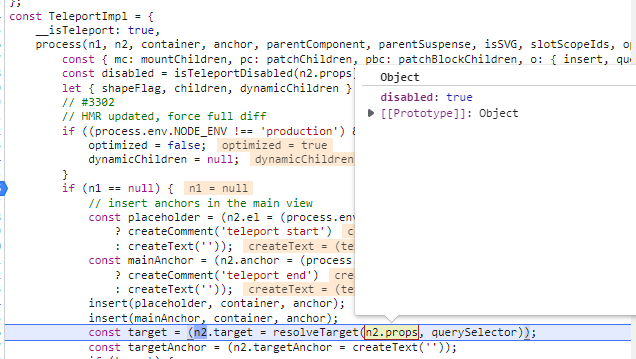
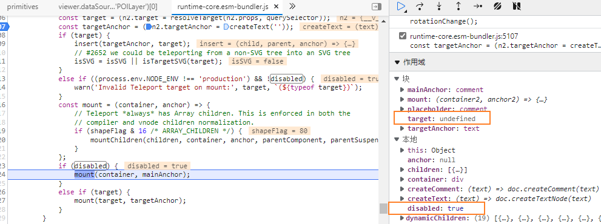
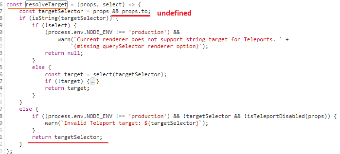

Teleport 提供了一种干净的方法，允许我们控制在 DOM 中哪个父节点下渲染了 HTML，而不必求助于全局状态或将其拆分为两个组件。

在这种情况下，即使在不同的地方渲染 `child-component`，它仍将是 `parent-component` 的子级，并将从中接收 `name` prop。


主要应用场景为:

​	渲染的节点脱离了组件的元素节点树, 需要挂到外部, 表明挂载的目标节点.

React 的 `Portal` 提供了一种将子节点渲染到存在于父组件以外的 `DOM` 节点的优秀的方案，`Vue 3` 中的 `Teleport` 跟这个其实是类似的


应用场景:

业务开发的过程中，我们经常会封装一些常用的组件，例如 Modal 组件。

在使用 Modal 组件的过程中，经常会遇到一个问题，那就是 **Modal 的定位**问题。


### 原理

#### Teleport 组件的实践及原理 [#](https://juejin.cn/post/6900957010808963079)


模板编译结果,

`createBlock`:

```ts
// packages/runtime-core/src/renderer.ts
export function createBlock(
	type, props, children, patchFlag
) {
  const vnode = createVNode(
    type,
    props,
    children,
    patchFlag
  )
  // ... 省略部分逻辑
  return vnode
}

export function createVNode(
  type, props, children, patchFlag
) {
  // class & style normalization.
  if (props) {
    // ...
  }

  // encode the vnode type information into a bitmap
  const shapeFlag = isString(type)
    ? ShapeFlags.ELEMENT
    : __FEATURE_SUSPENSE__ && isSuspense(type)
      ? ShapeFlags.SUSPENSE
      : isTeleport(type)
        ? ShapeFlags.TELEPORT
        : isObject(type)
          ? ShapeFlags.STATEFUL_COMPONENT
          : isFunction(type)
            ? ShapeFlags.FUNCTIONAL_COMPONENT
            : 0

  const vnode: VNode = {
    type,
    props,
    shapeFlag,
    patchFlag,
    key: props && normalizeKey(props),
    ref: props && normalizeRef(props),
  }

  return vnode
}

// packages/runtime-core/src/components/Teleport.ts
export const isTeleport = type => type.__isTeleport
export const Teleport = {
  __isTeleport: true,
  process() {}
}

// packages/shared/src/shapeFlags.ts
export const enum ShapeFlags {
  ELEMENT = 1,
  FUNCTIONAL_COMPONENT = 1 << 1,
  STATEFUL_COMPONENT = 1 << 2,
  TEXT_CHILDREN = 1 << 3,
  ARRAY_CHILDREN = 1 << 4,
  SLOTS_CHILDREN = 1 << 5,
  TELEPORT = 1 << 6,
  SUSPENSE = 1 << 7,
  COMPONENT_SHOULD_KEEP_ALIVE = 1 << 8,
  COMPONENT_KEPT_ALIVE = 1 << 9
}
```

传入 `createBlock` 的第一个参数为 `Teleport`，最后得到的 vnode 中会有一个基于 `type` 计算出的 `shapeFlag` 属性，该属性用来表示 vnode 的类型。`isTeleport(type)` 得到的结果为 `true`，所以 `shapeFlag` 属性最后的值为 `ShapeFlags.TELEPORT`（`1 << 6`）。

在组件的 render 函数中，会依据 `type` 和 `shapeFlag` 走不同的逻辑。

```ts
// packages/runtime-core/src/renderer.ts
const render = (vnode, container) => {
  if (vnode == null) {
    // 当前组件为空，则将组件销毁
    if (container._vnode) {
      unmount(container._vnode, null, null, true)
    }
  } else {
    // 新建或者更新组件
    // container._vnode 是之前已创建组件的缓存
    patch(container._vnode || null, vnode, container)
  }
  container._vnode = vnode
}

// patch 是表示补丁，用于 vnode 的创建、更新、销毁
const patch = (n1, n2, container) => {
  // 如果新旧节点的类型不一致，则将旧节点销毁
  if (n1 && !isSameVNodeType(n1, n2)) {
    unmount(n1)
  }
  const { type, ref, shapeFlag } = n2
  switch (type) {
    case Text:
      // 处理文本
      break
    case Comment:
      // 处理注释
      break
    // case ...
    default:
      if (shapeFlag & ShapeFlags.ELEMENT) {
        // 处理 DOM 元素
      } else if (shapeFlag & ShapeFlags.COMPONENT) {
        // 处理自定义组件
      } else if (shapeFlag & ShapeFlags.TELEPORT) {
        // 处理 Teleport 组件
        // 调用 Teleport.process 方法
        type.process(n1, n2, container...);
      } // else if ...
  }
}

```

在处理 `Teleport` 时，最后会调用 `Teleport.process` 方法

```ts
// packages/runtime-core/src/components/Teleport.ts
const isTeleportDisabled = props => props.disabled
export const Teleport = {
  __isTeleport: true,
  process(n1, n2, container) {
    const disabled = isTeleportDisabled(n2.props)
    const { shapeFlag, children } = n2
    if (n1 == null) {
      const target = (n2.target = querySelector(n2.prop.to))      
      const mount = (container) => {
        // compiler and vnode children normalization.
        if (shapeFlag & ShapeFlags.ARRAY_CHILDREN) {
          mountChildren(children, container)
        }
      }
      if (disabled) {
        // 开关关闭，挂载到原来的位置
        mount(container)
      } else if (target) {
        // 将子节点，挂载到属性 `to` 对应的节点上
        mount(target)
      }
    }
    else {
      // n1不存在，更新节点即可
    }
  }
}

```

其实就是多了一种标签情况的判断,然后用vue2的mount()方法挂载到指定dom元素上


那看了Teleport.process, 发现一个逻辑之前想尝试的逻辑不能使用:

`to` 属性作为变量, 若为空, 则使 `disabled` 属性为true..

可以通过提前判断 构建 props 使用 v-bind传给teleport... *尝试失败*, 因为to不传默认为undefined, 一样会报 `querySelector` 为空

? 但是我实际上是使用成功了!


```vue
const destination = computed(() => props.destination);
const teleProp = destination.value
      ? { to: destination.value }
      : { disabled: true };

<teleport v-bind="teleProp"></teleport>
```


可以单独使用 to/disabled 属性, 但是如果使用to属性则必须正确配置


打断点调试一下



target 结果为undefined; resolveTarget 读取 props.to 然后进行dom查找; 最后进行了mount操作






