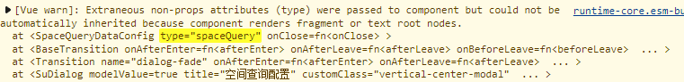
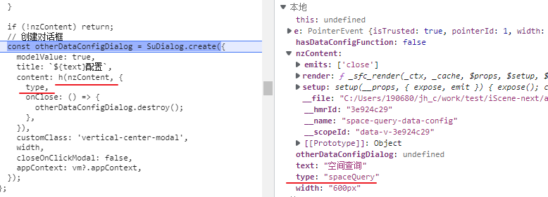
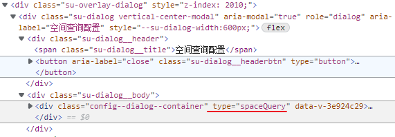

[toc]

# [透传 Attributes](https://cn.vuejs.org/guide/components/attrs.html)

## Attributes 继承[#](https://cn.vuejs.org/guide/components/attrs.html#attribute-inheritance)

“透传 attribute”指的是传递给一个组件，却没有**被该组件声明为 [props](https://cn.vuejs.org/guide/components/props.html) 或 [emits](https://cn.vuejs.org/guide/components/events.html#defining-custom-events) 的** **attribute** 或者 `v-on` **事件监听器**。

> 传给一个组件的值, 需要被组件显示声明接收

最常见的例子就是 `class`、`style` 和 `id`。


当一个组件以单个元素为根作渲染时，**透传的 attribute 会自动被添加到根元素上**。

> 根 & 元素
>
> 如果用多个节点呢?
>
> 如果不是元素呢?

举例来说，假如我们有一个 `<MyButton>` 组件，它的模板长这样：

```html
<!-- <MyButton> 的模板 -->
<button>click me</button>
```

一个父组件使用了这个组件，并且传入了 `class`：

```
<MyButton class="large" />
```

最后渲染出的 DOM 结果是：

```html
<button class="large">click me</button>
```

这里，`<MyButton>` 并*<u>没有将 `class` 声明为一个它所接受的 prop</u>*，所以 `class` **被视作透传 attribute**，自动透传到了 `<MyButton>` 的**根元素**上。




### 对 `class` 和 `style` 的合并[#](https://cn.vuejs.org/guide/components/attrs.html#class-and-style-merging)

如果一个子组件的根元素已经有了 `class` 或 `style` attribute，它会**和从父组件上继承的值合并**。

如果我们将之前的 `<MyButton>` 组件的模板改成这样：

```
<!-- <MyButton> 的模板 -->
<button class="btn">click me</button>
```

则最后渲染出的 DOM 结果会变成：

```html
<button class="btn large">click me</button>
```


### `v-on` 监听器继承[#](https://cn.vuejs.org/guide/components/attrs.html#v-on-listener-inheritance)

同样的规则也适用于 `v-on` 事件监听器：

```
<MyButton @click="onClick" />
```

**`click` 监听器**会被添加到 `<MyButton>` 的**根元素**，即那个原生的 `<button>` 元素之上。

当原生的 `<button>` 被点击，会触发父组件的 `onClick` 方法。

同样的，如果原生 `button` 元素自身也通过 `v-on` 绑定了一个事件监听器，则这个监听器和从父组件继承的监听器都会被触发。


> 跟之前的组件监听是一个效果.
>
> 不过之前监听子组件原生事件会添加 `.native` 修饰符


### 深层组件继承

有些情况下一个组件会在根节点上渲染另一个组件。

重构一下 `<MyButton>`，让它在根节点上渲染 `<BaseButton>`：

template

```
<!-- <MyButton/> 的模板，只是渲染另一个组件 -->
<BaseButton />
```

此时 `<MyButton>` 接收的透传 attribute 会直接**继续传给** `<BaseButton>`。

请注意：

1. 透传的 attribute 不会包含 `<MyButton>` 上**声明过的 props** 或是**针对 `emits` 声明事件的 `v-on` 侦听函数**，换句话说，**声明过的 props 和侦听函数被 `<MyButton>`“消费”了**。
2. 透传的 attribute 若符合声明，也可以作为 props 传入 `<BaseButton>`。


## 禁用 Attributes 继承[#](https://cn.vuejs.org/guide/components/attrs.html#disabling-attribute-inheritance)

如果你**不想要**一个组件自动地继承 attribute，你可以在**组件选项中**设置 `inheritAttrs: false`。

> 那 setup 中如何设置呢?

最常见的需要禁用 attribute 继承的场景就是 attribute 需要**应用在根节点以外的其他元素**上。

通过设置 `inheritAttrs` 选项为 `false`，你可以完全控制透传进来的 attribute 被如何使用。


这些透传进来的 attribute 可以在模板的表达式中**直接用 `$attrs` 访问到**。

```
<span>Fallthrough attribute: {{ $attrs }}</span>
```

这个 `$attrs` 对象包含了除组件所声明的 `props` 和 `emits` 之外的所有其他 attribute，例如 `class`，`style`，`v-on` 监听器等等。


有几点需要注意：

- 和 props 有所不同，透传 attributes 在 JavaScript 中保留了它们原始的大小写，所以像 `foo-bar` 这样的一个 attribute 需要通过 `$attrs['foo-bar']` 来访问。
- 像 `@click` 这样的一个 `v-on` 事件监听器将在此对象下被暴露为一个函数 `$attrs.onClick`。


现在我们要再次使用一下[之前小节](https://cn.vuejs.org/guide/components/attrs.html#attribute-inheritance)中的 `<MyButton>` 组件例子。有时候我们可能为了样式，需要在 `<button>` 元素外包装一层 `<div>`：

```html
<div class="btn-wrapper">
  <button class="btn">click me</button>
</div>
```

我们想要所有像 `class` 和 `v-on` 监听器这样的透传 attribute 都应用在内部的 `<button>` 上而不是外层的 `<div>` 上。

我们可以通过设定 `inheritAttrs: false` 和使用 `v-bind="$attrs"` 来实现：

```html
<div class="btn-wrapper">
  <button class="btn" v-bind="$attrs">click me</button>
</div>
```

小提示：[没有参数的 `v-bind`](https://cn.vuejs.org/guide/essentials/template-syntax.html#dynamically-binding-multiple-attributes) 会将一个对象的所有属性都作为 attribute 应用到目标元素上。


## 多根节点的 Attributes 继承[#](https://cn.vuejs.org/guide/components/attrs.html#attribute-inheritance-on-multiple-root-nodes)

和单根节点组件有所不同，有着**多个根节点的组件没有自动 attribute 透传行为**。

如果 `$attrs` 没有被显式绑定，将会**抛出一个运行时警告**。

```html
<CustomLayout id="custom-layout" @click="changeValue" />
```

如果 `<CustomLayout>` 有下面这样的多根节点模板，由于 Vue **不知道要将 attribute 透传到哪里，所以会抛出一个警告**。

```html
<header>...</header>
<main>...</main>
<footer>...</footer>
```

如果 `$attrs` 被显式绑定，则不会有警告：

```html
<header>...</header>
<main v-bind="$attrs">...</main>
<footer>...</footer>
```

> 警告的正确来源

如果根元素是一个 `fragment or text root nodes.` 也会抛出警告 

说白了就是无法 **添加属性, 或不知道该如何添加属性时** 抛出


## 在 JavaScript 中访问透传 Attributes[#](https://cn.vuejs.org/guide/components/attrs.html#accessing-fallthrough-attributes-in-javascript)

如果需要，你可以通过 `$attrs` 这个实例属性来访问组件的所有透传 attribute：

```js
export default {
  created() {
    console.log(this.$attrs)
  }
```


### 渲染函数中的属性也会透传






### [# inheritAttrs](https://cn.vuejs.org/api/options-misc.html#inheritattrs)

用于控制是否启用默认的组件 attribute 透传行为。


默认情况下，父组件传递的，但没有被子组件解析为 props 的 attributes 绑定会被“透传”。

这意味着当我们有一个单根节点的子组件时，这些绑定会被作为一个**常规的 HTML attribute** 应用在子组件的**根节点元素**上。

当你编写的组件想要在一个目标元素或其他组件外面包一层时，可能并不期望这样的行为。

我们可以通过设置 `inheritAttrs` 为 `false` 来禁用这个默认行为。

这些 attributes 可以通过 `$attrs` 这个实例属性来访问，并且可以通过 `v-bind` 来**显式绑定**在一个非根节点的元素上。


在一个组件的 `<script setup>` 中声明这个选项时，需要一个额外的 `<script>` 块：

```vue
<script>
export default {
  inheritAttrs: false
}
</script>

<script setup>
defineProps(['label', 'value'])
defineEmits(['input'])
</script>

<template>
  <label>
    {{ label }}
    <input
      v-bind="$attrs"
      v-bind:value="value"
      v-on:input="$emit('input', $event.target.value)"
    />
  </label>
</template>

```

