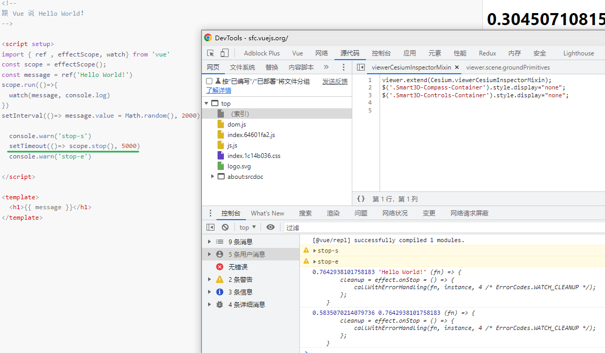

[toc]

## reactive()[#](https://cn.vuejs.org/api/reactivity-core.html#reactive)

返回一个对象的响应式代理。

- **类型**

  ```ts
  function reactive<T extends object>(target: T): UnwrapNestedRefs<T>
  ```

- **详细信息**

  响应式转换是“深层”的：它会**影响到所有嵌套的属性**。

  **一个响应式对象也将深层地解包任何 [ref](https://cn.vuejs.org/api/reactivity-core.html#ref) 属性，同时保持响应性**。

  值得注意的是，当访问到某个响应式数组或 `Map` 这样的**原生集合类型中的 ref 元素时**，不会执行 ref 的解包。

  若要避免深层响应式转换，只想**保留对这个对象顶层次访问的响应性**，请使用 [shallowReactive()](https://cn.vuejs.org/api/reactivity-advanced.html#shallowreactive) 作替代。

  返回的对象以及其中嵌套的对象都会通过 [ES Proxy](https://developer.mozilla.org/en-US/docs/Web/JavaScript/Reference/Global_Objects/Proxy) 包裹，因此**不等于**源对象，建议只使用响应式代理，避免使用原始对象。

- **示例**

  创建一个响应式对象：

  ```ts
  const obj = reactive({ count: 0 })
  obj.count++
  ```

  **ref 的解包**：

  将一个 [ref](https://cn.vuejs.org/api/reactivity-core.html#ref) 赋值给为一个 `reactive` 属性时，该 ref 会被自动解包：

  ```ts
  const count = ref(1)
  const count1 = ref(1)
  const obj = reactive({ count })
  
  // 将一个 ref 赋值给为一个 `reactive` 属性
  obj.count1 = count1
  console.log(obj.count1) // 1
  console.log(obj.count1 === count1.value) // true
  
  // ref 会被解包 unwrap
  console.log(obj.count === count.value) // true
  
  // 会更新 `obj.count`
  count.value++
  console.log(count.value) // 2
  console.log(obj.count) // 2
  
  // 也会更新 `count` ref
  obj.count++
  console.log(obj.count) // 3
  console.log(count.value) // 3
  ```
  
  
  
  注意当访问到某个响应式数组或 `Map` 这样的**原生集合类型**中的 ref 元素时，**不会**执行 ref 的解包：
  
  ```ts
  const books = reactive([ref('Vue 3 Guide')])
  // 这里需要 .value
  console.log(books[0].value)
  
  const map = reactive(new Map([['count', ref(0)]]))
  // 这里需要 .value
  console.log(map.get('count').value)
  ```
  
  将一个 [ref](https://cn.vuejs.org/api/reactivity-core.html#ref) 赋值为一个 **`reactive` 属性**时，该 ref 会被自动解包：
  
  ```ts
  const count = ref(1)
  const obj = reactive({})
  
  obj.count = count
  
  console.log(obj.count) // 1
  console.log(obj.count === count.value) // true
  ```
  
- reactive 对象的解构

  

​		

## isReactive()[#](https://cn.vuejs.org/api/reactivity-utilities.html#isreactive)

检查一个对象是否是由 [`reactive()`](https://cn.vuejs.org/api/reactivity-core.html#reactive) 或 [`shallowReactive()`](https://cn.vuejs.org/api/reactivity-advanced.html#shallowreactive) 创建的代理。

## isReadonly()[#](https://cn.vuejs.org/api/reactivity-utilities.html#isreadonly)

检查一个对象是否是由 [`readonly()`](https://cn.vuejs.org/api/reactivity-core.html#readonly) 或 [`shallowReadonly()`](https://cn.vuejs.org/api/reactivity-advanced.html#shallowreadonly) 创建的代理。


## readonly()[#](https://cn.vuejs.org/api/reactivity-core.html#readonly)

接受一个**对象** (不论是响应式还是普通的) 或是一个 [ref](https://cn.vuejs.org/api/reactivity-core.html#ref)，返回一个原值的**只读代理**。

- **类型**

  ```ts
  function readonly<T extends object>(
    target: T
  ): DeepReadonly<UnwrapNestedRefs<T>>
  ```

- **详细信息**

  只读代理是深层的：对任何嵌套属性的访问都将是只读的。

  它的 ref **解包行为与 `reactive()` 相同**，但解包得到的值是只读的。

  要避免深层级的转换行为，请使用 [shallowReadonly()](https://cn.vuejs.org/api/reactivity-advanced.html#shallowreadonly) 作替代。

- **示例**

  ```ts
  const original = reactive({ count: 0 })
  
  const copy = readonly(original)
  
  watchEffect(() => {
    // 用来做响应性追踪
    console.log(copy.count)
  })
  
  // 更改源属性会触发其依赖的侦听器
  original.count++
  
  // 更改该只读副本将会失败，并会得到一个警告
  copy.count++ // warning!
  ```


## ref()[#](https://cn.vuejs.org/api/reactivity-core.html#ref)

接受一个**内部值**，返回一个响应式的、可更改的 ref 对象，此对象只有一个指向其内部值的属性 `.value`。

- **类型**

  ```ts
  function ref<T>(value: T): Ref<UnwrapRef<T>>
  
  interface Ref<T> {
    value: T
  }
  ```

- **详细信息**

  ref 对象是可更改的，也就是说你可以**为 `.value` 赋予新的值**。

  它也是响应式的，即所有对 `.value` 的操作都将被追踪，并且写操作会触发与之相关的副作用。

  如果**将一个对象赋值给 ref**，那么这个对象将**通过 [reactive()](https://cn.vuejs.org/api/reactivity-core.html#reactive) 转为具有深层次响应式的对象**。

  这也意味着**如果对象中包含了嵌套的 ref，它们将被深层地解包**。

  若要避免这种深层次的转换，请使用 [`shallowRef()`](https://cn.vuejs.org/api/reactivity-advanced.html#shallowref) 来替代。


## isRef()[#](https://cn.vuejs.org/api/reactivity-utilities.html#isref)

检查某个值是否为 ref。

## unref()[#](https://cn.vuejs.org/api/reactivity-utilities.html#unref)

如果参数是 ref，则返回内部值，否则返回参数本身。

这是 `val = isRef(val) ? val.value : val` 计算的一个语法糖。


## toRef()[#](https://cn.vuejs.org/api/reactivity-utilities.html#toref)

基于**响应式对象上的<u>一个属性</u>**，**创建一个对应的 ref**。

**这样创建的 ref 与其源属性保持同步**：

​	改变源属性的值将更新 ref 的值，**反之亦然**。

- **类型**

  ```ts
  function toRef<T extends object, K extends keyof T>(
    object: T,
    key: K,
    defaultValue?: T[K]
  ): ToRef<T[K]>
  
  type ToRef<T> = T extends Ref ? T : Ref<T>
  ```

- **示例**

  ```ts
  const state = reactive({
    foo: 1,
    bar: 2
  })
  const fooRef = toRef(state, 'foo')
  
  // 更改该 ref 会更新源属性
  fooRef.value++
  console.log(state.foo) // 2
  
  // 更改源属性也会更新该 ref
  state.foo++
  console.log(fooRef.value) // 3
  ```

  **请注意，这不同于**：

  ```ts
  const fooRef = ref(state.foo)
  ```

  上面这个 ref **不会**和 `state.foo` 保持同步，因为这个 `ref()` 接收到的是一个纯数值。

  `toRef()` 这个函数在你想把一个 prop 的 **ref 传递给一个组合式函数时**会很有用: 

  ```ts
  <script setup>
  import { toRef } from 'vue'
  
  const props = defineProps(/* ... */)
  
  // 将 `props.foo` 转换为 ref，然后传入
  // 一个组合式函数
  useSomeFeature(toRef(props, 'foo'))
  </script>
  ```

  当 `toRef` 与组件 props 结合使用时，关于禁止对 props 做出更改的限制依然有效。尝试将新的值传递给 ref 等效于尝试直接更改 props，这是不允许的。

  在这种场景下，你可能可以考虑使用带有 `get` 和 `set` 的 [`computed`](https://cn.vuejs.org/api/reactivity-core.html#computed) 替代。详情请见[在组件上使用 `v-model`](https://cn.vuejs.org/guide/components/events.html#usage-with-v-model) 指南。

  

  即使源属性当前不存在，`toRef()` 也会返回一个可用的 ref。

  这让它在处理**可选 props** 的时候格外实用，相比之下 [`toRefs`](https://cn.vuejs.org/api/reactivity-utilities.html#torefs) 就不会为可选 props 创建对应的 refs。


## toRefs()[#](https://cn.vuejs.org/api/reactivity-utilities.html#torefs)

将一个响应式对象转换为一个普通对象，这个普通对象的**每个属性**都是指向源对象相应属性的 **ref**。

每个单独的 ref 都是使用 [`toRef()`](https://cn.vuejs.org/api/reactivity-utilities.html#toref) 创建的。

- **类型**

  ```ts
  function toRefs<T extends object>(
    object: T
  ): {
    [K in keyof T]: ToRef<T[K]>
  }
  
  type ToRef = T extends Ref ? T : Ref<T>
  ```

- **示例**

  ```ts
  const state = reactive({
    foo: 1,
    bar: 2
  })
  
  const stateAsRefs = toRefs(state)
  /*
  stateAsRefs 的类型：{
    foo: Ref<number>,
    bar: Ref<number>
  }
  */
  
  // 这个 ref 和源属性已经“链接上了”
  state.foo++
  console.log(stateAsRefs.foo.value) // 2
  
  stateAsRefs.foo.value++
  console.log(state.foo) // 3
  ```

  当从组合式函数中**返回响应式对象**时，`toRefs` **相当有用**。

  使用它，消费者组件可以解构/展开返回的对象而**不会失去响应性**：

  ```ts
  function useFeatureX() {
    const state = reactive({
      foo: 1,
      bar: 2
    })
  
    // ...基于状态的操作逻辑
  
    // 在返回时都转为 ref
    return toRefs(state)
  }
  
  // 可以解构而不会失去响应性
  const { foo, bar } = useFeatureX()
  ```

  `toRefs` 在调用时只会为源对象上可以枚举的属性创建 ref。

  如果要为可能还不存在的属性创建 ref，请改用 [`toRef`](https://cn.vuejs.org/api/reactivity-utilities.html#toref)。

## computed()[#](https://cn.vuejs.org/api/reactivity-core.html#computed)

接受一个 getter 函数，返回一个**只读**的响应式 [ref](https://cn.vuejs.org/api/reactivity-core.html#ref) 对象。

该 ref 通过 `.value` 暴露 getter 函数的返回值。它也可以接受一个带有 `get` 和 `set` 函数的对象来创建一个可写的 ref 对象。

```ts
// 只读
function computed<T>(
  getter: () => T,
  // 查看下方的 "计算属性调试" 链接
  debuggerOptions?: DebuggerOptions
): Readonly<Ref<Readonly<T>>>

// 可写的
function computed<T>(
  options: {
    get: () => T
    set: (value: T) => void
  },
  debuggerOptions?: DebuggerOptions
): Ref<T>
```


## shallowReactive()[#](https://cn.vuejs.org/api/reactivity-advanced.html#shallowreactive)

[`reactive()`](https://cn.vuejs.org/api/reactivity-core.html#reactive) 的浅层作用形式。

- **类型**

  ```ts
  function shallowReactive<T extends object>(target: T): T
  ```

- **详细信息**

  和 `reactive()` 不同，这里没有深层级的转换

  一个浅层响应式对象里**只有根级别的属性是响应式**的。

  属性的值会被原样存储和暴露，这也意味着值为 ref 的属性**不会**被自动解包了

- **示例**

  ```ts
  const state = shallowReactive({
    foo: 1,
    nested: {
      bar: 2
    }
  })
  
  // 更改状态自身的属性是响应式的
  state.foo++
  
  // ...但下层嵌套对象不会被转为响应式
  isReactive(state.nested) // false
  
  // 不是响应式的
  state.nested.bar++
  ```


## shallowReadonly()[#](https://cn.vuejs.org/api/reactivity-advanced.html#shallowreadonly)

[`readonly()`](https://cn.vuejs.org/api/reactivity-core.html#readonly) 的浅层作用形式

- 类型

  ```ts
  function shallowReadonly<T extends object>(target: T): Readonly<T>
  ```

  

## shallowRef()[#](https://cn.vuejs.org/api/reactivity-advanced.html#shallowref)

[`ref()`](https://cn.vuejs.org/api/reactivity-core.html#ref) 的浅层作用形式。

- **类型**

  ```ts
  function shallowRef<T>(value: T): ShallowRef<T>
  
  interface ShallowRef<T> {
    value: T
  }
  ```

- **详细信息**

  和 `ref()` 不同，浅层 ref 的内部值将会原样存储和暴露，并且不会被深层递归地转为响应式。

  **只有对 `.value` 的访问是响应式的。**

  `shallowRef()` 常常用于对**大型数据结构的性能优化**或是**与外部的状态管理系统集成**。

- 示例

  ```ts
  const state = shallowRef({ count: 1 })
  
  // 不会触发更改
  state.value.count = 2
  
  // 会触发更改
  state.value = { count: 2 }
  ```

- 参考:

  - [指南 - 减少大型不可变结构的响应性开销](https://cn.vuejs.org/guide/best-practices/performance.html#reduce-reactivity-overhead-for-large-immutable-structures)
  - [指南 - 与其他状态系统集成](https://cn.vuejs.org/guide/extras/reactivity-in-depth.html#integration-with-external-state-systems)


## triggerRef()[#](https://cn.vuejs.org/api/reactivity-advanced.html#triggerref)

强制触发依赖于一个[shallowRef](https://cn.vuejs.org/api/reactivity-advanced.html#shallowref) 的副作用，这通常在对浅引用的内部值进行深度变更后使用。

- **类型**

  ```ts
  function triggerRef(ref: ShallowRef): void
  ```

- **示例**

  ```ts
  const shallow = shallowRef({
    greet: 'Hello, world'
  })
  
  // 触发该副作用第一次应该会打印 "Hello, world"
  watchEffect(() => {
    console.log(shallow.value.greet)
  })
  
  // 这次变更不触发副作用
  shallow.value.greet = 'Hello, universe'
  
  // 打印 "Hello, universe"
  triggerRef(shallow)
  ```


## toRaw()[#](https://cn.vuejs.org/api/reactivity-advanced.html#toraw)

根据一个 Vue 创建的代理返回其原始对象。

- **类型**

  ```ts
  function toRaw<T>(proxy: T): T
  ```

- **详细信息**

  `toRaw()` 可以返回由 [`reactive()`](https://cn.vuejs.org/api/reactivity-core.html#reactive)、[`readonly()`](https://cn.vuejs.org/api/reactivity-core.html#readonly)、[`shallowReactive()`](https://cn.vuejs.org/api/reactivity-advanced.html#shallowreactive) 或者 [`shallowReadonly()`](https://cn.vuejs.org/api/reactivity-advanced.html#shallowreadonly) 创建的代理**对应的原始对象**。

  这是一个可以用于临时读取而不引起代理访问/跟踪开销，或是写入而不触发更改的特殊方法。

  不建议保存对原始对象的持久引用，请谨慎使用。

- **示例**

  ```ts
  const foo = {}
  const reactiveFoo = reactive(foo)
  
  console.log(toRaw(reactiveFoo) === foo) // true
  ```


## markRaw()[#](https://cn.vuejs.org/api/reactivity-advanced.html#markraw)

将一个对象**标记为不可被转为代理**。返回该对象本身。

- **类型**

  ```ts
  function markRaw<T extends object>(value: T): T
  ```

- **示例**

  ```ts
  const foo = markRaw({})
  console.log(isReactive(reactive(foo))) // false
  
  // 也适用于嵌套在其他响应性对象
  const bar = reactive({ foo })
  console.log(isReactive(bar.foo)) // false
  ```

- > 谨慎使用

`markRaw()` 和类似 `shallowReactive()` 这样的浅层式 API 使你可以有选择地避开默认的深度响应/只读转换，并在状态关系谱中嵌入原始的、非代理的对象。

 它们可能出于各种各样的原因被使用：

  - 有些值不应该是响应式的，例如复杂的**第三方类实例**或 **Vue 组件对象**。
  - 当呈现带有不可变数据源的大型列表时，跳过代理转换可以提高性能。

  这应该是一种进阶需求，因为只在根层访问能到原始值，所以如果把一个嵌套的、没有标记的原始对象设置成一个响应式对象，然后再次访问它，你获取到的是代理的版本。这可能会导致**对象身份风险**，即执行一个依赖于对象身份的操作，但却同时使用了同一对象的原始版本和代理版本：

  ```ts
  const foo = markRaw({
    nested: {}
  })
  
  const bar = reactive({
    // 尽管 `foo` 被标记为了原始对象，但 foo.nested 却没有
    nested: foo.nested
  })
  
  console.log(foo.nested === bar.nested) // false
  ```

  识别风险一般是很罕见的。然而，要正确使用这些 API，同时安全地避免这样的风险，需要你对响应性系统的工作方式有充分的了解。


## watchEffect()[#](https://cn.vuejs.org/api/reactivity-core.html#watcheffect)

立即运行一个函数，同时响应式地追踪其依赖，并在依赖更改时重新执行。

## watch()[#](https://cn.vuejs.org/api/reactivity-core.html#watch)

侦听一个或多个响应式数据源，并在数据源变化时调用所给的回调函数。

- 类型

  > 为了便于阅读，对类型进行了简化。

```ts
type WatchSource<T> =
  | Ref<T> // ref
  | (() => T) // getter
  | T extends object
  ? T
  : never // 响应式对象

type WatchCallback<T> = (
  value: T,
  oldValue: T,
  onCleanup: (cleanupFn: () => void) => void
) => void

interface WatchOptions extends WatchEffectOptions {
  immediate?: boolean // 默认：false
  deep?: boolean // 默认：false
  flush?: 'pre' | 'post' | 'sync' // 默认：'pre'
  onTrack?: (event: DebuggerEvent) => void
  onTrigger?: (event: DebuggerEvent) => void
}
// 侦听单个来源
function watch<T>(
  source: WatchSource<T>,
  callback: WatchCallback<T>,
  options?: WatchOptions
): StopHandle

// 侦听多个来源
function watch<T>(
  sources: WatchSource<T>[],
  callback: WatchCallback<T[]>,
  options?: WatchOptions
): StopHandle
```

- **详细信息**

`watch()` 默认是懒侦听的，即仅在侦听源发生变化时才执行回调函数。

第一个参数是侦听器的**源**。这个来源可以是以下几种：

- 一个 **ref**
- 一个**函数**，返回一个值 (getter)
- 一个**响应式对象**
- ...或是由以上类型的值组成的**数组**

第二个参数是在发生变化时要调用的回调函数。

这个回调函数接受三个参数：

- 新值

- 旧值

- 一个用于注册副作用清理的回调函数。

  **该回调函数会在副作用下一次重新执行前调用**，可以用来清除无效的副作用，例如等待中的异步请求。

当侦听多个来源时，**回调函数接受两个数组**，分别对应来源数组中的新值和旧值。

第三个可选的参数是一个对象，支持以下这些选项：

- **`immediate`**：在侦听器创建时立即触发回调。第一次调用时旧值是 `undefined`。
- **`deep`**：如果源是对象，强制深度遍历，以便在深层级变更时触发回调。参考[深层侦听器](https://cn.vuejs.org/guide/essentials/watchers.html#deep-watchers)。
- **`flush`**：调整回调函数的刷新时机。参考[回调的刷新时机](https://cn.vuejs.org/guide/essentials/watchers.html#callback-flush-timing)及 [`watchEffect()`](https://cn.vuejs.org/api/reactivity-core.html#watcheffect)。
- **`onTrack / onTrigger`**：调试侦听器的依赖。参考[调试侦听器](https://cn.vuejs.org/guide/extras/reactivity-in-depth.html#watcher-debugging)。

与 [`watchEffect()`](https://cn.vuejs.org/api/reactivity-core.html#watcheffect) 相比，`watch()` 使我们可以：

- 懒执行副作用；
- 更加明确是应该由哪个状态触发侦听器重新执行；
- 可以访问所侦听状态的前一个值和当前值。

**示例**

侦听一个 ref：

```ts
const count = ref(0)
watch(count, (count, prevCount) => {
  /* ... */
})
```

侦听一个 getter 函数：

```ts
const state = reactive({ count: 0 })
watch(
  () => state.count,
  (count, prevCount) => {
    /* ... */
  }
)
```

当使用 getter 函数作为源时，回调只在此函数的**返回值变化时才会触发**。

如果你想让回调在深层级变更(对象的属性)时也能触发，你需要使用 `{ deep: true }` 强制侦听器进入**深层级**模式。

在深层级模式时，如果回调函数由于深层级的变更而被触发，那么新值和旧值将是同一个对象。

```js
const state = reactive({ count: 0 })
watch(
  () => state,
  (newValue, oldValue) => {
    // newValue === oldValue
  },
  { deep: true }
)

```

当直接侦听一个响应式对象时，侦听器会**自动启用深层模式**：

```js
const state = reactive({ count: 0 })
watch(state, () => {
  /* 深层级变更状态所触发的回调 */
})
```


当侦听多个来源时，回调函数接受两个数组，分别对应来源数组中的新值和旧值：

```ts
watch([fooRef, barRef], 
      ([foo, bar], [prevFoo, prevBar]) => {
  /* ... */
})
```


## effectScope()[#](https://cn.vuejs.org/api/reactivity-advanced.html#effectscope)

源码 [vuejs/core/packages/reactivity/src/effectScope](https://github.com/vuejs/core/blob/main/packages/reactivity/src/effectScope.ts)

创建一个 effect 作用域，可以捕获其中所创建的响应式副作用 (即计算属性和侦听器)，这样捕获到的副作用可以一起处理。

对于该 API 的使用细节，请查阅对应的 [RFC](https://github.com/vuejs/rfcs/blob/master/active-rfcs/0041-reactivity-effect-scope.md)。

应用: [VueUse-createGlobalState](https://vueuse.org/shared/createGlobalState/)  `effectScope(true)`

pinia 源码 [createPinia](https://github.com/vuejs/pinia/blob/v2/packages/pinia/src/createPinia.ts)

- **类型**

  ```ts
  function effectScope(detached?: boolean): EffectScope
  
  interface EffectScope {
    run<T>(fn: () => T): T | undefined // 如果作用域不活跃就为 undefined
    stop(): void
  }
  ```

  ```ts
  export class EffectScope {
    constructor(detached = false) {
      if (!detached && activeEffectScope) {
        this.parent = activeEffectScope
        this.index =
          (activeEffectScope.scopes || (activeEffectScope.scopes = [])).push(
            this
          ) - 1
      }
    }
  }
  ```

  **detached**(脱离的)

  detach为true时不会被 activeEffectScope.scopes 收集.

- **示例**

  ```ts
  const scope = effectScope()
  
  scope.run(() => {
    const doubled = computed(() => counter.value * 2)
  
    watch(doubled, () => console.log(doubled.value))
  
    watchEffect(() => console.log('Count: ', doubled.value))
  })
  
  // 处理掉当前作用域内的所有 effect
  scope.stop()
  ```

stop 处理掉**当前作用域**中所有的effect (作用)





`effectScope(true)` 的scope 不会被getCurrentScope检索到


## getCurrentScope()[#](https://cn.vuejs.org/api/reactivity-advanced.html#getcurrentscope)

如果有的话，返回当前活跃的 [effect 作用域](https://cn.vuejs.org/api/reactivity-advanced.html#effectscope)。


## onScopeDispose()[#](https://cn.vuejs.org/api/reactivity-advanced.html#onscopedispose)

在当前活跃的 [effect 作用域](https://cn.vuejs.org/api/reactivity-advanced.html#effectscope)上**注册一个处理回调函数**。

当**相关的 effect 作用域停止时**会调用这个回调函数。

这个方法可以作为**可复用的组合式函数中 `onUnmounted` 的替代品，它并不与组件耦合**，因为每一个 Vue 组件的 `setup()` 函数也是在一个 effect 作用域中调用的。


## [vuejs/rfcs](https://github.com/vuejs/rfcs)

reactivity-effect-scope.md

- Start Date: 2020-08-20
- Target Major Version: 3.x
- Reference Issues: (fill in existing related issues, if any)
- Implementation PR: [#2195](https://github.com/vuejs/vue-next/pull/2195)

# Summary

Introducing a new `effectScope()` API for `@vue/reactivity`. An `EffectScope` instance can automatically collect effects run within a synchronous function so that these effects can be disposed together at a later time.
