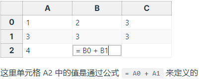

[toc]

# [#深入响应式系统](https://cn.vuejs.org/guide/extras/reactivity-in-depth.html#reactivity-in-depth)


## 什么是响应性



但如果你试着更改 A0 或 A1，你会注意到 A2 也随即自动更新了。

而 JavaScript 默认并不是这样的。如何在 JavaScript 中做到这一点呢？

```js
let A0 = 1
let A1 = 2
let A2 = A0 + A1

console.log(A2) // 3

A0 = 2
console.log(A2) // 仍然是 3
```

首先，为了能重新运行计算的代码来更新 `A2`，我们需要将其包装为一个函数：

```
let A2

function update() {
  A2 = A0 + A1
}
```

然后，我们需要定义几个术语：

- 这个 `update()` 函数会产生一个**副作用**，或者就简称为**作用** (**effect**)，因为它会更改程序里的状态。
- `A0` 和 `A1` 被视为这个作用的**依赖** (**dependency**)，因为它们的值被用来执行这个作用。因此这次作用也可以说是一个它依赖的**订阅者** (**subscriber**)。

我们需要一个魔法函数，能够在 `A0` 或 `A1` (这两个**依赖**) 变化时调用 `update()` (产生**作用**)。

```js
whenDepsChange(update)
```

这个 `whenDepsChange()` 函数有如下的任务：

1. 当一个**变量被读取时进行追踪**。例如我们执行了表达式 `A0 + A1` 的计算，则 `A0` 和 `A1` 都被读取到了。

2. 如果一个变量**在当前运行的副作用中被读取了，就将该副作用设为此变量的一个订阅者**。

   例如由于 `A0` 和 `A1` 在 `update()` 执行时被访问到了，则 `update()` 需要**在第一次调用之后成为 `A0` 和 `A1` 的订阅者**。

3. **探测一个变量的变化**。例如当我们给 `A0` 赋了一个**新**的值后，应该**通知**其所有订阅了的**副作用重新执行**。


## Vue 中的响应性是如何工作的[#](https://cn.vuejs.org/guide/extras/reactivity-in-depth.html#how-reactivity-works-in-vue)

我们无法直接追踪对上述示例中**局部变量**的读写，原生 JavaScript 没有提供任何机制能做到这一点。

**但是**，我们是可以追踪**对象属性**的读写的。

在 JavaScript 中有**两种劫持 property 访问**的方式：[getter](https://developer.mozilla.org/en-US/docs/Web/JavaScript/Reference/Functions/get) / [setters](https://developer.mozilla.org/en-US/docs/Web/JavaScript/Reference/Functions/set) 和 [Proxies](https://developer.mozilla.org/en-US/docs/Web/JavaScript/Reference/Global_Objects/Proxy)。

Vue 2 使用 getter / setters 完全是出于支持旧版本浏览器的限制。

而在 Vue 3 中则使用了 Proxy 来创建响应式对象，仅将 getter / setter 用于 ref。

下面的伪代码将会说明它们是如何工作的：

```js
// reactive 关联一个对象
function reactive(obj) {
  return new Proxy(obj, {
    get(target, key) {
      track(target, key) // 读取属性, 跟踪
      return target[key]
    },
    set(target, key, value) {
      target[key] = value
      trigger(target, key) // 赋值属性, 触发
    }
  })
}

// ref 绑定的是一个值
function ref(value) {
  const refObject = {
    get value() {
      track(refObject, 'value') // ref 内部 处理一个空对象带有value属性
      return value
    },
    set value(newValue) {
      value = newValue
      trigger(refObject, 'value')
    }
  }
  return refObject
}
```

以上代码解释了我们在基础章节部分讨论过的一些事情：

- 当你将一个**响应性对象**的**属性解构为一个局部变量时**，**响应性就会“断开连接”**，因为对局部变量的访问不再触发 get / set 代理捕获。
- 从 `reactive()` 返回的代理尽管行为上表现得像原始对象，但我们通过使用 `===` 运算符还是能够比较出它们的不同。


在 `track()` 内部，我们会检查当前**是否有正在运行的副作用** (Target?)。

如果有，我们会查找到一个存储了所有追踪了该属性的**订阅者**的 Set，然后将当前这个副作用作为新订阅者添加到该 Set 中。

```js
// 这会在一个副作用就要运行之前被设置
// 我们会在后面处理它
let activeEffect

function track(target, key) {
  if (activeEffect) {
    const effects = getSubscribersForProperty(target, key)
    effects.add(activeEffect)
  }
}
```

副作用订阅将被存储在一个全局的 `WeakMap<target, Map<key, Set<effect>>>` 数据结构中。

如果在第一次追踪时没有找到对相应属性订阅的副作用集合，它将会在这里新建。

这就是 `getSubscribersForProperty()` 函数所做的事。

为了简化描述，我们跳过了它其中的细节。


在 `trigger()` 之中，我们会**再查找到该属性的所有订阅副作用**。

但这一次我们需要执行它们：

```js
function trigger(target, key) {
  const effects = getSubscribersForProperty(target, key)
  effects.forEach((effect) => effect())
}
```

现在让我们回到 `whenDepsChange()` 函数中：

```js
function whenDepsChange(update) {
  const effect = () => {
    activeEffect = effect
    update()
    activeEffect = null
  }
  effect()
}
```

它将原本的 `update` 函数包装在了一个副作用函数中。

在运行实际的更新之前，**这个外部函数会将自己设为当前活跃的副作用**。

这使得在更新期间的 `track()` 调用都能定位到这个当前活跃的副作用。


我们已经创建了一个能自动跟踪其依赖的副作用，它会在任意依赖被改动时重新运行。我们称其为**响应式副作用**。


常见的响应式副作用的用例是什么呢？自然是更新 DOM！我们可以像下面这样实现一个简单的“响应式渲染”：

```js
import { ref, watchEffect } from 'vue'

const count = ref(0)

watchEffect(() => {
  document.body.innerHTML = `计数：${count.value}`
})

// 更新 DOM
count.value++
```

实际上，这与 Vue 组件保持状态和 DOM 同步的方式非常接近。

每个组件实例创建一个响应式副作用来渲染和更新 DOM。

当然，Vue 组件使用了比 `innerHTML` 更高效的方式来更新 DOM。

这会在[渲染机制](https://cn.vuejs.org/guide/extras/rendering-mechanism.html)一章中详细介绍。


## [运行时 vs. 编译时响应性](https://cn.vuejs.org/guide/extras/reactivity-in-depth.html#runtime-vs-compile-time-reactivity)


## 响应性调试[#](https://cn.vuejs.org/guide/extras/reactivity-in-depth.html#reactivity-debugging)

Vue 的响应性系统可以自动跟踪依赖关系，但在某些情况下，我们可能希望确切地知道**正在跟踪什么**，或者是**什么导致了组件重新渲染**。


### 组件调试钩子[#](https://cn.vuejs.org/guide/extras/reactivity-in-depth.html#component-debugging-hooks)

我们可以在一个组件渲染时使用 `renderTracked` **生命周期钩子**来调试查看哪些依赖正在被使用，或是用 `renderTriggered` 来确定哪个依赖正在触发更新。

这些钩子都会收到一个调试事件，其中包含了触发相关事件的依赖的信息。推荐在回调中放置一个 `debugger` 语句，使你可以在开发者工具中交互式地查看依赖：

```js
export default {
  renderTracked(event) {
    debugger
  },
  renderTriggered(event) {
    debugger
  }
}
```


可以向 `computed()`  `watch()` `watchEffec()` 传入第二个参数，是一个包含了 **`onTrack`** 和 **`onTrigger`** 两个回调函数的对象：

- `onTrack` 将在响应属性或引用作为依赖项被**跟踪**时被调用。
- `onTrigger` 将在侦听器回调被依赖项的变更**触发**时被调用。

> `onTrack` 和 `onTrigger` 选项仅会在开发模式下工作。


## 与外部状态系统集成[#](https://cn.vuejs.org/guide/extras/reactivity-in-depth.html#integration-with-external-state-systems)

Vue 的响应性系统是通过深度转换普通 JavaScript 对象为响应式代理来实现的。

这种深度转换在一些情况下是不必要的，在**和一些外部状态管理系统时集成**时，甚至是需要避免的 (例如，**当一个外部的解决方案也用了 Proxy 时**)。

### 不可变数据[#](https://cn.vuejs.org/guide/extras/reactivity-in-depth.html#immutable-data)

如果状态树很大的话，Vue 的可变响应性系统没法很好地处理这种情况，因为在每次更新时都序列化整个状态对象对 CPU 和内存开销来说都是非常昂贵的。

[不可变数据结构](https://en.wikipedia.org/wiki/Persistent_data_structure)通过永不更改状态对象来解决这个问题。

### 状态机[#](https://cn.vuejs.org/guide/extras/reactivity-in-depth.html#state-machines)

[状态机](https://en.wikipedia.org/wiki/Finite-state_machine)是一种数据模型，

### RxJS[#](https://cn.vuejs.org/guide/extras/reactivity-in-depth.html#rxjs)

[RxJS](https://rxjs.dev/) 是一个用于处理异步事件流的库。[VueUse](https://vueuse.org/) 库提供了 [`@vueuse/rxjs`](https://vueuse.org/rxjs/readme.html) 扩展来支持连接 RxJS 流与 Vue 的响应性系统。
