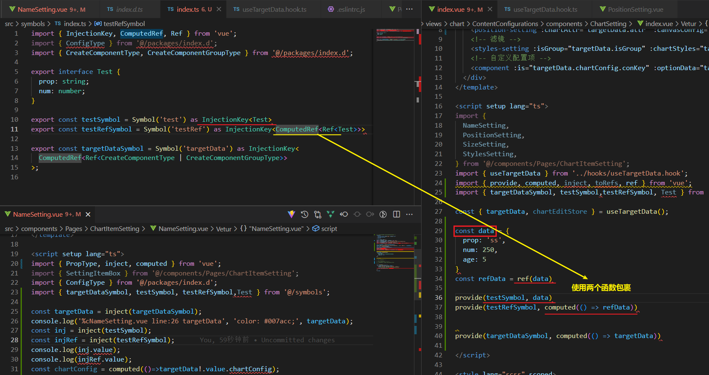
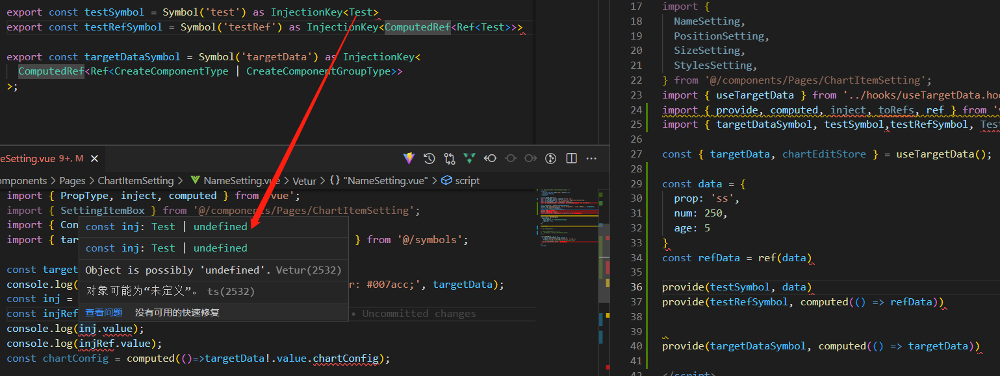
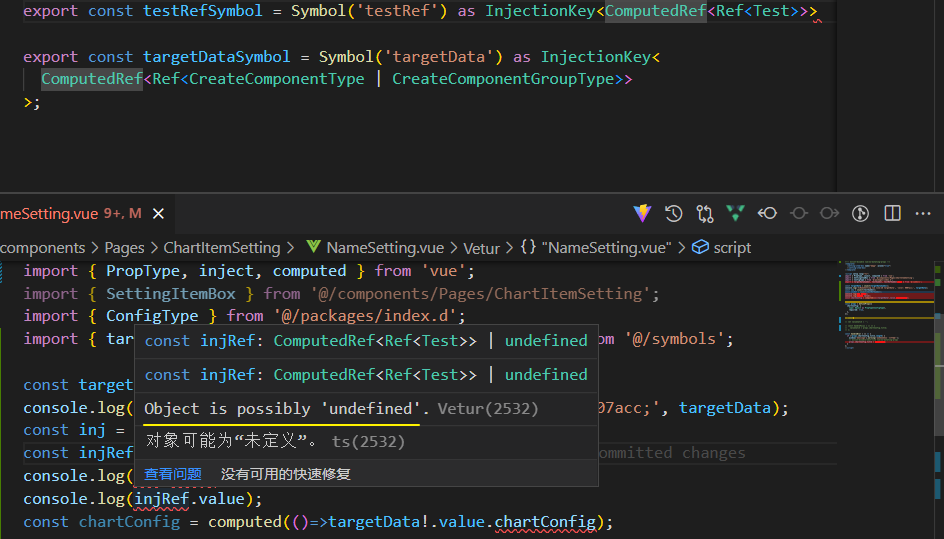
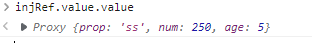

[TOC]

# 组合式 API：依赖注入

## provide()

- **类型**

  ```ts
  function provide<T>(key: InjectionKey<T> | string, value: T): void
  ```

- **详细信息**

  `provide()` 接受两个参数：第一个参数是要注入的 key，可以是一个字符串或者一个 symbol，第二个参数是要注入的值。

  

  当使用 TypeScript 时，**key 可以是一个被类型断言为 `InjectionKey` 的 symbol。**`InjectionKey` 是一个 **Vue 提供的工具类型**，继承自 `Symbol`，可以**用来同步 `provide()` 和 `inject()` 之间值的类型**。

  与注册生命周期钩子的 API 类似，**`provide()` 必须在组件的 `setup()` 阶段同步调用**。

- 示例

  ```vue
  <script setup>
  import { ref, provide } from 'vue'
  import { fooSymbol } from './injectionSymbols'
  
  // 提供静态值
  provide('foo', 'bar')
  
  // 提供响应式的值
  const count = ref(0)
  provide('count', count)
  
  // 提供时将 Symbol 作为 key
  provide(fooSymbol, count)
  </script>
  ```

- **参考：**
  - [指南 - 依赖注入](https://cn.vuejs.org/guide/components/provide-inject.html)
  - [指南 - 为 provide/inject 标注类型](https://cn.vuejs.org/guide/typescript/composition-api.html#typing-provide-inject) 


## inject()[#](https://cn.vuejs.org/api/composition-api-dependency-injection.html#inject)

注入一个由祖先组件或整个应用 (通过 `app.provide()`) 提供的值。

- **类型**

  ```ts
  // 没有默认值
  function inject<T>(key: InjectionKey<T> | string): T | undefined
  
  // 带有默认值
  function inject<T>(key: InjectionKey<T> | string, defaultValue: T): T
  
  // 使用工厂函数
  function inject<T>(
    key: InjectionKey<T> | string,
    defaultValue: () => T,
    treatDefaultAsFactory: true
  ): T
  ```

- **详细信息**

  **第一个参数是注入的 key**。

  - Vue 会遍历父组件链，通过匹配 key 来确定所提供的值。如果父组件链上多个组件对同一个 key 提供了值，那么离得更近的组件将会“覆盖”链上更远的组件所提供的值。

  - 如果没有能通过 key 匹配到值，`inject()` 将返回 `undefined`，除非提供了一个默认值。

  第二个参数是**可选的**，即在没有匹配到 key 时使用的**默认值**。

  - 它也可以是一个工厂函数，用来返回某些创建起来比较复杂的值。
  - 如果默认值本身就是一个函数，那么你必须将 `false` 作为第三个参数传入，表明这个函数就是默认值，而不是一个工厂函数。

  与注册生命周期钩子的 API 类似，**`inject()` 必须在组件的 `setup()` 阶段同步调用**。

  当使用 TypeScript 时，key 可以是一个类型为 `InjectionKey` 的 symbol。

  `InjectionKey` 是一个 Vue 提供的工具类型，继承自 `Symbol`，可以用来同步 `provide()` 和 `inject()` 之间值的类型。

- **示例**

  假设有一个父组件已经提供了一些值，如前面 `provide()` 的例子中所示：

  ```ts
  <script setup>
  import { inject } from 'vue'
  import { fooSymbol } from './injectionSymbols'
  
  // 注入值的默认方式
  const foo = inject('foo')
  
  // 注入响应式的值
  const count = inject('count')
  
  // 通过 Symbol 类型的 key 注入
  const foo2 = inject(fooSymbol)
  
  // 注入一个值，若为空则使用提供的默认值
  const bar = inject('foo', 'default value')
  
  // 注入一个值，若为空则使用提供的工厂函数
  const baz = inject('foo', () => new Map())
  
  // 注入时为了表明提供的默认值是个函数，需要传入第三个参数
  const fn = inject('function', () => {}, false)
  </script>
  ```


## 为 provide / inject 标注类型[#](https://cn.vuejs.org/guide/typescript/composition-api.html#typing-provide-inject)

provide 和 inject 通常会在不同的组件中运行。要正确地为注入的值标记类型，Vue 提供了一个 `InjectionKey` 接口，它是一个继承自 `Symbol` 的泛型类型，可以用来在提供者和消费者之间同步注入值的类型

```ts
import { provide, inject } from 'vue'
import type { InjectionKey } from 'vue'

const key = Symbol() as InjectionKey<string>

provide(key, 'foo') // 若提供的是非字符串值会导致错误

const foo = inject(key) // foo 的类型：string | undefined
```

建议**将注入 key 的类型放在一个单独的文件**中，这样它就可以被多个组件导入。


当**使用字符串注入 key 时，注入值的类型是 `unknown`**，需要通过**泛型参数显式声明**：

```ts
const foo = inject<string>('foo') // 类型：string | undefined
```


注意注入的值**仍然可以是 `undefined`，因为无法保证提供者一定会在运行时 provide 这个值**。 

> 可以
>
> 1. 添加默认值
> 2. 强制转换
> 3. 断言 (!)

当提供了一个默认值后，这个 `undefined` 类型就可以被移除：

```ts
const foo = inject<string>('foo', 'bar') // 类型：string
```


如果你确定该值将始终被提供，则还可以强制转换该值：

```ts
const foo = inject('foo') as string
```








使用时会有 undefined, 需要显示声明;

> 不建议多层Ref嵌套, 不然会需要多次访问.value
>
> 

 使用 `InjectionKey`  声明provide&inject的值的类型;
