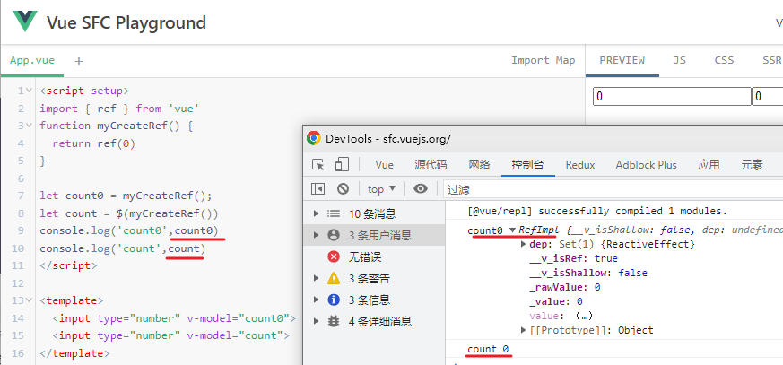

[toc]

# 响应性语法糖 / reactivity-transform

docs: 对比着看

​	cn: https://cn.vuejs.org/guide/extras/reactivity-transform.html

​    en: https://vuejs.org/guide/extras/reactivity-transform.html


RIP Reactive Transform *2023年1月25*


## ref vs. 响应式变量[#](https://cn.vuejs.org/guide/extras/reactivity-transform.html#refs-vs-reactive-variables)

自从引入组合式 API 的概念以来，一个主要的未解决的问题就是 ref 和响应式对象到底用哪个。

- 响应式对象存在解构丢失响应性的问题， 
- ref 需要到处使用 `.value` 则感觉很繁琐，并且在没有类型系统的帮助时很容易漏掉 `.value`。

[Vue 的响应性语法糖 or Vue Reactive Transform](https://github.com/vuejs/core/tree/main/packages/reactivity-transform)是一个**编译时的转换步骤**，让我们可以像这样书写代码

```vue
<script setup>
let count = $ref(0) // macro 不需要引入

console.log(count)

function increment() {
  count++ // get/set 都不再需要访问.value属性
}
</script>

<template>
  <button @click="increment">{{ count }}</button>
</template>
```

这里的这个 `$ref()` 方法是一个**编译时的宏命令**：它不是一个真实的、在运行时会调用的方法。

而是用作 Vue 编译器的标记，表明最终的 `count` 变量需要是一个**响应式变量**。

响应式的变量可以像普通变量那样被访问和重新赋值，但这些操作在**编译后**都会变为带 `.value` 的 ref。

每一个会返回 ref 的响应式 API 都有一个相对应的、以 `$` 为前缀的宏函数。

包括以下这些 API：

- [`ref`](https://cn.vuejs.org/api/reactivity-core.html#ref) -> `$ref`
- [`computed`](https://cn.vuejs.org/api/reactivity-core.html#computed) -> `$computed`
- [`shallowRef`](https://cn.vuejs.org/api/reactivity-advanced.html#shallowref) -> `$shallowRef`
- [`customRef`](https://cn.vuejs.org/api/reactivity-advanced.html#customref) -> `$customRef`
- [`toRef`](https://cn.vuejs.org/api/reactivity-utilities.html#toref) -> `$toRef`


当启用响应性语法糖时，这些宏函数都是全局可用的、无需手动导入。

但如果你想让它更明显，你也可以选择从 `vue/macros` 中引入它们：

```js
import { $ref } from 'vue/macros'

let count = $ref(0)
```


## 通过 `$()` 解构[#](https://cn.vuejs.org/guide/extras/reactivity-transform.html#destructuring-with)

我们常常会**让一个组合函数返回一个含数个 ref 的对象，然后解构得到这些 ref**。

对于这种场景，响应性语法糖提供了一个 **`$()`** 宏：

```js
import { useMouse } from '@vueuse/core'

const { x, y } = $(useMouse())

console.log(x, y)
```

编译输出为：

```js
import { toRef } from 'vue'
import { useMouse } from '@vueuse/core'

const __temp = useMouse(),
  x = toRef(__temp, 'x'),
  y = toRef(__temp, 'y')

console.log(x.value, y.value)
```

- 如果 `x` 已经是一个 ref，`toRef(__temp, 'x')` 则会简单地返回它本身，而不会再创建新的 ref。

- 如果一个被解构的值不是 ref (例如是一个函数)，也仍然可以使用，这个值会被包装进一个 ref，因此其他代码都会正常工作。

对 `$()` 的解构在响应式对象**和**包含数个 ref 的对象都可用。


## 用 `$()` 将现存的 ref 转换为响应式对象

在某些场景中我们可能已经有了会返回 ref 的函数。然而，Vue 编译器并不能够提前知道该函数会返回一个 ref。那么此时可以使用 `$()` 宏来将现存的 ref 转换为响应式变量。

```js
function myCreateRef() {
  return ref(0)
}

let count = $(myCreateRef())
```



> 1. 相当于是 $ref() 省略`.value`的另外一种写法


## 响应式 props 解构[#](https://cn.vuejs.org/guide/extras/reactivity-transform.html#reactive-props-destructure)

现在的 `<script setup>` 中对 **`defineProps` 宏**的使用有**两个痛点**：

1. 和 `.value` 类似，为了保持响应性，你始终需要以 `props.x` 的方式访问这些 prop。

   这意味着你**不能够解构 `defineProps` 的返回值**，因为得到的变量将不是响应式的、也不会更新。

2. 当使用[基于类型的 props 的声明](https://v3.vuejs.org/api/sfc-script-setup.html#typescript-only-features)时，**无法很方便地声明这些 prop 的默认值**。

   为此我们提供了 `withDefaults()` 这个 API，但使用起来仍然很笨拙。

当 `defineProps` 与解构一起使用时，我们可以通过**应用编译时转换**来解决这些问题，类似于我们之前看到的 `$()`：

```vue
<script setup lang="ts">
  interface Props {
    msg: string
    count?: number
    foo?: string
  }

  const {
    msg,
    // 默认值正常可用
    count = 1,
    // 解构时命别名也可用
    // 这里我们就将 `props.foo` 命别名为 `bar`
    foo: bar
  } = defineProps<Props>()

  watchEffect(() => {
    // 会在 props 变化时打印
    console.log(msg, count, bar)
  })
</script>
```

上面的代码将被**编译**成下面这样的运行时声明：

```js
export default {
  props: {
    msg: { type: String, required: true },
    count: { type: Number, default: 1 },
    foo: String
  },
  setup(props) {
    watchEffect(() => {
      console.log(props.msg, props.count, props.foo)
    })
  }
}
```


## 保持在函数间传递时的响应性[#](https://cn.vuejs.org/guide/extras/reactivity-transform.html#retaining-reactivity-across-function-boundaries)

虽然响应式变量使我们可以不再受 `.value` 的困扰，但它也使得我们在**函数间传递响应式变量时可能造成“响应性丢失”的问题**。

这可能在以下两种场景中出现：

### 以参数形式传入函数[#](https://cn.vuejs.org/guide/extras/reactivity-transform.html#passing-into-function-as-argument)

假设有一个期望接收一个 ref 对象为参数的函数：

```ts
function trackChange(x: Ref<number>) {
  watch(x, (x) => {
    console.log('x 改变了！')
  })
}

let count = $ref(0)
trackChange(count) // 无效！ 编译后为 count.value
```

### 作为函数返回值[#](https://cn.vuejs.org/guide/extras/reactivity-transform.html#returning-inside-function-scope)

如果将响应式变量直接放在返回值表达式中会丢失掉响应性

```ts
function useMouse() {
  let x = $ref(0)
  let y = $ref(0)

  // 监听 mousemove 事件

  // 不起效！
  return {x, y}
}
```

为了保持响应性，我们需要返回的是真正的 ref，而不是返回时 ref 内的值。


## TypeScript 集成 [#](https://cn.vuejs.org/guide/extras/reactivity-transform.html#typescript-integration)

Vue 为这些宏函数都提供了类型声明 (全局可用)，因此类型推导都会符合预期。

...

## 显式启用[#](https://cn.vuejs.org/guide/extras/reactivity-transform.html#explicit-opt-in)

响应性语法糖目前默认是关闭状态，需要你显式选择启用。

...


### Vite[#](https://cn.vuejs.org/guide/extras/reactivity-transform.html#vite)

- 需要 `@vitejs/plugin-vue@>=2.0.0`
- 应用于 SFC 和 js(x)/ts(x) 文件。在执行转换之前，会对文件进行快速的使用检查，因此不使用宏的文件应该不会有性能损失。
- 注意 `reactivityTransform` 现在是一个**插件的顶层选项**，而不再是位于 `script.refSugar` 之中了，因为它不仅仅只对 SFC 起效。

```js
// vite.config.js
export default {
  plugins: [
    vue({
      reactivityTransform: true
    })
  ]
}
```
