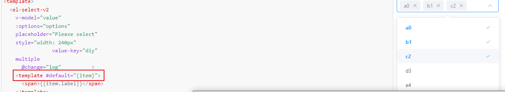
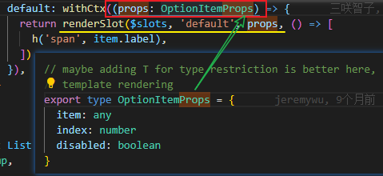

[TOC]

# [#](https://v3.cn.vuejs.org/guide/component-slots.html#插槽) 插槽

### [作用域插槽](https://v3.cn.vuejs.org/guide/component-slots.html#%E4%BD%9C%E7%94%A8%E5%9F%9F%E6%8F%92%E6%A7%BD)

有时让插槽内容能够访问子组件中才有的数据是很有用的。

可以根据自己的需要将任意数量的 attribute 绑定到 `slot` 上：

```html
<ul>
  <li v-for="( item, index ) in items">
    <slot :item="item" :index="index" :another-attribute="anotherAttribute"></slot>
  </li>
</ul>
```

绑定在 `<slot>` 元素上的 attribute 被称为**插槽 prop**。

在父级作用域中，我们可以使用带值的 `v-slot` 来定义我们提供的插槽 prop 的名字：

```html
<todo-list>
  <template v-slot:default="slotProps">
    <i class="fas fa-check"></i>
    <span class="green">{{ slotProps.item }}</span>
  </template>
</todo-list>
```


`v-slot:default="slotProps"`  ===> 指令 `v-slot` 

指令 (Directives) 是带有 `v-` 前缀的特殊 attribute。

指令 attribute 的**值**预期是**单个 JavaScript 表达式**

一些指令能够接收一个“**参数**”，在指令名称之后**以冒号**表示。 支持动态参数

修饰符 (modifier) 是以半角句号 `.` 指明的特殊后缀，用于指出一个指令应该以特殊方式绑定。

代入 v-slot 指令, 参数为插槽名 (默认为`default`)

**限用于**：`<template>` [组件](https://v3.cn.vuejs.org/guide/component-slots.html#独占默认插槽的缩写语法) (对于一个单独的带 prop 的默认插槽)

**用法**：提供具名插槽或需要接收 prop 的插槽。

---- 相当于是传给 template 的值.


### 作用域插槽解构



`template #default="props"` 给绑定在slot标签上的属性(s)对象设置一个别名

`template #default={item}` 确定props有什么属性进行处理


