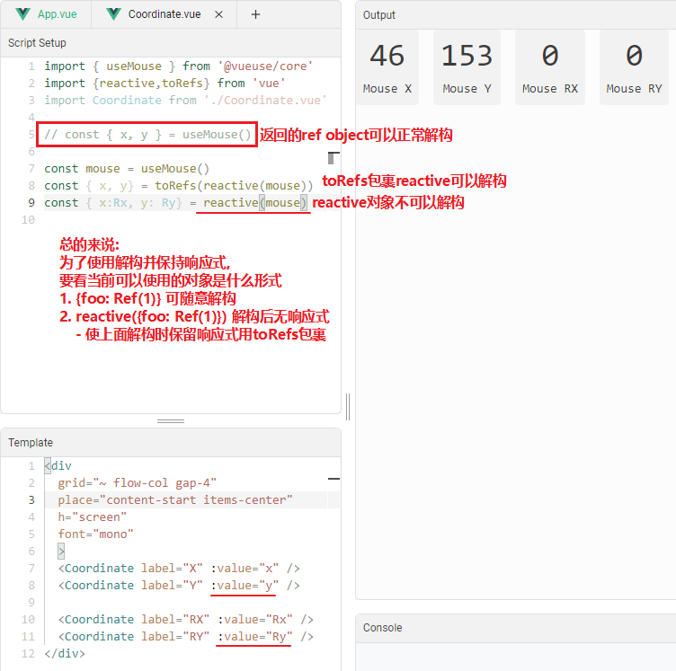
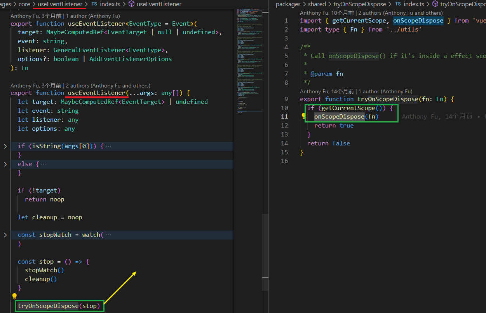
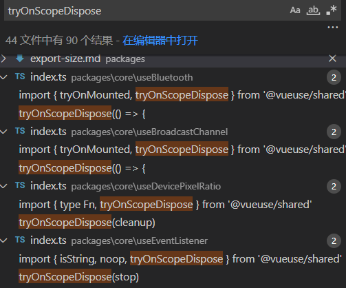
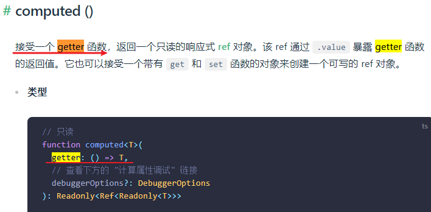
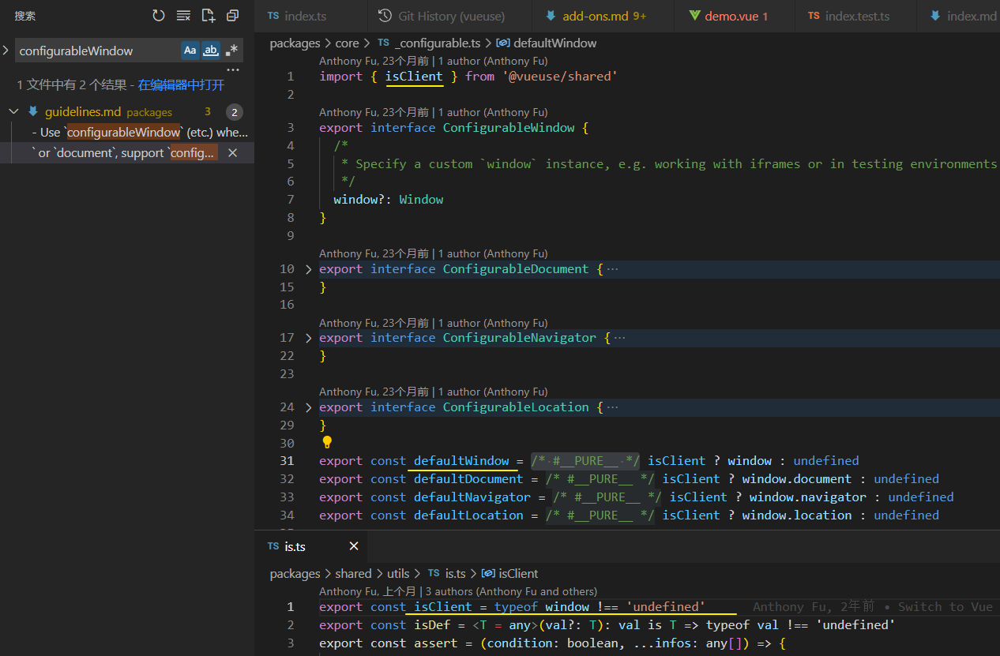
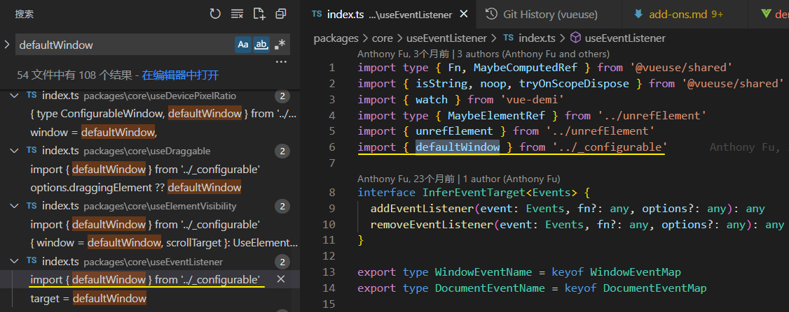
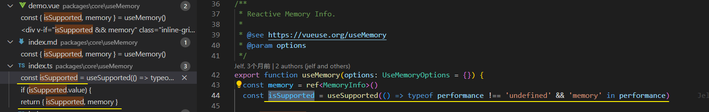

[toc]

# [Best Practice](https://vueuse.org/guide/best-practice.html)

### Destructuring[#](https://vueuse.org/guide/best-practice.html#destructuring)

Most of the functions in VueUse return an **object of refs** that you can use [ES6's object destructure](https://developer.mozilla.org/en-US/docs/Web/JavaScript/Reference/Operators/Destructuring_assignment) syntax on to take what you need.For example:

```ts
import { useMouse } from '@vueuse/core'

// "x" and "y" are refs
const { x, y } = useMouse()
console.log(x.value)

const mouse = useMouse()
console.log(mouse.x.value)
```

If you prefer to use them as **object properties style**, you can **unwrap the refs** by using `reactive()`. For example:

```ts
import { reactive } from 'vue'
import { useMouse } from '@vueuse/core'

const mouse = reactive(useMouse())

// "x" and "y" will be auto unwrapped, no `.value` needed
console.log(mouse.x)
```




### Side-effect Clean Up[#](https://vueuse.org/guide/best-practice.html#side-effect-clean-up)

Similar to Vue's `watch` and `computed` that will be **disposed** when the component is unmounted, VueUse's functions also **clean up the side-effects automatically**. (VueUse的功能也会自动清除副作用。)

For example, [`useEventListener`](https://vueuse.org/core/useEventListener/)will call `removeEventListener` when the component is unmounted so you don't need to worry about it.

​	清楚effect的处理逻辑为:

		- 使用getCurrentScope()
		- onScopeDispose(clear)



All VueUse functions follow this convention (约定).




To **manually dispose** the side-effects, **some** function returns a stop handler just like the `watch` function. 


While not all function return the handler, **a more general solution** is to use the [`effectScope` API](https://vuejs.org/api/reactivity-advanced.html#effectscope) from Vue.

```ts
import { effectScope } from 'vue'

const scope = effectScope()

scope.run(() => {
  // ...

  useEventListener('mousemove', () => {})
  onClickOutside(el, () => {})
  watch(source, () => {})
})

// all composables called inside `scope.run` will be disposed
scope.stop()
```

​	

### Passing Ref as Argument[#](https://vueuse.org/guide/best-practice.html#passing-ref-as-argument)

In Vue, we use the `setup()` function to construct the "**connections**" between the data and logics. 

To make it flexible, most of the VueUse function also accpets **ref version** of the arguments.

Taking [`useTitle`](https://vueuse.org/core/useTitle/)as an example:

###### Normal usage[#](https://vueuse.org/guide/best-practice.html#normal-usage)

Normally [`useTitle`](https://vueuse.org/core/useTitle/)return a ref that reflects to the page's title. 

When you **assign new value** to the ref, it automatically updates the title.

```ts
const isDark = useDark()
const title = useTitle('Set title')

watch(isDark, () => {
  title.value = isDark.value ? '🌙 Good evening!' : '☀️ Good morning!'
})
```

###### Connection usage[#](https://vueuse.org/guide/best-practice.html#connection-usage)

If you think in "**connection**", you can **instead passing a ref** that make it bind to the page's title.

```ts
const isDark = useDark()
const title = computed(() => isDark.value ? '🌙 Good evening!' : '☀️ Good morning!')

useTitle(title)
```

###### Reactive Getter[#](https://vueuse.org/guide/best-practice.html#reactive-getter)

Since VueUse 9.0, we introduce **a new convention** for passing "Reactive Getter" as the argument. 

​	引入一个新约定, 支持传入 "Reactive Getter" 作为参数

Which works great with reactive object and [Reactivity Transform](https://vuejs.org/guide/extras/reactivity-transform.html#reactivity-transform).

```ts
const isDark = useDark()

useTitle(() => isDark.value ? '🌙 Good evening!' : '☀️ Good morning!')
```

a getter function instead



详见 Vue 中 搜索 getter.

getter 简单理解就是使用一个箭头函数return一个值.


# Configurations[#](https://vueuse.org/guide/config.html#configurations)

These show the general configurations for most of the functions in VueUse.


# Components[#](https://vueuse.org/guide/components.html#components)

In v5.0, we introduced a new package, `@vueuse/components` providing renderless component versions of composable functions.


# Contributing [#](https://vueuse.org/contributing.html)

运行: `pnpm i` + `pnpm dev`

### Existing functions[#](https://vueuse.org/contributing.html#existing-functions)

Feel free to enhance the existing functions. 

Please try not to introduce breaking changes.

### New functions[#](https://vueuse.org/contributing.html#new-functions)

There are some notes for adding new functions

- Before you start working, it's better to **open an issue** to **discuss** first.
- The implementation should be placed under `packages/core` as a folder and exposing in `index.ts`
- In the `core` package, try **not to introduce 3rd-party dependencies** as this package is **aimed to be as lightweight** as possible.
- If you'd like to **introduce 3rd-party dependencies**, please contribute to **@vueuse/integrations** or create a new add-on.
- You can find the function template (函数模板) under `packages/core/_template/`, details explained in the [Function Folder](https://vueuse.org/contributing.html#function-folder) section.
- When writing documentation for your function, the `` and `` will be automatically updated at build time, so don't feel the need to update them.

> Please note you don't need to update packages' `index.ts`. They are auto-generated.


### New add-ons[#](https://vueuse.org/contributing.html#new-add-ons)

New add-ons are greatly welcome!

- Create a new folder under `packages/`, name it as your add-on name.
- Add add-on details in `scripts/packages.ts`
- Create `README.md` under that folder.
- Add functions as you would do to the core package.
- Commit and submit as a PR.


## Project Structure[#](https://vueuse.org/contributing.html#project-structure)

### Monorepo[#](https://vueuse.org/contributing.html#monorepo)

We use **monorepo** for multiple packages

```bash
packages
  shared/         - shared utils across packages
  core/           - the core package
  firebase/       - the Firebase add-on
  [...addons]/    - add-ons named
```

### Function Folder[#](https://vueuse.org/contributing.html#function-folder)

A function folder typically contains these 4 files:

> You can find the template under `packages/core/_template/`


```bash
index.ts            # function source code itself
demo.vue            # documentation demo
index.test.ts       # vitest unit testing
index.md            # documentation
```

# Guidelines [准则] [#](https://vueuse.org/guidelines.html)

Here are the guidelines for VueUse functions. 

You could also take them as a reference for authoring your own composable functions or apps.

You can also find some reasons for those design decisions and also some tips for writing composable functions with [Anthony Fu](https://github.com/antfu)'s talk about VueUse:

- [Composable Vue](https://antfu.me/posts/composable-vue-vueday-2021) - at VueDay 2021 (article + Slides)
- 直播录像: [哔哩哔哩](https://www.bilibili.com/video/BV1x54y1V7H6)


## General[#](https://vueuse.org/guidelines.html#general)

- Import all Vue APIs from `"vue-demi"`
- Use `ref` instead `reactive` whenever possible
- Use options object as arguments whenever possible to be more flexible for future extensions.
- Use `shallowRef` instead of `ref` when **wrapping large amounts of data**.
- Use `configurableWindow` (etc.) when using global variables like `window` to be flexible when working with multi-windows, testing mocks, and SSR.
- When involved with Web APIs that are not yet implemented by the browser widely, also outputs `isSupported` flag
- When using `watch` or `watchEffect` internally, also make the `immediate` and `flush` options configurable whenever possible
- Use [`tryOnUnmounted`](https://vueuse.org/shared/tryOnUnmounted/) to clear the side-effects gracefully
- Avoid using console logs
- When the function is asynchronous, return a PromiseLike


- 从Vue -demi导入所有Vue api

- 尽可能使用ref而不是reactive

- 尽可能使用options对象作为参数，以便将来的扩展更加灵活。

- 当包装大量数据时，使用**shallowRef**而不是ref。

- 在使用全局变量时(如window)使用`configurableWindow`(等)，以便在使用多窗口、测试模拟和SSR时更加灵活。

- 当涉及到尚未被浏览器广泛实现的Web api时，还会输出isSupported标志

- 在内部使用watch或watchEffect时，还要尽可能使`immediate`和`flush`选项可配置

- 使用 `tryOnUnmounted`可以优雅地清除副作用

- 避免使用控制台日志

- 当函数是异步的，返回一个**PromiseLike**

(全局变量)





(isSupported)




## ShallowRef[#](https://vueuse.org/guidelines.html#shallowref)

Use `shallowRef` instead of `ref` when wrapping large amounts of data.

```ts
export function useFetch<T>(url: MaybeRef<string>) {
  // use `shallowRef` to prevent deep reactivity
  const data = shallowRef<T | undefined>()
  const error = shallowRef<Error | undefined>()

  fetch(unref(url))
    .then(r => r.json())
    .then(r => data.value = r)
    .catch(e => error.value = e)

  /* ... */
}
```


## Configurable Globals[#](https://vueuse.org/guidelines.html#configurable-globals)

When using global variables like `window` or `document`, support `configurableWindow` or `configurableDocument` in the options interface to make the function flexible when for scenarios(场景) like multi-windows, testing mocks, and SSR.


## Watch Options[#](https://vueuse.org/guidelines.html#watch-options)

When using `watch` or `watchEffect` internally, also make the `immediate` and `flush` options configurable whenever possible. 

For example [`watchDebounced`](https://vueuse.org/shared/watchDebounced/)

```ts
import type { WatchOptions } from 'vue-demi'

// extend the watch options
export interface WatchDebouncedOptions extends WatchOptions {
  debounce?: number
}

export function watchDebounced(
  source: any,
  cb: any,
  options: WatchDebouncedOptions = {},
): WatchStopHandle {
  return watch(
    source,
    () => { /* ... */ },
    options, // pass watch options
  )
}
```


## Controls[#](https://vueuse.org/guidelines.html#controls)

We use the `controls` option allowing users to **use functions with a single return for simple usages**, while being able to have more **controls** and flexibility when needed. 

Read more: [#362](https://github.com/vueuse/vueuse/pull/362).

#### Affect functions

This is breaking changes for some functions. But we have different returning types (object/single ref) for different functions, this proposal also unified them to make the API more consistent.

- useNow
- useTimestamp
- useTimeAgo
- useInterval
- useTimeout

#### When to provide a `controls` option[#](https://vueuse.org/guidelines.html#when-to-provide-a-controls-option)

- The function is more commonly used with **single `ref`** or

  (该函数通常与**单个ref** 或一起使用)

- Examples: [`useTimestamp`](https://vueuse.org/core/useTimestamp/) [`useInterval`](https://vueuse.org/shared/useInterval/)

```
// common usage
const timestamp = useTimestamp()

// more controls for flexibility
const { timestamp, pause, resume } = useTimestamp({ controls: true })
```

#### When **NOT** to provide a `controls` option[#](https://vueuse.org/guidelines.html#when-not-to-provide-a-controls-option)

- The function is more commonly used with **multiple returns**

  该函数通常与**多个返回**一起使用

- Examples: [`useRafFn`](https://vueuse.org/core/useRafFn/) [`useRefHistory`](https://vueuse.org/core/useRefHistory/)

```ts
const { pause, resume } = useRafFn(() => {})
```

函数通常只使用一个值的情况下,  可以提供controls;

函数通常使用多个返回值, 不需要提供controls;


## `isSupported` Flag[#](https://vueuse.org/guidelines.html#issupported-flag)

When involved with Web APIs that are not yet implemented by the browser widely, also outputs `isSupported` flag.

For example [`useShare`](https://vueuse.org/core/useShare/)

```ts
export function useShare(
  shareOptions: MaybeRef<ShareOptions> = {},
  options: ConfigurableNavigator = {},
) {
  const { navigator = defaultNavigator } = options
  const isSupported = useSupported(() => navigator && 'canShare' in navigator)

  const share = async (overrideOptions) => {
    if (isSupported.value) {
      /* ...implementation */
    }
  }

  return {
    isSupported,
    share,
  }
}
```


## Asynchronous Composables[#](https://vueuse.org/guidelines.html#asynchronous-composables)

When a composable is asynchronous, like [`useFetch`](https://vueuse.org/core/useFetch/) it is a good idea to return a PromiseLike object from the composable so the user is able to await the function. 

This is especially useful in the case of Vue's `<Suspense>` api.

- Use a `ref` to determine when the function should resolve e.g. `isFinished`
- **Store the return state in a variable** as it **must be returned twice,** once in the **return** and once in the **promise**.
- The return type should be an **intersection** (交叉类型) between the return type and a PromiseLike, e.g. `UseFetchReturn & PromiseLike`

```ts
export function useFetch<T>(url: MaybeRef<string>): UseFetchReturn<T> & PromiseLike<UseFetchReturn<T>> {
  const data = shallowRef<T | undefined>()
  const error = shallowRef<Error | undefined>()
  const isFinished = ref(false)

  fetch(unref(url))
    .then(r => r.json())
    .then(r => data.value = r)
    .catch(e => error.value = e)
    .finally(() => isFinished.value = true)

  // Store the return state in a variable
  const state: UseFetchReturn<T> = {
    data,	// data in return
    error,
    isFinished,
  }

  
  return {
    ...state,
    // Adding `then` to an object allows it to be awaited.
    // -> 添加一个then方法, 转变为一个 PromiseLike
    then(onFulfilled, onRejected) {
      return new Promise<UseFetchReturn<T>>((resolve, reject) => {
        until(isFinished)
          .toBeTruthy()
          .then(() => resolve(state)) // data in promise
          .then(() => reject(state))
      }).then(onFulfilled, onRejected)
    },
  }
}

```


## Renderless Components[#](https://vueuse.org/guidelines.html#renderless-components)

- Use render functions instead of Vue SFC
- Wrap the props in `reactive` to easily pass them as props to the **slot**
- Prefer to use the functions options as **prop** types instead of recreating them yourself
- Only wrap the slot in an HTML element if the function needs a target to bind to

```ts
import { defineComponent, reactive } from 'vue-demi'
import type { MouseOptions } from '@vueuse/core'
import { useMouse } from '@vueuse/core'

export const UseMouse = defineComponent<MouseOptions>({
  name: 'UseMouse',
  props: ['touch', 'resetOnTouchEnds', 'initialValue'] as unknown as undefined,
  setup(props, { slots }) {
    const data = reactive(useMouse(props)) // 使用reactive包裹props

    return () => {
      if (slots.default)
        return slots.default(data)
    }
  },
})

```


Sometimes a function may have **multiple parameters,** in that case, you maybe need to create **a new interface** to merge all the interfaces into a single interface for the component props.

```ts
import type { TimeAgoOptions } from '@vueuse/core'
import { useTimeAgo } from '@vueuse/core'

// 重新创建 renderless component 的 interface
interface UseTimeAgoComponentOptions extends Omit<TimeAgoOptions<true>, 'controls'> {
  time: MaybeRef<Date | number | string>
}

export const UseTimeAgo = defineComponent<UseTimeAgoComponentOptions>({ /* ... */ })
```