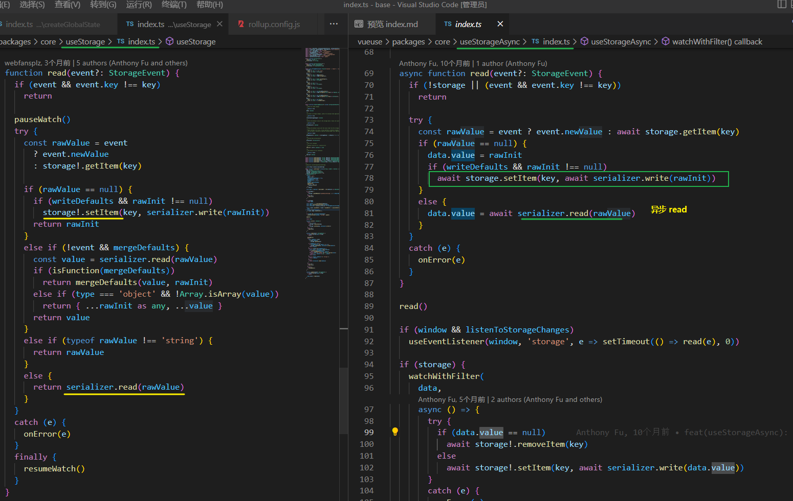

[TOC]

# useStorage

使用 localStorage 持久缓存数据

## Usage

```ts
import { useStorage } from '@vueuse/core'

// bind object
const state = useStorage('my-store', { hello: 'hi', greeting: 'Hello' })

// bind boolean
const flag = useStorage('my-flag', true) // returns Ref<boolean>

// bind number
const count = useStorage('my-count', 0) // returns Ref<number>

// bind string with SessionStorage
const id = useStorage('my-id', 'some-string-id', sessionStorage) // returns Ref<string>

// delete data from storage
state.value = null

```


## Merge Defaults 

优先使用命中的缓存数据, 如果命中则会忽略传入的state


To solve that, you can enable `mergeDefaults` option.

When setting it to true, it will perform a **shallow merge** for objects. 

当设置为 "true "时，它将对对象执行浅层合并。

```ts
localStorage.setItem('my-store', '{"hello": "hello"}')

const state = useStorage('my-store', { hello: 'hi', greeting: 'hello' }, localStorage)

console.log(state.greeting) // undefined, since the value is not presented in storage

```

```ts
localStorage.setItem('my-store', '{"hello": "nihao"}')

const state = useStorage(
  'my-store',
  { hello: 'hi', greeting: 'hello' },
  localStorage,
  { mergeDefaults: true } // <--
)

console.log(state.hello) // 'nihao', from storage
console.log(state.greeting) // 'hello', from merged default value
```

You can pass a function to perform custom merge (e.g. deep merge), for example:

你可以传递一个函数来执行自定义的合并（例如，深度合并），例如

```ts
const state = useStorage(
  'my-store',
  { hello: 'hi', greeting: 'hello' },
  localStorage,
  { mergeDefaults: (storageValue, defaults) => deepMerge(defaults, storageValue) } // <--
)

```


## Custom Serialization

自定义序列化 

源码中**默认**针对不同的数据类型进行序列化

```ts
export const StorageSerializers: Record<'boolean' | 'object' | 'number' | 'any' | 'string' | 'map' | 'set' | 'date', Serializer<any>> = {
  boolean: {
    read: (v: any) => v === 'true',
    write: (v: any) => String(v),
  },
  object: {
    read: (v: any) => JSON.parse(v),
    write: (v: any) => JSON.stringify(v),
  },
  number: {
    read: (v: any) => Number.parseFloat(v),
    write: (v: any) => String(v),
  },
  any: {
    read: (v: any) => v,
    write: (v: any) => String(v),
  },
  string: {
    read: (v: any) => v,
    write: (v: any) => String(v),
  },
  map: {
    read: (v: any) => new Map(JSON.parse(v)),
    write: (v: any) => JSON.stringify(Array.from((v as Map<any, any>).entries())),
  },
  set: {
    read: (v: any) => new Set(JSON.parse(v)),
    write: (v: any) => JSON.stringify(Array.from(v as Set<any>)),
  },
  date: {
    read: (v: any) => new Date(v),
    write: (v: any) => v.toISOString(),
  },
}
```

每次 storage 一个数据都会选择一个合适的 Serializer;

当然也可以自己自定义

Please note when you provide `null` as the default value, [`useStorage`](https://vueuse.org/core/useStorage/)can't assume the data type from it. In this case, you can provide a custom serializer or reuse the built-in ones explicitly.

请注意，当你提供null作为默认值时，useStoragec不能假定它的数据类型。在这种情况下，你可以提供一个自定义的序列化器，或者明确地重新使用内置的序列化器。


# [useStorageAsync](https://vueuse.org/core/useStorageAsync/)

