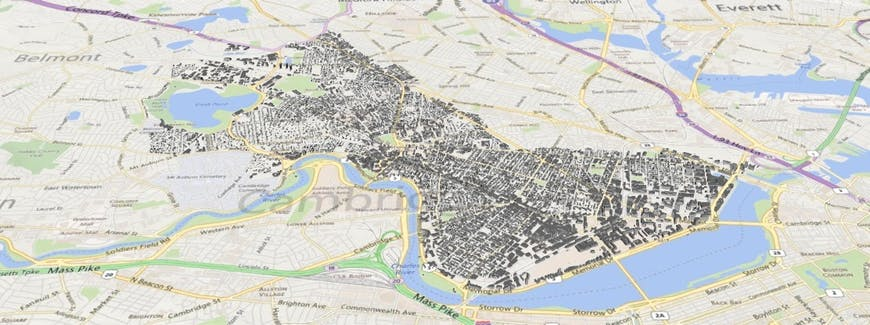
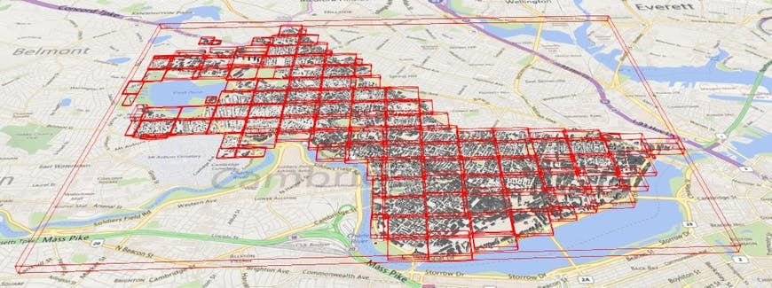
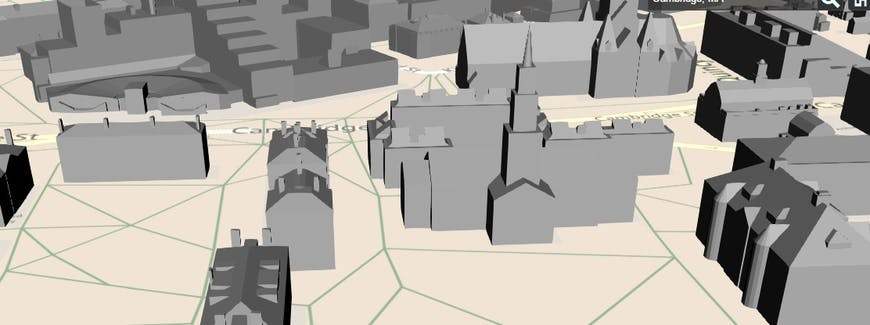
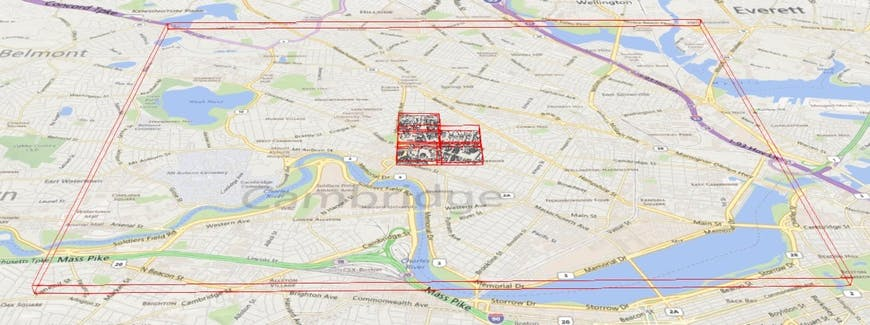
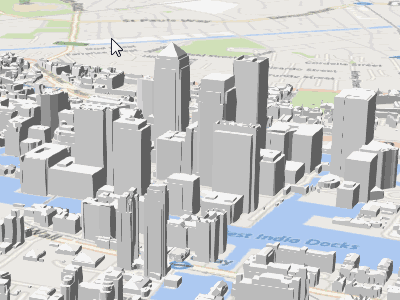
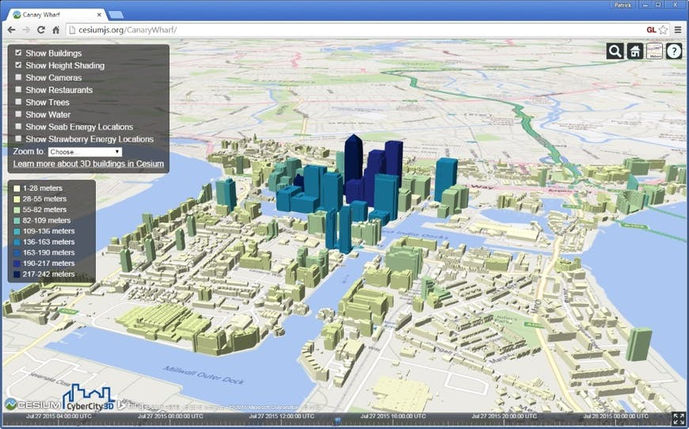
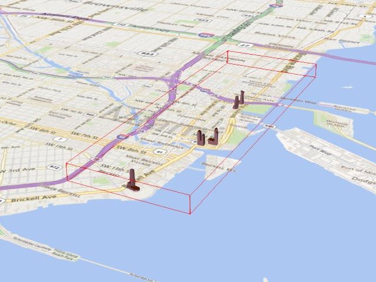
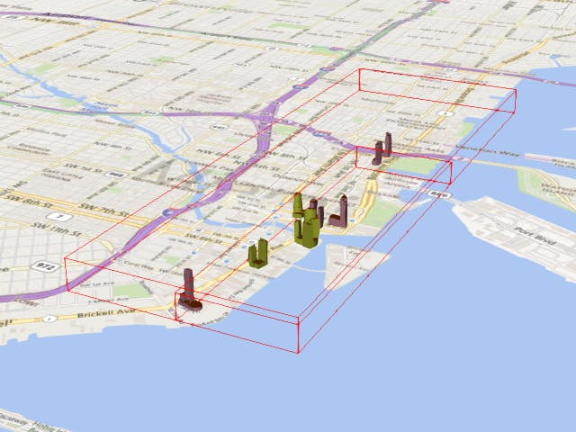
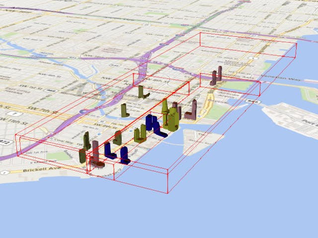

[TOC]

# Introducing 3D Tiles

3D Tiles are an [open specification](https://github.com/CesiumGS/3d-tiles) for streaming massive heterogeneous 3D geospatial datasets. To expand on Cesium’s terrain and imagery streaming, 3D Tiles will be used to stream 3D content, including buildings, trees, point clouds, and vector data.

3D Tiles 是一种 **用于流式传输大量异构 3D 地理空间数据集** 的[开放规范。](https://github.com/CesiumGS/3d-tiles)

为了扩展 Cesium 的地形和图像流式传输，3D Tiles 将用于流式传输 3D 内容，包括 buildings、trees、点云和矢量数据。


Bringing techniques from graphics research, the movie industry, and the game industry to 3D geospatial, 3D Tiles define a spatial data structure and a set of tile formats designed for 3D and optimized for streaming and rendering. Tiles for 3D models use [glTF](https://www.khronos.org/gltf), the WebGL runtime asset format developed by Khronos, which the Cesium team heavily contributes to.

将图形研究、电影行业和游戏行业的技术引入 3D 地理空间，3D Tiles 定义了空间数据结构和一组专为 3D 设计并针对流式传输和渲染进行优化的切片格式。3D 模型的瓷砖使用 [glTF](https://www.khronos.org/gltf)，这是由 Khronos 开发的 WebGL 运行时资产格式，Cesium 团队对此做出了重大贡献。

> gltf 是一种数据格式

Loading 3D Tiles in Cesium will be as simple as this:

```js
var viewer = new Cesium.Viewer('cesiumContainer');
var tileset = viewer.scene.primitives.add(new Cesium.Cesium3DTileset({
    url : '/path/to/3d/tileset'
}));
```

3D Tiles are

- Open
- Optimized for streaming and rendering
- Designed for 3D
- Interactive
- Styleable
- Adaptable
- Flexible
- Heterogeneous
- Precise
- Temporal


### **Open ** 开源

3D Tiles are an [open specification](https://github.com/CesiumGS/3d-tiles) with an open-source implementation in Cesium. We expect to see other 3D engines and conversion tools use 3D Tiles.

In addition, we help move the field forward by publishing related technical articles such as the [bounding volume optimizations](https://cesium.com/blog/2015/06/24/Oriented-Bounding-Boxes/) and [plane masking](https://cesium.com/blog/2015/08/04/Fast-Hierarchical-Culling/) in Cesium.

Development of both the spec and implementation are in-progress, and we encourage open discussion on the [Cesium forum](http://community.cesium.com/). We expect them to stabilize in spring 2016.

3D Tiles 是 在 Cesium 中具有开源实现的[开放规范。](https://github.com/CesiumGS/3d-tiles)我们希望看到其他 3D 引擎和转换工具使用 3D Tiles。

此外，我们通过发布相关技术文章帮助推动该领域向前发展，例如 Cesium 中的 [边界体积优化](https://cesium.com/blog/2015/06/24/Oriented-Bounding-Boxes/) 和 [平面掩蔽](https://cesium.com/blog/2015/08/04/Fast-Hierarchical-Culling/) 。

规范和实施的开发都在进行中，我们鼓励在 [Cesium 论坛](http://community.cesium.com/)上进行公开讨论。我们预计它们将在 2016 年春季稳定下来。


### Optimized for streaming and rendering 针对流式传输和渲染进行了优化

The primary purpose of 3D Tiles is to improve streaming and rendering performance of massive heterogeneous datasets. The foundation of 3D Tiles is a spatial data structure that enables ***Hierarchical Level of Detail* (HLOD)** so **only visible tiles are streamed** - and only those tiles which are most important for a given 3D view. **Tile payloads can be binary and context-aware compressed**, e.g., using [Open3DGC](https://github.com/KhronosGroup/glTF/issues/398) or [oct-encoding](http://jcgt.org/published/0003/02/01/).

3D Tiles are designed by a team that has used **WebGL** since its start, and OpenGL for many years before that. As a result, **like glTF, the pipeline from receiving a 3D Tile to rendering it with WebGL is streamlined to be fast and simple**, and to **minimize client-side processing**. To reduce the number of WebGL draw calls, tiles may be pre-batched or batched on-the-fly.

3D Tiles 的主要目的是提高海量异构数据集的流式传输和渲染性能。3D Tiles 的基础是一种空间数据结构，它支持 ***层次详细级别* (HLOD)**，因此**只有可见的切片被流式传输** - 并且只有那些对给定 3D 视图最重要的切片。**瓦片有效载荷可以是二进制和上下文感知压缩**，例如，使用 [Open3DGC](https://github.com/KhronosGroup/glTF/issues/398) 或 [oct-encoding](http://jcgt.org/published/0003/02/01/)。

3D Tiles 是由一个团队设计的，该团队从一开始就使用 WebGL，并且在此之前使用 OpenGL 多年。因此，**与 glTF 一样，从接收 3D Tile 到使用 WebGL 渲染它的管道被简化为快速和简单**，并**最大限度地减少客户端处理**。为了减少 WebGL 绘制调用的数量，可以预先批处理或即时批处理图块。




3D buildings in Cambridge.



Bounding volumes for tiles in a sparse grid layout. Each tile is one WebGL draw call.

稀疏网格布局中瓦片的边界体积。每个图块都是一个 WebGL 绘制调用。



A zoomed in view looking at Harvard Yard.



A zoomed out debug view shows that only a subset of the Cambridge dataset needed to be rendered in the above Harvard Yard view.

*缩小的调试视图显示，只有剑桥数据集的一个子集需要在上述哈佛庭院视图中呈现。*


### **Designed for 3D**

From the ground up, 3D Tiles are designed for true 3D with a free-roaming camera; they are not limited to cases such as 2.5D perspective.

Instead of relying on 2D constructs such as zoom levels, 3D Tiles are **based on geometric error for Level-Of-Detail (LOD) selection and a tunable pixel error**. **This allows performance/visual-quality tuning and is built for multiple “zoom levels” in the same view**.

**In 3D Tiles, bounding volumes are 3D**, not 2D cartographic extents. In 2D, the tiling scheme is often based on the Web Mercator projection. Web Mercator is not ideal for 3D because the poles project to infinity and also because the NGA [does not recommend Web Mercator](http://earth-info.nga.mil/GandG/wgs84/web_mercator/) for DoD application. In contrast, in 3D Tiles the tiling scheme is adaptable, in all three dimensions, depending on the models in the dataset and their distribution.

Traditional geospatial features, such as polygons and polylines, can be extruded or drawn above the surface. But 3D Tiles go beyond points, polylines, and polygons, to account for full 3D models with meshes, materials, and a node hierarchy.

从头开始，3D Tiles 专为真正的 3D 而设计，带有自由漫游的摄像头；它们不仅限于2.5D透视等情况。

3D Tiles 不依赖于缩放级别等 2D 结构，而是**基于细节级别 (LOD) 选择的几何误差和可调整的像素误差**。**这允许性能/视觉质量调整，并为同一视图中的多个“缩放级别”而构建**。

**在 3D Tiles 中，包围体是 3D**，而不是 2D 制图范围。在 2D 中，切片方案通常基于 Web Mercator projection (墨卡托投影)。Web Mercator 对于 3D 来说并不理想，因为极点投影到无穷远，而且 NGA [不推荐将 Web Mercator](http://earth-info.nga.mil/GandG/wgs84/web_mercator/) 用于 DoD 应用程序。相比之下，在 3D Tiles 中，切片方案在所有三个维度上都是可调整的，具体取决于数据集中的模型及其分布。

传统的地理空间特征，例如多边形和折线，可以在表面上方拉伸或绘制。但是 3D Tiles 超越了点、折线和多边形，它可以解释具有网格、材质和节点层次结构的完整 3D 模型。


### Interactive

3D Tiles support interactive **selection and styling**. Even with WebGL optimizations such as **batching**, 3D Tiles allow for individual model interaction such as **highlighting on mouseover**, or r**emoving a 3D building**. 

Tiles can contain metadata for each model to allow additional interaction, such as querying third-party web services using a building ID.

3D Tiles 支持交互式**选择和样式**。即使使用**批处理**等 WebGL 优化，3D Tiles 也允许单独的模型交互，例如**鼠标悬停时突出显示**或**删除 3D 建筑**。

瓦片可以包含每个模型的元数据以允许额外的交互，例如使用建筑物 ID 查询第三方 Web 服务。



Mouseover highlighting demonstrating 3D Tile interaction.


### **Styleable**

Metadata for individual models, such as building height or year built, can be used for shading at runtime without writing code. Styles can be changed on-the-fly.

单个模型的元数据，例如建筑高度或建造年份，可以在运行时用于着色，而无需编写代码。样式可以即时更改。




### **Adaptable ** (**适应性强**)

**Traditional quadtree subdivision**, used in TMS for example, is sufficient for map tiles and 2D, but **it is suboptimal(次优) for 3D and non-uniform dataset distributions**.

3D Tiles enable adaptive spatial subdivision in 3D, including k-d trees, quadtrees, octrees, grids, and other spatial data structures. Instead of rigid spatial subdivision, conversion tools can adaptively subdivide a dataset, for example, based on the cost of rendering each model and the distribution of models, resulting in a balanced data structure. A runtime engine like Cesium is generic and works with all subdivision techniques.

例如，在 TMS 中使用的**传统四叉树细分**对于地图瓦片和 2D 来说已经足够了，但**对于 3D 和非均匀数据集分布来说就不是最优**的了。

3D Tiles 支持 3D 中的自适应空间细分，包括 k-d 树、四叉树、八叉树、网格和其他空间数据结构。

转换工具可以自适应地细分数据集，而不是严格的空间细分，例如，基于渲染每个模型的成本和模型的分布，从而形成平衡的数据结构。像 Cesium 这样的运行时引擎是通用的，并且适用于所有细分技术。


An adaptive quadtree-like subdivision based on the distribution of buildings in Cambridge.


### **Flexible**

With traditional 2D map tiles, when the user zooms in, the visible map tiles are replaced with new higher-resolution map tiles. This is called ***refinement***. In a sense, a subset of the same content is downloaded again, but at a higher resolution. We call this ***replacement refinement***, and it is a reasonable solution for imagery tiles and even 3D terrain.

However, more flexibility is needed for other 3D datasets such as buildings and point clouds. For example, instead of essentially downloading the same building multiple times as the viewer zooms in, 3D Tiles rather stream just new buildings. We call this ***additive refinement***. Additive refinement has the additional benefit that child tiles can be rendered as they are downloaded, as opposed to replacement refinement, which requires that all of a parent’s children be downloaded first.

3D Tiles allow both replacement and additive refinement.

对于传统的 2D 地图瓦片，当用户放大时，可见地图瓦片会被新的更高分辨率的地图瓦片取代。这称为 ***refinement 细化***。

从某种意义上说，再次下载相同内容的子集，但分辨率更高。我们称之为 ***replacement refinement替换细化***，它是图像瓦片甚至 3D 地形的合理解决方案。

但是，其他 3D 数据集（例如建筑物和点云）需要更大的灵活性。例如，3D Tiles 不是在查看器放大时多次下载同一建筑物，而是只流式传输新建筑物。我们称此 ***additive refinement 附加细化***。

附加细化具有额外的好处，即可以在下载子图块时对其进行渲染，而不是替换细化，后者要求首先下载父级的所有子级。

3D Tiles 允许替换和添加细化。



The root tile for buildings in Miami contain the most "important" buildings.



As the viewer zooms in, child tiles containing the next most important buildings are streamed in using additive refinement. The root tile and its closest child are shown here.



As the viewer zooms in even closer, grandchildren tiles are loaded (blue). Note that child tiles are not loaded in the distance.


### **Heterogeneous** (**异构 ? **)

3D Tiles are heterogeneous because there is no one-size-fits-all for 3D datasets. <u>Batched models</u> (e.g., buildings) need a different representation from instanced models (e.g., trees), which need a different representation from point clouds, and so on.

3D Tiles support heterogeneous datasets by enabling adaptive subdivision, flexible refinement, and an extendable set of tile formats.

The heterogeneous nature of 3D Tiles allows discrete levels of detail combined with HLOD so, for example, a 3D building could be a billboard and label at one LOD, an extruded footprint at a higher LOD, a 3D model at the next LOD, and a textured 3D model at the highest LOD.

3D Tiles 是异构的，因为 3D 数据集没有万能的。<u>Batched models 批处理模型</u>（例如，建筑物）需要与 <u>instanced models 实例化模型</u>（例如，树）不同的表示，后者需要与点云不同的表示，等等。

3D Tiles 通过启用自适应细分、灵活细化和一组可扩展的切片格式来支持异构数据集。

3D Tiles 的异构特性允许将离散级别的细节与 HLOD 相结合，因此，例如，3D 建筑物可以是一个 LOD 的广告牌和标签，一个更高 LOD 的拉伸足迹，一个 3D 模型在下一个 LOD，以及一个最高 LOD 的纹理 3D 模型。


### Precise 精确的

Given Cesium’s roots in rocket science ([literally](http://apps.agi.com/SatelliteViewer/?Status=Operational)), 3D Tiles provide full-precision geometry to avoid [jittering artifacts](http://help.agi.com/AGIComponents/html/BlogPrecisionsPrecisions.htm) without the cost of storing double-precision values.

鉴于 Cesium 植根于火箭科学（[字面意思](http://apps.agi.com/SatelliteViewer/?Status=Operational)），3D Tiles 提供全精度几何结构以避免 [抖动伪影](http://help.agi.com/AGIComponents/html/BlogPrecisionsPrecisions.htm) ，而无需存储双精度值。

### Temporal

Cesium is designed for time-dynamic visualizations, such as of satellites and UAVs. The next step is to extend this to 3D Tiles so users can, for example, see topography or snow cover change over time with massive time-dynamic terrain and point clouds.

Cesium 专为时间动态可视化而设计，例如卫星和无人机。下一步是将其扩展到 3D Tiles，例如，用户可以通过大量时间动态地形和点云查看地形或积雪随时间的变化。