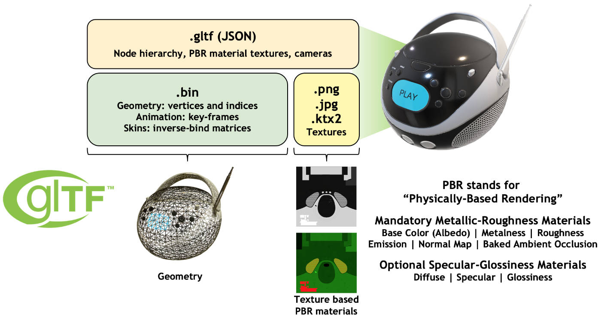
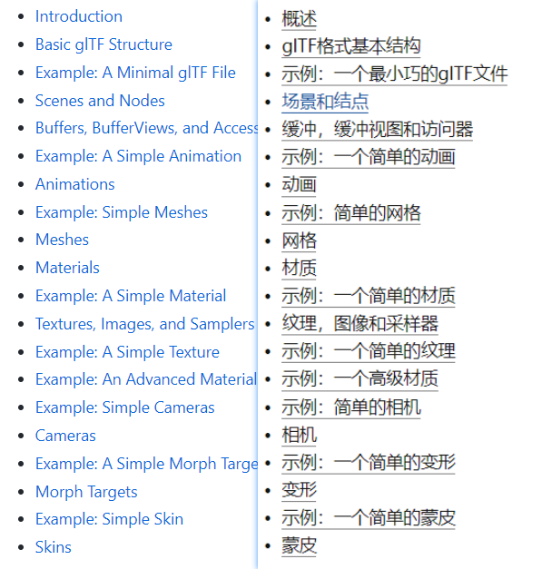

# gltf

**glTF is the "JPEG of 3D"**

**glTF 2.0 Scene Description Structure**

https://www.khronos.org/gltf/

**gltfTutorial**: https://github.com/KhronosGroup/glTF-Tutorials/tree/master/gltfTutorial

glTF格式详解(目录) - 中文翻译: https://zhuanlan.zhihu.com/p/65264050

规范2.0: [glTF/specification/2.0 at main · KhronosGroup/glTF (github.com)](https://github.com/KhronosGroup/glTF/tree/main/specification/2.0)

[glTF™ 2.0 规格 (khronos.org)](https://www.khronos.org/registry/glTF/specs/2.0/glTF-2.0.html)

预览glft [glTF Viewer (donmccurdy.com)](https://gltf-viewer.donmccurdy.com/)

如果有关联的 glb, 需要一起拖进去进行查看