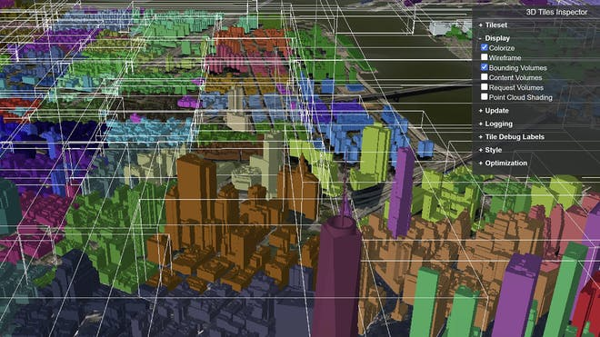
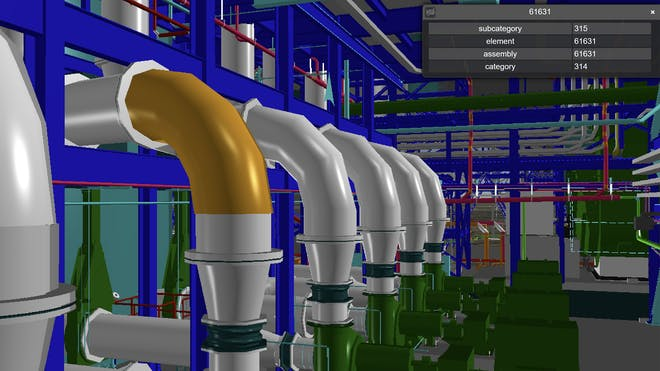
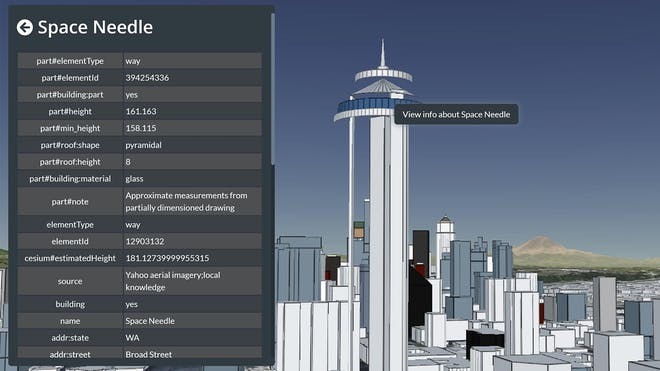
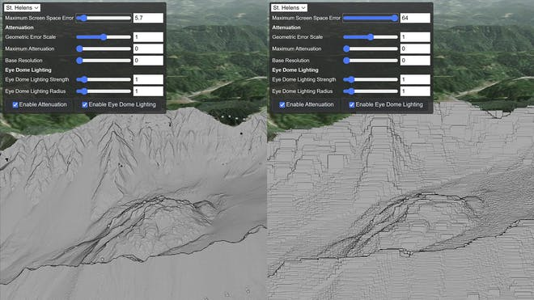
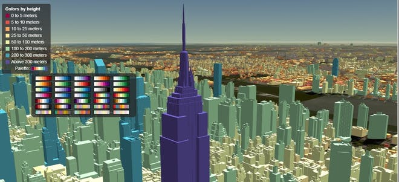
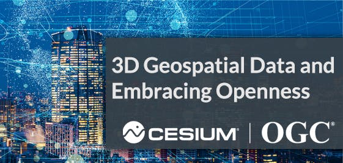

[TOC]

# 3D Tiles Essentials

3D Tiles styling used to color tiles of buildings and to show bounding volumes

### **Tilesets and Tiles**

3D Tiles provides a way to describe **tilesets** and their **tiles**, formatted as JSON.

Along with its **properties**, a tileset contains **a set of tiles arranged in a tree** – **a spatial hierarchy**. 3D Tiles supports a variety of 3D (and 2D) spatial subdivisions to facilitate optimized rendering by visualization software.

A tile:

- Includes or points to the tile’s content.
- May contain child tiles and can **refer to external tilesets**, making it possible to combine smaller tilesets into larger ones.
- Defines **a spatial bounding volume** that encloses its children.

3D Tiles 提供了一种描述 **tileset** 及其 **tiles**的方法，格式为 JSON。

除了它的**属性**，一个瓦片集还包含**一组排列在树中的瓦片**——**一种空间层次结构**。3D Tiles 支持各种 3D（和 2D）空间细分，以促进可视化软件的优化渲染。

瓦片:

- 包括或指向tile的内容。
- 可能包含子图块并且可以**引用外部 tilesets**，从而可以将较小的图块集组合成较大的图块集。
- 定义包含其子项的**空间边界体**。

Individually selectable 3D Tiles of BIM data *可单独选择的 BIM 数据 3D 切片*

### **Tile Content and Formats**

A tile’s content is a binary blob in one of these formats:

- **Instanced 3D Model** or **Batched 3D Model**: 3D model instances or heterogeneous 3D models
- **Point Cloud**: Massive number of points
- **Composite**: Multiple concatenated tiles of the other formats

Instanced and Batched 3D models are built on **binary glTF**, including geometry and texture. The lightweight glTF format is the ideal complement to 3D Tile's flexible spatial hierarchy.

Tile的内容是以下格式之一的**二进制 blob**：

- **实例化 3D 模型** 或 **批量 3D 模型** (i3dm/b3dm)：3D 模型实例或异构 3D 模型
- **点云**：大量的点
- **复合**：其他格式的多个连接图块

实例化和批处理 3D 模型基于 **二进制 glTF 构建**，包括几何和纹理。轻量级 glTF 格式是 3D Tile 灵活的空间层次结构的理想补充。

*The Cesium OSM Buildings model of the Seattle Space Needle with its 3D Tiles properties displayed*

*西雅图太空针塔的 Cesium OSM 建筑模型及其 3D 瓷砖属性显示*

### **Tile Properties**

A tile's content is accompanied by a **Feature Table,** a list of the features in the content (like buildings or points) with position and appearance properties.

The content also has a **Batch Table** to capture additional properties useful for visualization or analysis.

Tile的内容伴随着一个 **特征表，** 一个包含位置和外观属性的内容（如建筑物或点）中的特征列表。

该内容还具有一个 **批处理表** ，用于捕获对可视化或分析有用的其他属性。

*Dynamically set geometric error for these Mount St. Helen's point clouds illustrates the qualitative visual impact of the different values.*

*这些圣海伦山点云的动态设置几何误差说明了不同值的定性视觉影响。*

### **Levels of Detail**

3D Tiles enables tunable **Hierarchical Level of Detail (HLOD)**: only visible tiles are streamed, and only the most important for the view are shown. This is how 3D Tiles produces a smooth, fast user experience for interactions with massive, detailed 3D data.

- Visualization software uses a tile’s **geometric error** property and other screen space metrics – like distance from the tile to the camera – to choose which tiles to stream and render.
- Each tile's **refinement strategy** property determines whether the child should replace the parent or be added to it.

3D Tiles 启用了可调 **的层次细节层次 (HLOD)**：仅流式传输可见的图块，并且仅显示对视图最重要的图块。这就是 3D Tiles 如何为与大量详细 3D 数据的交互提供流畅、快速的用户体验。

- 可视化软件使用瓦片的 **几何误差** 属性和其他屏幕空间指标（例如瓦片到相机的距离）来选择要流式传输和渲染的瓦片。
- 每个 tile 的 **细化策略** 属性决定了子节点是应该替换父节点还是被添加到其中。

*3D Tiles of New York City buildings colored based on their height using the 3D Tiles styling language*

### **Declarative Styling at Runtime 运行时的声明式样式**

3D Tiles defines a **declarative styling language** that can modify the color and visibility of tile features at runtime.

Visualization software can apply styling to features based on user interactions and on the feature properties in the Batch Table.

3D Tiles 定义了一种 **声明式样式语言** ，可以在运行时修改图块特征的颜色和可见性。

可视化软件可以根据用户交互和批处理表中的特征属性将样式应用于特征。

### **An OGC Community Standard**

3D Tiles is recommended by the Open Geospatial Consortium (OGC), a global organization that works to advance free, publicly available geospatial standards that enable new technologies.

Learn more about how Cesium supports and collaborates with OGC.

[**LEARN MORE**](https://www.ogc.org/blog/3228)