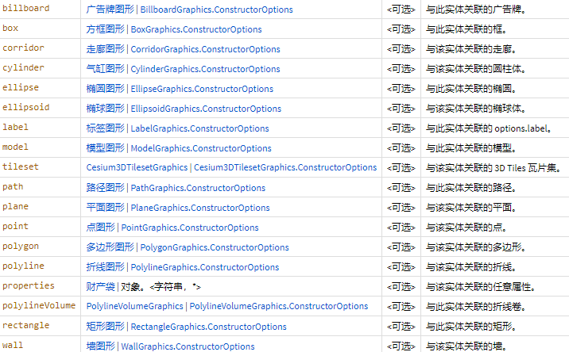

[TOC]

# Entity

Entity instances aggregate multiple forms of visualization into a single high-level object. They can be created manually and added to [`Viewer#entities`](https://cesium.com/learn/cesiumjs/ref-doc/Viewer.html#entities) or be produced by data sources, such as [`CzmlDataSource`](https://cesium.com/learn/cesiumjs/ref-doc/CzmlDataSource.html) and [`GeoJsonDataSource`](https://cesium.com/learn/cesiumjs/ref-doc/GeoJsonDataSource.html).

entity实例将多种形式的可视化聚合到一个高级对象中。 它们可以手动创建并将其添加到viewer#entities或由数据源生成，例如CZMLDataSource和GeojSondataSource。

## constructor

#### new Cesium.Entity(options)

参数options: [Entity.ConstructorOptions](https://cesium.com/learn/cesiumjs/ref-doc/Entity.html#.ConstructorOptions)

| Name             | Type                                                         | Attributes | Description                                                  |
| :--------------- | :----------------------------------------------------------- | :--------- | :----------------------------------------------------------- |
| `id`             | String                                                       | `<optional>` | A unique identifier for this object. If none is provided, a GUID is generated. |
| `name`           | String                                                       | `<optional>` | A human readable name to display to users. It does not have to be unique. |
| `availability`   | [TimeIntervalCollection](https://cesium.com/learn/cesiumjs/ref-doc/TimeIntervalCollection.html) | `<optional>` | The availability, if any, associated with this object.       |
| `show`           | Boolean                                                      | `<optional>` | A boolean value indicating if the entity and its children are displayed. |
| `description`    | [Property](https://cesium.com/learn/cesiumjs/ref-doc/Property.html) \| string | `<optional>` | A string Property specifying an HTML description for this entity. |
| `position`       | [PositionProperty](https://cesium.com/learn/cesiumjs/ref-doc/PositionProperty.html) \| [Cartesian3](https://cesium.com/learn/cesiumjs/ref-doc/Cartesian3.html) | `<optional>` | A Property specifying the entity position.                   |
| `orientation`    | [Property](https://cesium.com/learn/cesiumjs/ref-doc/Property.html) | `<optional>` | A Property specifying the entity orientation.                |
| `viewFrom`       | [Property](https://cesium.com/learn/cesiumjs/ref-doc/Property.html) | `<optional>` | A suggested initial offset for viewing this object.          |
| `parent`         | [Entity](https://cesium.com/learn/cesiumjs/ref-doc/Entity.html) | `<optional>` | A parent entity to associate with this entity.               |
| `billboard`      | [BillboardGraphics](https://cesium.com/learn/cesiumjs/ref-doc/BillboardGraphics.html) \| [BillboardGraphics.ConstructorOptions](https://cesium.com/learn/cesiumjs/ref-doc/BillboardGraphics.html#.ConstructorOptions) | `<optional>` | A billboard to associate with this entity.                   |
| `box`            | [BoxGraphics](https://cesium.com/learn/cesiumjs/ref-doc/BoxGraphics.html) \| [BoxGraphics.ConstructorOptions](https://cesium.com/learn/cesiumjs/ref-doc/BoxGraphics.html#.ConstructorOptions) | `<optional>` | A box to associate with this entity.                         |
| `corridor`       | [CorridorGraphics](https://cesium.com/learn/cesiumjs/ref-doc/CorridorGraphics.html) \| [CorridorGraphics.ConstructorOptions](https://cesium.com/learn/cesiumjs/ref-doc/CorridorGraphics.html#.ConstructorOptions) | `<optional>` | A corridor to associate with this entity.                    |
| `cylinder`       | [CylinderGraphics](https://cesium.com/learn/cesiumjs/ref-doc/CylinderGraphics.html) \| [CylinderGraphics.ConstructorOptions](https://cesium.com/learn/cesiumjs/ref-doc/CylinderGraphics.html#.ConstructorOptions) | `<optional>` | A cylinder to associate with this entity.                    |
| `ellipse`        | [EllipseGraphics](https://cesium.com/learn/cesiumjs/ref-doc/EllipseGraphics.html) \| [EllipseGraphics.ConstructorOptions](https://cesium.com/learn/cesiumjs/ref-doc/EllipseGraphics.html#.ConstructorOptions) | `<optional>` | A ellipse to associate with this entity.                     |
| `ellipsoid`      | [EllipsoidGraphics](https://cesium.com/learn/cesiumjs/ref-doc/EllipsoidGraphics.html) \| [EllipsoidGraphics.ConstructorOptions](https://cesium.com/learn/cesiumjs/ref-doc/EllipsoidGraphics.html#.ConstructorOptions) | `<optional>` | A ellipsoid to associate with this entity.                   |
| `label`          | [LabelGraphics](https://cesium.com/learn/cesiumjs/ref-doc/LabelGraphics.html) \| [LabelGraphics.ConstructorOptions](https://cesium.com/learn/cesiumjs/ref-doc/LabelGraphics.html#.ConstructorOptions) | `<optional>` | A options.label to associate with this entity.               |
| `model`          | [ModelGraphics](https://cesium.com/learn/cesiumjs/ref-doc/ModelGraphics.html) \| [ModelGraphics.ConstructorOptions](https://cesium.com/learn/cesiumjs/ref-doc/ModelGraphics.html#.ConstructorOptions) | `<optional>` | A model to associate with this entity.                       |
| `tileset`        | [Cesium3DTilesetGraphics](https://cesium.com/learn/cesiumjs/ref-doc/Cesium3DTilesetGraphics.html) \| [Cesium3DTilesetGraphics.ConstructorOptions](https://cesium.com/learn/cesiumjs/ref-doc/Cesium3DTilesetGraphics.html#.ConstructorOptions) | `<optional>` | A 3D Tiles tileset to associate with this entity.            |
| `path`           | [PathGraphics](https://cesium.com/learn/cesiumjs/ref-doc/PathGraphics.html) \| [PathGraphics.ConstructorOptions](https://cesium.com/learn/cesiumjs/ref-doc/PathGraphics.html#.ConstructorOptions) | `<optional>` | A path to associate with this entity.                        |
| `plane`          | [PlaneGraphics](https://cesium.com/learn/cesiumjs/ref-doc/PlaneGraphics.html) \| [PlaneGraphics.ConstructorOptions](https://cesium.com/learn/cesiumjs/ref-doc/PlaneGraphics.html#.ConstructorOptions) | `<optional>` | A plane to associate with this entity.                       |
| `point`          | [PointGraphics](https://cesium.com/learn/cesiumjs/ref-doc/PointGraphics.html) \| [PointGraphics.ConstructorOptions](https://cesium.com/learn/cesiumjs/ref-doc/PointGraphics.html#.ConstructorOptions) | `<optional>` | A point to associate with this entity.                       |
| `polygon`        | [PolygonGraphics](https://cesium.com/learn/cesiumjs/ref-doc/PolygonGraphics.html) \| [PolygonGraphics.ConstructorOptions](https://cesium.com/learn/cesiumjs/ref-doc/PolygonGraphics.html#.ConstructorOptions) | `<optional>` | A polygon to associate with this entity.                     |
| `polyline`       | [PolylineGraphics](https://cesium.com/learn/cesiumjs/ref-doc/PolylineGraphics.html) \| [PolylineGraphics.ConstructorOptions](https://cesium.com/learn/cesiumjs/ref-doc/PolylineGraphics.html#.ConstructorOptions) | `<optional>` | A polyline to associate with this entity.                    |
| `properties`     | [PropertyBag](https://cesium.com/learn/cesiumjs/ref-doc/PropertyBag.html) \| Object.<string, *> | `<optional>` | Arbitrary properties to associate with this entity.          |
| `polylineVolume` | [PolylineVolumeGraphics](https://cesium.com/learn/cesiumjs/ref-doc/PolylineVolumeGraphics.html) \| [PolylineVolumeGraphics.ConstructorOptions](https://cesium.com/learn/cesiumjs/ref-doc/PolylineVolumeGraphics.html#.ConstructorOptions) | `<optional>` | A polylineVolume to associate with this entity.              |
| `rectangle`      | [RectangleGraphics](https://cesium.com/learn/cesiumjs/ref-doc/RectangleGraphics.html) \| [RectangleGraphics.ConstructorOptions](https://cesium.com/learn/cesiumjs/ref-doc/RectangleGraphics.html#.ConstructorOptions) | `<optional>` | A rectangle to associate with this entity.                   |
| `wall`           | [WallGraphics](https://cesium.com/learn/cesiumjs/ref-doc/WallGraphics.html) \| [WallGraphics.ConstructorOptions](https://cesium.com/learn/cesiumjs/ref-doc/WallGraphics.html#.ConstructorOptions) | `<optional>` | A wall to associate with this entity.                        |

#### 构造函数:参数对象常用的属性

- id: 此对象的唯一标识符。如果未提供，则会生成 GUID。
- name: 向用户显示的人类可读名称。它不必是唯一的。
- description: 一个字符串属性，指定该实体的 HTML 描述。
- parent: 与此实体关联的父实体。

形态上的属性

- billboard: 与此实体关联的广告牌。
- box: 
- corridor: 
- cylinder:
- ellipse:
- ellipsoid:
- model:
- label: 
- point:
- polyline:
- polylineVolume:
- polygon:
- path:
- rectangle:
- wall:
- tileset: ? 与该实体关联的 3D Tiles 瓦片集。

### 属性

属性与构造函数中的参数对象一一对应

### 方法

#### addProperty(propertyName)

Adds a property to this object. 

Once a property is added, it can be observed with [`Entity#definitionChanged`](https://cesium.com/learn/cesiumjs/ref-doc/Entity.html#definitionChanged) and composited with [`CompositeEntityCollection`](https://cesium.com/learn/cesiumjs/ref-doc/CompositeEntityCollection.html)

| Name           | Type   | Description                      |
| :------------- | :----- | :------------------------------- |
| `propertyName` | String | The name of the property to add. |

##### Throws:

- [DeveloperError](https://cesium.com/learn/cesiumjs/ref-doc/DeveloperError.html) : "propertyName" is a reserved property name.
- [DeveloperError](https://cesium.com/learn/cesiumjs/ref-doc/DeveloperError.html) : "propertyName" is already a registered property.

不能覆盖原有的/保留的属性名

只是属性名? 没有属性值?

#### removeProperty(propertyName)

Removed a property previously added with addProperty.

| Name           | Type   | Description                         |
| :------------- | :----- | :---------------------------------- |
| `propertyName` | String | The name of the property to remove. |

##### Throws:

- [DeveloperError](https://cesium.com/learn/cesiumjs/ref-doc/DeveloperError.html) : "propertyName" is a reserved property name.
- [DeveloperError](https://cesium.com/learn/cesiumjs/ref-doc/DeveloperError.html) : "propertyName" is not a registered property.

#### merge(source)[DataSources/Entity.js 577](https://github.com/CesiumGS/cesium/blob/1.91/Source/DataSources/Entity.js#L577)

Assigns each unassigned property on this object to the value of the same property on the provided source object.

| Name     | Type                                                         | Description                               |
| :------- | :----------------------------------------------------------- | :---------------------------------------- |
| `source` | [Entity](https://cesium.com/learn/cesiumjs/ref-doc/Entity.html) | The object to be merged into this object. |
