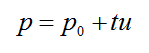
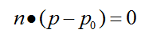
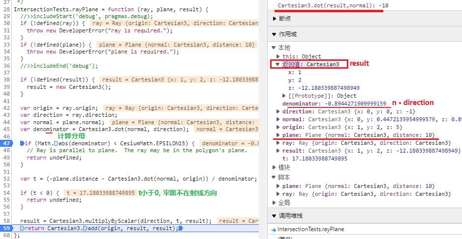

[TOC]

# IntersectionTests

Functions for computing the intersection between geometries such as rays, planes, triangles, and ellipsoids.


#### static Cesium.IntersectionTests.rayPlane(ray, plane, result) → [Cartesian3](https://cesium.com/learn/cesiumjs/ref-doc/Cartesian3.html)[Core/IntersectionTests.js 28](https://github.com/CesiumGS/cesium/blob/1.92/Source/Core/IntersectionTests.js#L28)

Computes the intersection of a ray and a plane.

| Name     | Type                                                         | Description                                        |
| :------- | :----------------------------------------------------------- | :------------------------------------------------- |
| `ray`    | [Ray](https://cesium.com/learn/cesiumjs/ref-doc/Ray.html)    | The ray.                                           |
| `plane`  | [Plane](https://cesium.com/learn/cesiumjs/ref-doc/Plane.html) | The plane.                                         |
| `result` | [Cartesian3](https://cesium.com/learn/cesiumjs/ref-doc/Cartesian3.html) | optionalThe object onto which to store the result. |

源码理解:

```js
IntersectionTests.rayPlane = function (ray, plane, result) {
  if (!defined(result)) result = new Cartesian3();
  const {origin, direction}=ray;
  const {normal}=plane;
  var denominator = Cartesian3.dot(normal, direction);

  // #1. t = 0, 射线的方向与平面的法向量垂直, 平行无交点
  if (Math.abs(denominator) < CesiumMath.EPSILON15) {
    // Ray is parallel to plane.  The ray may be in the polygon's plane.
    return undefined;
  }

  var t = (-plane.distance - Cartesian3.dot(normal, origin)) / denominator;

  if (t < 0) {
    return undefined;
  }

  result = Cartesian3.multiplyByScalar(direction, t, result);
  return Cartesian3.add(origin, result, result);
};
```

算法解析:  [射线与平面的相交检测(Ray-Plane intersection test) - 翰墨小生 - 博客园 (cnblogs.com)](https://www.cnblogs.com/graphics/archive/2009/10/17/1585281.html)

- 射线参数方程 

  其中p0是射线的**起点**， u是射线的**方向**向量，t >= 0，根据t的取值不同，可得射线上不同的点，所有这些点便构成了整个射线

  

- 平面参数方程 

  其中n是平面的**法向量**，p0是已知的**平面内一点**

  因n与平面垂直，所以n与平面内任意直线垂直， 而(p-p0)则是平面内的一个向量，所以n与 (p-p0)垂直，而互相垂直的向量其点积为0，见下图

  

  **平面可以由法向量和平面内的一点来确定，因为过一点与已知直线，有且只有一个平面垂直**

  

- Cesium中的平面表示为: 

   `ax + by + cz + d = 0` 

  where (a, b, c) is the plane's `normal`, 

  d is the signed `distance` to the plane, and (x, y, z) is any point on the plane.

  ```js
  p·n + d = 0 
  ```

  求解
  $$
  p={p}_{0}+tu
  $$

  $$
  p·n+d=0
  $$

  求t, 得出t代入公式得交点

  
  $$
  ({p}_{0}+tu)·n+d=0
  $$

$$
{p}_{0}·n+tu·n=-d
$$

$$
t=\frac {(-d-{p}_{0}·n)} {u·n}
$$

​	得出交点p后进行一次验算, 使用平面公式计算正确


