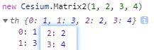
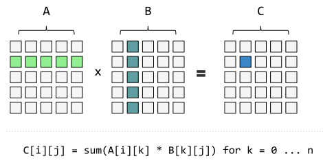
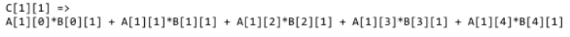
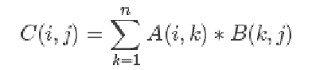
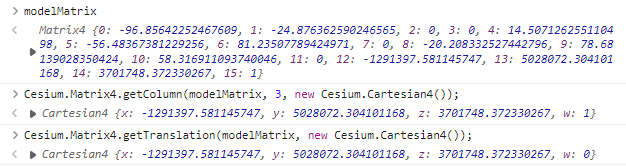
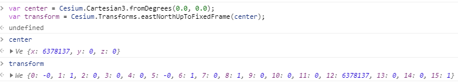
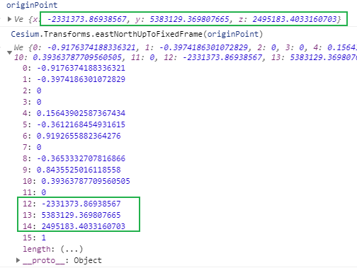
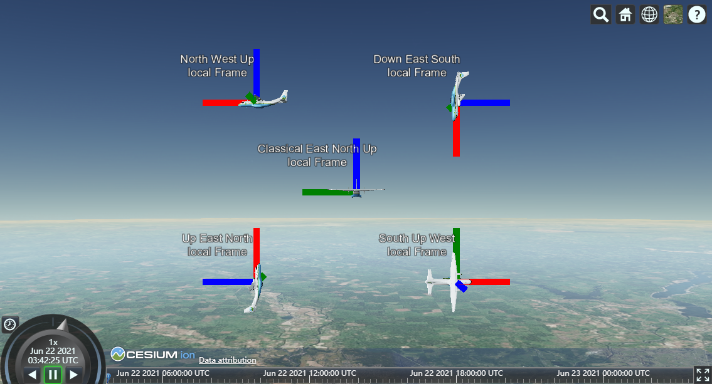

[TOC]

# Matrix

阶级越高派生出的方法越多.

尽量只在最低的阶级上来理解API


## [Matrix2](https://cesium.com/learn/cesiumjs/ref-doc/Matrix2.html)

#### new Cesium.Matrix2(column0Row0, column1Row0, column0Row1, column1Row1)[Core/Matrix2.js 25](https://github.com/CesiumGS/cesium/blob/1.82/Source/Core/Matrix2.js#L25)

A 2x2 matrix, indexable as a column-major order array. Constructor parameters are in row-major order for code readability.

2x2矩阵，可作为列主序数组进行索引。为了代码的可读性，**构造函数参数按行优先顺序排列**。

| Name          | Type   | Default | Description                            |
| :------------ | :----- | :------ | :------------------------------------- |
| `column0Row0` | Number | `0.0`   | optionalThe value for column 0, row 0. |
| `column1Row0` | Number | `0.0`   | optionalThe value for column 1, row 0. |
| `column0Row1` | Number | `0.0`   | optionalThe value for column 0, row 1. |
| `column1Row1` | Number | `0.0`   | optionalThe value for column 1, row 1. |




#### constant Cesium.Matrix2.IDENTITY : [Matrix2](https://cesium.com/learn/cesiumjs/ref-doc/Matrix2.html)[Core/Matrix2.js 751](https://github.com/CesiumGS/cesium/blob/1.82/Source/Core/Matrix2.js#L751)

An immutable Matrix2 instance initialized to the identity matrix.

单位矩阵单位矩阵一般用字母I，或E表示。非数学系用E，数学系用I

**除了对角线为1，其他位置为0的矩阵**。类似乘法中的1.

#### Cesium.Matrix2.multiply(left, right, result) → [Matrix2](https://cesium.com/learn/cesiumjs/ref-doc/Matrix2.html)[Core/Matrix2.js 486](https://github.com/CesiumGS/cesium/blob/1.82/Source/Core/Matrix2.js#L486)

Computes the product of two matrices.

| Name     | Type                                                         | Description                                |
| :------- | :----------------------------------------------------------- | :----------------------------------------- |
| `left`   | [Matrix2](https://cesium.com/learn/cesiumjs/ref-doc/Matrix2.html) | The first matrix.                          |
| `right`  | [Matrix2](https://cesium.com/learn/cesiumjs/ref-doc/Matrix2.html) | The second matrix.                         |
| `result` | [Matrix2](https://cesium.com/learn/cesiumjs/ref-doc/Matrix2.html) | The object onto which to store the result. |

##### 源码

```js
Matrix2.multiply = function (left, right, result) {
  //>>includeStart('debug', pragmas.debug);
  Check.typeOf.object("left", left);
  Check.typeOf.object("right", right);
  Check.typeOf.object("result", result);
  //>>includeEnd('debug');

  const column0Row0 = left[0] * right[0] + left[2] * right[1];
  const column1Row0 = left[0] * right[2] + left[2] * right[3];
  const column0Row1 = left[1] * right[0] + left[3] * right[1];
  const column1Row1 = left[1] * right[2] + left[3] * right[3];

  result[0] = column0Row0;
  result[1] = column0Row1;
  result[2] = column1Row0;
  result[3] = column1Row1;
  return result;
};
```


####  矩阵乘法 [b站视频](https://www.bilibili.com/video/av6731067/?p=5) [矩阵乘法的本质是什么](https://www.zhihu.com/question/21351965)






**矩阵乘法中第一个矩阵的列要等于第二个矩阵的行**

**一个m∗n的的A矩阵，和一个n∗p的B矩阵相乘，将得到一个m∗p的矩阵C** 



矩阵乘法的运算定律:

1. 不满足交换律
2. 满足结合律  (AB)C = A(BC)
3. 满足分配率 (A+B)C = AB + BC 


#### static Cesium.Matrix2.add(left, right, result) → [Matrix2](https://cesium.com/learn/cesiumjs/ref-doc/Matrix2.html)[Core/Matrix2.js 700](https://github.com/CesiumGS/cesium/blob/1.95/Source/Core/Matrix2.js#L700)

Computes the sum of two matrices.

| Name     | Type                                                         | Description                                |
| :------- | :----------------------------------------------------------- | :----------------------------------------- |
| `left`   | [Matrix2](https://cesium.com/learn/cesiumjs/ref-doc/Matrix2.html) | The first matrix.                          |
| `right`  | [Matrix2](https://cesium.com/learn/cesiumjs/ref-doc/Matrix2.html) | The second matrix.                         |
| `result` | [Matrix2](https://cesium.com/learn/cesiumjs/ref-doc/Matrix2.html) | The object onto which to store the result. |

##### Returns:

The modified result parameter.

##### 源码

```js
Matrix2.add = function (left, right, result) {
  //>>includeStart('debug', pragmas.debug);
  Check.typeOf.object("left", left);
  Check.typeOf.object("right", right);
  Check.typeOf.object("result", result);
  //>>includeEnd('debug');

  result[0] = left[0] + right[0];
  result[1] = left[1] + right[1];
  result[2] = left[2] + right[2];
  result[3] = left[3] + right[3];
  return result;
};
```


## [Matrix3](https://cesium.com/learn/cesiumjs/ref-doc/Matrix3.html)

#### Cesium.Matrix3.inverse(matrix, result) → [Matrix3](https://cesium.com/learn/cesiumjs/ref-doc/Matrix3.html)[Core/Matrix3.js 1328](https://github.com/CesiumGS/cesium/blob/1.82/Source/Core/Matrix3.js#L1328)

Computes the inverse of the provided matrix.

| Name     | Type                                                         | Description                                |
| :------- | :----------------------------------------------------------- | :----------------------------------------- |
| `matrix` | [Matrix3](https://cesium.com/learn/cesiumjs/ref-doc/Matrix3.html) | The matrix to invert.                      |
| `result` | [Matrix3](https://cesium.com/learn/cesiumjs/ref-doc/Matrix3.html) | The object onto which to store the result. |


## [Matrix4](https://cesium.com/learn/cesiumjs/ref-doc/Matrix4.html)

#### Cesium.Matrix4.getMatrix3(matrix, result) → [Matrix3](https://cesium.com/learn/cesiumjs/ref-doc/Matrix3.html)[Core/Matrix4.js 2352](https://github.com/CesiumGS/cesium/blob/1.82/Source/Core/Matrix4.js#L2352)

Gets the upper left 3x3 rotation matrix of the provided matrix, assuming the matrix is an affine transformation matrix.

| Name     | Type                                                         | Description                                |
| :------- | :----------------------------------------------------------- | :----------------------------------------- |
| `matrix` | [Matrix4](https://cesium.com/learn/cesiumjs/ref-doc/Matrix4.html) | The matrix to use.                         |
| `result` | [Matrix3](https://cesium.com/learn/cesiumjs/ref-doc/Matrix3.html) | The object onto which to store the result. |

Returns:

The modified result parameter.

**Example:**

```javascript
// returns a Matrix3 instance from a Matrix4 instance

// m = [10.0, 14.0, 18.0, 22.0]
//     [11.0, 15.0, 19.0, 23.0]
//     [12.0, 16.0, 20.0, 24.0]
//     [13.0, 17.0, 21.0, 25.0]

var b = new Cesium.Matrix3();
Cesium.Matrix4.getMatrix3(m,b);

// b = [10.0, 14.0, 18.0]
//     [11.0, 15.0, 19.0]
//     [12.0, 16.0, 20.0]
```


#### static Cesium.Matrix4.getRotation(matrix, result) → [Matrix4](https://cesium.com/learn/cesiumjs/ref-doc/Matrix4.html)[Core/Matrix4.js 1684](https://github.com/CesiumGS/cesium/blob/1.93/Source/Core/Matrix4.js#L1684)

Extracts the rotation matrix assuming the matrix is an affine transformation.

| Name     | Type                                                         | Description                                |
| :------- | :----------------------------------------------------------- | :----------------------------------------- |
| `matrix` | [Matrix4](https://cesium.com/learn/cesiumjs/ref-doc/Matrix4.html) | The matrix.                                |
| `result` | [Matrix4](https://cesium.com/learn/cesiumjs/ref-doc/Matrix4.html) | The object onto which to store the result. |

**Returns**:

The modified result parameter.


#### static Cesium.Matrix4.getScale(matrix, result) → [Cartesian3](https://cesium.com/learn/cesiumjs/ref-doc/Cartesian3.html)[Core/Matrix4.js 1596](https://github.com/CesiumGS/cesium/blob/1.93/Source/Core/Matrix4.js#L1596)

Extracts the non-uniform **scale** assuming the matrix is an affine transformation.

| Name     | Type                                                         | Description                                |
| :------- | :----------------------------------------------------------- | :----------------------------------------- |
| `matrix` | [Matrix4](https://cesium.com/learn/cesiumjs/ref-doc/Matrix4.html) | The matrix.                                |
| `result` | [Cartesian3](https://cesium.com/learn/cesiumjs/ref-doc/Cartesian3.html) | The object onto which to store the result. |

Returns:

The modified result parameter


#### static Cesium.Matrix4.getTranslation(matrix, result) → [Cartesian3](https://cesium.com/learn/cesiumjs/ref-doc/Cartesian3.html)[Core/Matrix4.js 2611](https://github.com/CesiumGS/cesium/blob/1.93/Source/Core/Matrix4.js#L2611)

Matrix4 中才有获取平移的方法, Matrix2/Matrix3中没有, scale&rotation为通用

Gets the translation portion of the provided matrix, assuming the matrix is an affine transformation matrix.

| Name     | Type                                                         | Description                                |
| :------- | :----------------------------------------------------------- | :----------------------------------------- |
| `matrix` | [Matrix4](https://cesium.com/learn/cesiumjs/ref-doc/Matrix4.html) | The matrix to use.                         |
| `result` | [Cartesian3](https://cesium.com/learn/cesiumjs/ref-doc/Cartesian3.html) | The object onto which to store the result. |

Returns:

The modified result parameter.

~~ 等同于getColumn(3)

Cesium.Matrix4.getColumn(modelMatrix, 3, new Cesium.Cartesian4());




#### static Cesium.Matrix4.getColumn(matrix, index, result) → [Cartesian4](https://cesium.com/learn/cesiumjs/ref-doc/Cartesian4.html)[Core/Matrix4.js 1272](https://github.com/CesiumGS/cesium/blob/1.93/Source/Core/Matrix4.js#L1272)

Retrieves a copy of the matrix column at the provided index as a Cartesian4 instance.

| Name     | Type                                                         | Description                                     |
| :------- | :----------------------------------------------------------- | :---------------------------------------------- |
| `matrix` | [Matrix4](https://cesium.com/learn/cesiumjs/ref-doc/Matrix4.html) | The matrix to use.                              |
| `index`  | Number                                                       | The zero-based index of the column to retrieve. |
| `result` | [Cartesian4](https://cesium.com/learn/cesiumjs/ref-doc/Cartesian4.html) | The object onto which to store the result.      |

##### Returns:

The modified result parameter.

##### Throws:

- [DeveloperError](https://cesium.com/learn/cesiumjs/ref-doc/DeveloperError.html) : index must be 0, 1, 2, or 3.

##### Examples:

```javascript
//returns a Cartesian4 instance with values from the specified column
// m = [10.0, 11.0, 12.0, 13.0]
//     [14.0, 15.0, 16.0, 17.0]
//     [18.0, 19.0, 20.0, 21.0]
//     [22.0, 23.0, 24.0, 25.0]

//Example 1: Creates an instance of Cartesian
const a = Cesium.Matrix4.getColumn(m, 2, new Cesium.Cartesian4());
//Example 2: Sets values for Cartesian instance
const a = new Cesium.Cartesian4();
Cesium.Matrix4.getColumn(m, 2, a);

// a.x = 12.0; a.y = 16.0; a.z = 20.0; a.w = 24.0;
```


#### static Cesium.Matrix4.getRow(matrix, index, result) → [Cartesian4](https://cesium.com/learn/cesiumjs/ref-doc/Cartesian4.html)[Core/Matrix4.js 1368](https://github.com/CesiumGS/cesium/blob/1.93/Source/Core/Matrix4.js#L1368)

Retrieves a copy of the matrix row at the provided index as a Cartesian4 instance.

| Name     | Type                                                         | Description                                  |
| :------- | :----------------------------------------------------------- | :------------------------------------------- |
| `matrix` | [Matrix4](https://cesium.com/learn/cesiumjs/ref-doc/Matrix4.html) | The matrix to use.                           |
| `index`  | Number                                                       | The zero-based index of the row to retrieve. |
| `result` | [Cartesian4](https://cesium.com/learn/cesiumjs/ref-doc/Cartesian4.html) | The object onto which to store the result.   |

##### Returns:

The modified result parameter.

##### Throws:

- [DeveloperError](https://cesium.com/learn/cesiumjs/ref-doc/DeveloperError.html) : index must be 0, 1, 2, or 3.

##### Examples:

```javascript
//returns a Cartesian4 instance with values from the specified column
// m = [10.0, 11.0, 12.0, 13.0]
//     [14.0, 15.0, 16.0, 17.0]
//     [18.0, 19.0, 20.0, 21.0]
//     [22.0, 23.0, 24.0, 25.0]

//Example 1: Returns an instance of Cartesian
const a = Cesium.Matrix4.getRow(m, 2, new Cesium.Cartesian4());
//Example 2: Sets values for a Cartesian instance
const a = new Cesium.Cartesian4();
Cesium.Matrix4.getRow(m, 2, a);

// a.x = 18.0; a.y = 19.0; a.z = 20.0; a.w = 21.0;
```


## [Transforms](https://cesium.com/learn/cesiumjs/ref-doc/Transforms.html)

#### Cesium.Transforms.eastNorthUpToFixedFrame(origin, ellipsoid, result)

**东北天坐标**

Computes a 4x4 transformation matrix from a reference frame with an east-north-up axes centered at the provided origin to the provided ellipsoid's fixed reference frame. The local axes are defined as:

- The `x` axis points in the local east direction.
- The `y` axis points in the local north direction.
- The `z` axis points in the direction of the ellipsoid surface normal which passes through the position.

计算从具有**以提供的原点为中心的东北上轴**的参考坐标系到所提供的椭球体的固定参考系的4x4变换矩阵。局部轴定义为：

- X轴指向当前点的东方向。
- Y轴指向当前点的北方向。
- Z轴指向通过该点的椭球面法线的方向。

传入一个中心点，然后获取到中心点的正东正北，和地表法线的方向

| Name        | Type                                                         | Default           | Description                                                  |
| :---------- | :----------------------------------------------------------- | :---------------- | :----------------------------------------------------------- |
| `origin`    | [Cartesian3](https://cesium.com/learn/cesiumjs/ref-doc/Cartesian3.html) |                   | The center point of the local reference frame.               |
| `ellipsoid` | [Ellipsoid](https://cesium.com/learn/cesiumjs/ref-doc/Ellipsoid.html) | `Ellipsoid.WGS84` | optionalThe ellipsoid whose fixed frame is used in the transformation. |
| `result`    | [Matrix4](https://cesium.com/learn/cesiumjs/ref-doc/Matrix4.html) |                   | optionalThe object onto which to store the result.           |

Returns:

The modified result parameter or a new Matrix4 instance if none was provided.

修改的结果参数或新的Matrix4实例(如果未提供任何实例)。





```js
// 假定提供的矩阵是仿射变换矩阵，则获取该矩阵的左上角3x3旋转矩阵。
const originPoint = {
    "x": -2331373.86938567,
    "y": 5383129.369807665,
    "z": 2495183.4033160703
}
const localSystem = Cesium.Matrix4.getMatrix3(
    Cesium.Transforms.eastNorthUpToFixedFrame(originPoint),
    new Cesium.Matrix3()
  );

  const xAxis = Cesium.Matrix3.getColumn(localSystem, 0, new Cesium.Cartesian3());
  const yAxis = Cesium.Matrix3.getColumn(localSystem, 1, new Cesium.Cartesian3());
  const zAxis = Cesium.Matrix3.getColumn(localSystem, 2, new Cesium.Cartesian3());
// x,y,z 为对应轴上的单位向量
```

 [demo](https://sandcastle.cesium.com/index.html?src=LocalToFixedFrame.html)

#### Transforms.northWestUpToFixedFrame

#### Transforms.northEastDownToFixedFrame

#### Transforms.northUpEastToFixedFrame

三个字母分别为X, Y, Z的指向


