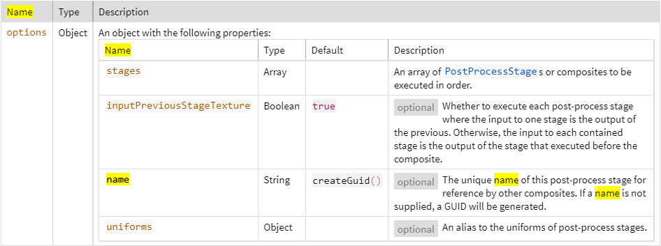

# PostProcessStageComposite

#### new Cesium.PostProcessStageComposite(options) ~ [Scene/PostProcessStageComposite.js 76](https://github.com/CesiumGS/cesium/blob/1.94/Source/Scene/PostProcessStageComposite.js#L76)

A collection of [`PostProcessStage`](https://cesium.com/learn/cesiumjs/ref-doc/PostProcessStage.html)s or other post-process composite **stages** that execute **together** logically.

All stages are executed in the order of the array. The input texture changes based on the value of `inputPreviousStageTexture`. If `inputPreviousStageTexture` is `true`, the input to each stage is the output texture rendered to by the scene or of the stage that executed before it. If `inputPreviousStageTexture` is `false`, the input texture is the same for each stage in the composite. The input texture is the texture rendered to by the scene or the output texture of the previous stage.



| Name      | Type   | Description                                                  |
| :-------- | :----- | :----------------------------------------------------------- |
| `options` | Object | An object with the following properties:<br>Name ---- Type ---- Default ---- Description<br>**`stages`** -- Array                     -- An array of [`PostProcessStage`](https://cesium.com/learn/cesiumjs/ref-doc/PostProcessStage.html)s or composites to be executed in order.<br>`inputPreviousStageTexture` -- Boolean -- `true` [optional] Whether to execute each post-process stage where the input to one stage is the output of the previous. Otherwise, the input to each contained stage is the output of the stage that executed before the composite.<br>`name` -- String -- `createGuid()`  -- [optional] The unique name of this post-process stage for reference by other composites. If a name is not supplied, a GUID will be generated.<br>`uniforms` -- Object             -- [optional] An alias to the uniforms of post-process stages. |

##### Throws:

- [DeveloperError](https://cesium.com/learn/cesiumjs/ref-doc/DeveloperError.html) : options.stages.length must be greater than 0.0.

##### Examples:

```javascript
// Example 1: separable blur filter
// The input to blurXDirection is the texture rendered to by the scene or the output of the previous stage.
// The input to blurYDirection is the texture rendered to by blurXDirection.
scene.postProcessStages.add(new Cesium.PostProcessStageComposite({
    stages : [blurXDirection, blurYDirection]
}));
// Example 2: referencing the output of another post-process stage
scene.postProcessStages.add(new Cesium.PostProcessStageComposite({
    inputPreviousStageTexture : false,
    stages : [
        // The same as Example 1.
        new Cesium.PostProcessStageComposite({
            inputPreviousStageTexture : true
            stages : [blurXDirection, blurYDirection],
            name : 'blur'
        }),
        // The input texture for this stage is the same input texture to blurXDirection since inputPreviousStageTexture is false
        new Cesium.PostProcessStage({
            fragmentShader : compositeShader,
            uniforms : {
                blurTexture : 'blur' // The output of the composite with name 'blur' (the texture that blurYDirection rendered to).
            }
        })
    ]
});
// Example 3: create a uniform alias
const uniforms = {};
Cesium.defineProperties(uniforms, {
    filterSize : {
        get : function() {
            return blurXDirection.uniforms.filterSize;
        },
        set : function(value) {
            blurXDirection.uniforms.filterSize = blurYDirection.uniforms.filterSize = value;
        }
    }
});
scene.postProcessStages.add(new Cesium.PostProcessStageComposite({
    stages : [blurXDirection, blurYDirection],
    uniforms : uniforms
}));
```
