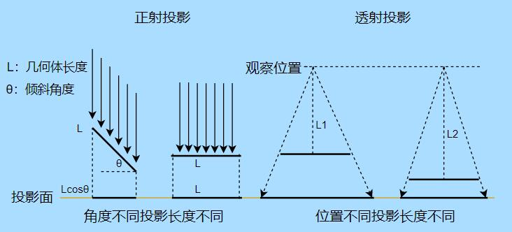
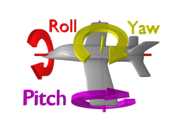

[TOC]

# Camera

## new Cesium.Camera(scene)

The camera is defined by a position, orientation, and view frustum (位置，方向和视锥体)

The orientation forms an orthonormal (正交) basis with a view, up and right = view x up unit vectors.

The viewing frustum is defined by 6 planes. Each plane is represented by a [`Cartesian4`](https://cesium.com/learn/cesiumjs/ref-doc/Cartesian4.html) object, where the x, y, and z components define the unit vector normal to the plane, and the **w** component is the distance of the plane from the origin/camera position.

视锥体由6个面构成, 每个平面由一个Cartesian4对象定义. (x,y,z 定义平面的法向量, w分量定义平面到原点/camera的距离)

##### Example:

```javascript
// Create a camera looking down the negative z-axis, positioned at the origin,
// with a field of view of 60 degrees, and 1:1 aspect ratio.
const camera = new Cesium.Camera(scene);
camera.position = new Cesium.Cartesian3();
camera.direction = Cesium.Cartesian3.negate(Cesium.Cartesian3.UNIT_Z, new Cesium.Cartesian3());
camera.up = Cesium.Cartesian3.clone(Cesium.Cartesian3.UNIT_Y);
camera.frustum.fov = Cesium.Math.PI_OVER_THREE;
camera.frustum.near = 1.0;
camera.frustum.far = 2.0;
```

##### Demo:

- [Cesium Sandcastle Camera Demo](https://sandcastle.cesium.com/index.html?src=Camera.html)
- [Cesium Sandcastle Camera Tutorial Example](https://sandcastle.cesium.com/index.html?src=Camera%20Tutorial.html)
- [Camera Tutorial](https://cesium.com/learn/cesiumjs-learn/cesiumjs-camera)


### 正投影和透视投影简单解释 [# three.js 电子书](http://www.webgl3d.cn/Three.js/)

生活中的物体都是三维的，但是人的眼睛只能看到正面，不能看到被遮挡的背面，三维几何体在人眼睛中的效果就像一张相机拍摄的二维照片，你看到的是一个2D的投影图。 空间几何体转化为一个二维图的过程就是投影，不同的投影方式意味着投影尺寸不同的算法。



对于正投影而言，一条直线放置的角度不同，投影在投影面上面的长短不同；

对于透视投影而言，投影的结果除了与几何体的角度有关，还和距离相关， 人的眼睛观察世界就是透视投影，

比如你观察一条铁路距离越远你会感到两条轨道之间的宽度越小。


## 属性

#### frustum: [PerspectiveFrustum](https://cesium.com/learn/cesiumjs/ref-doc/PerspectiveFrustum.html)|[PerspectiveOffCenterFrustum](https://cesium.com/learn/cesiumjs/ref-doc/PerspectiveOffCenterFrustum.html)|[OrthographicFrustum](https://cesium.com/learn/cesiumjs/ref-doc/OrthographicFrustum.html)

The region of space in view.

Default Value: `PerspectiveFrustum()`

##### See:

- [PerspectiveFrustum](https://cesium.com/learn/cesiumjs/ref-doc/PerspectiveFrustum.html)
- [PerspectiveOffCenterFrustum](https://cesium.com/learn/cesiumjs/ref-doc/PerspectiveOffCenterFrustum.html)
- [OrthographicFrustum](https://cesium.com/learn/cesiumjs/ref-doc/OrthographicFrustum.html)


#### readonly heading : Number

Gets the camera **heading in radians.** (向上的角度, 弧度表示)

#### readonly pitch : Number

Gets the camera pitch in radians.

####  readonly roll : Number

Gets the camera roll in radians.

**HeadingPitchRoll其实也就是欧拉（Euler）角：**

　　 

机体坐标系与地面坐标系的关系是三个Euler角：yaw，pitch，roll，反应了飞机相对地面的姿态。也就是说Yaw对应的是Heading。（个人认为Cesium用作Heading来表示是非常好的，Heading头朝向，更形象理解这个角）

**Heading值: 偏航角ψ（Heading）的值，是控制机体头的朝向位置，这个角的改变，也就是左右方向的改变。**

**Pitch值: 俯仰角的值，从上图来看是控制机体上下方向的改变，值为正是顺时针旋转；为负则相反。当然，这个是根据坐标轴来旋转的，要是进行了翻滚就不一定是上下旋转了；如果还将头朝向的方向看作前方，其实还是可以看作上下旋转的。**

**Roll值: 翻滚角，想象一下侧空翻，你就是那个侧空翻的人，假如你的头始终朝着前方看，然后进行侧空翻，翻滚完成也就是旋转了360度。**


#### readonly screenSpaceCameraController : [ScreenSpaceCameraController](https://cesium.com/learn/cesiumjs/ref-doc/ScreenSpaceCameraController.html)

Gets the **controller for camera** input handling


### 静态属性


## 方法

#### pickEllipsoid(windowPosition, ellipsoid, result) → [Cartesian3](https://cesium.com/learn/cesiumjs/ref-doc/Cartesian3.html)|undefined

Pick an ellipsoid or map.

| Name             | Type                                                         | Default           | Description                                        |
| :--------------- | :----------------------------------------------------------- | :---------------- | :------------------------------------------------- |
| `windowPosition` | [Cartesian2](https://cesium.com/learn/cesiumjs/ref-doc/Cartesian2.html) |                   | The x and y coordinates of a pixel.                |
| `ellipsoid`      | [Ellipsoid](https://cesium.com/learn/cesiumjs/ref-doc/Ellipsoid.html) | `Ellipsoid.WGS84` | optionalThe ellipsoid to pick.                     |
| `result`         | [Cartesian3](https://cesium.com/learn/cesiumjs/ref-doc/Cartesian3.html) |                   | optionalThe object onto which to store the result. |

##### Returns:

If the ellipsoid or map was picked, returns the point on the surface of the ellipsoid or map in world coordinates. If the ellipsoid or map was not picked, returns undefined.

##### Example:

```javascript
const canvas = viewer.scene.canvas;
const center = new Cesium.Cartesian2(canvas.clientWidth / 2.0, canvas.clientHeight / 2.0);
const ellipsoid = viewer.scene.globe.ellipsoid;
const result = viewer.camera.pickEllipsoid(center, ellipsoid);
```