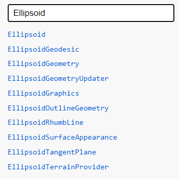
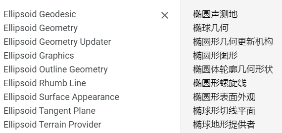

[TOC]

# Ellipsoid

#### new Cesium.Ellipsoid(x, y, z)[Core/Ellipsoid.js 75](https://github.com/CesiumGS/cesium/blob/1.83/Source/Core/Ellipsoid.js#L75)

A quadratic surface defined in Cartesian coordinates by the equation `(x / a)^2 + (y / b)^2 + (z / c)^2 = 1`. Primarily used by Cesium to represent the shape of planetary bodies. Rather than constructing this object directly, one of the provided constants is normally used. (Cesium主要用于表示行星体的形状。 通常使用提供的常量之一，而不是直接构造此对象。)
$$
椭球公式: (\frac{x}{a})^2 + (\frac{y}{b})^2 + (\frac{z}{c})^2 = 1
$$

| Name | Type   | Default | Description                            |
| :--- | :----- | :------ | :------------------------------------- |
| `x`  | Number | `0`     | optionalThe radius in the x direction. |
| `y`  | Number | `0`     | optionalThe radius in the y direction. |
| `z`  | Number | `0`     | optionalThe radius in the z direction. |

## 属性

### 只读属性

### 静态属性

### 静态只读属性

##### Cesium.Ellipsoid.WGS84

An Ellipsoid instance initialized to the WGS84 standard.

WGS84:World Geodetic System 1984，是为[GPS全球定位系统](https://baike.baidu.com/item/GPS全球定位系统/5864639)使用而建立的[坐标系统](https://baike.baidu.com/item/坐标系统/4725756)。

## 方法