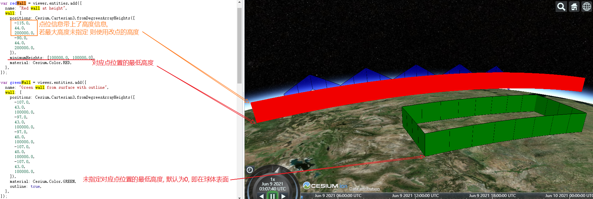
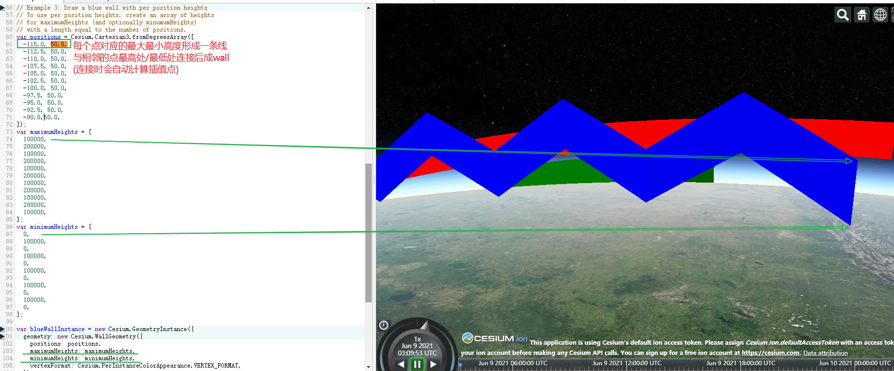

[TOC]

## WallGeometry [$](https://cesium.com/docs/cesiumjs-ref-doc/WallGeometry.html)

**new Cesium.WallGeometry(options)**

A description of a wall, which is similar to a KML line string. 

A wall is defined by a series of points, which **extrude down to the ground**. Optionally, they can **extrude downwards to a specified height**.

墙的描述，类似于 KML 线串。 墙由一系列**向下延伸到地面**的点定义。 或者，它们可以**向下挤压到指定的高度**。

options参数:

- positions	Array.`<Cartesian3>`

  An array of Cartesian objects, which are the points of the wall.

- granularity  (*optional*)	Number [默认值: CesiumMath.RADIANS_PER_DEGREE]

  The distance, in radians, between each latitude and longitude. Determines the number of positions in the buffer.

  granularity : 粒度; 每个纬度和经度之间的距离（以弧度为单位）。 确定缓冲区中的位置数。

- maximumHeights (*optional*)	Array.`<Number>`	

  An array parallel to positions that give the maximum height of the wall at positions. If undefined, the height of each position in used.

  平行于position的数组，在对应点的位置给出墙的最大高度。 如果未定义，则使用每个位置的高度。

- minimumHeights (*optional*)	Array.`<Number>`

  An array parallel to positions that give the minimum height of the wall at positions. If undefined, the height at each position is 0.0.

- ellipsoid (*optional*)	Ellipsoid	 [默认值: Ellipsoid.WGS84]

  The ellipsoid for coordinate manipulation (用于坐标操作的椭球)

- vertexFormat	VertexFormat	 [默认值: VertexFormat.DEFAULT]

  The vertex attributes to be computed(要计算的顶点属性)

##### Throws:

- [DeveloperError](https://cesium.com/docs/cesiumjs-ref-doc/DeveloperError.html) : positions length must be greater than or equal to 2.
- [DeveloperError](https://cesium.com/docs/cesiumjs-ref-doc/DeveloperError.html) : positions and maximumHeights must **have the same length**.
- [DeveloperError](https://cesium.com/docs/cesiumjs-ref-doc/DeveloperError.html) : positions and minimumHeights must have the same length.
