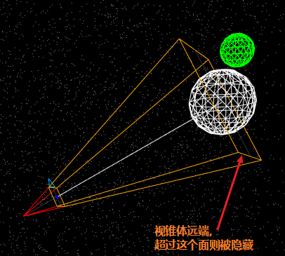

[toc]

# 摄像机（Camera）

摄像机的抽象基类。在构建新摄像机时，应始终继承此类。


## 构造函数

### Camera()

创建一个新的Camera（摄像机）。注意：这个类并不是被直接调用的；你所想要的或许是一个 PerspectiveCamera（透视摄像机）或者 OrthographicCamera（正交摄像机）。


## 属性

共有属性请参见其基类Object3D

- .isCamera : Boolean

  用于来检查这个类或者派生的类是否为摄像机，默认为**true**。

  你不应当对这个属性进行改变，因为它在内部由渲染器使用，以用于优化。

- .layers : Layers

  **摄像机是一个layers的成员. 这是一个从Object3D继承而来的属性。**

  当摄像机的视点被渲染的时候，物体必须和当前被看到的摄像机共享至少一个层。

- .matrixWorldInverse : Matrix4

  这是matrixWorld矩阵的逆矩阵。 MatrixWorld包含了相机的世界变换矩阵。

- .projectionMatrix : Matrix4

  这是投影变换矩阵。

- .projectionMatrixInverse : Matrix4

  这是投影变换矩阵的逆矩阵。


## 方法

共有方法请参见其基类Object3D。

- .clone ( ) : Camera

  返回一个具有和当前相机的属性一样的新的相机。

- .copy ( source : Camera, recursive : Boolean ) : Camera

  将源摄像机的属性复制到新摄像机中。

- .getWorldDirection ( target : Vector3 ) : Vector3

  target — 调用该函数的结果将复制给该Vector3对象。

  返回一个能够表示当前摄像机所正视的世界空间方向的Vector3对象。 （注意：摄像机俯视时，其Z轴坐标为负。）


# 透视相机（PerspectiveCamera）

这一摄像机使用[perspective projection](https://en.wikipedia.org/wiki/Perspective_(graphical))（透视投影）来进行投影。

这一投影模式被用来模拟人眼所看到的景象，它是3D场景的渲染中使用得最普遍的投影模式。


## 构造函数

### PerspectiveCamera( fov : Number, aspect : Number, near : Number, far : Number )

- fov — 摄像机视锥体垂直视野角度

- aspect — 摄像机视锥体长宽比

- near — 摄像机视锥体近端面

- far — 摄像机视锥体远端面-

```js
var camera = new THREE.PerspectiveCamera( 45, width / height, 1, 1000 );
scene.add( camera );
```


这些参数一起定义了摄像机的[viewing frustum](https://en.wikipedia.org/wiki/Viewing_frustum)（视锥体）。


## 属性

在大多数属性发生改变之后，需要调用.updateProjectionMatrix来使得这些改变生效。

### camera共有属性

### .aspect : Float

摄像机视锥体的长宽比，通常是使用画布的宽/画布的高。默认值是**1**（正方形画布）。

### .far : Float

摄像机的远端面，默认值是**2000**。

其有效值范围是在当前摄像机near plane（近端面）的值到无穷远之间。

### .filmGauge : Float

胶片尺寸，其默认值为35（毫米）。 这个参数不会影响摄像机的投影矩阵，除非.filmOffset被设置为了一个非零的值。

### .filmOffset : Float

水平偏离中心偏移量，和.filmGauge单位相同。默认值为**0**。

### .focus : Float

用于立体视觉和景深效果的物体的距离。 这个参数不会影响摄像机的投影矩阵，除非使用了StereoCamera。 默认值是**10**。

### .fov : Float

摄像机视锥体垂直视野角度，从视图的底部到顶部，以角度来表示。默认值是**50**。

### .isPerspectiveCamera : Boolean

用于测试这个类或者派生类是否为PerspectiveCameras，默认为true。

你不应当对这个属性进行改变,因为它在内部由渲染器使用，以用于优化。

### .near : Float

摄像机的近端面，默认值是**0.1**。

其有效值范围是0到当前摄像机far plane（远端面）的值之间。 请注意，和OrthographicCamera不同，**0**对于PerspectiveCamera的近端面来说*不是*一个有效值。

### .view : Object

Frustum window specification or null. 这个值使用.setViewOffset方法来进行设置，使用.clearViewOffset方法来进行清除。

### .zoom : number

获取或者设置摄像机的缩放倍数，其默认值为**1**。


## 方法

共有方法请参见其基类Camera。

### .clearViewOffset () : null

清除任何由.setViewOffset设置的偏移量。

### .getEffectiveFOV () : Float

结合.zoom（缩放倍数），以角度返回当前垂直视野角度。

### .getFilmHeight () : Float

返回当前胶片上图像的高，如果.aspect小于或等于1（肖像格式、纵向构图），则结果等于.filmGauge。

### .getFilmWidth () : Float

返回当前胶片上图像的宽，如果.aspect大于或等于1（景观格式、横向构图），则结果等于.filmGauge。

### .getFocalLength () : Float

返回当前.fov（视野角度）相对于.filmGauge（胶片尺寸）的焦距。

### .setFocalLength ( focalLength : Float ) : null

通过相对于当前.filmGauge的焦距，设置FOV。

默认情况下，焦距是为35mm（全画幅）摄像机而指定的。

### .setViewOffset ( fullWidth : Float, fullHeight : Float, x : Float, y : Float, width : Float, height : Float ) : null


### .updateProjectionMatrix () : null

更新摄像机投影矩阵。在任何参数被改变以后必须被调用。

### .toJSON (meta : object) : Object

meta -- 包含有元数据的对象，例如对象后代中的纹理或图像
将摄像机转换为 three.js [JSON Object/Scene format](https://github.com/mrdoob/three.js/wiki/JSON-Object-Scene-format-4)（three.js JSON 物体/场景格式）。


```js
/// onWindowResize
camera.aspect = window.innerWidth / window.innerHeight;
camera.updateProjectionMatrix();
```


# 透视相机视锥体



左侧蓝点所在平面为近端面, 可视范围在近/远端面之间
