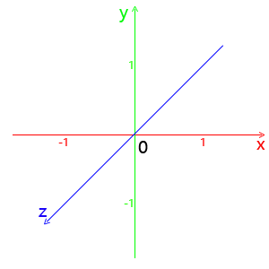
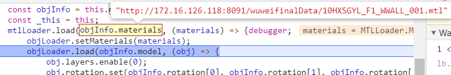
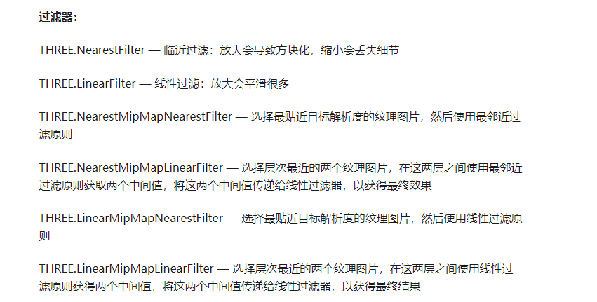

1. 闪烁效果

   ```js
   定时器修改object的opacity/color
   外加高亮 object.layers.enable(1)
   ```

   

2. 重叠问题

   ```js
   
   ```

   

3. webGL三维坐标系

   1. 
   2. canvas画布宽高采用的是像素值定义，以显示器为准，WebGL中顶点坐标的表示方法采用的是相对坐标，相对于canvas而言 WebGL坐标系统，X轴水平向右，也就是canvas画布的width表示的宽度方向，x等于-1表示canvas画布的左边界，x等于1表示canvas画布的右边界，x等于0对应的是画布宽度方向的中间。
   3. WebGL坐标系统，Y轴竖直向上，也就是canvas画布的height表示的高度方向，y等于-1表示canvas画布的下边界，y等于1表示canvas画布的上边界，y等于0对应的是画布高度方向的中间。
   4. WebGL坐标系统，Z轴垂直canvas画布朝外，Z值-1和1是Z方向的极限值，GPU成像默认的沿着Z轴投影，你也可以抽象出一个概念，人眼睛位于z轴上，沿着z轴方向去观察物体
   5. 顶点光栅化之后得到的片元，只要不在xyz三个方向`-1.0~1.0`范围构成的立方体空间中，就会被剪裁掉。

4. 1

5. loaders

6. 

   1. mtl ~ material ?
   2. obj ~ object 模型？ 

7. 对应的数据

   1. [mtl](http://172.16.126.118:8091/wuweifinalData/10HXSGYL_F1_WWALL_001.mtl)

      ```
      // mtl 文件
      # 3ds Max Wavefront OBJ Exporter v0.97b - (c)2007 guruware
      # 创建的文件:28.04.2020 09:10:53
      
      newmtl wire_027177027
      	Ns 32
      	d 1
      	Tr 0
      	Tf 1 1 1
      	illum 2
      	Ka 0.105882 0.694118 0.105882
      	Kd 0.105882 0.694118 0.105882
      	Ks 0.350000 0.350000 0.350000
      ```

      

   2. [obj](http://172.16.126.118:8091/wuweifinalData/10HXSGYL_F1_WWALL_001.obj)

      ```
      // obj 文件
      # 3ds Max Wavefront OBJ Exporter v0.97b - (c)2007 guruware
      # 创建的文件:28.04.2020 09:10:53
      
      mtllib 10HXSGYL_F1_WWALL_001.mtl
      
      #
      # object 10HXSGYL_F1_WWALL_001
      #
      
      v  -2062.485107 -1830.524780 0.002196
      v  -2076.685303 -1830.524780 0.001701
      v  -2076.685303 -1830.524780 3.278953
      v  -2062.485107 -1830.524780 3.279448
      v  -2127.894775 -1830.524780 -0.000019
      v  -2127.894775 -1838.535522 0.002181
      v  -2127.894775 -1838.535522 3.279433
      v  -2127.894775 -1830.524780 3.277233
      v  -2127.284912 -1838.535522 0.002165
      v  -2127.284912 -1840.524902 0.002164
      v  -2127.284912 -1840.524902 3.279416
      v  -2127.284912 -1838.535522 3.279416
      v  -2127.894775 -1840.524902 0.002181
      v  -2127.894775 -1848.534302 0.012677
      v  -2127.894775 -1848.534302 3.289929
      v  -2127.894775 -1840.524902 3.279432
      v  -2112.284668 -1848.534302 0.012681
      v  -2112.284668 -1848.534302 3.289933
      v  -2112.284668 -1846.727539 0.012236
      v  -2106.891113 -1846.727417 0.012238
      v  -2106.891113 -1846.726563 3.289490
      v  -2112.284668 -1846.726685 3.289488
      v  -2106.891113 -1848.534302 0.012683
      v  -2083.484619 -1848.534302 -0.000006
      v  -2083.484619 -1848.534302 3.277246
      v  -2106.891113 -1848.534302 3.289935
      v  -2083.484619 -1846.727417 -0.000451
      v  -2078.091309 -1846.727539 -0.000452
      v  -2078.091309 -1846.726807 3.276800
      v  -2083.484619 -1846.726563 3.276801
      v  -2078.091309 -1848.534302 -0.000007
      v  -2062.485107 -1848.534302 -0.000000
      v  -2062.485107 -1848.534302 3.277252
      v  -2078.091309 -1848.534302 3.277245
      v  -2062.485107 -1840.524902 0.002196
      v  -2062.485107 -1840.524902 3.279448
      v  -2063.094971 -1840.524902 0.002213
      v  -2063.094971 -1838.535522 0.002213
      v  -2063.094971 -1838.535522 3.279465
      v  -2063.094971 -1840.524902 3.279465
      v  -2062.485107 -1838.535522 0.002196
      v  -2062.485107 -1838.535522 3.279448
      v  -2113.420410 -1829.740356 0.000567
      v  -2113.420410 -1829.739624 3.277819
      v  -2109.360352 -1829.739624 3.277947
      v  -2109.360352 -1829.740356 0.000695
      v  -2113.420410 -1830.524780 3.277727
      v  -2113.420410 -1830.524780 0.000475
      v  -2109.360352 -1830.524780 0.000604
      v  -2109.360352 -1830.524780 3.277856
      v  -2081.295166 -1830.524780 3.278824
      v  -2081.295166 -1830.524780 0.001573
      v  -2081.295166 -1829.740356 0.001664
      v  -2081.295166 -1829.739502 3.278915
      v  -2076.685303 -1829.739502 3.279044
      v  -2076.685303 -1829.740356 0.001793
      # 56 vertices
      
      vn 0.000000 1.000000 0.000000
      vn -1.000000 0.000000 0.000000
      vn 0.000000 -1.000000 0.000000
      vn 0.000017 -1.000000 0.000246
      vn -0.000035 -1.000000 0.000246
      vn 1.000000 0.000000 0.000000
      vn 0.000000 -0.000246 -1.000000
      vn -0.000000 -0.000246 -1.000000
      vn -0.000002 1.000000 -0.000246
      vn 0.000032 0.000117 -1.000000
      vn 0.000028 0.000117 -1.000000
      # 11 vertex normals
      
      g 10HXSGYL_F1_WWALL_001
      usemtl wire_027177027
      s off
      f 1//1 2//1 3//1 4//1 
      f 5//2 6//2 7//2 8//2 
      f 9//2 10//2 11//2 12//2 
      f 13//2 14//2 15//2 16//2 
      f 14//3 17//3 18//3 15//3 
      f 19//4 20//4 21//4 22//4 
      f 23//3 24//3 25//3 26//3 
      f 27//5 28//5 29//5 30//5 
      f 31//3 32//3 33//3 34//3 
      f 32//6 35//6 36//6 33//6 
      f 37//6 38//6 39//6 40//6 
      f 41//6 1//6 4//6 42//6 
      f 23//2 26//2 21//2 20//2 
      f 26//7 18//7 22//7 21//7 
      f 18//6 17//6 19//6 22//6 
      f 31//2 34//2 29//2 28//2 
      f 34//8 25//8 30//8 29//8 
      f 25//6 24//6 27//6 30//6 
      f 41//3 42//3 39//3 38//3 
      f 36//1 35//1 37//1 40//1 
      f 13//1 16//1 11//1 10//1 
      f 7//3 6//3 9//3 12//3 
      f 43//9 44//9 45//9 46//9 
      f 5//1 8//1 47//1 48//1 
      f 49//1 50//1 51//1 52//1 
      f 53//9 54//9 55//9 56//9 
      f 49//10 48//10 43//10 46//10 
      f 48//2 47//2 44//2 43//2 
      f 50//6 49//6 46//6 45//6 
      f 3//6 2//6 56//6 55//6 
      f 2//11 52//11 53//11 56//11 
      f 52//2 51//2 54//2 53//2 
      # 32 polygons
      
      
      ```

      

   3. 

8. GUI 设置参数

9. 射线求交

   1. # 光线投射Raycaster

   2. ### .intersectObject ( object : Object3D | Array`<Object3d>`, recursive : Boolean, optionalTarget : Array ) : Array

      object —— 检查与射线相交的物体。
      recursive —— 若为true，则同时也会检查所有的后代。否则将只会检查对象本身。默认值为false。
      optionalTarget — （可选）设置结果的目标数组。如果不设置这个值，则一个新的Array会被实例化；如果设置了这个值，则在每次调用之前必须清空这个数组（例如：array.length = 0;）。

      检测所有在射线与物体之间，包括或不包括后代的相交部分。返回结果时，相交部分将按距离进行排序，最近的位于第一个。

10. 天空球, 球形模型加个纹理贴图, 相机防止在球体内部
11. setPosition 定位
12. translate平移是不用考虑轴翻转的问题;

13. 几何信息是geometry. 材质是material .当你需要改颜色，贴图，透明度，那就是改材质。如果是改图元大小那就是geometry


获取一个mesh的中心坐标, 用一个box包围mesh, 然后获取box的中心点

```js
/**
* @method 获取三维对象的范围信息
* @param {THREE.Object3D} Object3D 
*/
getObject3DRangeInfo(object3D) {
    const box = new THREE.Box3();
    box.setFromObject(object3D);
    const center = box.getCenter();


    return center
}
```


### Box3( min : Vector3, max :Vector3 )

min - (参数可选) Vector3 表示包围盒的下边界。 默认值是（ + Infinity, + Infinity, + Infinity ）。
max - (参数可选) Vector3 表示包围盒的上边界。 默认值是（ - Infinity, - Infinity, - Infinity ）。

### .setFromObject ( object : Object3D ) : Box3

object - 用来计算包围盒的3D对象 Object3D。

计算和世界轴对齐的一个对象 Object3D （含其子对象）的包围盒，计算对象和子对象的世界坐标变换。


## 由场景进入单栋建筑

1. 遍历scene, 建筑带有name
   1. 以Group为最小单位, 以name筛选, 隐藏其他的建筑 `visible = false`
   2. 隐藏其他的模型, 模型类型 - `[ "Sprite", "WhiteModel", "Road", "Icon", "Animation", "Map"]`
2. 显示楼层之间的线框
3. 创建过渡动画 
   1. 加载动画圆
   2. 加载生长墙体
   3. 相机环绕动画

3. 获取建筑楼层信息
4. 退出时还原视角


### 精灵图模型遮挡问题

### .depthTest : Boolean

是否在渲染此材质时启用深度测试。默认为 **true**。

### .depthWrite : Boolean

渲染此材质是否对深度缓冲区有任何影响。默认为**true**。

在绘制2D叠加时，将多个事物分层在一起而不创建z-index时，禁用深度写入会很有用。

[来源](https://stackoverflow.com/questions/37647853/three-js-depthwrite-vs-depthtest-for-transparent-canvas-texture-map-on-three-p)

深度测试关闭意味着同时关闭深度测试。（阅读/测试和写作）

深度注销意味着防止写入深度缓冲区。

So first of all, what is depth test? Suppose if you are to draw 2 identical shapes directly in front of you but of different distance to you. In real life, you expect to only see the shape that is closer to you, correct?

那么，首先，什么是深度测试？假设您要在您的正前方绘制两个相同的形状，但距您的**距离不同**。在现实生活中，您期望只看到更接近您的形状，对吗？

Well if you were to try to do this without a depth test, you will only get the desired effect half the time: if the *distant object* is drawn **before** the closer object, no problem, same as real life; but if the closer object is drawn **before** the *distance object*, oh-oh, the distant object is visible when it should be not. Problematic.

好吧，如果您尝试不进行深度测试就只能达到预期的效果：如果将远处的物体绘制在较近的物体之前，则没有问题，与现实生活相同；但是，如果在距离对象之前绘制了较近的对象，那么哦，哦，远处的对象在不应该看到的情况下可见。有问题。  before means '先于'?, 类似于层

Depth test is a tool built in today's GPUs to allow to get the desired draw output **regardless of the order which the objects are drawn**. This is normally very useful but it comes with a critical weakness: **depth and blending(transparency) do not work together**. Why is this the case? Well what depth test does is that for every pixel that is drawn, the distance(depth) of that pixel to the camera is compared to the depth value stored in that the pixel. If the distance is less that the stored depth value, the pixel is drawn, otherwise that pixel is discarded.

深度测试是当今GPU中内置的工具，**无论对象的绘制顺序如何**，都可以获取所需的绘制输出。通常这是非常有用的，但它有一个严重的缺点：**深度和混合（透明度）不能一起使用**。为什么会这样呢？深度测试所做的是，对于绘制的每个像素，将其与相机的距离（深度）与存储在该像素中的深度值进行比较。如果距离小于所存储的深度值，则绘制像素，否则丢弃该像素。

This explains why you sometimes see the black quads in your demo. When those quads are drawn first, their depth values are written into the depth buffer. Then when the more distant quads are drawn, their depth value are greater than the depth in the buffer and thus those pixels are discarded. In other viewing angles it just so happens that distant quads are drawn first and then the closer quads, so no pixels are discarded due to depth testing.

这说明了为什么有时会在演示中看到黑色四边形。当首先绘制这些四边形时，它们的深度值将写入深度缓冲区。然后，当绘制距离较远的四边形时，它们的深度值大于缓冲区中的深度，因此将那些像素丢弃。在其他视角下，很可能会先绘制远方的四边形，然后再绘制较近的四角形，因此不会因深度测试而丢弃任何像素。

Hopefully its clear now that there are **two aspects of depth testing: the comparison of depth values and the writing of depth values to the depth buffer.** DepthTest and depthWrite gives you fine control over how to archive the desired effect.

希望现在可以清楚地知道**深度测试**有**两个方面：深度值的比较以及将深度值写入深度缓冲区。**DepthTest和depthWrite使您可以更好地控制如何存档所需的效果。

Turning off depth testing all together would be faster than just depth writing. However, sometimes you just want to prevent new pixels to write to the depth buffer but still with the depth testing enabled. For example, in your demo if you were to draw a totally opaque cube in the center; you still want pixels with further depth than the pixels representing the opaque cube to be hidden (the depth testing aspect), but also want to prevent pixels from the transparent circles from blocking each other (the writing aspect). A common draw configuration you see is to draw all the opaque object with depth testing on, turn depth write off, then draw the transparent objects in a back to front order.

全部关闭深度测试将比仅深度写入更快。但是，有时您只想阻止新像素写入深度缓冲区，但仍启用深度测试。例如，在演示中，如果要在中心绘制一个完全不透明的立方体；您仍然希望隐藏比表示不透明立方体的像素更深的像素（深度测试方面），但同时也要防止透明圆圈中的像素彼此阻塞（书写方面）。您看到的常见绘制配置是在进行深度测试的情况下绘制所有不透明的对象，关闭深度写入，然后以从前到后的顺序绘制透明对象。

~~ comment

如果将实心立方体放入示例代码（例如[jsbin.com/bigikijogi/edit?js,output](http://jsbin.com/bigikijogi/edit?js,output)）中并使用`depthTest: false`，则在实心几何体后面时，圆不会被正确遮挡。但是，如果我使用`depthWrite: false`它们，它们将被正确阻止。


### .renderOrder : Number ~ Object

这个值将使得[scene graph](https://en.wikipedia.org/wiki/Scene_graph)（场景图）中默认的的渲染顺序被覆盖， 即使不透明对象和透明对象保持独立顺序。 渲染顺序是由低到高来排序的，默认值为**0**。

### .sortObjects : Boolean  ~ Renderer

定义渲染器是否应对对象进行排序。默认是**true**.

说明: 排序用于尝试正确渲染出具有一定透明度的对象。根据定义，排序可能不总是有用。根据应用的需求，可能需要关闭排序并使其他方法来处理透明度的渲染，例如， 手动确定每个对象的显然顺序。


### scene 中是mousewheel/wheel事件的触发回调与scene是同一阶段执行的 (左/右键同理)

scene 会先执行, 于此同时监听的事件如果依赖于scene, 则需要延迟执行, 等到scene中的处理执行完毕数据稳定后再执行相应的回调

例子

监听wheel事件动态计算并改变精灵图的scale,

同时右键也做同样的回调操作

结果:

	1. scene 在wheel之后改变scale
	2. 此时 右键触发回调还可以继续改变, 即为=> wheel时没有计算完scene的数据就开始触发回调了


更正方向: 

	1. 手动监听wheel事件类型的执行回调延迟执行, (Promise.then 好像还是不行, setTimeout可以满足)


### 过滤器

THREE.NearestFilter — 临近过滤：放大会导致方块化，缩小会丢失细节

THREE.LinearFilter — 线性过滤：放大会平滑很多

THREE.NearestMipMapNearestFilter — 选择最贴近目标解析度的纹理图片，然后使用最邻近过滤原则

THREE.NearestMipMapLinearFilter — 选择层次最近的两个纹理图片，在这两层之间使用最邻近过滤原则获取两个中间值，将这两个中间值传递给线性过滤器，以获得最终效果

THREE.LinearMipMapNearestFilter — 选择最贴近目标解析度的纹理图片，然后使用线性过滤原则

THREE.LinearMipMapLinearFilter — 选择层次最近的两个纹理图片，在这两层之间使用线性过滤原则获得两个中间值，将这两个中间值传递给线性过滤器，以获得最终结果




UI提供过来的三维场景的图标尽量是2的幂次方


数据 树型

​	json -> {mtl}


锯齿问题/图片失真

1. 增加平面定点数 (定点数越多性能消耗越大)
2. 使用svg替换png图片


threejs 案例中如果想开断点调试, 可以在iframe地址后面加上对应的search参数, 替换到对应的网址中

http://www.webgl3d.cn/threejs/examples/?q=svg#webgl_loader_svg

http://www.webgl3d.cn/threejs/examples/webgl_loader_svg.html


移除object

### .dispose () : null --- geometry

将对象从内存中删除。
在你删除一个几何体时，不要忘记调用该方法，否则会造成内存泄漏。


### .dispose () : null

处理材质。材质的纹理不会被处理。需要通过Texture处理。


合并几何模型提高性能

`BufferGeometryUtils.mergeBufferGeometries`

### .mergeBufferGeometries ( geometries : Array, useGroups : Boolean ) : BufferGeometry

geometries -- Array of BufferGeometry instances.
useGroups -- Whether groups should be generated for the merged geometry or not.

Merges a set of geometries into a single instance. All geometries must have compatible[兼容的] attributes. If merge does not succeed, the method returns null.


Geometry.prorotype.merge ( geometry : Geometry, matrix : Matrix4, materialIndexOffset : Integer ) : null

将两个几何体，或一个几何体和一个从对象中通过变换获得的几何体进行合并。


精灵图纹理图片最好是2的n次方, 设置sprite的中心可以调整对应的图片显示区域

// 动态更改 精灵图的scale

```js
temp1.forEach(g=>{
    g.traverse(mesh=>{
        if (mesh.isSprite) mesh.scale.set(1000, 1000)
    })
})
```

