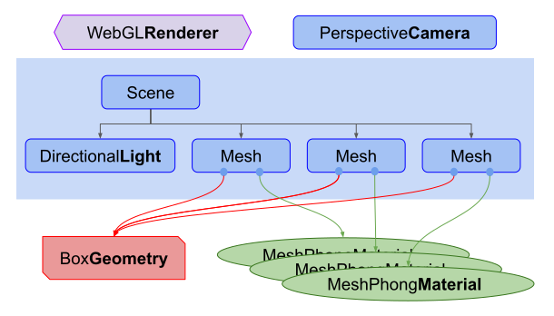

# [基础 - three.js manual (threejs.org)](https://threejs.org/manual/#zh/fundamentals)

这是Three.js系列文章的第一篇。 

[Three.js](http://threejs.org/)是一个尽可能简化在网页端获取3D 内容的库。

Three.js经常会和WebGL混淆， 但也并不总是，three.js其实是使用WebGL来绘制三维效果的。 [WebGL是一个只能画点、线和三角形的非常底层的系统](https://webglfundamentals.org/). 

想要用WebGL来做一些实用的东西通常需要大量的代码， 这就是Three.js的用武之地。

Three.js封装了诸如场景、灯光、阴影、材质、贴图、空间运算等一系列功能，让你不必要再从底层WebGL开始写起。


对于三维来说第一件事往往是创建一个三维的立方体。 所以我们从"Hello Cube!"开始。

在我们开始前，让我们试着让你了解一下一个three.js应用的整体结构。

**一个three.js应用需要创建很多对象，并且将他们关联在一起**。

下图是一个基础的three.js应用结构。


上图需要注意的事项：

- 首先有一个[渲染器(`Renderer`)](https://threejs.org/docs/#api/zh/constants/Renderer)。这可以说是three.js的主要对象。
  - 你传入一个[场景(`Scene`)](https://threejs.org/docs/#api/zh/scenes/Scene)和一个[摄像机(`Camera`)](https://threejs.org/docs/#api/zh/cameras/Camera)到[渲染器(`Renderer`)](https://threejs.org/docs/#api/zh/constants/Renderer)中，然后它会将摄像机视椎体中的三维场景渲染成一个二维图片显示在画布上。

- 其次有一个[场景图(scenegraph)](https://threejs.org/manual/zh/scenegraph.html) 它是一个树状结构，由很多对象组成，
  - 比如图中包含了一个[场景(`Scene`)](https://threejs.org/docs/#api/zh/scenes/Scene)对象 ，多个[网格(`Mesh`)](https://threejs.org/docs/#api/zh/objects/Mesh)对象，[光源(`Light`)](https://threejs.org/docs/#api/zh/lights/Light)对象，[群组(`Group`)](https://threejs.org/docs/#api/zh/objects/Group)，[三维物体(`Object3D`)](https://threejs.org/docs/#api/zh/core/Object3D)，和[摄像机(`Camera`)](https://threejs.org/docs/#api/zh/cameras/Camera)对象。
  - 一个[场景(`Scene`)](https://threejs.org/docs/#api/zh/scenes/Scene)对象定义了场景图最基本的要素，并包了含背景色和雾等属性。这些对象通过一个层级关系明确的树状结构来展示出各自的位置和方向。子对象的位置和方向总是相对于父对象而言的。
    - 比如说汽车的轮子是汽车的子对象，这样移动和定位汽车时就会自动移动轮子。
    - 你可以在[场景图](https://threejs.org/manual/zh/scenegraph.html)的这篇文章中了解更多内容。
  - 注意图中[摄像机(`Camera`)](https://threejs.org/docs/#api/zh/cameras/Camera)是**一半在场景图中，一半在场景图外的**。
    - 这表示在three.js中，[摄像机(`Camera`)](https://threejs.org/docs/#api/zh/cameras/Camera)和其他对象不同的是，它不一定要在场景图中才能起作用。
    - 相同的是，[摄像机(`Camera`)](https://threejs.org/docs/#api/zh/cameras/Camera)作为其他对象的子对象，同样会继承它父对象的位置和朝向。
    - 在[场景图](https://threejs.org/manual/zh/scenegraph.html)这篇文章的结尾部分有放置多个[摄像机(`Camera`)](https://threejs.org/docs/#api/zh/cameras/Camera)在一个场景中的例子。
- [网格(`Mesh`)](https://threejs.org/docs/#api/zh/objects/Mesh)对象可以理解为用一种特定的[材质(`Material`)](https://threejs.org/docs/#api/zh/materials/Material)来绘制的一个特定的[几何体(`Geometry`)](https://threejs.org/manual/zh/Geometry)。
  - [材质(`Material`)](https://threejs.org/docs/#api/zh/materials/Material)和[几何体(`Geometry`)](https://threejs.org/manual/zh/Geometry)可以被多个[网格(`Mesh`)](https://threejs.org/docs/#api/zh/objects/Mesh)对象使用。
  - 比如在不同的位置画两个蓝色立方体，我们会需要两个[网格(`Mesh`)](https://threejs.org/docs/#api/zh/objects/Mesh)对象来代表每一个立方体的位置和方向。但只需一个[几何体(`Geometry`)](https://threejs.org/manual/zh/Geometry)来存放立方体的顶点数据，和一种[材质(`Material`)](https://threejs.org/docs/#api/zh/materials/Material)来定义立方体的颜色为蓝色就可以了。两个[网格(`Mesh`)](https://threejs.org/docs/#api/zh/objects/Mesh)对象都引用了相同的[几何体(`Geometry`)](https://threejs.org/manual/zh/Geometry)和[材质(`Material`)](https://threejs.org/docs/#api/zh/materials/Material)。
- [几何体(`Geometry`)](https://threejs.org/manual/zh/Geometry)对象顾名思义代表一些几何体，
  - 如球体、立方体、平面、狗、猫、人、树、建筑等物体的顶点信息。
  - Three.js内置了许多[基本几何体](https://threejs.org/manual/zh/primitives.html) 。你也可以[创建自定义几何体](https://threejs.org/manual/zh/custom-buffergeometry.html)或[从文件中加载几何体](https://threejs.org/manual/zh/load-obj.html)。
- [材质(`Material`)](https://threejs.org/docs/#api/zh/materials/Material)对象代表[绘制几何体的表面属性](https://threejs.org/manual/zh/materials.html)，包括使用的颜色，和光亮程度。
  - 一个[材质(`Material`)](https://threejs.org/docs/#api/zh/materials/Material)可以引用一个或多个[纹理(`Texture`)](https://threejs.org/docs/#api/zh/textures/Texture)，这些纹理可以用来，打个比方，**将图像包裹到几何体的表面。**
- [纹理(`Texture`)](https://threejs.org/docs/#api/zh/textures/Texture)对象通常表示一幅要么[从文件中加载](https://threejs.org/manual/zh/textures.html)，要么[在画布上生成](https://threejs.org/manual/zh/canvas-textures.html)，要么[由另一个场景渲染出](https://threejs.org/manual/zh/rendertargets.html)的图像。
- [光源(`Light`)](https://threejs.org/docs/#api/zh/lights/Light)对象代表[不同种类的光](https://threejs.org/manual/zh/lights.html)。


有了以上基本概念，我们接下来就来画个下图所示的*"Hello Cube"*吧。


渲染器负责将你提供的所有数据渲染绘制到canvas上。

[透视摄像机(`PerspectiveCamera`)](https://threejs.org/docs/#api/zh/cameras/PerspectiveCamera)。

```js
const fov = 75;const aspect = 2;  // 相机默认值
const near = 0.1;const far = 5;
const camera = new THREE.PerspectiveCamera(fov, aspect, near, far);
```

`fov`是视野范围(field of view)的缩写。上述代码中是指垂直方向为75度。 注意three.js中大多数的角用弧度表示，但是因为某些原因透视摄像机使用角度表示。

`aspect`指画布的宽高比。我们将在别的文章详细讨论，在默认情况下 画布是300x150像素，所以宽高比为300/150或者说2。

`near`和`far`代表近平面和远平面，它们限制了摄像机面朝方向的可绘区域。 任何距离小于或超过这个范围的物体都将被裁剪掉(不绘制)。

这四个参数定义了一个 *"视椎(frustum)"*。 *视椎(frustum)*是指一个像被削去顶部的金字塔形状。

换句话说，可以把"视椎(frustum)"想象成其他三维形状如球体、立方体、棱柱体、截椎体。


近平面和远平面的**高度**由**视野范围决定**，**宽度**由**视野范围和宽高比决定**。

视椎体内部的物体将被绘制，视椎体外的东西将不会被绘制。

摄像机默认指向Z轴负方向，上方向朝向Y轴正方向。我们将会把立方体放置在坐标原点，所以我们需要往后移一下摄像机才能显示出物体。

```js
camera.position.z = 2;
```

下图是我们想要达到的效果。


我们能看到摄像机的位置在`z = 2`。它朝向Z轴负方向。

我们的视椎体范围从摄像机前方0.1到5。 (可以看到 近平面 与摄像机还有一点距离; 三角形最远端为 -3 )

因为这张图是俯视图，视野范围会受到宽高比的影响。画布的宽度是高度的两倍，所以水平视角会比我们设置的垂直视角75度要大。


[场景(`Scene`)](https://threejs.org/docs/#api/zh/scenes/Scene)是three.js的基本的组成部分。需要three.js绘制的东西都需要加入到scene中。

创建一个包含盒子信息的[立方几何体(`BoxGeometry`)](https://threejs.org/docs/#api/zh/geometries/BoxGeometry)。

几乎所有希望在three.js中显示的物体都需要一个包含了组成三维物体的顶点信息的几何体。

创建一个基本的材质并设置它的颜色. 颜色的值可以用css方式和十六进制来表示。

再创建一个[网格(`Mesh`)](https://threejs.org/docs/#api/zh/objects/Mesh)对象，它包含了：

1. [几何体(`Geometry`)](https://threejs.org/manual/zh/Geometry)(物体的形状)
2. [材质(`Material`)](https://threejs.org/docs/#api/zh/materials/Material)(如何绘制物体，光滑还是平整，什么颜色，什么贴图等等)
3. 对象在场景中相对于他父对象的位置、朝向、和缩放。下面的代码中父对象即为场景对象。

```js
const geometry = new THREE.BoxGeometry(boxWidth, boxHeight, boxDepth);
const material = new THREE.MeshBasicMaterial({color: 0x44aa88});
const cube = new THREE.Mesh(geometry, material);
scene.add(cube);
```


**将场景和摄像机传递给渲染器**来渲染出整个场景。

```js
renderer.render(scene, camera);
```

<!-- [示例0](../tutorials/1 fundamentals_0.html) -->
<a href="../tutorials/1 fundamentals_0.html" target="_blank">示例0</a>
运行起来后很难看出来这是一个三维的立方体，因为我们直视Z轴的负方向并且立方体和坐标轴是对齐的，所以我们只能看到一个面。

我们来让立方体旋转起来，以便更好的在三维环境中显示。

为了让它动起来我们需要用到一个渲染循环函数 [`requestAnimationFrame`](https://developer.mozilla.org/en-US/docs/Web/API/window/requestAnimationFrame).

```js
function render(time) {
  time *= 0.001;  // 将时间单位变为秒
 
  cube.rotation.x = time;
  cube.rotation.y = time;
 
  renderer.render(scene, camera);
 
  requestAnimationFrame(render);
}
requestAnimationFrame(render);
```

`requestAnimationFrame`函数会告诉浏览器你需要显示动画。传入一个函数作为回调函数。

本例中的函数是`render`函数。

如果你更新了跟页面显示有关的任何东西，浏览器会调用你传入的函数来重新渲染页面。

我们这里是调用three.js的`renderer.render`函数来绘制我们的场景。

`requestAnimationFrame`会将页面开始加载到函数运行所经历的**时间当作入参传给回调函数**，单位是毫秒数。但我觉得用秒会更简单所以我将它转换成了秒。

然后我们把立方体的X轴和Y轴方向的旋转角度设置成这个时间。这些旋转角度是[弧度制](https://en.wikipedia.org/wiki/Radian)。

一圈的**弧度**为2Π所以我们的立方体在每个方向旋转一周的时间为6.28秒。


渲染我们的场景并**调用另一个帧动画函数来继续我们的循环**。

回调函数之外在**主进程中我们调用一次`requestAnimationFrame`来开始整个渲染循环**。


添加些光照效果 (平行光)

```js
const color = 0xFFFFFF;
const intensity = 1;
const light = new THREE.DirectionalLight(color, intensity);
light.position.set(-1, 2, 4);
scene.add(light);
```

平行光有一个位置和目标点。默认值都为(0, 0, 0)。

我们这里 将灯光的位置设为(-1, 2, 4)，让它**位于摄像机前面稍微左上方一点的地方**。

目标点还是(0, 0, 0)，让它朝向坐标原点方向。


还需要改变下立方体的材质。[`MeshBasicMaterial`](https://threejs.org/docs/#api/zh/materials/MeshBasicMaterial)材质不会受到灯光的影响。

改成会受灯光影响的[`MeshPhongMaterial`](https://threejs.org/docs/#api/zh/materials/MeshPhongMaterial)材质。

```diff
- const material = new THREE.MeshBasicMaterial({color: 0x44aa88});  // 绿蓝色
+ const material = new THREE.MeshPhongMaterial({color: 0x44aa88});  // 绿蓝色
```

<!-- [示例2](../tutorials/1 fundamentals_2.html) -->
<a href="../tutorials/1 fundamentals_2.html" target="_blank">示例2</a>
新的项目结构


再添加两个立方体来增添点趣味性。

每个立方体会引用同一个几何体和不同的材质，这样每个立方体将会是不同的颜色。

首先我们创建一个根据指定的颜色生成新材质的函数。

它会根据指定的几何体生成对应网格，然后将网格添加进场景并设置其X轴的位置。

```js
function makeInstance(geometry, color, x) {  
    const material = new THREE.MeshPhongMaterial({color});   
    const cube = new THREE.Mesh(geometry, material);  
    scene.add(cube);   
    cube.position.x = x;   
    return cube;
}
```

然后我们将用三种不同的颜色和X轴位置调用三次函数，将生成的网格实例存在一个数组中。

```js
const cubes = [  makeInstance(geometry, 0x44aa88,  0),  makeInstance(geometry, 0x8844aa, -2),  makeInstance(geometry, 0xaa8844,  2),];
```

最后我们将在渲染函数中旋转三个立方体。我们给每个立方体设置了稍微不同的旋转角度。

```js
function render(time) {
    time *= 0.001; // 将时间单位变为秒

    cubes.forEach((cube, ndx) => {
        const speed = 1 + ndx * 0.1;
        const rot = time * speed;
        cube.rotation.x = rot;
        cube.rotation.y = rot;
    });

    renderer.render(scene, camera);

    requestAnimationFrame(render);
}
```

<!-- [示例3](../tutorials/1 fundamentals_3.html) -->
<a href="../tutorials/1 fundamentals_3.html" target="_blank">示例3</a>

可以看到此效果符合我们的预想。位置为X = -2 和 X = +2的立方体有一部分在我们的视椎体外面。他们大部分是被包裹的，因为水平方向的视角非常大。


现在有了这样的结构



正如你看见的那样，我们有三个[网格(`Mesh`)](http://127.0.0.1:5500/docs/#api/zh/objects/Mesh)引用了相同的[立方几何体(`BoxGeometry`)](http://127.0.0.1:5500/docs/#api/zh/geometries/BoxGeometry)。

每个[网格(`Mesh`)](http://127.0.0.1:5500/docs/#api/zh/objects/Mesh)引用了一个单独的[`MeshPhongMaterial`](http://127.0.0.1:5500/docs/#api/zh/materials/MeshPhongMaterial)材质来显示不同的颜色。
