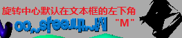
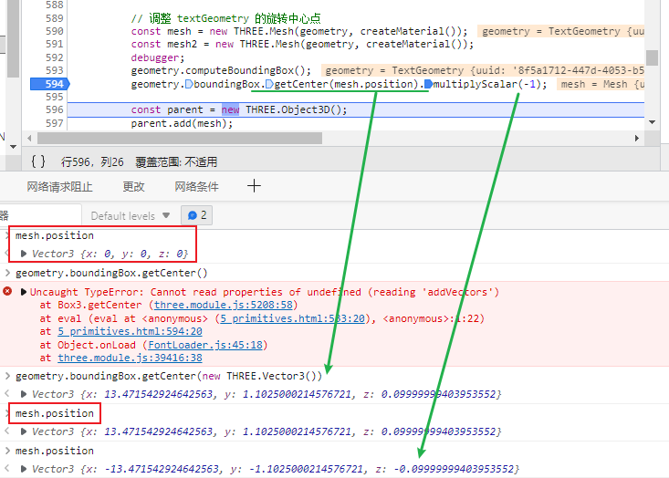

# [Primitives 图元](https://threejs.org/manual/#en/primitives)

... 许多几何模型的类的示例和简单说明


## `Geometry`  vs  [`BufferGeometry`](http://127.0.0.1:5500/docs/#api/zh/core/BufferGeometry)

`Geometry` 和 [`BufferGeometry`](http://127.0.0.1:5500/docs/#api/zh/core/BufferGeometry) 是成对出现的。 

这两种类型的区别是高效灵活 vs 性能。


基于 [`BufferGeometry`](http://127.0.0.1:5500/docs/#api/zh/core/BufferGeometry) 的图元是面向性能的类型。 几何体的顶点是**直接生成为一个高效的类型数组形式**，可以被上传到 **GPU 进行渲染**。 这意味着它们能**更快的启动，占用更少的内存**。但如果想**修改数据，就需要复杂的编程**。


基于 `Geometry` 的图元更灵活、更易修改。 它们根据 JavaScript 的类而来，像 [`Vector3`](http://127.0.0.1:5500/docs/#api/zh/math/Vector3) 是 3D 的点，[`Face3`](http://127.0.0.1:5500/docs/#api/zh/core/Face3) 是三角形。 它们需要更多的内存，在能够被渲染前，Three.js 会将它们转换成相应的 [`BufferGeometry`](http://127.0.0.1:5500/docs/#api/zh/core/BufferGeometry) 表现形式。


如果你知道你不会操作图元，或者你擅长使用数学来操作它们，那么最好使用基于 [`BufferGeometry`](http://127.0.0.1:5500/docs/#api/zh/core/BufferGeometry) 的图元。[`BufferGeometry`](http://127.0.0.1:5500/docs/#api/zh/core/BufferGeometry) 不能轻松的添加新的顶点。 使用**顶点的数量在创建时就定好**了，相应的创建存储，填充顶点数据。

如果你想在渲染前修改一些东西，那么 `Geometry` 的图元会更好操作。用 `Geometry` 你就能随时添加顶点。


### hsl

[`Color`](http://127.0.0.1:5500/docs/#api/zh/math/Color) 的一个特性，让你可以基于色调、饱和度、亮度来设置颜色。

在色轮上，

`hue` 值从 0 到 1，红色在 0 的位置，绿色在 .33 的位置，蓝色在 .66 的位置。 

`saturation` 值从 0 到 1，0 表示没有颜色，1 表示饱和度最高。

`luminance` 值从 0 到 1，0 表示黑色，1 表示白色，0.5 表示最大数量的颜色。 

​	换句说话，`luminance` 从 0 到 0.5 表示颜色从黑到 `hue`，从 0.5 到 1.0 表示颜色从 `hue` 到白。


### side

将 `side: THREE.DoubleSide` 传给材质。这告诉 Three.js 绘制组成形状的三角形的两个面。 

对于实心的形状，像球体或立方体，通常不需要绘制三角形的背面，因为它们全部朝向内部。 

对于绘制一些像 [`PlaneGeometry`](http://127.0.0.1:5500/docs/#api/zh/geometries/PlaneGeometry) 和 [`ShapeGeometry`](http://127.0.0.1:5500/docs/#api/zh/geometries/ShapeGeometry) 这样的二维图形，没有内部, 如果不设置 `side: THREE.DoubleSide`，当从反面看时它们会消失。


> 需要注意的是，如果 **不** 设置 `side: THREE.DoubleSide` 绘制会更快，所以最好只在需要的时候设置它。


### TextGeometry

 [`TextGeometry`](http://127.0.0.1:5500/docs/#api/zh/geometries/TextGeometry)。在为文字生成网格前需要先加载 3D 字体数据。 数据的加载是异步的，所以在尝试创建几何体前需要等待。通过将字体加载 Promise 化，我们可以让这个过程更简单。 我们创建一个 [`FontLoader`](http://127.0.0.1:5500/docs/#api/zh/loaders/FontLoader)，然后 `loadFont` 函数返回一个 `promise`，`promise` 的 `resolve` 会给我们字体。 接着我们创建一个 `async` 函数 `doit`，使用 `await` 加载字体。最后创建几何体，调用 `addOjbect` 将它添加到场景中。

```js
{
  const loader = new FontLoader();
  // 将字体加载过程 promise 化
  function loadFont(url) {
    return new Promise((resolve, reject) => {
      loader.load(url, resolve, undefined, reject);
    });
  }
 
  async function doit() {
    const font = await loadFont('resources/threejs/fonts/helvetiker_regular.typeface.json');  /* threejs.org: url */
    const geometry = new TextGeometry('three.js', {
      font: font,
      size: 3.0,
      height: .2,
      curveSegments: 12,
      bevelEnabled: true,
      bevelThickness: 0.15,
      bevelSize: .3,
      bevelSegments: 5,
    });
    const mesh = new THREE.Mesh(geometry, createMaterial());
    geometry.computeBoundingBox();
    geometry.boundingBox.getCenter(mesh.position).multiplyScalar(-1);
 
    const parent = new THREE.Object3D(); // 使用一个Object3D作为text的父级
    parent.add(mesh);
 
    addObject(-1, -1, parent);
  }
  doit();
}
```

FontLoader & TextGeometry 需要额外引入


#### textGeometry 的旋转中心

Three.js 默认创建的文字的旋转中心在左边。

从现象来理解, 选中中心在文本所在框的矩形左下角



想让文字绕着它的中心旋转

变通的方法是要求 Three.js 计算几何体的边界框。然后我们可以对边界框调用 `getCenter`，将网格位置对象传给它。 `getCenter` 将盒子的中心值复制进位置对象。 同时它也返回位置对象，这样我们就可以调用 `multiplyScalar(-1)` 来放置整个对象，这样对象的旋转中心就是对象的中心了。



默认 mesh 的坐标为 (0,0,0), 假设文本框的中心点为 (+10,+6,+3)

计算后的 mesh.position 为(-10,-6,-3), 即为把mesh往左下角移动一个boundingBox.R的距离


再调整玩字体mesh的位置坐标后, 如果我们像之前的例子一样接着调用 `addSolidGeometry`，它**又会设置位置**，这是不对的。 

在我们的例子中，我们创建了一个 [`Object3D`](http://127.0.0.1:5500/docs/#api/zh/core/Object3D) 是 Three.js 场景图中的标准节点。

[`Mesh`](http://127.0.0.1:5500/docs/#api/zh/objects/Mesh) 也是继承自 [`Object3D`](http://127.0.0.1:5500/docs/#api/zh/core/Object3D) 的。

现在知道它们像 DOM 的节点就行了，**子节点是相对与父节点绘制的**。 

创建一个 [`Object3D`](http://127.0.0.1:5500/docs/#api/zh/core/Object3D)，并将网格mesh设置成它的子节点，我们就能将 [`Object3D`](http://127.0.0.1:5500/docs/#api/zh/core/Object3D) 放置在任何位置，并**保持我们之前设置的中心**。

如果不这么做，文字会偏离中心。


其它的异常情况是，有 2 个线的例子，[`EdgesGeometry`](http://127.0.0.1:5500/docs/#api/zh/geometries/EdgesGeometry) 和 [`WireframeGeometry`](http://127.0.0.1:5500/docs/#api/zh/geometries/WireframeGeometry)。 

它们调用 `addLineGeometry` 而不是 `addSolidGeometry`:

```js
function addLineGeometry(x, y, geometry) {
  const material = new THREE.LineBasicMaterial({color: 0x000000});
  const mesh = new THREE.LineSegments(geometry, material);
  addObject(x, y, mesh);
}
```

不同的材质对象

上面代码创建了一个黑色的 [`LineBasicMaterial`](http://127.0.0.1:5500/docs/#api/zh/materials/LineBasicMaterial)，然后创建了一个 [`LineSegments`](http://127.0.0.1:5500/docs/#api/zh/objects/LineSegments) 对象，它封装了 [`Mesh`](http://127.0.0.1:5500/docs/#api/zh/objects/Mesh)， 好让 Three.js 知道你在渲染一个线段（每个段 2 个点）。


有一对类并不和上面的模式匹配。它们是 [`PointsMaterial`](http://127.0.0.1:5500/docs/#api/zh/materials/PointsMaterial) 和 [`Points`](http://127.0.0.1:5500/docs/#api/zh/objects/Points)。 [`Points`](http://127.0.0.1:5500/docs/#api/zh/objects/Points) 和 [`LineSegments`](http://127.0.0.1:5500/docs/#api/zh/objects/LineSegments) 类似，它需要一个 `Geometry` 或者 [`BufferGeometry`](http://127.0.0.1:5500/docs/#api/zh/core/BufferGeometry)，但每个顶点都绘制一次，而不是每条线。 要使用，你需要传入 [`PointsMaterial`](http://127.0.0.1:5500/docs/#api/zh/materials/PointsMaterial)，它需要一个代表点多大的 [`size`](http://127.0.0.1:5500/docs/#api/zh/materials/PointsMaterial#size)。


还有一个重要的东西，就是所有形状都有多个设置来设置它们的**细化程度**。

由你决定需要细分成多少

细分的越少，运行的越流畅，使用的内存也会更少。 