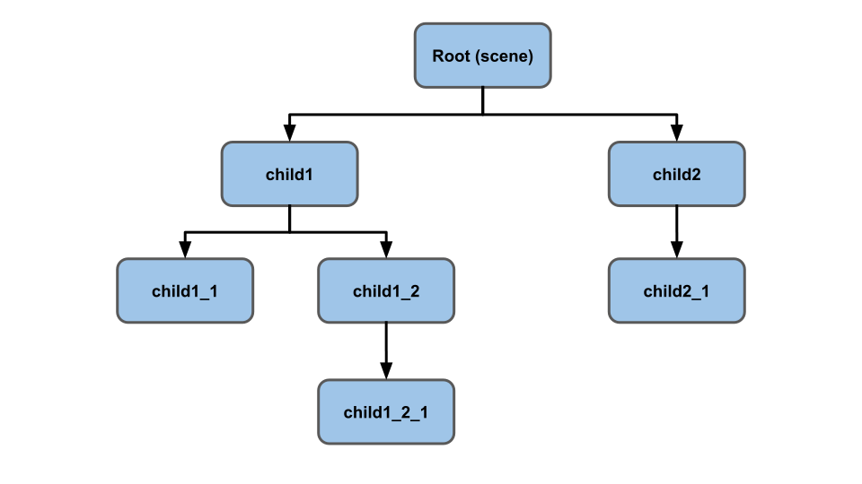
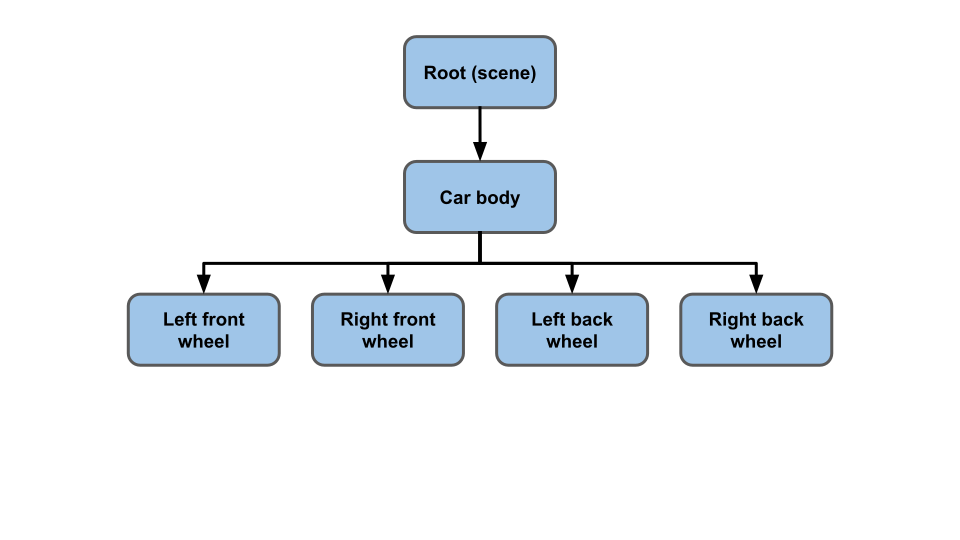
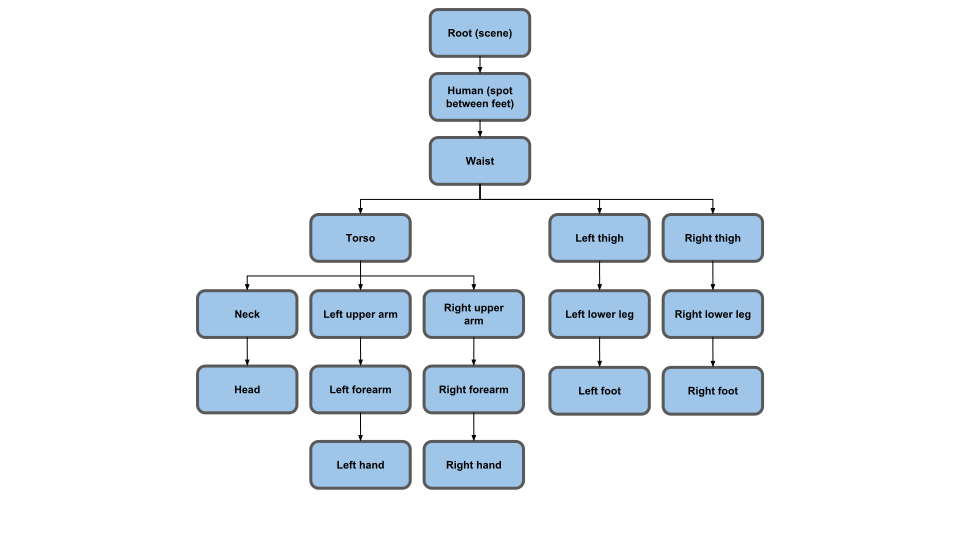

# 场景图

Three.js 的核心可以说是它的场景图（scene gprah）。

场景图在 3D 引擎是一个图中**节点的层次结构**，其中每个节点代表了一个**局部空间（local space）**。




### AxesHelper

```js
// 为每个节点添加一个AxesHelper
objects.forEach((node) => {
  const axes = new THREE.AxesHelper();
  axes.material.depthTest = false;
  axes.renderOrder = 1;
  node.add(axes);
});
```

希望轴即使在球体内部也能出现。要做到这一点，我们将其材质（material）的 `depthTest` 属性设置为 false，这意味着它们不会检查其是否在其他东西后面进行绘制。

我们还将它们的 `renderOrder` 属性设置为 1（默认值为 0），这样它们就会在所有球体之后被绘制。否则一个球体可能会画在它们上面，把它们遮住。

### GripHelper

可以在 X,Z 平面上创建一个 2D 网格


### GUI

lil-gui 会获取一个对象和该对象上的属性名，并根据属性的类型自动生成一个 UI 来操作该属性。

```js
// 打开/关闭轴和网格的可见性
// lil-gui 要求一个返回类型为bool型的属性
// 来创建一个复选框，所以我们为 `visible`属性
// 绑定了一个setter 和 getter。 从而让lil-gui
// 去操作该属性.
class AxisGridHelper {
  constructor(node, units = 10) {
    const axes = new THREE.AxesHelper();
    axes.material.depthTest = false;
    axes.renderOrder = 2; // 在网格渲染之后再渲染
    node.add(axes);
 
    const grid = new THREE.GridHelper(units, units);
    grid.material.depthTest = false;
    grid.renderOrder = 1;
    node.add(grid);
 
    this.grid = grid;
    this.axes = axes;
    this.visible = false;
  }
  get visible() {
    return this._visible;
  }
  set visible(v) {
    this._visible = v;
    this.grid.visible = v;
    this.axes.visible = v;
  }
}
```

`makeAxisGrid` 创建了一个 `AxisGridHelper` 类，这是一个我们将创建的让 lil-gui 满足的类。

lil-gui 会自动地生成一个 UI 来操作某个对象的命名属性。它将根据属性的类型创建不同的 UI。

我们希望它创建一个复选框，所以我们需要指定一个 `bool` 属性。

但是，我们希望坐标轴和网格都能基于一个单一的属性出现/消失，所以我们将创建一个类，其有一个属性绑定了 getter 和 setter。

这样我们就可以让 lil-gui 认为它在操作一个单一的属性，但是在内部我们可以为一个节点设置 [`AxesHelper`](http://127.0.0.1:5500/docs/#api/zh/helpers/AxesHelper) 和 [`GridHelper`](http://127.0.0.1:5500/docs/#api/zh/helpers/GridHelper) 的可见（visible）属性。


### 场景图的例子

再举几个场景图的例子。在一个简单的游戏世界中，一辆汽车可能有这样的场景图。



如果你移动车体，所有的轮子都会随之移动。如果你想让车身和轮子分开弹跳，你可以将车身和轮子作为代表汽车框架的框架（frame）节点的子节点。

另一个例子是游戏世界中的人类。



你可以看到对于人类来说，场景图会变得很复杂。


### 坦克示例

我们来做一个稍微复杂的场景图。我们来做一辆坦克。

坦克将有 6 个轮子和一个炮塔。坦克会沿着一条路径行驶。会有一个球体在周围移动，坦克会瞄准球体。

这是场景图。网格（mesh）的颜色为绿色，[`Object3D`](http://127.0.0.1:5500/docs/#api/zh/core/Object3D) 为蓝色，灯光（light）为金色，摄像机（camera）为紫色。其中一台摄像机没有被添加进场景图。


#### 首先先学习摄像机.md

因为到现在还没有能用鼠标控制相机视角移动, 所以不那么容易调试.


