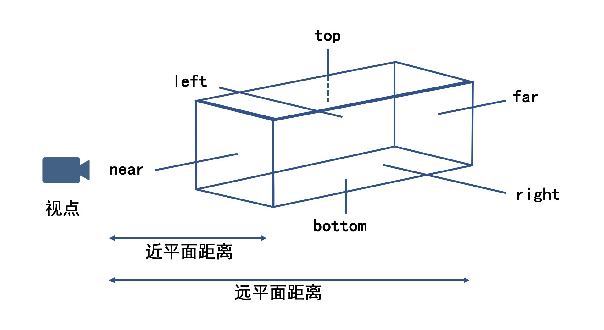
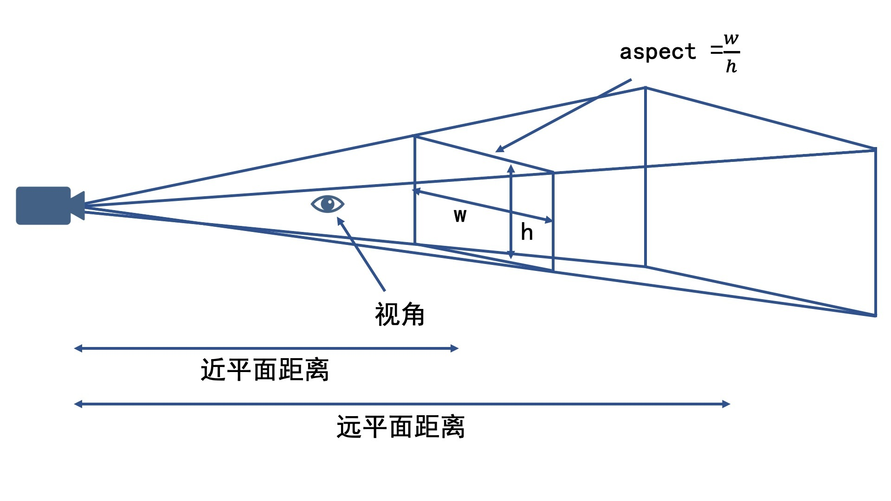
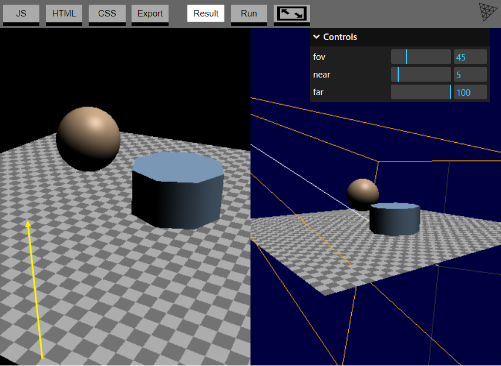
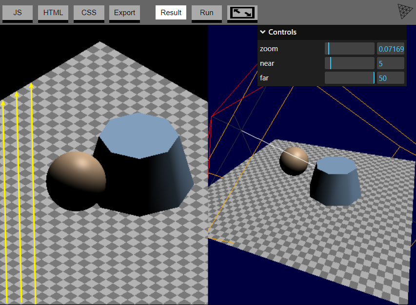
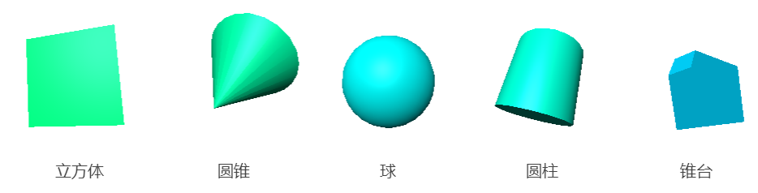

[toc]

# 摄像机

## 投影

首先是正投影，它又叫做平行投影。**正投影是将物体投影到一个长方体的空间（又称为视景体）**，并且无论相机与物体距离多远，**投影的大小都不变**。正投影示意图

而透视投影则更接近我们的视觉感知。它投影的规律是，离相机**近**的物体**大**，离相机**远**的物体**小**。与正投影不同，正投影的视景体是一个长方体，而透视投影的视景体是一个**棱台**。

透视投影近大远小的效果可以GridHelper中的小方块看出来

正交投影的三维平行一定也会在二维上平行

正交投影照相机获得的结果就像我们在数学几何学课上老师教我们画的效果，**对于在三维空间内平行的线，投影到二维空间中也一定是平行的**

在three.js中最常用的摄像机并且之前我们一直用的摄像机是`透视摄像机 PerspectiveCamera`, 它可以提供一个**近大远小的3D视觉效果**.

[`PerspectiveCamera`](http://127.0.0.1:5500/docs/#api/zh/cameras/PerspectiveCamera) 定义了一个 *视锥frustum*. 

[*frustum* 是一个切掉顶的三角锥或者说实心金字塔型](https://en.wikipedia.org/wiki/Frustum). 说到***实心体solid***, 在这里通常是指一个立方体, 一个圆锥, 一个球, 一个圆柱或锥台.

[`PerspectiveCamera`](http://127.0.0.1:5500/docs/#api/zh/cameras/PerspectiveCamera)通过四个属性来定义一个视锥. `near`定义了视锥的前端, `far`定义了后端, `fov`是视野, 通过计算正确的高度来从摄像机的位置获得指定的以`near`为单位的视野, 定义的是视锥的前端和后端的高度. `aspect`间接地定义了视锥前端和后端的宽度, 实际上视锥的宽度是通过高度乘以aspect来得到的.

示例: [three.js examples (threejs.org)](https://threejs.org/examples/#webgl_camera)

按O/P切换

### TODO...