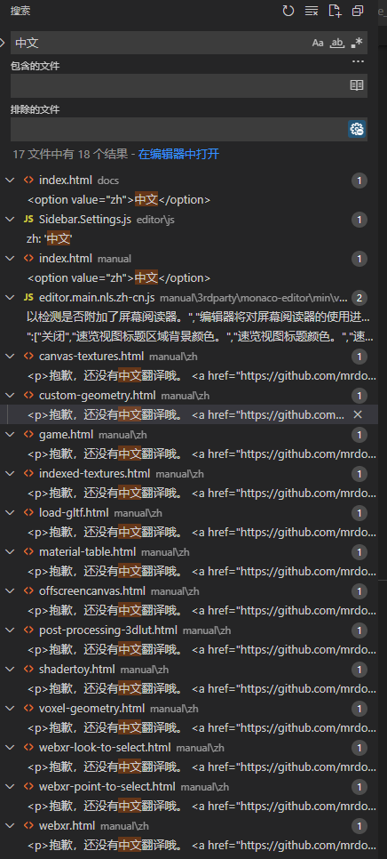

[Three.js – JavaScript 3D Library (threejs.org)](https://threejs.org/)

[基础 - three.js manual (threejs.org)](https://threejs.org/manual/#zh/fundamentals)

本系列是从官方的 Resources 中的 https://threejs.org/manual/#en/fundamentals

存在部分翻译不全的情况:

