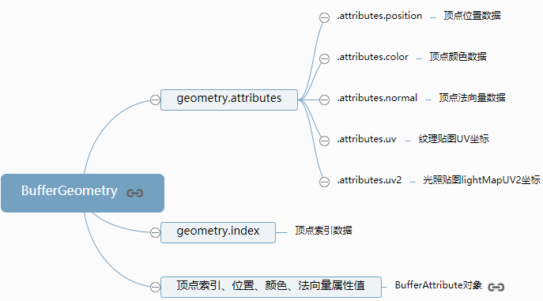

[TOC]


# 顶点索引复用顶点数据

通过几何体[BufferGeometry](http://www.yanhuangxueyuan.com/threejs/docs/index.html#api/zh/core/BufferGeometry)的顶点索引属性`BufferGeometry.index`可以设置几何体顶点索引数据，如果你有WebGL基础很容易理解顶点索引的概念，如果没有也没有关系，下面会通过一个简单的例子形象说明。

比如绘制一个矩形网格模型,至少需要两个三角形拼接而成，两个三角形，每个三角形有三个顶点，也就是说需要定义6个顶点位置数据。对于矩形网格模型而言，两个三角形有两个顶点位置是重合的。也就是说可以重复的位置可以定义一次，然后通过通过顶点数组的索引值获取这些顶点位置数据。


### 不使用顶点索引

下面通过几何体六个顶点定义了两个三角形，几何体的顶点位置数据、顶点法向量数据都是6个。

```javascript
var geometry = new THREE.BufferGeometry(); //声明一个空几何体对象
//类型数组创建顶点位置position数据
var vertices = new Float32Array([
  0, 0, 0, //顶点1坐标
  80, 0, 0, //顶点2坐标
  80, 80, 0, //顶点3坐标

  0, 0, 0, //顶点4坐标   和顶点1位置相同
  80, 80, 0, //顶点5坐标  和顶点3位置相同
  0, 80, 0, //顶点6坐标
]);
// 创建属性缓冲区对象
var attribue = new THREE.BufferAttribute(vertices, 3); //3个为一组
// 设置几何体attributes属性的位置position属性
geometry.attributes.position = attribue
var normals = new Float32Array([
  0, 0, 1, //顶点1法向量
  0, 0, 1, //顶点2法向量
  0, 0, 1, //顶点3法向量

  0, 0, 1, //顶点4法向量
  0, 0, 1, //顶点5法向量
  0, 0, 1, //顶点6法向量
]);
// 设置几何体attributes属性的位置normal属性
geometry.attributes.normal = new THREE.BufferAttribute(normals, 3); //3个为一组,表示一个顶点的xyz坐标
```

### 顶点索引`.index`

下面代码通过几何体[BufferGeometry](http://www.yanhuangxueyuan.com/threejs/docs/index.html#api/zh/core/BufferGeometry)的顶点索引`BufferGeometry.index`定义了一个矩形。通过顶点索引组织网格模型三角形的绘制，因为矩形的两个三角形有两个顶点位置重复，所以顶点位置数据、顶点法向量数据都只需要定义4个就可以。

```javascript
var geometry = new THREE.BufferGeometry(); //声明一个空几何体对象
//类型数组创建顶点位置position数据
var vertices = new Float32Array([
  0, 0, 0, //顶点1坐标
  80, 0, 0, //顶点2坐标
  80, 80, 0, //顶点3坐标
  0, 80, 0, //顶点4坐标
]);
// 创建属性缓冲区对象
var attribue = new THREE.BufferAttribute(vertices, 3); //3个为一组
// 设置几何体attributes属性的位置position属性
geometry.attributes.position = attribue
var normals = new Float32Array([
  0, 0, 1, //顶点1法向量
  0, 0, 1, //顶点2法向量
  0, 0, 1, //顶点3法向量
  0, 0, 1, //顶点4法向量
]);
// 设置几何体attributes属性的位置normal属性
geometry.attributes.normal = new THREE.BufferAttribute(normals, 3); //3个为一组,表示一个顶点的xyz坐标
```

### 设置索引

通过**顶点索引组织顶点数据**，顶点索引数组**`indexes`**通过索引值**指向顶点位置**`geometry.attributes.position`、顶点法向量`geometry.attributes.normal`中顶面数组。

```javascript
// Uint16Array类型数组创建顶点索引数据
var indexes = new Uint16Array([
  // 0对应第1个顶点位置数据、第1个顶点法向量数据
  // 1对应第2个顶点位置数据、第2个顶点法向量数据
  // 索引值3个为一组，表示一个三角形的3个顶点
  0, 1, 2,
  0, 2, 3,
])
// 索引数据赋值给几何体的index属性
geometry.index = new THREE.BufferAttribute(indexes, 1); //1个为一组
```

**创建顶点索引数组的时候，可以根据顶点的数量选择类型数组**`Uint8Array`、`Uint16Array`、`Uint32Array`。对于顶点索引而言选择整型类型数组，对于非索引的顶点数据，需要使用浮点类型数组`Float32Array`等。

| 类型数组     | 位数 | 字节 | 类型描述           | C语言等价类型 |
| :----------- | :--- | :--- | :----------------- | :------------ |
| Int8Array    | 8    | 1    | 有符号8位整型      | int8_t        |
| Uint8Array   | 8    | 1    | 无符号8位整型      | uint8_t       |
| Int16Array   | 16   | 2    | 有符号16位整型     | int16_t       |
| Uint16Array  | 16   | 2    | 无符号16位整型     | int16_t       |
| Int32Array   | 32   | 4    | 有符号32位整型     | int32_t       |
| Uint32Array  | 32   | 4    | 无符号32位整型     | uint32_t      |
| Float32Array | 32   | 4    | 单精度(32位)浮点数 | float         |
| Float64Array | 64   | 8    | 双精度(64位)浮点数 | double        |

### `BufferGeometry`总结

