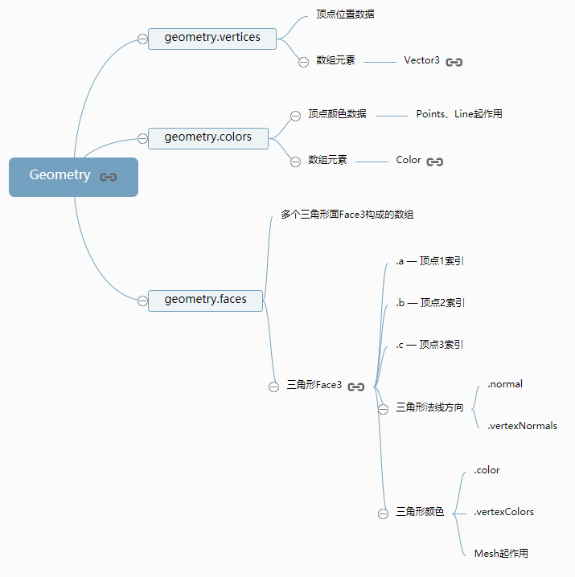
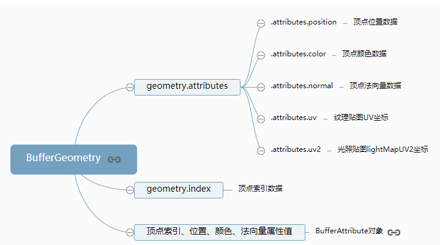
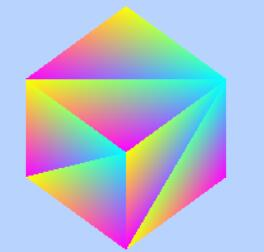

# 访问几何体对象的数据

实际开发项目的时候，可能会加载外部模型，有些时候需要获取模型几何体的顶点数据，如果想获取几何体的顶点数据首先要熟悉three.js几何体`BoxGeometry`和`BufferGeometry`的结构。

访问几何体顶点数据其实很简单，刚开始学习不用刻意记忆，直接查看threejs文档，就像访问javascript对象的属性一样。

### 测试`BoxGeometry`

调用`BoxGeometry`创建一个立方体，执行`THREE.BoxGeometry`构造函数会自动生成几何体对象的顶点位置坐标、顶点法向量等数据。

你可以通过执行下面代码，然后查看浏览器控制台打印的数据

```javascript
var geometry = new THREE.BoxGeometry(100, 100, 100); //一个立方体几何对象
console.log(geometry);
console.log('几何体顶点位置数据',geometry.vertices);
console.log('三角行面数据',geometry.faces);
```

`BoxGeometry`、`PlaneGeometry`、`SphereGeometry`等几何体类的基类是`Geometry`，所以访问这些几何体的顶点数据,不知道具体属性名称，可以查问threejs文档[Geometry](http://www.yanhuangxueyuan.com/threejs/docs/index.html#api/zh/core/Geometry)



### 测试`PlaneBufferGeometry`

`PlaneBufferGeometry`表示一个矩形平面几何体，执行下面代码，你可以查看该几何体的相关顶点数据。

```javascript
//创建一个矩形平面几何体
var geometry = new THREE.PlaneBufferGeometry(100, 100);
console.log(geometry);
console.log('几何体顶点位置数据',geometry.attributes.position);
console.log('几何体索引数据',geometry.index);
```

`BoxBufferGeometry`、`PlaneBufferGeometry`、`SphereBufferGeometry`等几何体类的基类是`BufferGeometry`，所以访问这些几何体的顶点数据,不知道具体属性名称，可以查问threejs文档[BufferGeometry](http://www.yanhuangxueyuan.com/threejs/docs/index.html#api/zh/core/BufferGeometry)



### 案例

通过下面代码修改`BoxGeometry`的三角形顶点颜色的数据，可以渲染出来如下效果。



```javascript
var geometry = new THREE.BoxGeometry(100, 100, 100); //创建一个立方体几何对象Geometry
// 遍历几何体的face属性
geometry.faces.forEach(face => {
  // 设置三角面face三个顶点的颜色
  face.vertexColors = [
    new THREE.Color(0xffff00),
    new THREE.Color(0xff00ff),
    new THREE.Color(0x00ffff),
  ]
});
var material = new THREE.MeshBasicMaterial({
  // color: 0x0000ff,
  vertexColors: THREE.FaceColors,
  // wireframe:true,//线框模式渲染
}); //材质对象Material
```

### 案例

你可以通过下面代码删除立方体部分三角形面，测试删除效果。

```javascript
var geometry = new THREE.BoxGeometry(100, 100, 100); //创建一个立方体几何对象Geometry
// pop()：删除数组的最后一个元素   shift：删除数组的第一个元素
geometry.faces.pop();
geometry.faces.pop();
geometry.faces.shift();
geometry.faces.shift();
var material = new THREE.MeshLambertMaterial({
  color: 0x0000ff,
  side: THREE.DoubleSide, //两面可见
}); //材质对象Material
```

### 访问外部模型几何体顶点数据

Threejs加载外部模型的时候，会把几何体解析为缓冲类型几何体`BufferGeometry`，所以访问外部模型几何体顶点数据，可以查看文档[BufferGeometry](http://www.yanhuangxueyuan.com/threejs/docs/index.html#api/zh/core/BufferGeometry)。关于外部模型加载的讲解可以查看课程第14章。