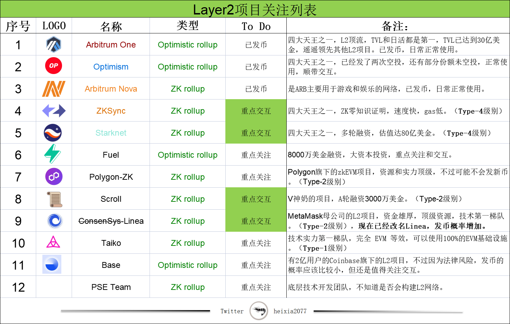
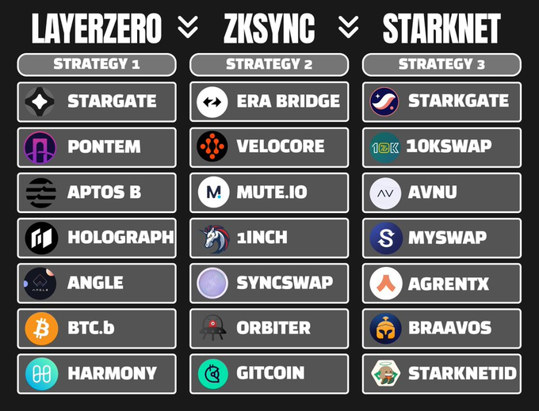
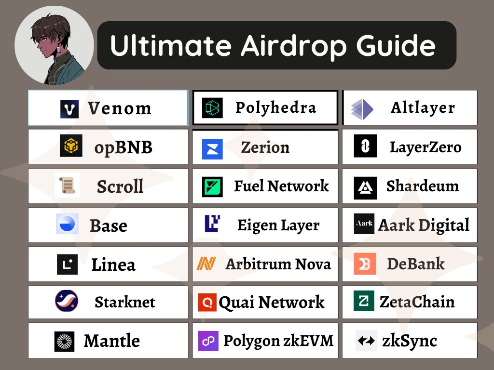
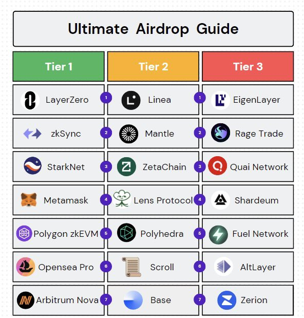
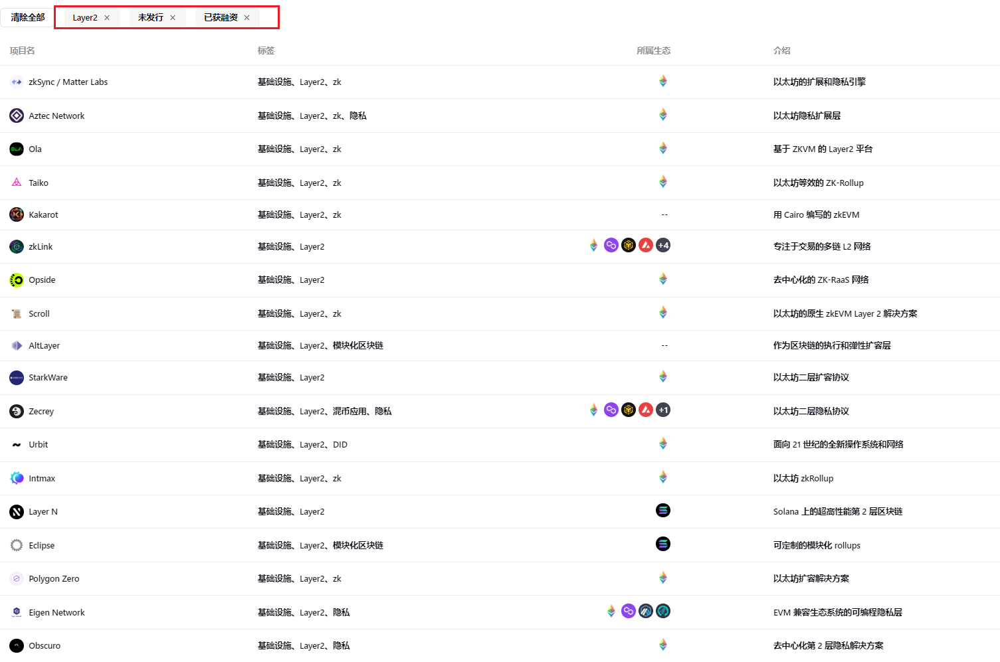
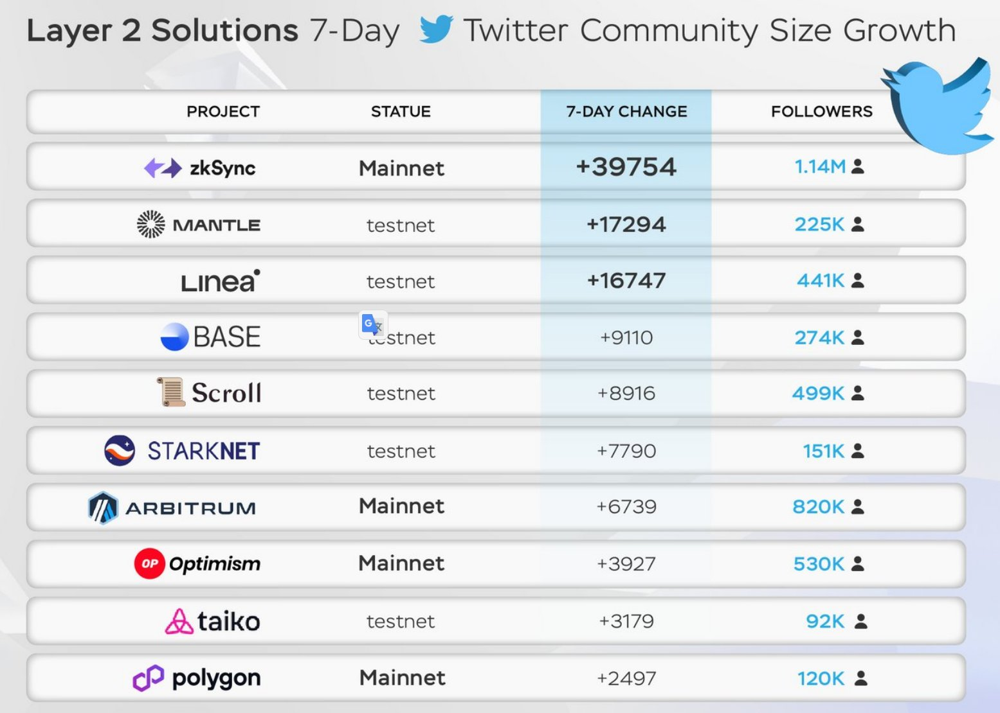
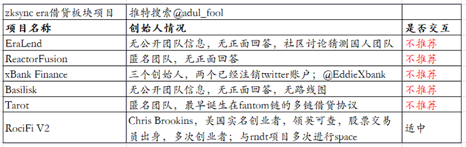

> https://twitter.com/heixia2077/status/1678614310728400896

Rootdata 未发币L2

> https://www.rootdata.com/zh/Projects?st=1&sn=Layer2&snc=Layer2&sd=50

可以根据融资关注

> 1. zkSync
> 2. Aztec Network
> 3. Taiko
> 4. Kakarot
> 5. scroll
> 6. altlayer
> 7. starkware
> 8. Zecrey
> 9. Eclipse
> 10. 

> 2023年真是大毛璀璨之年。光是Layer 2 有空投预期的公链就有这么多：  
>
> https://twitter.com/tcoin_b/status/1678422863781535746

Mantle : 上IEO了不交互

>加州大学伯克利分校校友创立的加密项目
>
>https://www.rootdata.com/zh/Archives/detail/UC%20Berkeley%20Alumni%20Founded%20Crypto%20Projects?k=Mjk%3D

zkSync支持的生态有izi/satori

投资者**>**Coinbase Ventures 投的zkSync未发币项目

1. [RedStone](https://www.rootdata.com/zh/Projects/detail/RedStone?k=MjA2MQ%3D%3D)
2. [Satori](https://www.rootdata.com/zh/Projects/detail/Satori?k=MzAyMg%3D%3D)
