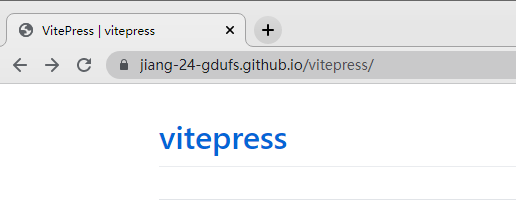

[toc]

### 如何将 vitepress 党文部署到github

您可以使用以下步骤将 VitePress 部署到 GitHub：

1. 创建一个 GitHub 仓库，例如 "my-vitepress-docs"。
2. 在您的计算机上使用 Git 克隆该仓库。
3. 在您的项目目录下创建一个文档文件夹，例如 "docs"。
4. 在该文件夹中创建一个 markdown 文件，例如 "index.md"。
5. 在命令行中进入文档文件夹，然后运行 "vuepress build" 命令。它将在 "dist" 文件夹中生成静态文件。
6. 将 "dist" 文件夹中的所有内容复制到您的仓库的根目录下。
7. 在命令行中使用 Git 将您的更改提交到仓库。
8. 在 GitHub 仓库的设置页面中，选择 "GitHub Pages"，并选择 "master branch /docs folder" 作为您的源。
9. 在浏览器中打开 "`https://<your-github-username>.github.io/<your-repo-name>/`"，查看您的文档。

请注意，您需要先安装 Node.js 和 npm，并使用 "npm install -g vuepress" 命令安装 VitePress。此外，您需要在本地安装并配置 Git，以便可以与 GitHub 仓库进行交互。

> 
>
> 成功把fork过来了的 vitepress 部署, 但是没有显示文档相关的内容.

#### [vitepress 额外的文档](https://vitepress.vuejs.org/guide/deploying#github-pages)

增加部署的action, 但是推送过去后执行失败了 [action](https://github.com/jiang-24-gdufs/vitepress/actions/runs/4082428015/jobs/7036770132)

`Error: Dependencies lock file is not found in /home/runner/work/vitepress/vitepress. Supported file patterns: yarn.lock`

搜索到类似问题: https://dev.to/imomaliev/til-fix-error-dependencies-lock-file-is-not-found-ade

这个action一直不成功呀?

