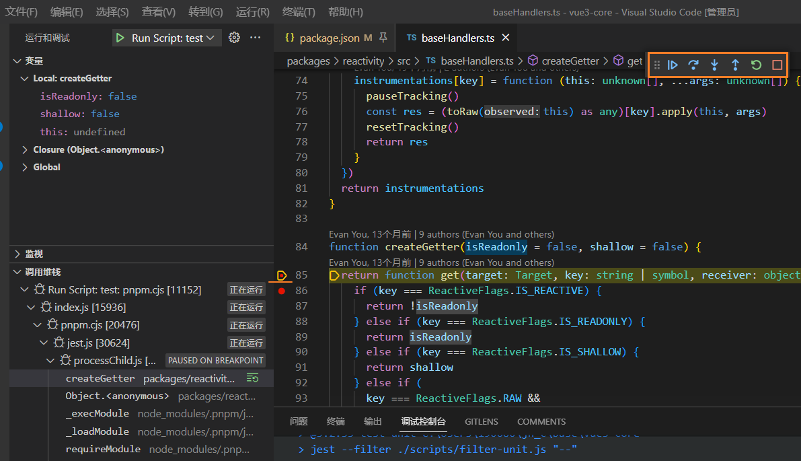

[toc]

### JavaScript ES6 中的 Proxy 是如何在Vue3源码中使用的?

In Vue 3, the `Proxy` API is used to implement the reactivity system. Proxies allow you to intercept and manipulate the behavior of an object property access.

In Vue 3, the `reactive` function creates a reactive object by wrapping it in a `Proxy`:

> 在Vue 3中，Proxy API被用来实现响应式系统。Proxy允许你拦截和操纵一个对象属性访问的行为。
>
> 在Vue 3中，reactive 函数通过将其包裹在一个Proxy中来创建一个响应式对象。

```js
function reactive(obj) {
  return new Proxy(obj, {
    set(target, key, value) {
      // track changes to the reactive object
      ...
      return Reflect.set(target, key, value);
    },
    get(target, key) {
      // track access to reactive properties
      ...
      return Reflect.get(target, key);
    },
  });
}
```

The reactive object can then be used in a component's data or computed properties. When the reactive object is modified, the `set` trap of the `Proxy` will be triggered, allowing Vue to update the component's reactive properties and re-render the component if necessary.

By using the `Proxy` API, Vue is able to provide a simple and efficient way to track changes in a component's state and automatically update the component when necessary.

> 然后，该反应式对象可用于组件的数据或计算属性。当反应式对象被修改时，`Proxy`的`set`陷阱将被 trigger，允许Vue更新组件的反应式属性并在必要时重新渲染组件。
>
> 通过使用`Proxy`API，Vue能够提供一种简单而有效的方式来跟踪组件状态的变化，并在必要时自动更新组件。


### 请透露更多细节

在 Vue 3 中，反应式系统是使用 `Proxy` API 构建的。这意味着当访问组件的反应式数据时，实际上是访问一个包装了原始数据的代理对象。这样做的好处是，在代理对象上访问数据时，Vue 可以通过拦截这些访问并进行相应的处理，以便追踪数据的变化。


### 开始调试Vue3源码的步骤是什么

要调试 Vue 3 源代码，需要以下步骤：

1. 克隆 Vue 3 仓库：首先，需要在本地克隆 Vue 3 源代码仓库。可以使用 Git 客户端或命令行工具执行此操作。
2. 安装依赖项：在本地仓库的根目录下运行 `npm install` 命令，以安装所有必要的依赖项。
3. 运行单元测试：可以运行 Vue 3 中的单元测试以确保代码的正确性。在根目录下运行 `npm run test` 即可。
4. 设置断点：使用你喜欢的代码调试工具，在需要调试的文件中设置断点。
5. 启动调试：启动你的应用程序，并使用调试工具进行调试。在代码中执行到断点时，调试工具会暂停执行并允许您检查变量的值和执行流程。

这些步骤将帮助您以更深入的方式了解 Vue 3 的工作原理，并方便对源代码进行调试和调试。




> 1. 在浏览器调试, 运行`npm run dev -s`, 生成带 sourcemap 的 dist, 运行`serve`, 打开vue/examples中的html文件调试
>
> 2. 在VSCode中打断点调试. 操作1, 调试&Open 'launch.json', 添加配置选择`Chrome: Launch`, 将url的地址改成`serve`的地址; 
>
>    例子全部都在`/packages/vue/examples/`文件夹下
>
>    用VSCode在`packages` 源码中打断点会在 VSCode 中中断
>
>    
>
>    - 第一条优点简单快捷, 甚至不用serve, 直接打开html文件即可. 缺点是需要手动去更改源文件去添加断点(不然在一个大js文件中去找到对应的函数来点稍微麻烦一点)
>    - 第二条用VSCode在源码中打断点, 在VSCode中调试, 用起来不如浏览器方便
