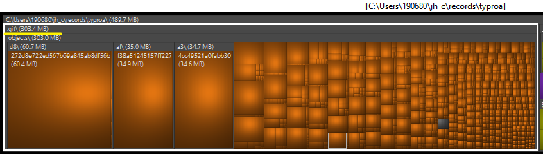
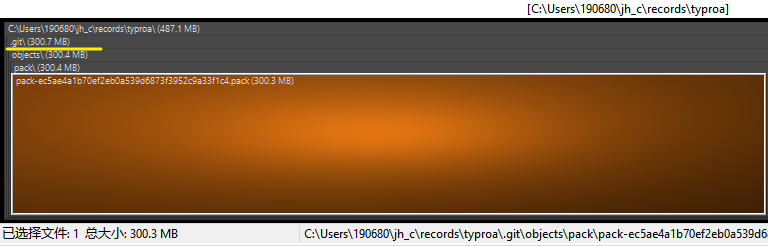

[toc]

### .git 文件夹太大如何瘦身

在 Git 存储库中，`.git` 文件夹包含所有 Git 存储库的元数据和历史记录信息。如果您的 `.git` 文件夹太大，可能会占用很多磁盘空间，而且可能会影响 Git 存储库的性能。以下是一些可以帮助您瘦身 `.git` 文件夹的方法：

1. 清理无用的对象和引用

在 Git 存储库中，一些对象和引用可能已经过期或不再使用。可以使用 Git 命令 `git gc` 来清理这些无用的对象和引用。该命令会压缩 Git 存储库中的对象，并删除未被引用的对象。

您可以通过运行以下命令来运行 git gc：

```bash
git gc --prune=now --aggressive
```

这将删除所有未被引用的对象，并强制 Git 压缩和优化存储库。

2. 缩小历史记录

您可以使用 Git 命令 `git filter-branch` 来缩小存储库的历史记录。该命令允许您删除不需要的文件、文件夹、提交或其他历史记录中的信息，以减小存储库的大小。

例如，您可以使用以下命令来删除大型文件：

```bash
git filter-branch --tree-filter 'rm -rf path/to/large/file' HEAD
```

​	3. 使用 Git LFS

如果您的存储库包含大型二进制文件，可以考虑使用 Git LFS（Git Large File Storage）来管理它们。Git LFS 允许您将大型文件存储在独立的存储库中，并在需要时下载它们。

要使用 Git LFS，请安装 Git LFS 并将您的存储库配置为使用 Git LFS。然后，使用 Git LFS 命令 `git lfs prune` 来清理不再需要的大型文件。

4. 限制 Git 历史记录的深度

如果您的存储库包含过多的提交记录，可以考虑限制 Git 历史记录的深度。这可以通过使用 Git 命令 `git clone` 和 `--depth` 选项来实现，如下所示：

```bash
git clone --depth=1 <repository-url>
```

这将仅克隆存储库的最新提交，而不会克隆存储库的完整历史记录。

总之，以上是几种可以帮助您瘦身 `.git` 文件夹的方法。但是，在对 Git 存储库进行任何更改之前，请务必备份存储库，以避免不必要的数据损失。


> 执行前后感觉没有明显大小的变化





### git gc --prune=now --aggressive 这条命令的作用是什么? 参数是什么意思

> PS C:\Users\190680\jh_c\records\typroa> git gc --prune=now --aggressive
> Enumerating objects: 4076, done.
> Counting objects: 100% (4076/4076), done.
> Delta compression using up to 12 threads 
> Compressing objects: 100% (4003/4003), done.
> Writing objects: 100% (4076/4076), done.
> Total 4076 (delta 1005), reused 75 (delta 0), pack-reused 0
> Removing duplicate objects: 100% (256/256), done.

`git gc --prune=now --aggressive` 命令是 Git 中用于执行垃圾回收的命令，它的作用是清理无用的对象并压缩 Git 存储库。

`--prune=now` 参数告诉 Git 立即删除那些不再被引用的 Git 对象，而不是等到下一次垃圾回收时才删除它们。这可以确保垃圾回收能够及时释放不再使用的资源。

`--aggressive` 参数是一个可选参数，它指示 Git 采取一些更激进的措施来进行垃圾回收。具体而言，这将启用更严格的对象压缩和重新打包，并尝试进一步减小存储库的大小。然而，这可能会导致垃圾回收所需的时间更长。

需要注意的是，使用 `--aggressive` 参数会对存储库进行更彻底的优化，但也会增加垃圾回收的时间和资源消耗。如果您的存储库已经足够小，并且您不想等待过长的垃圾回收时间，可以省略该参数。


### 3D Tiles 是什么

3D Tiles是一种用于将大规模三维数据切片、存储、传输和渲染的规范和开源工具。它可以在Web浏览器和桌面应用程序中呈现大规模的三维数据，例如建筑物、地形、点云和地球数据。3D Tiles通过切分三维数据集来实现高效的加载和呈现，并支持数据流式传输和增量更新。

3D Tiles是一种非常灵活的规范，允许用户在多种数据类型之间自由转换，并以标准的格式将数据提供给多个三维地图引擎和框架，如Cesium、Mapbox和Unity等。3D Tiles的设计允许用户按照自己的需要配置数据集，例如切片大小、深度、内容和格式。使用3D Tiles可以大大降低三维数据的网络传输量，提高数据的可用性和可视化效果。

总的来说，3D Tiles为三维数据集的处理、管理和共享提供了一种规范和工具，让用户可以更加高效地访问和使用大规模的三维数据。
