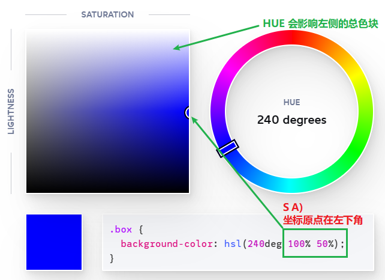

[toc]

### css/color-formats


CSS (Cascading Style Sheets) supports various color formats to specify colors in a webpage. Some of the commonly used color formats are:

1. HEX: HEX (hexadecimal) color code is a six-digit code that represents a color in RGB (Red Green Blue) format. Each pair of digits represents the intensity of red, green, and blue, respectively. For example, #FF0000 represents the color red, #00FF00 represents the color green, and #0000FF represents the color blue.
2. RGB: RGB color code represents a color in terms of its intensity of red, green, and blue. Each value ranges from 0 to 255. For example, rgb(255, 0, 0) represents the color red, rgb(0, 255, 0) represents the color green, and rgb(0, 0, 255) represents the color blue.
3. RGBA: RGBA (Red Green Blue Alpha) color code is similar to RGB, but it includes an additional alpha value that represents the opacity of the color. The alpha value ranges from 0 to 1. For example, rgba(255, 0, 0, 0.5) represents a semi-transparent red color.
4. HSL: HSL (Hue Saturation Lightness) color code represents a color based on its hue, saturation, and lightness. The hue value ranges from 0 to 360, while the saturation and lightness values range from 0% to 100%. For example, hsl(0, 100%, 50%) represents the color red.
5. HSLA: HSLA (Hue Saturation Lightness Alpha) color code is similar to HSL, but it includes an additional alpha value that represents the opacity of the color. The alpha value ranges from 0 to 1. For example, hsla(0, 100%, 50%, 0.5) represents a semi-transparent red color.


### Modern color formats: Display P3 and LCH

Yes, CSS also supports two other modern color formats: Display P3 and LCH.

Display P3: Display P3 is a color space that is used in newer devices like iPhones and Macs. It has a wider gamut than sRGB and can produce more saturated colors. To use Display P3 in CSS, you can specify the color values using the "color()" function and the "display-p3" keyword. Here's an example

```css
color: color(display-p3 0.4 0.6 0.8);
```

LCH: LCH is a color space that is similar to HSL but has better perceptual uniformity. It stands for "Lightness, Chroma, Hue" and is based on the CIELAB color space. To use LCH in CSS, you can specify the color values using the "color()" function and the "lch" keyword. Here's an example:

```css
color: color(lch 50% 80 120);
```

In both cases, the "color()" function is used to define the color value and the keyword is used to specify the color space.


### 详细介绍下CSS 中的 color HSL,Display P3,LCH

当使用 CSS 定义颜色时，除了传统的 RGB 和 HEX 格式之外，现代 CSS 还支持使用 HSL、Display P3 和 LCH 颜色格式。

HSL 是一种基于**色相、饱和度和亮度值**的颜色格式。它的色相值（Hue）范围是 0-360，饱和度（Saturation）和亮度（Lightness）值的范围是 0%-100%。通过调整这三个值，可以创建出许多不同的颜色。下面是一个 HSL 颜色的例子：

```css
color: hsl(240, 100%, 50%);
```

这会创建一个蓝色的文本颜色，其中色相为 240（蓝色），饱和度为 100%，亮度为 50%。



LCH目前[仅在Safari中受支持](https://caniuse.com/css-lch-lab)

LCH 是一种类似于 HSL 的颜色空间，它在 CIELAB 颜色空间的基础上具有更好的感知均匀性。LCH 代表 Lightness（亮度）、Chroma（饱和度）和 Hue（色相），其中亮度值的范围为 0%-100%，饱和度和色相值没有固定的范围。要在 CSS 中使用 LCH，可以使用“color()”函数和“lch”关键字来指定颜色值。下面是一个 LCH 颜色的例子：

```css
color: color(lch 50% 80 120);
```

这会创建一个文本颜色，其中亮度为 50%，饱和度为 80，色相为 120。

**Display P3**：

Display P3 是一种颜色空间，通常用于新设备，如 iPhone 和 Mac。它具有比 sRGB 更广的色域，可以呈现更饱和的颜色。要在 CSS 中使用 Display P3，可以使用“color()”函数和“display-p3”关键字来指定颜色值。下面是一个 Display P3 颜色的例子：

```css
color: color(display-p3 0.4 0.6 0.8);
```

这会创建一个颜色为 R:102, G:204, B:255 的文本颜色，这个颜色在 sRGB 中看起来比较明亮，但在 Display P3 中更加饱和。


### HTTPS 中的 CA

**CA 是 Certificate Authority（证书颁发机构）**的缩写，是一种数字证书颁发机构。它是一家**受信任的第三方**组织，负责颁发和管理数字证书。数字证书是一种包含公钥、证书持有人信息、CA 信息等数据的电子文件，用于验证用户身份和保护信息安全。

在 HTTPS 中，客户端和服务器之间的安全通信是通过数字证书来实现的。**当客户端访问一个使用 HTTPS 协议的网站时，服务器会向客户端发送数字证书，证书中包含了服务器的公钥以及证书颁发机构的信息**。客户端使用证书中的公钥来加密信息，以确保信息的安全性。

为了确保数字证书的真实性和有效性，需要CA**进行证书签名和验证**。**CA** 的作用就是充当这样的受信任的证书颁发机构，它**使用自己的私钥来对数字证书进行签名**，以确保证书的真实性和有效性。客户端通过验证数字证书中的 CA 信息，来判断数字证书是否受信任，从而决定是否继续进行通信。

总之，CA 是数字证书颁发机构的缩写，是一家受信任的第三方机构，负责颁发和管理数字证书，确保数字证书的真实性和有效性，从而保护用户信息的安全性。


### CA 是用自己的私钥来签名吗? 那解密时如何确认信息没有被篡改

是的，**CA 在签名数字证书时会使用自己的私钥来加密数字证书的哈希值，从而生成数字签名**。这个数字签名可以用于验证数字证书的真实性和完整性。

在验证数字证书时，**客户端会使用证书中包含的 CA 公钥来解密数字签名，从而获取数字证书的哈希值**。客户端还会对数字证书中的各项信息进行计算哈希值，并将这两个哈希值进行比对，以判断数字证书是否被篡改。

如果数字签名验证成功，那么就可以确认数字证书的真实性和完整性。如果数字签名验证失败，那么就说明数字证书可能已被篡改或者无效，此时客户端会停止通信，以保护用户的信息安全。


### 非对称加密

非对称加密（**Asymmetric Encryption**）是一种加密方式，使用公钥和私钥两个不同的密钥来实现数据的加密和解密。

在非对称加密中，公钥和私钥是成对出现的。公钥可以公开给任何人使用，而私钥则只有密钥的持有人才能访问。公钥和私钥是通过复杂的数学算法生成的，它们之间是有关联的，但是无法从公钥推算出私钥，也无法从私钥推算出公钥。

非对称加密的加密过程是：发送方使用接收方的公钥对数据进行加密，接收方收到加密的数据后使用自己的私钥进行解密。这种方式能够保证数据在传输过程中的安全性，即使有人截取了数据，也无法获取到明文数据。

非对称加密广泛应用于网络通信和数据保护领域，如 HTTPS、SSL/TLS、SSH 等协议和加密技术。它可以提供更高的安全性和可靠性，确保数据在传输过程中不被篡改、窃取或者伪造，保护了用户的隐私和信息安全。


### RSA可以在用私钥加密后, 接受方用公钥解密吗?

使用**私钥加密，公钥解密**的方式，与使用公钥加密、私钥解密的方式相比，会有一些安全性上的问题。

在 RSA 算法中，私钥用于解密数据、签名数据，公钥用于加密数据、验证签名。如果使用私钥加密，公钥解密的方式，那么在解密时，接收方需要将私钥发送给发送方，这样就存在私钥被泄露的风险。而使用公钥加密，私钥解密的方式，则不会存在这个问题，因为公钥是公开的，可以自由传播，而私钥则仅在接收方手中，不会泄露。

因此，一般来说，在使用 RSA 算法进行数据加密和解密时，应该使用公钥加密、私钥解密的方式。这样可以更好地保护私钥的安全性，确保加密和解密的过程不会被恶意的攻击者所干扰和窃取。


### https协议中, CA用私钥加密,客户端用CA公钥解密数字签名 没有风险吗

在 HTTPS 协议中，数字证书是由 CA 使用私钥进行签名的。数字证书包含了网站的公钥和相关的信息，数字证书的签名可以通过 CA 的公钥进行验证，以确保数字证书的真实性和完整性。

在客户端收到数字证书时，客户端会使用 CA 的公钥来解密数字证书的签名，从而得到数字证书的哈希值。然后，客户端会对数字证书中的各项信息进行计算哈希值，并将这两个哈希值进行比对，以判断数字证书是否被篡改。

**由于 CA 的私钥只有 CA 所拥有，没有人可以从数字证书中的签名推出 CA 的私钥。因此，在 HTTPS 协议中，使用 CA 的私钥进行数字签名是安全的。**客户端使用 CA 的公钥对数字签名进行解密也是安全的，因为只有 CA 才能够使用相应的私钥进行签名。

当客户端验证数字证书通过后，客户端会获取到网站的公钥，然后使用这个公钥进行加密通信。在这个过程中，客户端的信息会被加密传输，从而保证了信息的安全性。


### 币安

币安是全球知名的**加密货币交易所**之一，成立于2017年，总部位于马耳他。币安提供了全球范围内的数字货币交易、存储和管理服务。用户可以**在币安平台上进行数字货币的交易**，包括比特币、以太坊、莱特币等主流数字货币以及许多其他数字货币。

币安的平台采用了高度安全的技术，包括多重签名、离线存储等，以保护用户的数字货币安全。币安还提供了一系列安全工具和功能，例如2FA（双重身份验证）、防钓鱼等，以增强用户的账户安全。

币安也积极参与区块链和加密货币生态系统的建设。币安基金会是一个非营利组织，致力于促进区块链技术的发展和应用，支持区块链教育和创新项目，推动区块链行业的健康发展。

总之，币安是一个颇具知名度和声誉的数字货币交易所，为用户提供了安全可靠的数字货币交易和存储服务，也在推动整个区块链行业的发展。


### 币安靠什么盈利

币安主要通过交易手续费和其他服务费用来盈利。币安的交易手续费非常低，是许多其他加密货币交易所的一半甚至更少。当用户在币安平台上进行交易时，币安会收取一定比例的交易手续费，这些手续费被视为币安的主要收入来源之一。

除了交易手续费，币安还提供了一些其他服务，例如杠杆交易、OTC交易、币安托管等，这些服务也会收取一定的费用。此外，币安还向用户提供了一些付费服务，例如币安Labs、币安学院等，这些服务也是币安的另一个收入来源。

币安还通过代币发行和股权投资等方式获得收益。例如，币安曾经发行过自己的代币 Binance Coin（简称BNB），并通过销售 BNB 来获得收益。此外，币安还投资了一些区块链项目和加密货币公司，这些投资也有望带来一定的回报。

总之，币安主要通过收取交易手续费和其他服务费用来盈利，同时也通过代币发行和股权投资等方式获得收益。